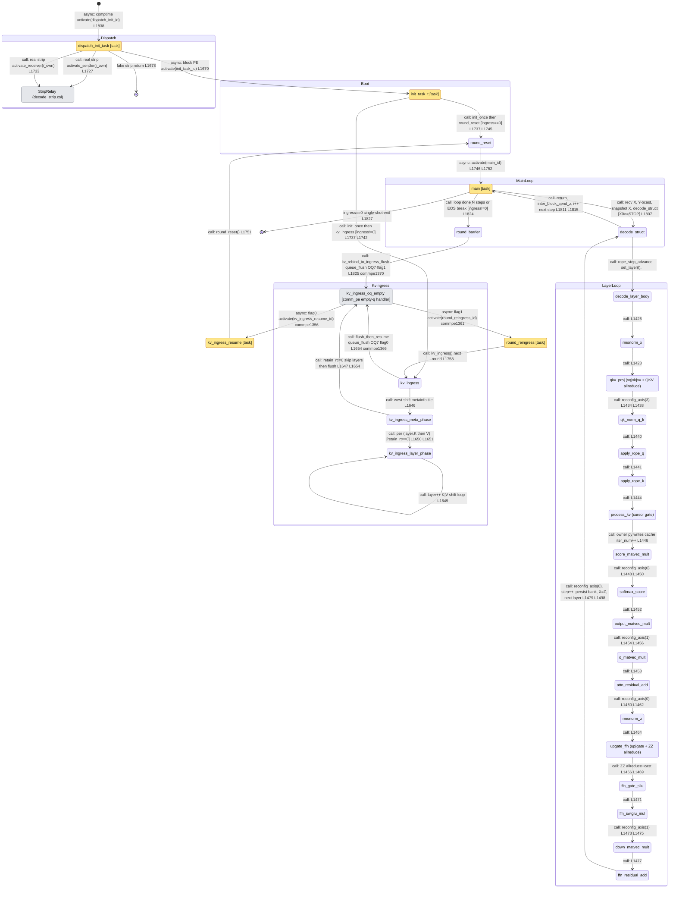
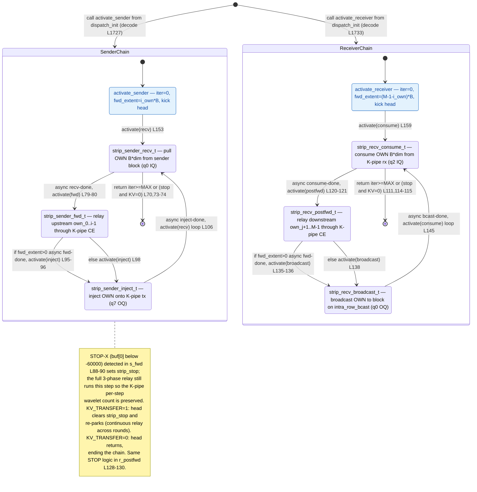
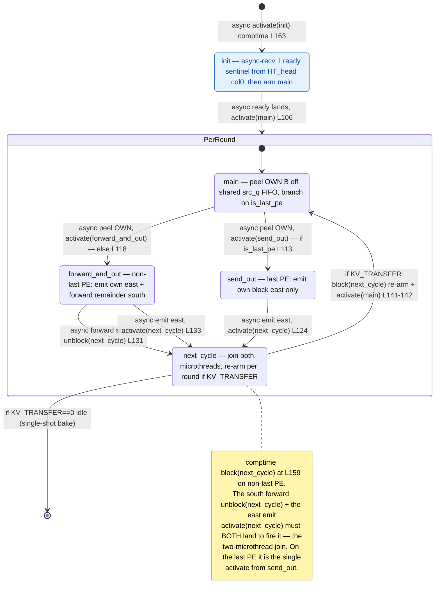
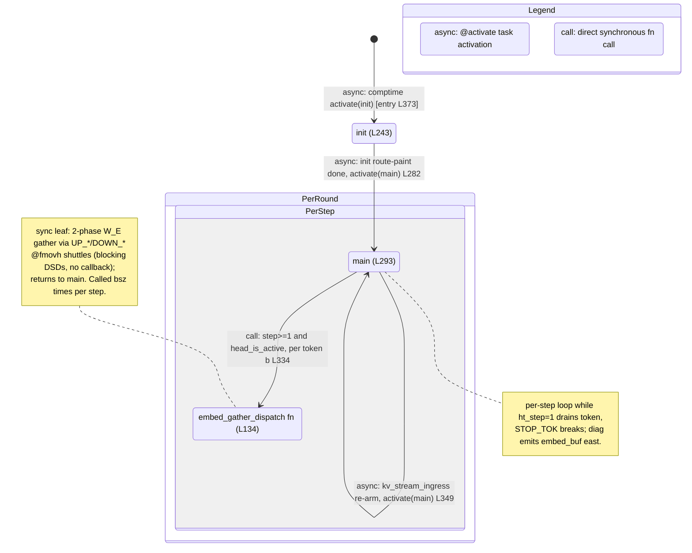
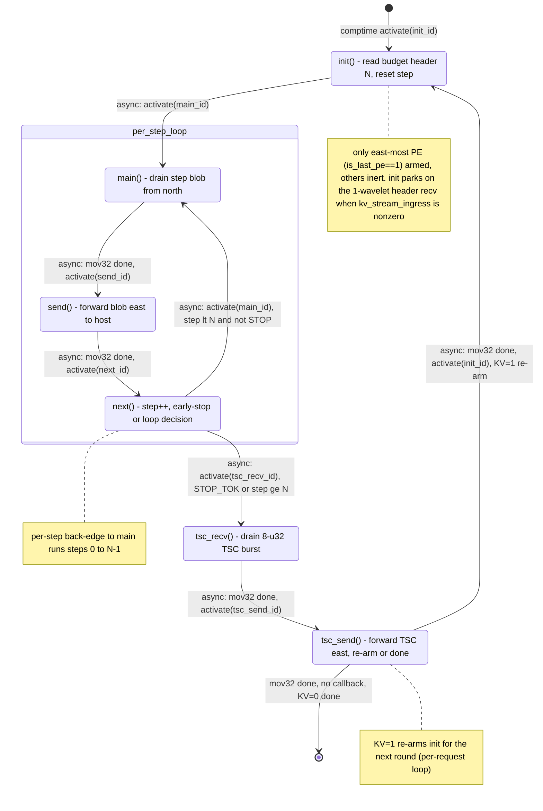
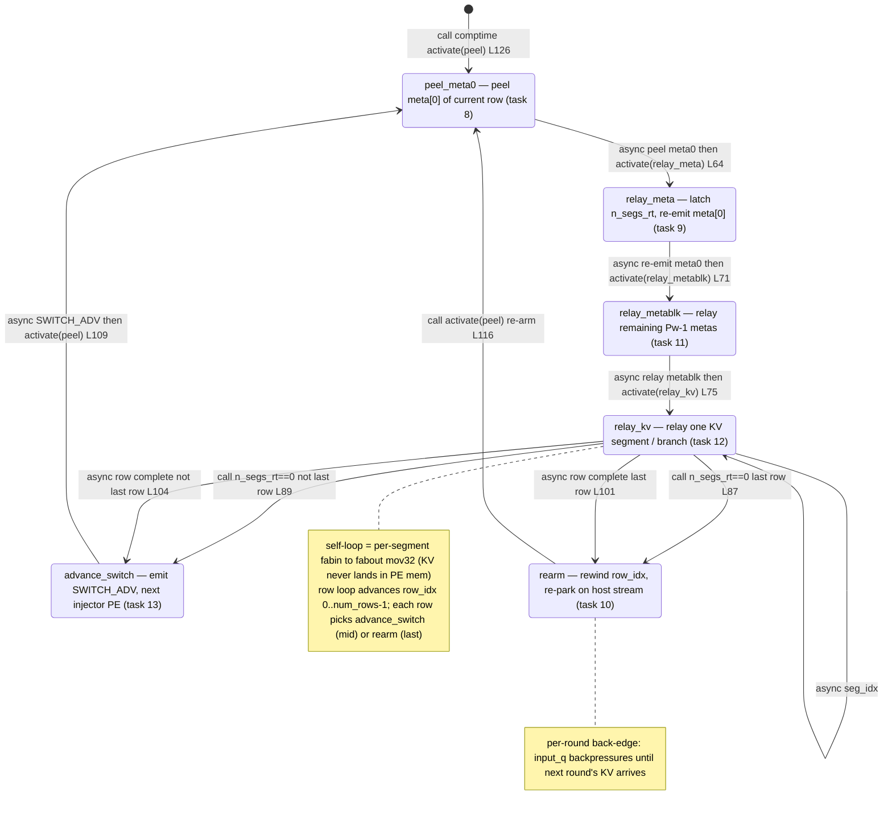
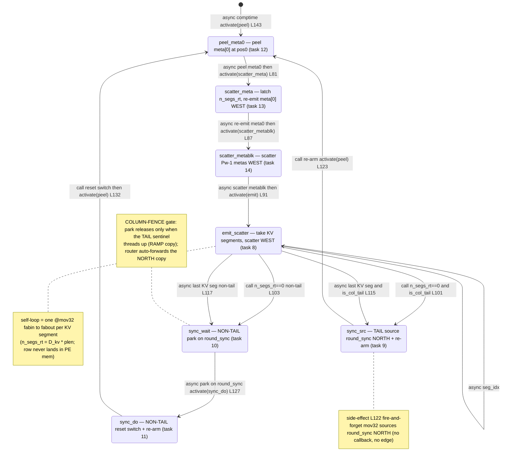

# qwen3_1p7b-decode — task/fn state machines (all kernels)

> **Aggregate index** of the per-kernel task/fn state-machine set for `qwen3_1p7b-decode`. Each kernel below is an independent Mermaid `stateDiagram-v2` (not merged into one diagram), with links to its standalone detail doc (full per-state prose + `file:line` citations) and its rendered SVG under `assets/kernel-algo/`. Control-flow companion to the algo walkthroughs. Ref config `test_sim_2x2block_kv_varlen.json`.

**Edge legend (shared by every diagram):** `call:` = synchronous same-stack `fn` call · `async:` = microthread `.activate`/`@activate` callback (incl. cross-module comm_pe) · `gate:` = `@unblock` of a `@block`-ed task · `event:` = fabric recv park. `[task]` marks a real scheduling unit; unmarked nodes are `fn`s on a task's stack.

## Index

| Kernel | Detail doc | Rendered | In-page diagram |
|---|---|---|---|
| `decode.csl` — main decode compute PE | [qwen3_1p7b-decode.decode.statemachine.md](../../assets/kernel-algo/qwen3_1p7b-decode.decode.statemachine.md) | [svg](../../assets/kernel-algo/qwen3_1p7b-decode.decode.statemachine.svg) | [↓](#decode) |
| `decode_strip.csl` — strip/helper PE | [qwen3_1p7b-decode.decode_strip.statemachine.md](../../assets/kernel-algo/qwen3_1p7b-decode.decode_strip.statemachine.md) | [svg](../../assets/kernel-algo/qwen3_1p7b-decode.decode_strip.statemachine.svg) | [↓](#decode_strip) |
| `demux.csl` — host token-id ingress | [qwen3_1p7b-decode.demux.statemachine.md](../../assets/kernel-algo/qwen3_1p7b-decode.demux.statemachine.md) | [svg](../../assets/kernel-algo/qwen3_1p7b-decode.demux.statemachine.svg) | [↓](#demux) |
| `ht_head.csl` — embedding LUT (vocab-rotation ring) | [qwen3_1p7b-decode.ht_head.statemachine.md](../../assets/kernel-algo/qwen3_1p7b-decode.ht_head.statemachine.md) | [svg](../../assets/kernel-algo/qwen3_1p7b-decode.ht_head.statemachine.svg) | [↓](#ht_head) |
| `ht_tail.csl` — output head | [qwen3_1p7b-decode.ht_tail.statemachine.md](../../assets/kernel-algo/qwen3_1p7b-decode.ht_tail.statemachine.md) | [svg](../../assets/kernel-algo/qwen3_1p7b-decode.ht_tail.statemachine.svg) | [↓](#ht_tail) |
| `comm_pe.csl` — comm library (no main) | [qwen3_1p7b-decode.comm_pe.statemachine.md](../../assets/kernel-algo/qwen3_1p7b-decode.comm_pe.statemachine.md) | [svg](../../assets/kernel-algo/qwen3_1p7b-decode.comm_pe.statemachine.svg) | [↓](#comm_pe) |
| `mux.csl` — logits/token egress | [qwen3_1p7b-decode.mux.statemachine.md](../../assets/kernel-algo/qwen3_1p7b-decode.mux.statemachine.md) | [svg](../../assets/kernel-algo/qwen3_1p7b-decode.mux.statemachine.svg) | [↓](#mux) |
| `kv_ingress_adaptor.csl` — host->decode KV ingress adaptor | [qwen3_1p7b-decode.kv_ingress_adaptor.statemachine.md](../../assets/kernel-algo/qwen3_1p7b-decode.kv_ingress_adaptor.statemachine.md) | [svg](../../assets/kernel-algo/qwen3_1p7b-decode.kv_ingress_adaptor.statemachine.svg) | [↓](#kv_ingress_adaptor) |
| `kv_ingress_injector.csl` — host->decode KV injector | [qwen3_1p7b-decode.kv_ingress_injector.statemachine.md](../../assets/kernel-algo/qwen3_1p7b-decode.kv_ingress_injector.statemachine.md) | [svg](../../assets/kernel-algo/qwen3_1p7b-decode.kv_ingress_injector.statemachine.svg) | [↓](#kv_ingress_injector) |
| route-only files | — | — | [↓ note](#route-only) |

## `decode.csl` — main decode compute PE

Single-token (m=1) decode over a slice of layers; two-pass safe softmax (max all-reduce, subtract global max, sum all-reduce); per-layer + per-iteration (iter_num) re-arm.

**Links:** detail doc → [qwen3_1p7b-decode.decode.statemachine.md](../../assets/kernel-algo/qwen3_1p7b-decode.decode.statemachine.md) · rendered SVG → [qwen3_1p7b-decode.decode.statemachine.svg](../../assets/kernel-algo/qwen3_1p7b-decode.decode.statemachine.svg)

## `decode_strip.csl` — strip/helper PE

Edge/IO strip in the decode band (see source for exact role); its own small task machine.

**Links:** detail doc → [qwen3_1p7b-decode.decode_strip.statemachine.md](../../assets/kernel-algo/qwen3_1p7b-decode.decode_strip.statemachine.md) · rendered SVG → [qwen3_1p7b-decode.decode_strip.statemachine.svg](../../assets/kernel-algo/qwen3_1p7b-decode.decode_strip.statemachine.svg)

## `demux.csl` — host token-id ingress

Peel/forward chain (decode variant, multi-round / per-iteration re-arm).

**Links:** detail doc → [qwen3_1p7b-decode.demux.statemachine.md](../../assets/kernel-algo/qwen3_1p7b-decode.demux.statemachine.md) · rendered SVG → [qwen3_1p7b-decode.demux.statemachine.svg](../../assets/kernel-algo/qwen3_1p7b-decode.demux.statemachine.svg)

## `ht_head.csl` — embedding LUT (vocab-rotation ring)

Per-token / per-iteration ingress re-arm.

**Links:** detail doc → [qwen3_1p7b-decode.ht_head.statemachine.md](../../assets/kernel-algo/qwen3_1p7b-decode.ht_head.statemachine.md) · rendered SVG → [qwen3_1p7b-decode.ht_head.statemachine.svg](../../assets/kernel-algo/qwen3_1p7b-decode.ht_head.statemachine.svg)

## `ht_tail.csl` — output head

RMSNorm to lm_head GEMV to top-K to sampling + TSC sentinel; two-phase tail reduce; per-iteration re-arm.

```mermaid
stateDiagram-v2
    state "tail_init task (L1201)" as tail_init
    state "tail_main task (L1288)" as tail_main

    [*] --> tail_init : async comptime activate(tail_init) [entry L1453]
    tail_init --> tail_main : async activate(tail_main) L1282
    tail_main --> tail_main : async re-arm activate(tail_main) L1423 [KV_TRANSFER=1; else terminal]

    state tail_init {
        state "derive coords + Y/X chain ids (L1202-1213)" as ti_derive
        state "write_Y_routes_tail fn (L490)" as ti_wY
        state "paint static routes: north tok L1220, z_drain L1231/1233, south L1241, xready barrier L1252; seed PRNG L1275; enable TSC L1279" as ti_routes
        [*] --> ti_derive
        ti_derive --> ti_wY : call write_Y_routes_tail() L1215
        ti_wY --> ti_routes : return
        ti_routes --> [*]
    }

    state tail_main {
        state "per-round reset (L1290): tail_step=0, clear done_flag/pred_token; re-seed PRNG L1296" as tm_reset
        state "budget header (KV_TRANSFER=1, L1302): mov32 recv N off Z-drain, overwrite n_steps, re-forward south(mux)+north(HT_head)" as tm_hdr
        state "dump_round += 1 (L1418)" as tm_dumpround

        [*] --> tm_reset
        tm_reset --> tm_hdr : KV_TRANSFER=1 read budget
        tm_reset --> tm_step : KV_TRANSFER=0 (n_steps baked)
        tm_hdr --> tm_step : enter per-step loop

        state tm_step {
            state "TSC start (is_tsc_pe, tail_step==warmup): sample start L1317" as st_tsc_start
            state "drain Z: fmovh z_slice from z_recv L1320" as st_drainZ
            state "STOP-Z check L1327: z_slice[0] < STOP_THRESHOLD" as st_stopcheck
            state "TSC burst (is_tsc_pe): async mov32 8-u32 L1336" as st_stopburst
            state "dump_logits_step0 (dbg, step0, root row L1353)" as st_dump
            state "north emit L1389: sampled token to HT_head (skip last step)" as st_north
            state "south emit L1396: root east-most topk_val+arg+pred to mux OQ0" as st_south
            state "TSC end (is_tsc_pe, last iter): sample end + async mov32 burst L1413" as st_tsc_end

            [*] --> st_tsc_start : loop iter (tail_step)
            st_tsc_start --> st_drainZ : event Z arrives from last block
            st_drainZ --> st_stopcheck
            st_stopcheck --> st_stopburst : STOP-Z sentinel
            st_stopburst --> [*] : break loop L1338
            st_stopcheck --> st_rmsnorm : normal step, call tail_final_rmsnorm() L1342

            state st_rmsnorm {
                state "phase1 per-batch local sumsq (L432)" as rn_sumsq
                state "tail_reduce_bsz_f32 fn (L825)" as rn_wrap
                state "tail_reduce_2phase fn (L732), do_broadcast=1, Y allreduce" as rn_reduce
                state "phase3 normalize + cast + mul W_final_norm (L459)" as rn_norm
                [*] --> rn_sumsq
                rn_sumsq --> rn_wrap : call tail_reduce_bsz_f32() L454
                rn_wrap --> rn_reduce : call tail_reduce_2phase() L826
                rn_reduce --> rn_norm : return
                rn_norm --> [*]
            }

            st_rmsnorm --> st_lmhead : call tail_lm_head_matvec() L1344

            state st_lmhead {
                state "vecmat_computation_lm fn (L383)" as lm_vecmat
                state "gemv_lm_step fmachs (L378) via map, loop bsz x V_per_pe_x" as lm_step
                [*] --> lm_vecmat : call vecmat_computation_lm() L413
                lm_vecmat --> lm_step : map over left_vector L395
                lm_step --> lm_step : per-K fmachs accumulate
                lm_step --> [*] : per-batch done L388
            }

            st_lmhead --> st_logred : call tail_logits_reduce_bsz_vocab() L1346

            state st_logred {
                state "tail_reduce_2phase fn (L732), do_broadcast=0, len bsz x V_per_pe_x" as lr_reduce
                [*] --> lr_reduce : call tail_reduce_2phase() L727
                lr_reduce --> [*] : logits land on root_2nd_phase row
            }

            st_logred --> st_dump : root row + dbg_logit_dump + step0 L1352
            st_dump --> st_topk : proceed
            st_logred --> st_topk : root row (normal) L1359
            st_logred --> st_north : non-root skip top-K

            state st_topk {
                state "write_X_routes_tail fn (L602): repaint reduce colors Y to X" as tk_wX
                state "xready barrier L1364: root_2nd_phase_x sends go / others recv (event)" as tk_barrier
                state "tail_local_topk fn (L862): size-K min-heap + block-max prune, loop bsz" as tk_local
                state "tail_topk_mergereduce_x fn (L956): X 2-phase reduce, per-hop merge + bcast" as tk_merge
                state "topk_merge_local fn (L930): 2-pointer K-list merge, loop bsz" as tk_mergefn
                state "tail_sample_token fn (L1085): softmax, top-p, PRNG draw (root_2nd_phase_x only)" as tk_sample
                state "predtok X-bcast L1375 send / L1377 recv" as tk_predbcast
                state "write_Y_routes_tail fn (L490): restore Y routes" as tk_wY
                [*] --> tk_wX : call write_X_routes_tail() L1360
                tk_wX --> tk_barrier : return
                tk_barrier --> tk_local : call tail_local_topk() L1369
                tk_local --> tk_merge : call tail_topk_mergereduce_x() L1370
                tk_merge --> tk_mergefn : call topk_merge_local() per hop L962
                tk_mergefn --> tk_merge : return per hop
                tk_merge --> tk_sample : call tail_sample_token() if root_2nd_phase_x L1374
                tk_merge --> tk_predbcast : else recv bcast L1377
                tk_sample --> tk_predbcast : return
                tk_predbcast --> tk_wY : call write_Y_routes_tail() L1379
                tk_wY --> [*]
            }

            st_topk --> st_north : proceed
            st_north --> st_south
            st_south --> st_tsc_end : is_tsc_pe and tail_step==n_steps-1 L1405
            st_south --> st_tsc_start : while tail_step<n_steps, next step L1313
            st_south --> [*] : loop done (non-tsc last step)
            st_tsc_end --> [*] : loop done (tsc last step)
        }

        tm_step --> tm_dumpround : loop exit (n_steps reached or STOP break)
        tm_dumpround --> [*]
    }

    note right of tm_reset
        Per-round loop: tail_main re-activates itself (L1423) only
        when KV_TRANSFER=1, re-parking on the next round's budget
        header + Z. KV_TRANSFER=0 is single-shot (no re-arm).
    end note
    note right of st_drainZ
        Event-driven fabric parks (not activate/block):
        budget header L1303, z_recv L1320, xready L1367.
    end note
    note left of st_tsc_end
        Fire-and-forget async sends (no callback, not activation
        edges): TSC burst L1336 (STOP path) and L1413 (last iter).
    end note

    state Legend {
        state "async: microthread callback / activate (scheduling edge)" as L1
        state "call: direct synchronous fn call (same stack)" as L2
        state "event: blocking fabric recv park (not activate/block)" as L3
    }
```

**Links:** detail doc → [qwen3_1p7b-decode.ht_tail.statemachine.md](../../assets/kernel-algo/qwen3_1p7b-decode.ht_tail.statemachine.md) · rendered SVG → [qwen3_1p7b-decode.ht_tail.statemachine.svg](../../assets/kernel-algo/qwen3_1p7b-decode.ht_tail.statemachine.svg)

## `comm_pe.csl` — comm library (no main)

Per-collective sub-machines: ~8 all_reduce variants (Y/X P-1, band-scoped P-7, fmaxh max, QKV/ZZ fusion) + reconfig route machine + inter-region pipeline edges.

```mermaid
stateDiagram-v2
    %% qwen3_1p7b-decode comm_pe.csl — library, NO single main, NO tasks.
    %% One sub-machine per collective driver; the only async machine is KV-ingress rebind.

    %% ================= INIT (boot, called once from decode.csl init) =============
    state Init {
        state "init (L630)" as init
        state "precompute_route_words (L599)" as precompute_route_words
        [*] --> init : boot (decode init activates init_task)
        init --> precompute_route_words : call: L662
        init --> write_Y_routes : call: boot Y-active L663
        init --> write_intra_row_bcast_routes : call: L664
    }
    note right of init
        also set_route_2tx for INTER_A/INTER_B colors inline (L665-666),
        and caches this PE's IQ7/OQ7 ingress color binding (col-parity
        swap) for the rebind handler if kv_stream_ingress != 0 (L671-680)
    end note

    %% ================= RECONFIG route machine (the ONE route-switch) =============
    state Reconfig {
        state "reconfig_allreduce_axis (L1335)" as reconfig
        state "write_Y_routes (L558)" as write_Y_routes
        state "write_X_routes (L550)" as write_X_routes
        state "write_X_kv_head_routes (L568)" as write_X_kv_head_routes
        [*] --> reconfig
        reconfig --> write_Y_routes : call: axis==0 dim L1337
        reconfig --> write_X_routes : call: axis==1 head L1339
        reconfig --> write_X_kv_head_routes : call: axis==3 kv-head L1341
    }
    note right of reconfig
        C1 safety: repaints SHARED reduce/bcast colors with no barrier.
        Race-free ONLY because every all_reduce_* is synchronous + ends
        in a multi-tx broadcast (self-fencing) L1325-1334
    end note

    %% ================= TWO-PHASE ALL-REDUCE (P-block, Y/X axis) ==================
    state AllReduce_TwoPhase {
        state "all_reduce_bsz_f32 (L685)" as ar_f32
        state "all_reduce_bsz_dim (L1035)" as ar_dim
        state "all_reduce_bsz_dim_QKV_fusion (L1115)" as ar_qkv
        state "all_reduce_bsz_ffn_dim_ZZ_fusion (L1195)" as ar_zz
        state "all_reduce_bsz_gqa_group (L767)" as ar_gqa
        state "all_reduceMax_bsz_gqa_group (L848)" as ar_max
        state two_phase_body {
            state "1st-phase reduce (remainder chain to root_1st)" as p1
            state "2nd-phase reduce (quotient chain to root_2nd)" as p2
            state "broadcast (root_2nd mov32/mov16 fanout)" as p3
            [*] --> p1
            p1 --> p2 : sync: straight-line
            p2 --> p3 : sync: straight-line
            p3 --> [*] : sync: bcast done (self-fencing)
        }
        [*] --> ar_f32 : RMSNorm sumsq entry (fp32)
        [*] --> ar_dim : hidden X/Z reduce entry
        [*] --> ar_qkv : QKV-fusion reduce entry
        [*] --> ar_zz : FFN gate+up (ZZ) reduce entry
        [*] --> ar_gqa : softmax sum entry
        [*] --> ar_max : softmax max entry (fmaxh/mov16)
        ar_f32 --> two_phase_body : sync: inline phases
        ar_dim --> two_phase_body : sync: inline phases
        ar_qkv --> two_phase_body : sync: inline phases
        ar_zz --> two_phase_body : sync: inline phases
        ar_gqa --> two_phase_body : sync: inline phases
        ar_max --> two_phase_body : sync: max variant
    }

    %% ================= BAND-SCOPED ALL-REDUCE (kv-head, single-chain) ============
    state AllReduce_Band {
        state "all_reduce_bsz_gqa_group_kv_len_kv_head_scoped (L931)" as ar_score
        state "all_reduce_qk_kv_head_scoped (L987)" as ar_qk
        state band_body {
            state "band chain to kv_head_root (pes_per_kv_head gt 1)" as bp1
            state "band-scoped broadcast (kv_head_root mov32)" as bp2
            [*] --> bp1
            bp1 --> bp2 : sync: straight-line
            bp2 --> [*] : sync: bcast done
        }
        [*] --> ar_score : attn score reduce entry
        [*] --> ar_qk : QK-Norm sumsq entry
        ar_score --> band_body : sync: inline
        ar_qk --> band_body : sync: inline
    }
    note right of ar_qk
        no-op when pes_per_kv_head == 1 (single PE per
        kv-head already holds the full sum) L939,973,993,1026
    end note

    %% ================= INTER-REGION pipeline stages (sync leaves) ================
    state InterRegionPipeline {
        state "inter_block_recv_x_sync (L1281)" as recv_x
        state "intra_block_x_broadcast_y_bsz_dim (L1295)" as bcast_x
        state "inter_block_send_z (L1308)" as send_z
        [*] --> recv_x : chain X-recv entry (has_inter_recv)
        [*] --> bcast_x : Y-broadcast entry (intra_row_bcast_color)
        [*] --> send_z : chain Z-send entry (has_inter_send)
    }
    note right of send_z
        three independent sync leaves; the recv to compute to
        bcast to send ordering is decode.csl-sequenced, not here
    end note

    %% ================= KV-INGRESS REBIND (the only async machine) ================
    state KVIngressRebind {
        state "kv_ingress_flush_then_resume (L1364)" as flush_resume
        state "kv_rebind_to_ingress_flush (L1368)" as rebind_ingress
        state "kv_ingress_oq_empty (L1351)" as oq_empty
        [*] --> flush_resume : startup ingress done, flag=0
        [*] --> rebind_ingress : per-round re-arm, flag=1
        flush_resume --> oq_empty : async: queue_flush OQ7 empty L1366
        rebind_ingress --> oq_empty : async: queue_flush OQ7 empty L1370
        oq_empty --> ext_kv_resume : async: activate if flag==0 L1356
        oq_empty --> ext_round_reingress : async: activate if flag==1 L1361
    }

    %% ================= EXTERNAL continuations (in decode.csl) ====================
    state "ext: kv_ingress_resume_id (decode)" as ext_kv_resume
    state "ext: round_reingress_id (decode)" as ext_round_reingress

    %% ================= LEGEND ====================================================
    state Legend {
        state "call:  direct synchronous fn call" as Lc
        state "async: queue_flush drain to empty-queue handler OR activate(id)" as La
        state "ext:   continuation task bound in decode.csl" as Le
        state "comptime: queues initialize_queue; OQ7 empty handler kv_ingress_oq_empty set_empty_queue_handler L1381; NO tasks, NO block, NO microthreads" as Lcomp
    }
```

**Links:** detail doc → [qwen3_1p7b-decode.comm_pe.statemachine.md](../../assets/kernel-algo/qwen3_1p7b-decode.comm_pe.statemachine.md) · rendered SVG → [qwen3_1p7b-decode.comm_pe.statemachine.svg](../../assets/kernel-algo/qwen3_1p7b-decode.comm_pe.statemachine.svg)

## `mux.csl` — logits/token egress

Serialize through a collector PE to host; per-token re-armed chain.

**Links:** detail doc → [qwen3_1p7b-decode.mux.statemachine.md](../../assets/kernel-algo/qwen3_1p7b-decode.mux.statemachine.md) · rendered SVG → [qwen3_1p7b-decode.mux.statemachine.svg](../../assets/kernel-algo/qwen3_1p7b-decode.mux.statemachine.svg)

## `kv_ingress_adaptor.csl` — host->decode KV ingress adaptor

Reshapes incoming KV for the varlen multi-round injection path; per-round re-arm.

**Links:** detail doc → [qwen3_1p7b-decode.kv_ingress_adaptor.statemachine.md](../../assets/kernel-algo/qwen3_1p7b-decode.kv_ingress_adaptor.statemachine.md) · rendered SVG → [qwen3_1p7b-decode.kv_ingress_adaptor.statemachine.svg](../../assets/kernel-algo/qwen3_1p7b-decode.kv_ingress_adaptor.statemachine.svg)

## `kv_ingress_injector.csl` — host->decode KV injector

Injects adapted KV into the decode PEs cache per round; handshakes with the adaptor.

**Links:** detail doc → [qwen3_1p7b-decode.kv_ingress_injector.statemachine.md](../../assets/kernel-algo/qwen3_1p7b-decode.kv_ingress_injector.statemachine.md) · rendered SVG → [qwen3_1p7b-decode.kv_ingress_injector.statemachine.svg](../../assets/kernel-algo/qwen3_1p7b-decode.kv_ingress_injector.statemachine.svg)

## Route-only files (no task/fn state machine)

- **`kv_fwd.csl`** — 11-line task-less pass-through relay (fabin->fabout), no task graph.
- **`route_util.csl`** — synchronous route-config helper `inline fn`s, called on the caller stack. No task graph.
- **`route_calc.csl`** — init-time per-PE route-direction calc returning `runtime_params_t`. Pure data-flow, no tasks.
