# qwen3_1p7b-decode · comm_pe.csl — task/fn state machine

> Model `qwen3_1p7b-decode`, ref config `test_sim_2x2block_kv_varlen.json`. Control-flow /
> state-machine companion to the algorithm walkthrough: a **library** with per-collective
> sub-machines and **no single `main()`** — every entry is a driver `noinline fn` that
> `decode.csl` calls in sequence within each layer. Unlike prefill's comm_pe, this file has
> **no `task` declarations, no `@block`, and no microthread `.activate`/`.unblock` callbacks**:
> the reduces are fully synchronous. The only asynchronous machine is the one-shot / per-round
> **KV-ingress queue rebind** (an OQ7 empty-queue handler + two `@queue_flush` triggers +
> two `@activate` into `decode.csl` continuations). Diagram:
> `qwen3_1p7b-decode.comm_pe.statemachine.svg`.

```mermaid
stateDiagram-v2
    %% qwen3_1p7b-decode comm_pe.csl — library, NO single main, NO tasks.
    %% One sub-machine per collective driver; the only async machine is KV-ingress rebind.

    %% ================= INIT (boot, called once from decode.csl init) =============
    state Init {
        state "init (L630)" as init
        state "precompute_route_words (L599)" as precompute_route_words
        [*] --> init : boot (decode init activates init_task)
        init --> precompute_route_words : call: L662
        init --> write_Y_routes : call: boot Y-active L663
        init --> write_intra_row_bcast_routes : call: L664
    }
    note right of init
        also set_route_2tx for INTER_A/INTER_B colors inline (L665-666),
        and caches this PE's IQ7/OQ7 ingress color binding (col-parity
        swap) for the rebind handler if kv_stream_ingress != 0 (L671-680)
    end note

    %% ================= RECONFIG route machine (the ONE route-switch) =============
    state Reconfig {
        state "reconfig_allreduce_axis (L1335)" as reconfig
        state "write_Y_routes (L558)" as write_Y_routes
        state "write_X_routes (L550)" as write_X_routes
        state "write_X_kv_head_routes (L568)" as write_X_kv_head_routes
        [*] --> reconfig
        reconfig --> write_Y_routes : call: axis==0 dim L1337
        reconfig --> write_X_routes : call: axis==1 head L1339
        reconfig --> write_X_kv_head_routes : call: axis==3 kv-head L1341
    }
    note right of reconfig
        C1 safety: repaints SHARED reduce/bcast colors with no barrier.
        Race-free ONLY because every all_reduce_* is synchronous + ends
        in a multi-tx broadcast (self-fencing) L1325-1334
    end note

    %% ================= TWO-PHASE ALL-REDUCE (P-block, Y/X axis) ==================
    state AllReduce_TwoPhase {
        state "all_reduce_bsz_f32 (L685)" as ar_f32
        state "all_reduce_bsz_dim (L1035)" as ar_dim
        state "all_reduce_bsz_dim_QKV_fusion (L1115)" as ar_qkv
        state "all_reduce_bsz_ffn_dim_ZZ_fusion (L1195)" as ar_zz
        state "all_reduce_bsz_gqa_group (L767)" as ar_gqa
        state "all_reduceMax_bsz_gqa_group (L848)" as ar_max
        state two_phase_body {
            state "1st-phase reduce (remainder chain to root_1st)" as p1
            state "2nd-phase reduce (quotient chain to root_2nd)" as p2
            state "broadcast (root_2nd mov32/mov16 fanout)" as p3
            [*] --> p1
            p1 --> p2 : sync: straight-line
            p2 --> p3 : sync: straight-line
            p3 --> [*] : sync: bcast done (self-fencing)
        }
        [*] --> ar_f32 : RMSNorm sumsq entry (fp32)
        [*] --> ar_dim : hidden X/Z reduce entry
        [*] --> ar_qkv : QKV-fusion reduce entry
        [*] --> ar_zz : FFN gate+up (ZZ) reduce entry
        [*] --> ar_gqa : softmax sum entry
        [*] --> ar_max : softmax max entry (fmaxh/mov16)
        ar_f32 --> two_phase_body : sync: inline phases
        ar_dim --> two_phase_body : sync: inline phases
        ar_qkv --> two_phase_body : sync: inline phases
        ar_zz --> two_phase_body : sync: inline phases
        ar_gqa --> two_phase_body : sync: inline phases
        ar_max --> two_phase_body : sync: max variant
    }

    %% ================= BAND-SCOPED ALL-REDUCE (kv-head, single-chain) ============
    state AllReduce_Band {
        state "all_reduce_bsz_gqa_group_kv_len_kv_head_scoped (L931)" as ar_score
        state "all_reduce_qk_kv_head_scoped (L987)" as ar_qk
        state band_body {
            state "band chain to kv_head_root (pes_per_kv_head gt 1)" as bp1
            state "band-scoped broadcast (kv_head_root mov32)" as bp2
            [*] --> bp1
            bp1 --> bp2 : sync: straight-line
            bp2 --> [*] : sync: bcast done
        }
        [*] --> ar_score : attn score reduce entry
        [*] --> ar_qk : QK-Norm sumsq entry
        ar_score --> band_body : sync: inline
        ar_qk --> band_body : sync: inline
    }
    note right of ar_qk
        no-op when pes_per_kv_head == 1 (single PE per
        kv-head already holds the full sum) L939,973,993,1026
    end note

    %% ================= INTER-REGION pipeline stages (sync leaves) ================
    state InterRegionPipeline {
        state "inter_block_recv_x_sync (L1281)" as recv_x
        state "intra_block_x_broadcast_y_bsz_dim (L1295)" as bcast_x
        state "inter_block_send_z (L1308)" as send_z
        [*] --> recv_x : chain X-recv entry (has_inter_recv)
        [*] --> bcast_x : Y-broadcast entry (intra_row_bcast_color)
        [*] --> send_z : chain Z-send entry (has_inter_send)
    }
    note right of send_z
        three independent sync leaves; the recv to compute to
        bcast to send ordering is decode.csl-sequenced, not here
    end note

    %% ================= KV-INGRESS REBIND (the only async machine) ================
    state KVIngressRebind {
        state "kv_ingress_flush_then_resume (L1364)" as flush_resume
        state "kv_rebind_to_ingress_flush (L1368)" as rebind_ingress
        state "kv_ingress_oq_empty (L1351)" as oq_empty
        [*] --> flush_resume : startup ingress done, flag=0
        [*] --> rebind_ingress : per-round re-arm, flag=1
        flush_resume --> oq_empty : async: queue_flush OQ7 empty L1366
        rebind_ingress --> oq_empty : async: queue_flush OQ7 empty L1370
        oq_empty --> ext_kv_resume : async: activate if flag==0 L1356
        oq_empty --> ext_round_reingress : async: activate if flag==1 L1361
    }

    %% ================= EXTERNAL continuations (in decode.csl) ====================
    state "ext: kv_ingress_resume_id (decode)" as ext_kv_resume
    state "ext: round_reingress_id (decode)" as ext_round_reingress

    %% ================= LEGEND ====================================================
    state Legend {
        state "call:  direct synchronous fn call" as Lc
        state "async: queue_flush drain to empty-queue handler OR activate(id)" as La
        state "ext:   continuation task bound in decode.csl" as Le
        state "comptime: queues initialize_queue; OQ7 empty handler kv_ingress_oq_empty set_empty_queue_handler L1381; NO tasks, NO block, NO microthreads" as Lcomp
    }
```

## How to read this

`comm_pe.csl` (decode side) has **no `main()`** and **no `task`s**: it is a toolbox of
`noinline fn` collective drivers that `decode.csl` calls in sequence within each layer. So the
diagram is **not one flow** — it is **six independent sub-machines**, each with its own `[*]`
entry, plus two external nodes (`ext:*`) that are continuation tasks living in `decode.csl`.
An `ext:*` node is where control leaves this file; its return path back into a `comm_pe` entry
is `decode.csl`'s decision, not encoded here.

Transition-label prefixes: **`call:`** = synchronous same-stack `fn` call; **`async:`** = an
asynchronous transfer — here either a `@queue_flush` completion routed to the OQ7 empty-queue
handler, or an `@activate(id)` task enqueue. `sync:` on the internal reduce edges marks that the
phases run straight-line within one `fn` body (no fabric microthread callback — the reduce is
self-fencing via router backpressure). There is **no `block:`** class in this file.

## Walk by sub-machine

### Init (boot) — `L630-681`
`init` runs once, activated by `decode.csl`'s `init_task` (strip PEs never activate it, so `init`
simply never runs there, `L631`). In-edge `[*]`. It computes `routing_params` via
`route_calc.get_params` (`L638`), then `call:`s `precompute_route_words` (`L662`) to fill every
axis's color-config word once from the layout-painted register base, then `write_Y_routes` to
boot in Y-reduce mode (`L663`, cross-edge into **Reconfig** — the first layer op is
RMSNorm's Y-axis allreduce), then `write_intra_row_bcast_routes` (`L664`). Inline (drawn as the
note, not sub-fns) it also sets the two INTER_A/INTER_B relay routes (`L665-666`) and, when
`kv_stream_ingress != 0`, caches this PE's column-parity IQ7/OQ7 ingress color binding
(`ing_iq_color_i16`/`ing_oq_color_i16`) for the rebind handler to restore (`L671-680`).

### Reconfig — the one route-switch machine — `L1335-1345`
`reconfig_allreduce_axis(axis)` is the single route repaint entry point. Three modes dispatch to
a named applier: `axis==0 → write_Y_routes` (dim reduce, `L1337`), `axis==1 → write_X_routes`
(head reduce, `L1339`), `axis==3 → write_X_kv_head_routes` (kv-head band reduce, `L1341`); any
other axis `@assert(false)`. `write_Y_routes` / `write_X_routes` (`L558/L550`) each replay five
precomputed words onto the shared reduce/broadcast colors; `write_X_kv_head_routes` (`L568`)
replays three (reduce_2nd is unused in kv-head mode). These appliers are terminal leaves (they
only call `apply_route_word` → `route_util`). The **C1 safety invariant** (the note) is the load-
bearing subtlety: this repaints *shared* colors with no barrier, and is race-free **only** because
every `all_reduce_*` on those colors is synchronous and ends in a multi-tx broadcast, leaving the
colors globally quiescent on return (`L1325-1334`). `write_Y_routes` here is the same leaf `init`
cross-edges into at boot.

### AllReduce_TwoPhase — P-block two-phase reduces (Y/X axis) — `L685-1273`
Six entries, one per driver `fn`, each `[*]`-entered by `decode.csl` at the matching layer step:
`all_reduce_bsz_f32` (RMSNorm sumsq, fp32, `L685`), `all_reduce_bsz_dim` (hidden X/Z reduce,
`L1035`), `all_reduce_bsz_dim_QKV_fusion` (fused Q+K+V projection reduce, `L1115`),
`all_reduce_bsz_ffn_dim_ZZ_fusion` (fused gate+up FFN reduce, `L1195`), `all_reduce_bsz_gqa_group`
(softmax sum, `L767`), and `all_reduceMax_bsz_gqa_group` (softmax max, `L848`). All six share the
same **inline three-phase body** drawn once as the composite `two_phase_body`: 1st-phase reduce
(the remainder-index bidirectional chain toward `root_1st_phase`) → 2nd-phase reduce (the
quotient-index chain toward `root_2nd_phase`) → broadcast (`root_2nd_phase` fans out via `@mov32`,
or `@mov16` in the fmaxh variant). The phases are `if`-branch structure keyed on
`remainder_pe_id`/`quotient_pe_id`/`pe_id`, **not** fn calls — hence `sync:` self-contained edges.
`all_reduceMax_bsz_gqa_group` is the odd one: identical chain shape but `@fmaxh`/`@fmovh` instead
of `@fadds`/`@fmovs` and a 16-bit `@mov16` broadcast (`L920-925`). The fusion variants differ only
in DSD extent (`bsz*(attn_per_pe+2*kv_cols)` for QKV, `bsz*2*ffn_dim_per_pe` for ZZ).

### AllReduce_Band — kv-head-scoped single-chain reduces — `L931-1033`
Two entries: `all_reduce_bsz_gqa_group_kv_len_kv_head_scoped` (attention score reduce along the
Y kv-band, `L931`) and `all_reduce_qk_kv_head_scoped` (Qwen3 QK-Norm sumsq, fused Q+K, `L987`).
Both use the shared `band_body`: a single bidirectional chain toward `kv_head_root` confined to
the `pes_per_kv_head`-wide band on `reduce_1st_color_0/1`, then a band-scoped `@mov32` broadcast
back. `reduce_2nd` is untouched — kv-head mode is one-phase. Both are **no-ops when
`pes_per_kv_head == 1`** (a single PE per kv-head already holds the full sum; guarded at
`L939/973/993/1026`, the note). These reuse the X-kv-head routes painted by
`reconfig_allreduce_axis(3)`.

### InterRegionPipeline — inter/intra-block transit leaves — `L1281-1318`
Three independent synchronous leaf `fn`s, each its own `[*]` entry: `inter_block_recv_x_sync`
(receive the X tile from the previous block on the parity-chosen inter color, no-op unless
`has_inter_recv_rt`, `L1281`), `intra_block_x_broadcast_y_bsz_dim` (Y-broadcast the per-column X
tile across block rows on `intra_row_bcast_color`, `L1295`), and `inter_block_send_z` (send the Z
tile onward on the opposite inter color, no-op unless `has_inter_send_rt`, `L1308`). They have no
internal edges — the recv → compute → bcast → send ordering across a layer is sequenced by
`decode.csl`, not inside this file (the note).

### KVIngressRebind — the only async machine — `L1351-1371`
This is the sole asynchronous state machine in the file, the KV-cache ingress queue rebind. Two
trigger entries: `kv_ingress_flush_then_resume` (post-startup-ingress, sets
`kv_rebind_to_ingress_flag = 0`, `L1364`) and `kv_rebind_to_ingress_flush` (per-round re-arm, sets
flag `= 1`, `L1368`). Each `@queue_flush`es `broadcast_send_queue_id` (OQ7), whose drain fires the
comptime-bound empty-queue handler `kv_ingress_oq_empty` (`async:` edges `L1366`/`L1370`). The
handler branches on the flag: `flag==0` rebinds IQ7/OQ7 ingress→`broadcast_color`, drains, and
`@activate`s the external `kv_ingress_resume_id` (`L1352-1356`); `flag==1` restores the cached
ingress colors and `@activate`s the external `round_reingress_id` (`L1357-1362`). Both `ext:*`
continuations live in `decode.csl` and are terminal here.

## Legend

- **`call:`** — direct synchronous `fn` call (same stack, returns to caller).
- **`async:`** — asynchronous transfer: a `@queue_flush` drain routed to the OQ7 empty-queue
  handler, or an `@activate(id)` task enqueue.
- **`sync:`** (internal reduce edges) — straight-line phase progression inside one `fn` body; no
  microthread callback (the collective self-fences via router backpressure, per the C1 note).
- **`ext:`** — a continuation task **bound in `decode.csl`**, not in this file; control leaves here.
- **comptime** (`L1373-1417`) — `@initialize_queue` for all reduce/broadcast/inter queues; when
  `kv_stream_ingress != 0`, OQ7/IQ7 boot on the ingress colors and OQ7 gets the
  `kv_ingress_oq_empty` `@set_empty_queue_handler` (`L1381`). **No `@bind_local_task`, no tasks, no
  `@block`, no microthread queues** — this decode comm library is fn-only plus the one empty-queue
  handler.

## Site-to-edge reconciliation (count-exact)

| Site kind | Source count | Drawn as |
|---|---|---|
| `@activate(id)` | 2 (`L1356,L1361`) | 2 `async:` edges (`oq_empty → ext_kv_resume`, `oq_empty → ext_round_reingress`) |
| `.activate` / `.unblock` (async microthread) | 0 | none (reduces are synchronous) |
| `@block` / `@unblock` | 0 | none |
| `@queue_flush` | 2 (`L1366,L1370`) | 2 `async:` edges (trigger fn → `oq_empty`) |
| `@set_empty_queue_handler` | 1 (`L1381`) | `oq_empty` node (comptime-bound; noted in Legend) |
| `task` decls | 0 | none (this file has no tasks) |
| driver `fn`s (collective / route / transit) | 24 | 6 sub-machines; each collective driver has its own `[*]` |

Every drawn node has an in-edge except each sub-machine's `[*]` entry (Init, Reconfig, the 6+2
collective entries, the 3 transit entries, the 2 KV-ingress triggers) and the two terminal
`ext:*` continuations. No orphan nodes; the two async trigger→handler edges and two
handler→ext edges close the only asynchronous path.

## Notes on ambiguous control flow

- **No per-collective loop back-edges in this file.** Unlike prefill's Cannon/shuttle self-loops,
  decode's reduces are single-shot single-token collectives with no driver-iterated trip count —
  the per-layer / per-round loop lives entirely in `decode.csl`. The KV-ingress rebind's per-round
  re-arm (`kv_rebind_to_ingress_flush`, `flag=1`) is the one recurring path, and its loop closes
  through the external `round_reingress_id` in `decode.csl`, not here.
- **Shared inline reduce body.** The six two-phase variants (and two band variants) are distinct
  `fn`s with fully inlined, near-identical phase logic; drawing one shared `two_phase_body` /
  `band_body` composite that all entries flow into is the faithful control-flow abstraction (they
  are not calls to a shared engine — the code is duplicated per extent/dtype).
- **`ext:*` return paths.** How `decode.csl` resumes a `comm_pe` entry after
  `kv_ingress_resume_id` / `round_reingress_id` fire is control that lives in `decode.csl` and is
  out of scope for this file's state machine.
