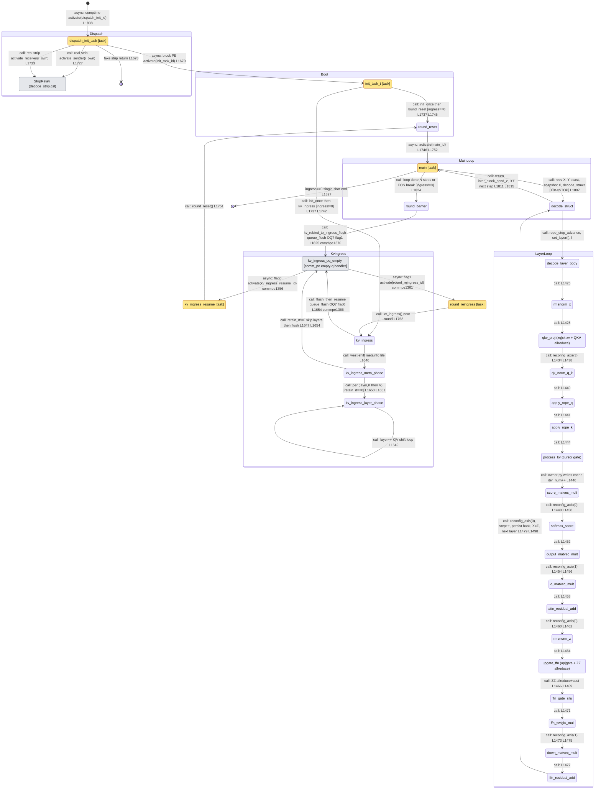

# qwen3_1p7b-decode · decode.csl — task/fn state machine

> Control-flow / state-machine companion to the algo walkthrough. Model `qwen3_1p7b-decode`, ref
> config `test_sim_2x2block_kv_varlen.json` (2×2 blocks, 7 layers → ≤2 layers/block, `KV_TRANSFER=1`
> so the runtime KV-ingress path is live). Nodes = every `task` + every driver/operator `fn` that a
> task calls, plus the `comm_pe` empty-queue handler where the two KV round-trip `@activate`s actually
> fire. Edges = control transfers, labelled `call:` (synchronous same-stack call), `async:` (a bare
> `@activate(id)` local-task activation or a `comm_pe` module callback fired on a queue-drain event).
> Line refs `L####` are `decode.csl:####`; `commpe####` is `comm_lib/comm_pe.csl:####`. Companion
> diagram: `qwen3_1p7b-decode.decode.statemachine.svg`.

## Loop boundaries at a glance

- **Per-round loop** — the KV round-trip. `main`'s tail (`ingress!=0`, L1823) barriers the column then
  `kv_rebind_to_ingress_flush` (broadcast→ingress rebind + `@queue_flush(OQ7)`); the OQ7-empty event fires
  `round_reingress` (commpe1361), which re-runs `kv_ingress` for the next request's prefix; that ingress's
  own flush fires `kv_ingress_resume` (commpe1356) → `round_reset` → `@activate(main)`. So the serve loop is
  `main → round_reingress → kv_ingress → kv_ingress_resume → round_reset → main`, never returning to `[*]`.
  `KV_TRANSFER=0` (bake) has no round loop: `main` just ends at L1827.
- **Per-step (per-token) loop** — `main`'s `while i < n_steps` (L1775). Each step recv/broadcasts X, runs
  `decode_struct` (one full layer stack, appending one K/V per layer), sends Z, re-arms. The back-edge is
  `decode_struct → main` (L1811). `n_steps` is re-derived per round in `round_reset` (L298).
- **Per-layer loop** — `decode_struct`'s `while l < layers_in_this_block` (L1495): `set_layer(l)` →
  `decode_layer_body` → persist `(iter_num, step)` to the per-layer bank → chain `X = Z`. Back-edge
  `ffn_residual_add → decode_struct` (L1498).
- **Operator pipeline** — `decode_layer_body` (L1424) is a **straight-line** driver (no flag hub, no async
  operators — decode's GEMVs are synchronous `@map`s, unlike prefill's Cannon/attention chains). The chain
  edges show execution order; each `reconfig_allreduce_axis(k)` between operators (L1434/1448/1454/1460/1473/
  1479) repaints the collective routes for the next stage and is folded into the incoming edge label.
- **KV-ingress shift loop** — inside `kv_ingress`, `kv_ingress_layer_phase` self-loops over
  `(layer, K|V)` (L1648-1652) doing the west-going blocking `@mov16` shift; `retain_rt!=0` skips the layer
  phases entirely (metainfo only, cache retained) and goes straight to the flush.

## State-by-state walk

### Dispatch (every PE)

- **dispatch_init_task** (task, L1657). In-edge: comptime `@activate(dispatch_init_id)` from `[*]` (L1838,
  the single entry — every PE binds and activates it). Recovers strip-vs-block identity from fabric coords.
  Block PE → **async** `@activate(init_task_id)` (L1670). Fake strip (no real inter-region traffic) →
  `return` to `[*]` (L1678). Real strip → rebinds K-pipe queue colors then **call**s `activate_sender`
  (L1727) or `activate_receiver` (L1733) in `decode_strip.csl` (the `StripRelay` external node — its own
  task chain is documented in `qwen3_1p7b-decode.decode_strip.statemachine`).

### Boot / KV ingress

- **init_task_t** (task, L1736). In-edge: L1670. Always runs `init_once()` (paints collective routes, coords,
  α — L1737). Then branches on `kv_stream_ingress`: `!=0` → **call** `kv_ingress()` (L1742, then `return` —
  the round loop takes over); `==0` (bake) → **call** `round_reset()` (L1745). `init_once` is folded into the
  outgoing edge labels (one-time, no downstream control interest). Runs once per PE.
- **round_reset** (fn, L286). In-edges: `init_task_t` bake (L1745), `kv_ingress_resume` (L1751). Re-derives
  this round's decode budget `n_steps` (L298), re-seeds the RoPE f32 state from the round's prefill
  (`rope_init_from_delta_p`, L301), and resets every layer bank's `(iter_num, step)` cursor (L304-307). Out-edge
  **async** `@activate(main_id)` (L1746 bake / L1752 resume) — the two `@activate(main)` sites merge here.
- **kv_ingress** (fn, L1630). In-edges: `init_task_t` (L1742), `round_reingress` (L1758). Odd fabric columns
  swap the IQ7/OQ7↔color binding, then **call** `kv_ingress_meta_phase` (L1646); when `retain_rt==0` also the
  per-layer `kv_ingress_layer_phase` loop (L1649-1652). Finally **call**s `comm.kv_ingress_flush_then_resume`
  (flag=0, `@queue_flush(OQ7)`, L1654) → the `kv_ingress_oq_empty` handler.
- **kv_ingress_meta_phase** (fn, L1571). In-edge: `kv_ingress` (L1646). West-shifts the 4×i16 metainfo tile,
  extracting this round's `prefill_len`, `decode_len`, `retained_len` and the `retain_rt` flag (L1577-1580).
  If `retain_rt==0` **call**s `kv_ingress_layer_phase`; else the KV is retained, so control skips straight to
  the flush (drawn as `kv_ingress_meta_phase → kv_ingress_oq_empty`, L1647/L1654).
- **kv_ingress_layer_phase** (fn, L1583). In-edge: `kv_ingress_meta_phase` (L1650/1651) and its own
  `(layer, K|V)` self-loop (L1649). Per `(layer, K|V)`: blocking west-shift of `num_tiles` KV tiles, then
  scatter the kept tile into `XKCache_tile`/`XVCache_tile` at the layer slab.
- **kv_ingress_oq_empty** (`comm_pe` empty-queue handler, commpe1351 — external). In-edges: `kv_ingress`
  flush (flag=0, L1654) and `round_barrier`→`kv_rebind_to_ingress_flush` (flag=1, L1825). This is where the
  KV round-trip's two `@activate`s actually fire: flag=0 rebinds IQ7/OQ7 back to `broadcast` and **async**
  `@activate(kv_ingress_resume_id)` (commpe1356); flag=1 rebinds `broadcast→ingress` and **async**
  `@activate(round_reingress_id)` (commpe1361).
- **kv_ingress_resume** (task, L1750). In-edge: commpe1356. **call**s `round_reset()` (L1751) then the shared
  `round_reset → main` async edge. Runs every round after its KV prefix has landed.
- **round_reingress** (task, L1757). In-edge: commpe1361. **call**s `kv_ingress()` (L1758) to ingest the next
  round's KV — the per-round re-arm head.

### Main serve loop

- **main** (task, L1767). In-edge: `round_reset` (`@activate(main_id)`, L1746/1752). First, on the
  result-sender and `ingress!=0`, ships this round's budget `N` as a 1-wavelet header to HT_tail (L1770-1773).
  Then the `while i < n_steps` per-step loop: recv X (host stream on `is_x_receiver`, else
  `inter_block_recv_x_sync`), Y-broadcast X, check the STOP sentinel (`X[0] < STOP_THRESHOLD` → forward Z +
  break, L1797-1803), snapshot X, **call** `decode_struct()` (L1807), `inter_block_send_z(Z)` and the
  streaming result send (L1811-1817). On loop exit (`N` steps or EOS break): `ingress!=0` → **call**
  `round_barrier()` (L1824); `ingress==0` → end at `[*]` (L1827).
- **decode_struct** (fn, L1489). In-edge: `main` (L1807). Restores `X_tile` from the step snapshot,
  `rope_step_advance()` (snapshot/advance the shared per-step RoPE angles, L1493), then the per-layer loop
  (L1495): `set_layer(l)` → **call** `decode_layer_body` → persist bank + chain `X = Z`. Returns to `main`
  (L1811) after all layers.
- **round_barrier** (fn, L314). In-edge: `main` tail (L1824). A synchronous Y-axis all-reduce (value discarded)
  that fences the column so no PE rebinds IQ7 while a neighbor still broadcasts, then **call**s
  `comm.kv_rebind_to_ingress_flush` (flag=1, L1825) → `kv_ingress_oq_empty`.

### Operator pipeline (decode_layer_body, straight-line)

- **decode_layer_body** (fn, L1424). In-edge: `decode_struct` (L1497). Straight-line driver of one layer's
  operators; the chain below runs in source order, each `reconfig_allreduce_axis(k)` repainting collective
  routes for the next stage.
- **rmsnorm_x** (fn, L970) — input RMSNorm (fp32, HF parity), L1426.
- **qkv_proj** (fns `xq/xk/xv_matvec_mult` L972/978/984 + `all_reduce_bsz_dim_QKV_fusion` + cast, L1428-1432)
  — the three GQA projections into one fused `QKV_tile`, one node.
- **qk_norm_q_k** (fn, L1128) — Qwen3 per-head QK-Norm; reached after `reconfig_axis(3)` (L1434), L1438.
- **apply_rope_q** (fn, L1051) — RoPE on Q pairs, L1440.
- **apply_rope_k** (fn, L1052) — RoPE on K pairs, L1441.
- **process_kv** (fn, L1148) — the **KV-cursor gate**: only the owner PE (`local_py == step % P_BLOCK_SIZE`)
  writes the new K/V into cache column `iter_num` and bumps `iter_num`; skipped once `iter_num >= kv_len_per_pe`
  (L1149-1150). Entered at L1444.
- **score_matvec_mult** (fn, L1188) — `Q·Kᵀ` GEMV over the `iter_num` cached K columns + band all-reduce +
  α-scale, L1446.
- **softmax_score** (fn, L1245) — fp32 two-pass safe softmax: bf16 max → Y all-reduce max → f32 subtract → exp
  → f32 sum → Y all-reduce sum → normalize → cast to bf16; reached after `reconfig_axis(0)` (L1448), L1450.
- **output_matvec_mult** (fn, L1312) — `score·V` GEMV + band all-reduce, L1452.
- **o_matvec_mult** (fn, L1350) — attention out-projection + X all-reduce; after `reconfig_axis(1)` (L1454),
  L1456.
- **attn_residual_add** (fn, L1357) — `Z = X + attn_out`, L1458.
- **rmsnorm_z** (fn, L1364) — post-attention RMSNorm on Z; after `reconfig_axis(0)` (L1460), L1462.
- **upgate_ffn** (fns `up/gate_matvec_mult` L1366/1371 + `all_reduce_bsz_ffn_dim_ZZ_fusion` + cast,
  L1464-1467) — fused up|gate FFN projection, one node.
- **ffn_gate_silu** (fn, L1376) — branchless SIMD-4 f32 SiLU on the gate half, L1469.
- **ffn_swiglu_mul** (fn, L1403) — `swiglu = up * silu(gate)`, L1471.
- **down_matvec_mult** (fn, L1410) — FFN down-projection + X all-reduce; after `reconfig_axis(1)` (L1473),
  L1475.
- **ffn_residual_add** (fn, L1417) — `Z += down`, L1477; then `reconfig_axis(0)` + `step += 1` (L1479/1483)
  and the per-layer back-edge to `decode_struct` (L1498).

## Legend

- **`call:`** — synchronous same-stack `fn`/`task` call (no yield). Chained operator edges represent source
  order within the straight-line `decode_layer_body`; the per-layer/per-step loop back-edges are real `while`
  loops in `decode_struct`/`main`.
- **`async:`** — a bare `@activate(id)` local-task activation (control yields; the target runs as a scheduled
  task) or a `comm_pe` empty-queue callback fired on an OQ7 `@queue_flush` drain event. `commpe####` marks
  where in `comm_lib/comm_pe.csl` the edge is actually fired.
- **`[task]`** (amber) — a hardware task (`@get_local_task_id` + `@bind_local_task`). **[…external…]** (grey) —
  a node whose body lives in another module (`decode_strip.csl` relay, `comm_pe.csl` empty-q handler).
  Unmarked nodes are plain `fn`s reached by synchronous call.

## Validation

- **31 nodes**, one entry (`dispatch_init_task` from `[*]`, L1838); every other node has ≥1 in-edge; the two
  `[*]` terminals are the fake-strip return (L1678) and the bake single-shot end (L1827). No orphans.
- **`@activate` sites in decode.csl: 4** — L1838 (`[*]→dispatch_init_task`), L1670
  (`dispatch_init_task→init_task_t`), L1746 + L1752 (both `round_reset→main`, merged into one edge as the two
  `@activate(main_id)` call sites). All drawn.
- **`.activate` (module-fn) sites: 2** — L1727 (`activate_sender`), L1733 (`activate_receiver`), both drawn as
  `dispatch_init_task → StripRelay` edges.
- **`.unblock=` callbacks: 0**; **`@block` / `@unblock` sites: 0** in decode.csl (decode's collectives are
  synchronous; no Cannon/attention operand rendezvous as in prefill).
- **`@bind_local_task` sites: 5** (L1833-1837) — establish the 5 task nodes (`init_task_t`, `main`,
  `dispatch_init_task`, `kv_ingress_resume`, `round_reingress`); not edges.
- **Cross-module async edges** (fired in `comm_pe.csl`, ids passed in at L219-220): `kv_ingress_oq_empty →
  kv_ingress_resume` (commpe1356, flag=0) and `kv_ingress_oq_empty → round_reingress` (commpe1361, flag=1) —
  both drawn; these are the real `@activate`s that close the KV round-trip.

## Ambiguities / modelling choices

- **`init_once` folded into edges.** `init_task_t` unconditionally calls `init_once()` (L1737) before the
  `kv_stream_ingress` branch; it paints one-time routes with no further control interest, so it is folded into
  the two outgoing edge labels (`call: init_once then …`) rather than drawn as a node — mirroring the prefill
  diagram's `comm.init then enter_request`.
- **`round_reset → main` merge.** The literal `@activate(main_id)` lives in `init_task_t` (L1746) and
  `kv_ingress_resume` (L1752), each *after* `round_reset` returns. Since both share the same continuation, they
  are drawn as one `round_reset → main` async edge carrying both line refs; `round_reset`'s in-edges (L1745,
  L1751) preserve the two call paths.
- **`reconfig_allreduce_axis` as edge labels.** The six `comm.reconfig_allreduce_axis(k)` calls interleaved in
  `decode_layer_body` are route-repaints, not control branches, so they annotate the operator edges rather than
  appearing as nodes (they are the "layer-stage dispatch" the orientation notes — stage k selects the
  collective's axis for the next operator group).
- **`qkv_proj` / `upgate_ffn` fusion.** The three Q/K/V projection fns (+ QKV fusion all-reduce) and the two
  up/gate fns (+ ZZ fusion all-reduce) are each collapsed into one node — they are contiguous projection
  triples/pairs feeding a single fused collective, matching prefill's single `p_qkv_matmul`/`p_upgate_matmul`.
- **`retain_rt` skip.** When `retain_rt!=0` (empty prefill this round = retain the cached KV), `kv_ingress`
  runs only the metainfo phase and skips all `kv_ingress_layer_phase` shifts (L1647); drawn as the direct
  `kv_ingress_meta_phase → kv_ingress_oq_empty` edge.
