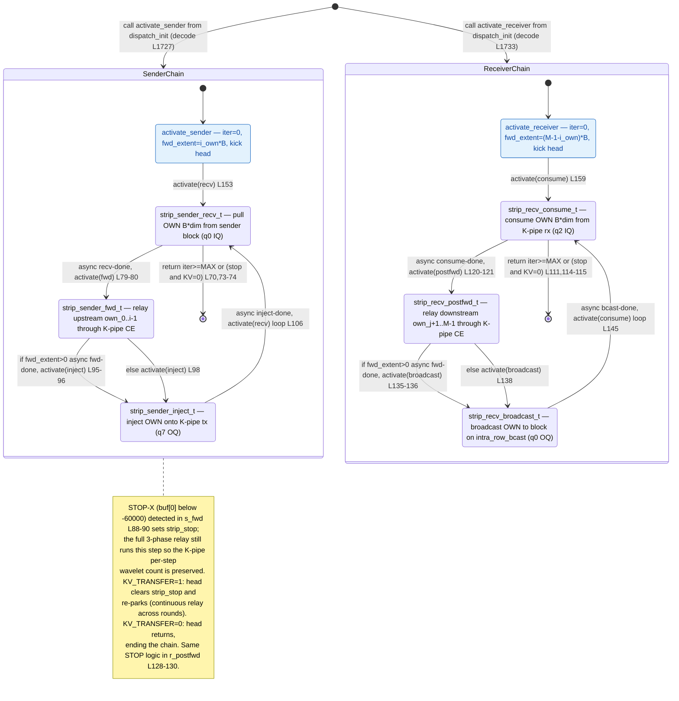

# qwen3_1p7b-decode · decode_strip.csl — task/fn state machine

> Model `qwen3_1p7b-decode`, ref config `test_sim_2x2block_kv_varlen.json`.
> Control-flow / state-machine companion to the algo walkthroughs. This file maps the **task
> activation graph** (who fires whom, sync vs async) — not the spatial K-pipe / inter-block shift
> geometry. `decode_strip.csl` is a **library** imported by `decode.csl` (no `main`); it holds the
> K-pipe strip relay chain that a strip (edge/IO) PE runs. A strip PE sits at `lcl_x = -1` (west) or
> `lcl_x = Pw_total` (east) of a decode block and relays K-cache wavelets between the block and the
> cross-region K-pipe. Each strip runs **one of two** async chains for up to `MAX_OUTPUT_LEN` iters:
> *sender* (`recv → fwd → inject`) or *receiver* (`consume → post_fwd → broadcast`).
> Diagram: `qwen3_1p7b-decode.decode_strip.statemachine.svg`.

## Two independent sub-machines

There is no single entry. `decode_strip.csl` exports two entry `fn`s — `activate_sender`
(`decode_strip.csl:150-154`) and `activate_receiver` (`decode_strip.csl:156-160`) — and the decode
block's `dispatch_init_task` selects **exactly one** at runtime from the strip's fabric coordinates
and row parity (`decode.csl:1716-1733`): `strip_role == 0` (snake-tail side) calls the sender, else
the receiver. So a given strip PE ever runs only one of the two composite chains. The six tasks are
bound at `decode_strip.csl:162-169` (task ids 13-18). No `.unblock` and no `@block` appear anywhere in
this kernel — control is a pure activation ring per role, self-guarded by a counter and a stop flag.

### Entry: `activate_sender` / `activate_receiver` (leaf entry `fn`s)
- **In-edge:** a synchronous `call` from `dispatch_init_task` in `decode.csl` — `activate_sender` at
  `decode.csl:1727`, `activate_receiver` at `decode.csl:1733`. These are the two `[*]` entries.
- **Body:** reset `strip_iter = 0` and set the per-role forward extent — sender forwards `i_own * B`
  wavelets (upstream own cells, `decode_strip.csl:152`), receiver forwards `(M-1-i_own) * B` wavelets
  (downstream own cells, `decode_strip.csl:158`), where `B = bsz * dim_per_pe`.
- **Out-edge:** `@activate` the role's head task — `activate(strip_sender_recv_id)`
  (`decode_strip.csl:153`) or `activate(strip_recv_consume_id)` (`decode_strip.csl:159`).

### Sender chain — `strip_sender_recv_t` → `strip_sender_fwd_t` → `strip_sender_inject_t`

**`strip_sender_recv_t`** (head / loop guard, `decode_strip.csl:69-81`)
- **In-edges:** the entry `activate(recv)` from `activate_sender` (`:153`) and the loop back-edge
  `activate(recv)` from `strip_sender_inject_t` (`:106`).
- **Guards → terminal:** returns (chain ends, node → `[*]`) if `strip_iter >= MAX_OUTPUT_LEN`
  (`:70`, hard ceiling across all rounds) or if `strip_stop != 0` **and** `kv_stream_ingress == 0`
  (`:73-74`). On `kv_stream_ingress == 1` a set `strip_stop` is cleared and the loop continues (`:75`)
  — the next recv parks until the block re-arms.
- **Body / out-edge (async):** increments `strip_iter` (`:77`), then Phase 1 pulls this cell's `B`
  wavelets from the sender block over `inter_block_{a,b}_color` (q0 IQ) via `@fmovh`, callback
  `.activate = strip_sender_fwd_id` (`:79-80`).

**`strip_sender_fwd_t`** (`decode_strip.csl:83-100`)
- **In-edge:** async recv-complete from `strip_sender_recv_t` (`:80`).
- **STOP detect:** if `strip_buf[0] < -60000` sets `strip_stop = 1` (`:88-90`); the relay still runs
  in full this step (skipping it would desync the shift-register receiver → device hang).
- **Out-edges (mutually exclusive, both → `strip_sender_inject_t`):**
  - `strip_fwd_extent > 0`: Phase 2 forwards upstream `own_0..own_{i-1}` wavelets through the K-pipe
    CE relay (length-narrowed `@fmovh`), callback `.activate = strip_sender_inject_id` (**async**,
    `:95-96`).
  - else: `@activate(strip_sender_inject_id)` directly (**synchronous activation**, no transfer,
    `:98`).

**`strip_sender_inject_t`** (`decode_strip.csl:102-107`)
- **In-edge:** from `strip_sender_fwd_t` (async `:96` or direct `:98`).
- **Body / out-edge (async, loop back):** Phase 3 injects this cell's own wavelets onto the K-pipe
  `tx_color` (q7 OQ) via `@fmovh`, callback `.activate = strip_sender_recv_id` (`:106`) — the
  per-iteration back-edge that re-fires the guarded head.

### Receiver chain — `strip_recv_consume_t` → `strip_recv_postfwd_t` → `strip_recv_broadcast_t`

Structurally the mirror of the sender chain (same guards, same async shape); it moves K-pipe → block
instead of block → K-pipe.

**`strip_recv_consume_t`** (head / loop guard, `decode_strip.csl:110-122`)
- **In-edges:** entry `activate(consume)` from `activate_receiver` (`:159`) and the loop back-edge
  `activate(consume)` from `strip_recv_broadcast_t` (`:145`).
- **Guards → terminal:** returns (node → `[*]`) if `strip_iter >= MAX_OUTPUT_LEN` (`:111`) or if
  `strip_stop != 0` and `kv_stream_ingress == 0` (`:114-115`); `kv_stream_ingress == 1` clears
  `strip_stop` and continues (`:116`).
- **Body / out-edge (async):** Phase 1 consumes this cell's `B` wavelets from the K-pipe `rx_color`
  (q2 IQ), callback `.activate = strip_recv_postfwd_id` (`:120-121`).

**`strip_recv_postfwd_t`** (`decode_strip.csl:124-140`)
- **In-edge:** async consume-complete from `strip_recv_consume_t` (`:121`).
- **STOP detect:** `strip_buf[0] < -60000` sets `strip_stop = 1` (`:128-130`); full relay still runs.
- **Out-edges (both → `strip_recv_broadcast_t`):**
  - `strip_fwd_extent > 0`: Phase 2 forwards downstream `own_{j+1}..own_{M-1}` wavelets through the
    K-pipe CE relay, callback `.activate = strip_recv_broadcast_id` (**async**, `:135-136`).
  - else: `@activate(strip_recv_broadcast_id)` directly (**synchronous activation**, `:138`).

**`strip_recv_broadcast_t`** (`decode_strip.csl:142-146`)
- **In-edge:** from `strip_recv_postfwd_t` (async `:136` or direct `:138`).
- **Body / out-edge (async, loop back):** Phase 3 broadcasts this cell's own wavelets onto
  `intra_row_bcast` (q0 OQ) → block, callback `.activate = strip_recv_consume_id` (`:145`) — the
  per-iteration back-edge.

## Loop / terminal boundaries

- **Per-iteration ring:** each role is a 3-task async ring `head → fwd/postfwd → inject/broadcast →
  head`. One full lap moves one step's worth of K-cache wavelets (one autoregressive decode step, or
  one KV-ingress round position).
- **Per-run ceiling:** the head task increments `strip_iter` and self-terminates at
  `MAX_OUTPUT_LEN` (= `W × NUM_ROUNDS` — the continuous-relay ceiling across all rounds,
  `decode_strip.csl:16`).
- **Early stop:** an EOS/early-exit relays a STOP-X sentinel (`buf[0] = NEG_INF`). The fwd/postfwd
  task sets `strip_stop` after relaying it one more hop; on `KV_TRANSFER=0` the head then ends the
  chain, on `KV_TRANSFER=1` it clears `strip_stop` and re-parks to relay the next round
  (`decode_strip.csl:57-63`).

## Legend

- **`async …`** — an async-op completion callback (`.activate` on an `@fmovh` microthread); the source
  task returns immediately, the edge fires when the transfer drains.
- **`call …`** — a synchronous, same-stack `fn` call (the two `activate_*` entries, invoked from
  `dispatch_init_task`).
- **`activate(x)`** — `@activate` / `.activate = x_id`, an activation edge. There are **no** `@block` /
  `.unblock` gating edges in this kernel.
- **`[*]`** — each composite's own entry (`call activate_*`) and terminal (`return` from the guarded
  head). `SenderChain` / `ReceiverChain` are the per-role composite loops; a strip PE runs exactly one.

## Edge inventory (control-transfer sites vs edges drawn)

| Site (source) | kind | target | edge in diagram |
|---|---|---|---|
| `call strip_mod.activate_sender` `decode.csl:1727` | sync call | activate_sender | `[*] → SenderChain` |
| `call strip_mod.activate_receiver` `decode.csl:1733` | sync call | activate_receiver | `[*] → ReceiverChain` |
| `@activate(strip_sender_recv_id)` `decode_strip.csl:153` | activation | s_recv | activate_sender → s_recv |
| `.activate=strip_sender_fwd_id` `decode_strip.csl:80` | async activation | s_fwd | s_recv → s_fwd |
| `.activate=strip_sender_inject_id` `decode_strip.csl:96` | async activation | s_inject | s_fwd → s_inject (fwd_extent>0) |
| `@activate(strip_sender_inject_id)` `decode_strip.csl:98` | activation | s_inject | s_fwd → s_inject (else) |
| `.activate=strip_sender_recv_id` `decode_strip.csl:106` | async activation | s_recv | s_inject → s_recv (loop) |
| `@activate(strip_recv_consume_id)` `decode_strip.csl:159` | activation | r_consume | activate_receiver → r_consume |
| `.activate=strip_recv_postfwd_id` `decode_strip.csl:121` | async activation | r_postfwd | r_consume → r_postfwd |
| `.activate=strip_recv_broadcast_id` `decode_strip.csl:136` | async activation | r_broadcast | r_postfwd → r_broadcast (fwd_extent>0) |
| `@activate(strip_recv_broadcast_id)` `decode_strip.csl:138` | activation | r_broadcast | r_postfwd → r_broadcast (else) |
| `.activate=strip_recv_consume_id` `decode_strip.csl:145` | async activation | r_consume | r_broadcast → r_consume (loop) |

**10 activation edges inside `decode_strip.csl`** (4 direct `@activate` at `:98,:138,:153,:159` +
6 microthread `.activate` at `:80,:96,:106,:121,:136,:145`), all drawn, plus the **2 synchronous
`call` entries** from `decode.csl` (`:1727,:1733`). **Zero `.unblock`, zero `@block`** — no gating
edges. The two `return` terminals (`decode_strip.csl:70/73-74` sender head, `:111/114-115` receiver
head) are the `[*]` exits.
