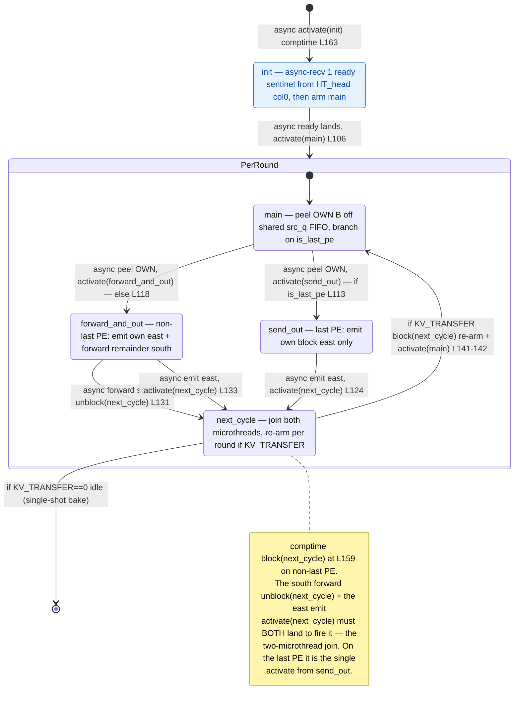

# qwen3_1p7b-decode · demux.csl — task/fn state machine

> Model `qwen3_1p7b-decode`, ref config `test_sim_2x2block_kv_varlen.json`.
> Control-flow / state-machine companion to the algo walkthrough. Diagram:
> `qwen3_1p7b-decode.demux.statemachine.svg`. This file maps the **task activation graph**
> (who fires whom, sync vs async) — not the spatial peel/forward/emit geometry.
>
> Decode variant vs prefill's demux: (1) an extra `init` task gates the whole machine on a
> one-time **ready sentinel** from HT_head col0 (async fabric barrier) before `main` ever peels;
> (2) the per-request re-arm is conditional on `kv_stream_ingress` (`KV_TRANSFER=1`, multi-round
> KV ingress) — with `KV_TRANSFER=0` the machine is **single-shot** (bake) and `next_cycle` is
> terminal; (3) there is **no kickoff `fn`** — autoregressive steps close on-chip via
> HT_tail → tok_bcast → HT_head, so demux only handles the host X[0] seed per round.

## States

Five nodes, all `@bind_local_task` tasks bound at `demux.csl:151-155`: `init`, `main`, `send_out`,
`forward_and_out`, `next_cycle`. There is no plain-`fn` control edge (unlike prefill's
`demux_emit_kickoff`) — decode's demux has no kickoff sentinel. The same compiled program runs on
every column of the 1×P demux chain; `my_idx` / `is_last_pe` select which out-edges a given PE takes.

### `init` — one-time ready barrier (machine entry)
- **In-edge:** comptime `@activate(init_id)` at `demux.csl:163` — the single machine entry, drawn from
  `[*]`.
- **Body:** one async `@mov32` receives exactly 1 ready sentinel wavelet from the HT_head col0 PE on
  `ht_ready_color` into `ready_buf` (`demux.csl:104-107`); its completion callback is the only work.
- **Out-edge (async):** `.activate = main_id` (`demux.csl:106`). This barrier fires **once** — it is
  outside the per-round loop, so subsequent rounds re-park `main` directly without re-waiting for the
  sentinel (see `next_cycle`).

### `main` — the per-round entry / peel
- **In-edges:** the async ready-complete from `init` (`demux.csl:106`, first round) and the re-arm
  `@activate(main_id)` from `next_cycle` (`demux.csl:142`, every subsequent round — the loop back-edge,
  present only when `KV_TRANSFER=1`).
- **Body:** one async `@mov32` peels this column's `OWN_B` block off the shared `src_q` FIFO into
  `own_buf` (`demux.csl:112-118`). PE 0's `src_q` is the host stream; PE k≥1's is the north chain color.
  The peel's completion callback is the branch.
- **Out-edges (async, mutually exclusive on `is_last_pe`):**
  - `is_last_pe == 1` → `.activate = send_out_id` (`demux.csl:112-113`).
  - else → `.activate = forward_and_out_id` (`demux.csl:117-118`).

### `forward_and_out` — non-last PE (`my_idx < P-1`)
- **In-edge:** async peel-complete from `main` (`demux.csl:118`).
- **Body / out-edges (two concurrent microthreads that join at `next_cycle`):**
  - async `@mov32` streams the remaining `FWD_EXTENT = (P-1-my_idx)·OWN_B` wavelets **south** on
    `forward_oq` to PE k+1, callback `.unblock = next_cycle_id` (`demux.csl:130-131`).
  - async `@mov32` emits `own_buf` **east** on `out_oq` (= `pre_embed_x_color`), callback
    `.activate = next_cycle_id` (`demux.csl:132-133`).

### `send_out` — last PE (`my_idx == P-1`)
- **In-edge:** async peel-complete from `main` (`demux.csl:113`).
- **Body / out-edge:** async `@mov32` emits `own_buf` east on `out_oq`, `.activate = next_cycle_id`
  (`demux.csl:123-124`). No south forward exists on the last PE (`FWD_EXTENT = 1` placeholder), so this
  is the single edge into `next_cycle`.

### `next_cycle` — the join + conditional per-round re-arm
- **In-edges:** on the non-last PE, `.unblock(next_cycle_id)` from the south-forward mov
  (`demux.csl:131`) and `.activate(next_cycle_id)` from the east-emit mov (`demux.csl:133`); on the last
  PE, the single `.activate(next_cycle_id)` from `send_out` (`demux.csl:124`).
- **The join:** `next_cycle_id` is `@block`-ed at comptime on non-last PEs (`demux.csl:159`). So even
  though the east-emit mov `.activate`s it, the task cannot fire until the south-forward mov
  `.unblock`s it — **both microthreads must complete**. Block/unblock barrier, not an ordinary
  activation.
- **Out-edge (the loop, conditional):** only if `kv_stream_ingress != 0` (`KV_TRANSFER=1`): on the
  non-last PE `@block(next_cycle_id)` re-arms the join gate (`demux.csl:141`), then
  `@activate(main_id)` re-parks `main` for the next round's X[0] seed (`demux.csl:142`). With
  `KV_TRANSFER=0` (single-shot bake) `next_cycle` does nothing and the machine goes idle — the
  `next_cycle → [*]` edge in the diagram.

## Legend

- **`async …`** — an async-op completion callback (`.activate` / `.unblock` on an `@mov32`
  microthread); the source task returns immediately and the edge fires later when the transfer drains.
- **`activate(x)`** — `@activate` / `.activate = x_id`, an activation edge. **`unblock(x)`** —
  `.unblock = x_id`, releases a `@block`-gated task. **`block(x)`** — `@block`, re-arms/holds a gate.
- **`[*]`** — entry (comptime `@activate(init_id)`) / the composite's initial / the single-shot idle
  terminal. **`PerRound`** — the composite loop; `next_cycle → main` is the per-round re-arm back-edge,
  present only under `KV_TRANSFER=1`.
- Branch guards on edges (`if is_last_pe`, `else`, `if KV_TRANSFER`) are compile-time / config
  predicates; a given column under a given config takes only the matching edges.
- No `call:` (sync) or `event:` edges exist in this kernel — every intra-machine transfer is an async
  microthread callback; the sole `event`-like park (the ready sentinel) is modeled as `init`'s async
  in-edge.

## Edge inventory (control-transfer sites vs edges drawn)

| Site (source) | kind | target | edge in diagram |
|---|---|---|---|
| `@activate(init_id)` comptime `demux.csl:163` | activation | init | `[*] → init` |
| `.activate=main_id` `demux.csl:106` | async activation | main | init → PerRound (main) |
| `.activate=send_out_id` `demux.csl:113` | async activation | send_out | main → send_out |
| `.activate=forward_and_out_id` `demux.csl:118` | async activation | forward_and_out | main → forward_and_out |
| `.activate=next_cycle_id` `demux.csl:124` | async activation | next_cycle | send_out → next_cycle |
| `.unblock=next_cycle_id` `demux.csl:131` | async unblock | next_cycle | forward_and_out → next_cycle (south forward) |
| `.activate=next_cycle_id` `demux.csl:133` | async activation | next_cycle | forward_and_out → next_cycle (east emit) |
| `@activate(main_id)` `demux.csl:142` | activation | main | next_cycle → main (re-arm, KV_TRANSFER=1) |
| `@block(next_cycle_id)` comptime `demux.csl:159` | gate (initial) | next_cycle | join note |
| `@block(next_cycle_id)` `demux.csl:141` | gate (re-arm) | next_cycle | next_cycle → main label |

**8 activation/unblock edges** (2 `@activate` + 5 `.activate` + 1 `.unblock`), all drawn; the **2
`@block` sites** are gating (shown as the `next_cycle` join note + the re-arm label), not separate
arrows. No plain-`fn` call edge exists. `init`'s ready-sentinel receive collapses the prefill kernel's
implicit start into an explicit barrier task, and the `KV_TRANSFER` guard makes the `next_cycle → main`
back-edge conditional — the two structural differences from the prefill demux state machine.
