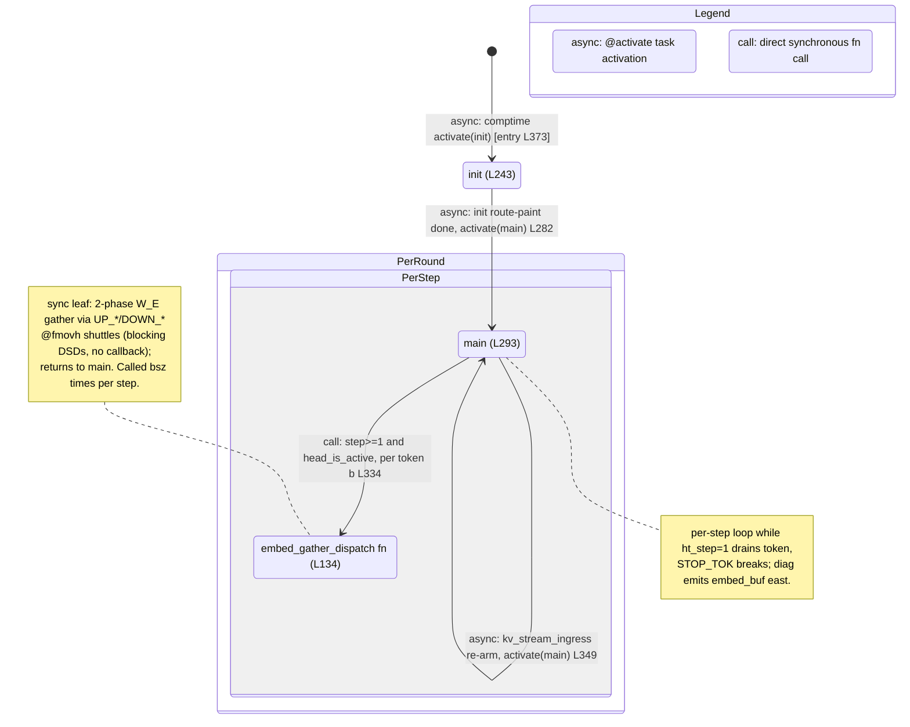

# qwen3_1p7b-decode · ht_head.csl — task/fn state machine

> Model `qwen3_1p7b-decode`, ref config `test_sim_2x2block_kv_varlen.json`. Control-flow / state-machine
> companion to the algo walkthrough. Nodes = tasks + directly-called fns; edges = control transfers
> (async `@activate` task activation vs synchronous `call`). Diagram:
> `qwen3_1p7b-decode.ht_head.statemachine.svg`.
>
> Decode variant of the vocab head: token id → embedding-row lookup. Unlike prefill's rotating shared
> vocab tile, decode **statically shards** the vocab along Y and **gathers** the owning row over 4
> statically-painted relay colors (UP_A/UP_B north, DOWN_A/DOWN_B south). The whole machine is small:
> two tasks (`init`, `main`) and one synchronous leaf fn (`embed_gather_dispatch`), with **no** async
> microthread callbacks — every fabric op is a blocking DSD move.

## States, in-edges, out-edges

Entry is the single `@activate(init_id)` in the comptime block (`ht_head.csl:373`), drawn from `[*]`. The
machine is linear — `init → main` — with two loops **inside** `main`: the per-step `while (ht_step <
n_steps)` (internal, no task transition) and, when `kv_stream_ingress != 0`, the **per-round** back-edge
`main → main` (L349) that re-reads the next round's step budget.

- **init** (`ht_head.csl:243`, task). Reads the PE's wafer coords via `tile_config.get_fabric_coord`,
  derives its local `head_my_x_local` / `head_my_py`, the diag-pair pys, and the `head_is_active` /
  `head_am_diag` flags, then paints the two per-row routes (`pre_embed_x_color` west→east/ramp,
  `post_embed_x_color` ramp/west→east). Col=0 PEs also fire the ready sentinel west via `@mov32`
  (L279 — a blocking send with **no** callback, so no control edge). *In:* entry `@activate` (L373,
  async). *Out:* one async edge — `@activate(main_id)` (L282).

- **main** (`ht_head.csl:293`, task). Drives the decode step loop. If `kv_stream_ingress != 0` it first
  drains a bsz-wide header off the token path and overwrites `n_steps` (L296–299). Then
  `while (ht_step < n_steps)`: **step 0** the diag PE parks the host-pre-embedded X (`@fmovh` from
  `pre_embed_x_recv_dsd`, L303); **step ≥ 1** every column drains its per-step token id (L309), breaks
  the loop on `STOP_TOK` (the diag PE floods the X path with `STOP_SENTINEL_F16` first, L315–321), else
  the active east columns loop `b` over `bsz` and **synchronously call** `embed_gather_dispatch` per
  token (L334). Every step the diag PE emits `embed_buf` east on `post_embed_x_send_dsd` (L341). *In:*
  async from `init` (L282) and the per-round self back-edge (L349). *Out:* a **sync call** to
  `embed_gather_dispatch` (L334) and, when `kv_stream_ingress != 0`, an **async** `@activate(main_id)`
  re-arm after the loop (L349); `kv_stream_ingress == 0` is single-shot (main terminates).

- **embed_gather_dispatch** (`ht_head.csl:134`, fn — inside `PerStep`). Pure fabric-shuffle leaf: given
  `(b, src_py, vocab_off)` it computes the four `case_src_*` predicates and issues the `@fmovh` shuttles
  that move the owning vocab row's two half-vectors along the UP_* (north) or DOWN_* (south) relay chain
  to the requesting diag PE's `embed_buf` slot. All moves are blocking DSD ops (no `.activate`/`.unblock`
  microthread callbacks). *In:* one **sync call** edge from `main` (L334). *Out:* none — it returns
  synchronously to `main` (the one sink; no control transfer or task activation out).

## Loop boundaries

- **Per-step loop** (`PerStep` composite): `while (ht_step < n_steps)` at `ht_head.csl:300`. This is a
  plain `while` **inside** `main`, not a task transition — the only control transfer it contains is the
  synchronous `embed_gather_dispatch` call (L334). Shown as a note on `main` plus the `main → dispatch`
  call edge nested in `PerStep`.
- **Per-round loop** (`PerRound` composite): `main → main` via `@activate(main_id)` (L349), taken only
  when `kv_stream_ingress != 0`. Resets `ht_step = 0` and re-enters `main`, which re-reads the next
  round's `N` header and re-parks step 0 on the host X[0]. With `kv_stream_ingress == 0` this edge does
  not exist and `main` is single-shot.

## Legend

- **`async:`** — a task `@activate` (comptime entry, or `main`'s per-round re-arm). The successor task is
  scheduled to run later.
- **`call:`** — a direct synchronous fn call on the same stack (`embed_gather_dispatch`); returns to the
  caller.
- No `.activate`/`.unblock`/`@block` primitives exist in this kernel — every `@mov32`/`@fmovh` is a
  blocking DSD move executed inline in the task, so there are no async microthread callback edges (unlike
  prefill's `ht_head`).

## Edge/site accounting

Grep of `ht_head.csl` control-flow sites vs. edges drawn:

- **`@activate`** — 3 sites (L282, L349, L373) → 3 edges (init→main, main→main per-round re-arm,
  `[*]`→init entry). Match.
- **`.activate`** (microthread callbacks) — 0 sites → 0 edges. Match.
- **`.unblock`** — 0 sites → 0 edges. Match.
- **`@block`** — 0 sites → 0 edges (no gating note). Match.
- **Direct fn calls** (sync) — 1 edge: main→embed_gather_dispatch (L334).

Total: 3 nodes (2 tasks + 1 fn), 4 control-transfer edges. Every node has an in-edge except the single
entry `init`; `embed_gather_dispatch` is the one sink (sync leaf helper); the per-round back-edge closes.
