# qwen3_1p7b-decode · ht_tail.csl — task/fn state machine

> Model `qwen3_1p7b-decode`, ref config `test_sim_2x2block_kv_varlen.json`.
> Control-flow / state-machine companion to the algo walkthrough for the decode output head.
> Nodes = tasks and the sync fns they drive; edges = control transfers (`async:` @activate / scheduling,
> `call:` direct fn call, `event:` blocking fabric recv park). File:line citations point at `ht_tail.csl`.

The decode tail mirrors prefill's `ht_tail.csl` (same lm_head matvec, final RMSNorm Y-allreduce, X
merge-reduce top-K, and sampling helpers) but where prefill runs the flow **once per request**, decode
wraps it in a **per-step `while` loop** (`tail_step < n_steps`) with early-stop, EOS handling, and a
**per-round re-arm** — so this machine has two extra loop levels the prefill version does not.

```mermaid
stateDiagram-v2
    state "tail_init task (L1201)" as tail_init
    state "tail_main task (L1288)" as tail_main

    [*] --> tail_init : async comptime activate(tail_init) [entry L1453]
    tail_init --> tail_main : async activate(tail_main) L1282
    tail_main --> tail_main : async re-arm activate(tail_main) L1423 [KV_TRANSFER=1; else terminal]

    state tail_init {
        state "derive coords + Y/X chain ids (L1202-1213)" as ti_derive
        state "write_Y_routes_tail fn (L490)" as ti_wY
        state "paint static routes: north tok L1220, z_drain L1231/1233, south L1241, xready barrier L1252; seed PRNG L1275; enable TSC L1279" as ti_routes
        [*] --> ti_derive
        ti_derive --> ti_wY : call write_Y_routes_tail() L1215
        ti_wY --> ti_routes : return
        ti_routes --> [*]
    }

    state tail_main {
        state "per-round reset (L1290): tail_step=0, clear done_flag/pred_token; re-seed PRNG L1296" as tm_reset
        state "budget header (KV_TRANSFER=1, L1302): mov32 recv N off Z-drain, overwrite n_steps, re-forward south(mux)+north(HT_head)" as tm_hdr
        state "dump_round += 1 (L1418)" as tm_dumpround

        [*] --> tm_reset
        tm_reset --> tm_hdr : KV_TRANSFER=1 read budget
        tm_reset --> tm_step : KV_TRANSFER=0 (n_steps baked)
        tm_hdr --> tm_step : enter per-step loop

        state tm_step {
            state "TSC start (is_tsc_pe, tail_step==warmup): sample start L1317" as st_tsc_start
            state "drain Z: fmovh z_slice from z_recv L1320" as st_drainZ
            state "STOP-Z check L1327: z_slice[0] < STOP_THRESHOLD" as st_stopcheck
            state "TSC burst (is_tsc_pe): async mov32 8-u32 L1336" as st_stopburst
            state "dump_logits_step0 (dbg, step0, root row L1353)" as st_dump
            state "north emit L1389: sampled token to HT_head (skip last step)" as st_north
            state "south emit L1396: root east-most topk_val+arg+pred to mux OQ0" as st_south
            state "TSC end (is_tsc_pe, last iter): sample end + async mov32 burst L1413" as st_tsc_end

            [*] --> st_tsc_start : loop iter (tail_step)
            st_tsc_start --> st_drainZ : event Z arrives from last block
            st_drainZ --> st_stopcheck
            st_stopcheck --> st_stopburst : STOP-Z sentinel
            st_stopburst --> [*] : break loop L1338
            st_stopcheck --> st_rmsnorm : normal step, call tail_final_rmsnorm() L1342

            state st_rmsnorm {
                state "phase1 per-batch local sumsq (L432)" as rn_sumsq
                state "tail_reduce_bsz_f32 fn (L825)" as rn_wrap
                state "tail_reduce_2phase fn (L732), do_broadcast=1, Y allreduce" as rn_reduce
                state "phase3 normalize + cast + mul W_final_norm (L459)" as rn_norm
                [*] --> rn_sumsq
                rn_sumsq --> rn_wrap : call tail_reduce_bsz_f32() L454
                rn_wrap --> rn_reduce : call tail_reduce_2phase() L826
                rn_reduce --> rn_norm : return
                rn_norm --> [*]
            }

            st_rmsnorm --> st_lmhead : call tail_lm_head_matvec() L1344

            state st_lmhead {
                state "vecmat_computation_lm fn (L383)" as lm_vecmat
                state "gemv_lm_step fmachs (L378) via map, loop bsz x V_per_pe_x" as lm_step
                [*] --> lm_vecmat : call vecmat_computation_lm() L413
                lm_vecmat --> lm_step : map over left_vector L395
                lm_step --> lm_step : per-K fmachs accumulate
                lm_step --> [*] : per-batch done L388
            }

            st_lmhead --> st_logred : call tail_logits_reduce_bsz_vocab() L1346

            state st_logred {
                state "tail_reduce_2phase fn (L732), do_broadcast=0, len bsz x V_per_pe_x" as lr_reduce
                [*] --> lr_reduce : call tail_reduce_2phase() L727
                lr_reduce --> [*] : logits land on root_2nd_phase row
            }

            st_logred --> st_dump : root row + dbg_logit_dump + step0 L1352
            st_dump --> st_topk : proceed
            st_logred --> st_topk : root row (normal) L1359
            st_logred --> st_north : non-root skip top-K

            state st_topk {
                state "write_X_routes_tail fn (L602): repaint reduce colors Y to X" as tk_wX
                state "xready barrier L1364: root_2nd_phase_x sends go / others recv (event)" as tk_barrier
                state "tail_local_topk fn (L862): size-K min-heap + block-max prune, loop bsz" as tk_local
                state "tail_topk_mergereduce_x fn (L956): X 2-phase reduce, per-hop merge + bcast" as tk_merge
                state "topk_merge_local fn (L930): 2-pointer K-list merge, loop bsz" as tk_mergefn
                state "tail_sample_token fn (L1085): softmax, top-p, PRNG draw (root_2nd_phase_x only)" as tk_sample
                state "predtok X-bcast L1375 send / L1377 recv" as tk_predbcast
                state "write_Y_routes_tail fn (L490): restore Y routes" as tk_wY
                [*] --> tk_wX : call write_X_routes_tail() L1360
                tk_wX --> tk_barrier : return
                tk_barrier --> tk_local : call tail_local_topk() L1369
                tk_local --> tk_merge : call tail_topk_mergereduce_x() L1370
                tk_merge --> tk_mergefn : call topk_merge_local() per hop L962
                tk_mergefn --> tk_merge : return per hop
                tk_merge --> tk_sample : call tail_sample_token() if root_2nd_phase_x L1374
                tk_merge --> tk_predbcast : else recv bcast L1377
                tk_sample --> tk_predbcast : return
                tk_predbcast --> tk_wY : call write_Y_routes_tail() L1379
                tk_wY --> [*]
            }

            st_topk --> st_north : proceed
            st_north --> st_south
            st_south --> st_tsc_end : is_tsc_pe and tail_step==n_steps-1 L1405
            st_south --> st_tsc_start : while tail_step<n_steps, next step L1313
            st_south --> [*] : loop done (non-tsc last step)
            st_tsc_end --> [*] : loop done (tsc last step)
        }

        tm_step --> tm_dumpround : loop exit (n_steps reached or STOP break)
        tm_dumpround --> [*]
    }

    note right of tm_reset
        Per-round loop: tail_main re-activates itself (L1423) only
        when KV_TRANSFER=1, re-parking on the next round's budget
        header + Z. KV_TRANSFER=0 is single-shot (no re-arm).
    end note
    note right of st_drainZ
        Event-driven fabric parks (not activate/block):
        budget header L1303, z_recv L1320, xready L1367.
    end note
    note left of st_tsc_end
        Fire-and-forget async sends (no callback, not activation
        edges): TSC burst L1336 (STOP path) and L1413 (last iter).
    end note

    state Legend {
        state "async: microthread callback / activate (scheduling edge)" as L1
        state "call: direct synchronous fn call (same stack)" as L2
        state "event: blocking fabric recv park (not activate/block)" as L3
    }
```

## States

Only two things are real scheduling units — the tasks `tail_init` and `tail_main` (bound at
`ht_tail.csl:1450-1451`, ids 10/11). Everything else runs on `tail_main`'s stack as synchronous fn calls
inside the per-step `while` loop; the composite `state { }` blocks below bound those sub-flows.

### Entry and the two tasks

- **`[*] → tail_init`** — the only entry. The comptime block schedules it with `@activate(tail_init_id)`
  (`ht_tail.csl:1453`). This is the single in-edge with no source state.
- **`tail_init` (`:1201`)** — one-shot per-PE setup: reads its wafer coord, derives local `(x_local, py)`
  plus the Y and X chain ids (`:1202-1213`); **calls** `write_Y_routes_tail()` (`:1215`); then paints all
  static routes (north sampled-token emit `:1220`, Z-drain multicast `:1231/1233`, south top-K emit `:1241`,
  cross-column X-phase barrier `:1252`), seeds the PRNG on the sampling PE (`:1275`), and enables the TSC
  counter on `is_tsc_pe` (`:1279`). In-edge: entry. Out-edge: **`async: @activate(tail_main_id)`** (`:1282`).
- **`tail_main` (`:1288`)** — the per-round / per-step pipeline. In-edges: the activation from `tail_init`
  (`:1282`) and its own **per-round re-arm** `@activate(tail_main_id)` (`:1423`, KV_TRANSFER=1 only). Under
  KV_TRANSFER=0 the task is single-shot (no re-arm) — the drawn self-edge is the reuse/multi-round path.

### `tail_init` internals

`ti_derive → ti_wY → ti_routes`, all synchronous. `ti_wY` is `write_Y_routes_tail` (`:490`) called at
`:1215`; it returns to the caller, then `ti_routes` paints the remaining static routes. Composite exit
`→ [*]` precedes the `async: activate(tail_main)` out-edge drawn at the top level.

### `tail_main` — per-round wrapper

1. **`tm_reset`** (`:1290`) — per-round state reset: `tail_step = 0`, clears `done_flag`/`pred_token_buf`
   (`:1291`), and re-seeds the sampling PRNG on the sampling PE (`:1296`) so each round samples
   reproducibly rather than carrying PRNG state across rounds.
2. **`tm_hdr`** (`:1302`, KV_TRANSFER=1 only) — reads this round's budget `N` as a 1-wavelet header ahead of
   step-0 `Z` (`@mov32` off the Z-drain, `:1303`, **event**), overwrites `n_steps`, and re-forwards `N`
   south to the mux (`:1306`) and north to HT_head (`:1310`) so every region loops to exactly `N`. Under
   KV_TRANSFER=0 this state is skipped (`tm_reset → tm_step` directly) and `n_steps` is the baked budget.
3. **`tm_step`** (composite) — the per-step `while (tail_step < n_steps)` loop (`:1313-1415`), detailed below.
4. **`tm_dumpround`** (`:1418`) — after the loop, `dump_round += 1` (VALUE-based retain-verify tagging).
   Composite exit `→ [*]`, then the top-level re-arm.

### `tm_step` — per-step loop body

The internal `[*] → st_tsc_start` is one loop iteration; the back-edge `st_south → st_tsc_start` (`:1313`)
is the `while` re-entry (`tail_step += 1`), and `→ [*]` marks loop exit.

1. **`st_tsc_start`** — on `is_tsc_pe` at `tail_step == warmup_cycles` only: samples the start TSC (`:1317`).
   Non-TSC PEs / non-warmup iters fall through.
2. **`st_drainZ`** — `@fmovh(z_slice_buf, z_recv)` (`:1320`): a **blocking fabric recv** that parks until the
   last decode block ships `Z` into the tail. Out-edge triggered by `event: Z arrives`.
3. **`st_stopcheck`** (`:1327`) — early-stop gate: if `z_slice_buf[0] < STOP_THRESHOLD_F16` the last block
   relayed a STOP-Z sentinel, so every tail PE **breaks** the loop together. On the STOP path the TSC PE
   emits its timing burst (`st_stopburst`, `@mov32 … .async = true`, `:1336`) then the loop `break`s
   (`:1338 → [*]`). Otherwise control **calls** `tail_final_rmsnorm()` (`:1342`).
4. **`st_rmsnorm`** (composite, `tail_final_rmsnorm` `:423`) — `rn_sumsq` computes the per-batch fp32
   sum-of-squares (`:432`), **calls** `tail_reduce_bsz_f32` (`:825`, at `:454`) which **calls**
   `tail_reduce_2phase` (`:732`, at `:826`) with `do_broadcast=1` — a Y-axis 2-phase all-reduce of the `bsz`
   sums. Control returns to `rn_norm` (`:459`) for normalize + cast + `* W_final_norm`, in place over
   `z_slice_buf`.
5. **`st_lmhead`** (composite, `tail_lm_head_matvec` `:405`) — **calls** `vecmat_computation_lm` (`:383`, at
   `:413`), which `@map`s `gemv_lm_step` (`:378`) over the left vector (`:395`). `lm_step → lm_step` is the
   **per-K `@fmachs` accumulate loop**; the outer `for b in bsz` (`:388`) closes the composite. Purely local.
6. **`st_logred`** (composite, `tail_logits_reduce_bsz_vocab` `:726`) — **calls** `tail_reduce_2phase`
   (`:732`, at `:727`) with `do_broadcast=0` and the wider `bsz*V_per_pe_x` extent; the full logits land only
   on the `root_2nd_phase` row. Second caller of the shared two-phase reduce (see note), which is why it is
   drawn once inside each caller's composite rather than as a shared global node with an ambiguous return.
7. **Root-row branch** (`:1359`): `st_logred → st_topk` when `tail_my_py == root_2nd_phase`; otherwise
   `st_logred → st_north` (non-root rows skip top-K). When `dbg_logit_dump` is set and `tail_step == 0`,
   `st_logred → st_dump` (`dump_logits_step0` `:1167`, sim-only fp32 vocab-shard dump) first, then `st_topk`.

### `st_topk` internals (root row only)

- **`tk_wX`** — `write_X_routes_tail` (`:602`, called `:1360`): repaints reduce colors 1-5 from Y to X.
- **`tk_barrier`** — the X-phase fence (`:1364`): `root_2nd_phase_x` sends a 1-wavelet "go" (`:1365`); every
  other root column does a **blocking recv** (`:1367`, event) before any X send, so no column emits an X-mode
  wavelet into a neighbor still painted for Y.
- **`tk_local`** — `tail_local_topk` (`:862`, called `:1369`): per-batch local top-K via a **size-K min-heap
  + block-max prune** (`lt_heap_sift_down`, block `@fmaxs` tree); seeds `topk_val`/`topk_arg`. (Decode uses
  the heap+prune here where prefill uses K masked-argmax passes — decode runs top-K once per generated token,
  so the O(K·V) pass was too costly.)
- **`tk_merge`** — `tail_topk_mergereduce_x` (`:956`, called `:1370`): X-axis 2-phase reduce whose per-hop
  combine **calls** `topk_merge_local` (`tk_mergefn`, `:930`, first at `:962`). `tk_merge ↔ tk_mergefn` is
  the **per-hop merge loop**; each hop recvs `KB` fp16 vals + `KB` i32 ids, merges into the running top-K,
  sends it on; the final broadcast (`:1072`) replicates the global top-K across the root row.
- **`tk_sample`** — `tail_sample_token` (`:1085`, called `:1374`, `root_2nd_phase_x` only): temperature →
  fp32 softmax → top-p nucleus → categorical PRNG draw into `pred_token_buf`; also updates per-lane
  `done_flag` (EOS/`dbg_force_eos_step`) and, when all lanes finished + early-stop enabled, overwrites pred
  with `STOP_TOK`. Non-root columns instead `recv` the broadcast (`tk_merge → tk_predbcast`).
- **`tk_predbcast`** — X-broadcasts the sampled ids to every root column (`:1375` send / `:1377` recv).
- **`tk_wY`** — `write_Y_routes_tail` (`:490`, called `:1379`): restores Y routes. Composite exit `→ [*]`.

### Tail of `tm_step`

- **`st_north`** (`:1385`) — every `tail_is_token_emitter` root-row column emits the sampled `bsz` ids north
  to HT_head (`@mov32`, `:1389`), skipping the true last step (`tail_step < n_steps-1`). Both the `st_topk`
  exit and the non-root bypass converge here.
- **`st_south`** (`:1396`) — the east-most root PE (`x_local == HT_WIDTH-1 && py == root_2nd_phase`) emits
  `topk_val` + `topk_arg` + `pred_token` (+ even-count pad) south on `logits_south_color` (OQ 0) to the mux
  → host, every step.
- **`st_tsc_end`** (`:1405`) — on the last iter (`tail_step == n_steps-1`) `is_tsc_pe` samples the end TSC,
  packs start+end into an 8-u32 burst, and **async-emits** it (`@mov32 … .async = true`, `:1413`) — a
  fire-and-forget send with no callback, so it is a note, not an activation edge.
- Loop control: `st_south → st_tsc_start` is the `while` back-edge (`:1313`, `tail_step += 1`); `st_south →
  [*]` / `st_tsc_end → [*]` are the loop-exit edges (`tail_step == n_steps`); `st_stopburst → [*]` is the
  STOP `break`. All three converge on `tm_dumpround`, then the top-level re-arm.

## Legend

- **`async:`** — a scheduling edge: `@activate` (task activation). Exactly three in this kernel: entry
  `:1453`, `tail_init → tail_main` `:1282`, and the per-round `tail_main` re-arm `:1423`. There are **no**
  `.activate`/`.unblock`/`@block` microthread or gating edges — the two `.async = true` mov32 TSC bursts
  (`:1336`, `:1413`) are fire-and-forget with no callback and are drawn as notes, not edges.
- **`call:`** — a direct synchronous fn call on the same stack; `return` edges close each sub-call back to
  its caller.
- **`event:`** — a blocking fabric recv park (budget header `:1303`, `z_recv` `:1320`, xready `:1367`). These
  gate progress but are not `@activate`/`@block` primitives.
