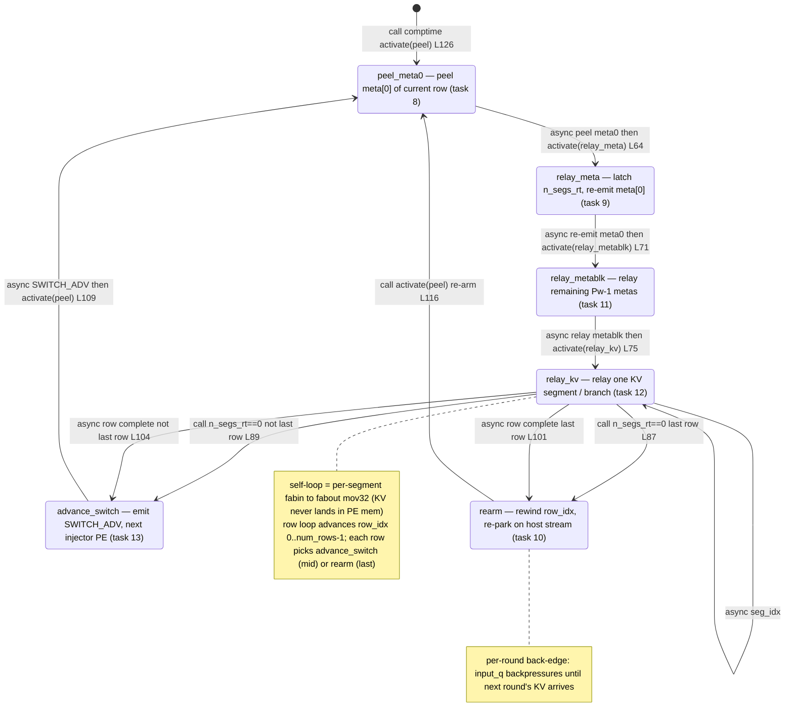

# qwen3_1p7b-decode · kv_ingress_adaptor.csl — task/fn state machine

> Model `qwen3_1p7b-decode`, ref config `test_sim_2x2block_kv_varlen.json`. Control-flow / state-machine companion to the algo walkthrough. Diagram: `qwen3_1p7b-decode.kv_ingress_adaptor.statemachine.svg`. This is the *task-graph* view (who activates whom); the host→injector relay geometry (TOP host stream in, SOUTH injector column out) and the SWITCH_ADV per-row scatter appear only as edge triggers. This is the single-PE ingress ADAPTOR: it peels varlen meta, re-emits it, and relays KV row-slices southward, one injector PE per row.

One PE runs this whole graph. All six tasks are `@bind_local_task`-bound (`kv_ingress_adaptor.csl:120-125`); the comptime block activates only `peel_id` (`:126`). Unlike the prefill `kv_egress_colmux` (whose column-fence sync split the graph per-PE role), this adaptor is a single relay PE with no role branch — every branch here is a data-driven counter test (`n_segs_rt`, `seg_idx`, `row_idx`), not a comptime binding choice. The two async `@mov32` ops that carry a segment to the SOUTH injector column and *also* fire the next task (`:101`, `:104`) are the fused "relay this segment AND advance" edges — the mov32 payload is the last KV segment of the row, and its callback re-arms control.

## States

**`peel_meta0` (task 8, `@get_local_task_id(8)` `:55`, bound `:120`).** The entry state — the only one activated from `[*]`, via the comptime `@activate(peel_id)` (`:126`). Peels `meta[0]` (extent 1) of the current row into `meta0_buf` with async `@mov32(meta0_buf_dsd, meta0_in_dsd, …)` (`:64`); `meta[0]` carries `prefill_len_per_pe` (plen). Out-edge: the async `.activate = relay_meta_id` callback fires `relay_meta` once the 1-word peel lands (`:64`). Re-entered every row from `advance_switch` (mid-round) and every round from `rearm`.

**`relay_meta` (task 9, `:56`, bound `:121`).** Latches the runtime segment count `n_segs_rt = D_kv * @as(u16, meta0_buf[0])` (the `@as(u16, u32)` truncation takes the low-16 plen, mirroring the prefill colmux; `:69`), resets `seg_idx = 0`, then **re-emits** `meta[0]` southward with async `@mov32(meta0_out_dsd, meta0_buf_dsd, …)` so the injector + block still receive the full `Pw`-meta block (`:71`). In-edge: from `peel_meta0` (`:64`). Out-edge: async `.activate = relay_metablk_id` (`:71`).

**`relay_metablk` (task 11, `:58`, bound `:122`).** Relays the remaining `Pw-1` metas as one fixed comptime-extent op `@mov32(metablk_out_dsd, metablk_in_dsd, …)` (`:75`) — this is the wavelet-count-neutral half of the peel+re-emit (peel meta[0], re-emit meta[0], pass the rest). In-edge: from `relay_meta` (`:71`). Out-edge: async `.activate = relay_kv_id` (`:75`), handing off to the KV body.

**`relay_kv` (task 12, `:59`, bound `:123`).** The KV relay core and the branch point. It moves one `seg_len`-wavelet KV segment `fabin→fabout` per entry; the row's `n_segs_rt` segments stream to the *same* injector PE (switch held at pos0) before SWITCH_ADV lets the next row advance. In-edges: from `relay_metablk` (`:75`) and its own self-loop (`:95`). Branch structure (`:81-106`):
- **`n_segs_rt == 0` guard** (empty-KV row, e.g. plen 0): no data moved. If this is the last row (`row_idx == num_rows-1`), sync `@activate(rearm_id)` (`:87`); else sync `@activate(advance_switch_id)` and `row_idx += 1` (`:89-90`). These two are the *synchronous* out-edges (no mov32 payload to ride).
- **self-loop** while `seg_idx < n_segs_rt`: async `@mov32(out_dsd, in_dsd, .activate = relay_kv_id)` moves the next segment and re-fires `relay_kv` (`:94-95`). This back-edge is the KV streaming out; bytes never land in PE memory.
- **row complete** (`seg_idx` reached `n_segs_rt`): the *final* segment mov32 carries the callback. If last row, async `.activate = rearm_id` (`:101`); else async `.activate = advance_switch_id` and `row_idx += 1` (`:104-105`). These two async edges fuse "send last segment" with "advance control".

**`advance_switch` (task 13, `:60`, bound `:124`).** Emits one `SWITCH_ADV` control wavelet on `inj_out_color` via async `@mov32(ctrl_out_dsd, switch_adv_dsd, …)` (`:109`) so the *next* injector PE's switch advances and the next row-slice lands on the next injector PE (no store-and-forward). Out-edge: async `.activate = peel_id` back to `peel_meta0` for the next row (`:109`). In-edges: sync from `relay_kv` empty-row branch (`:89`) and async from `relay_kv` row-complete branch (`:104`).

**`rearm` (task 10, `:57`, bound `:125`).** Per-round re-arm. Rewinds `row_idx = 0`, `seg_idx = 0`, `n_segs_rt = 0`, then sync `@activate(peel_id)` (`:112-116`); the input queue backpressures until the next round's KV arrives, so this is the park point between rounds (the injector resets its own switches, so this PE need not re-emit a final SWITCH_ADV). In-edges: sync from `relay_kv` empty-last-row branch (`:87`) and async from `relay_kv` last-row-complete branch (`:101`). Out-edge: sync `@activate(peel_id)` to `peel_meta0` (`:116`).

## Loops

- **Inner segment loop:** `relay_kv → relay_kv` (async, `:95`) — one iteration per KV transfer segment. `n_segs_rt == 1` (small contexts) collapses to a single mov32, byte-identical to an unsegmented relay. Segmentation is a fabric-DSD-extent limit (a 16-bit extent ≥ `0x7fff` hangs), not chunked prefill.
- **Per-row loop (mid-round):** `peel_meta0 → relay_meta → relay_metablk → relay_kv → advance_switch → peel_meta0`, advancing `row_idx` 0..`num_rows-1` (= `P_BLOCK_SIZE`, one row-slice per injector PE). Each non-last row exits `relay_kv` through `advance_switch` (`:89`/`:104`) to scatter to the next injector PE.
- **Per-round back-edge (outer loop):** the last row (`row_idx == num_rows-1`) exits `relay_kv` through `rearm` (`:87`/`:101`) instead of `advance_switch`; `rearm` re-parks on the host stream and re-arms `peel_meta0` for the next round. This is the serve-loop back-edge.

## Legend

- **Node** = a `task` that is `@activate`-d or bound as a task (all six are `@bind_local_task`, `:120-125`).
- Edge label prefix **`call`** = synchronous `@activate` (same stack, no mov32 payload); **`async`** = an async `@mov32` microthread callback (`.activate`), which for `:101`/`:104` also carries the KV segment being relayed. No `@block`/`@unblock`/`.unblock` sites exist in this kernel.
- `L<n>` in a label = source line in `kv_ingress_adaptor.csl`.
- `[*]` = the comptime entry (`:126`).
- Branch labels (`n_segs_rt==0`, `seg_idx<n_segs_rt`, `last row` / `not last row`) name the runtime counter test that selects the out-edge; unlike the prefill colmux, no edge here is a comptime role binding.
