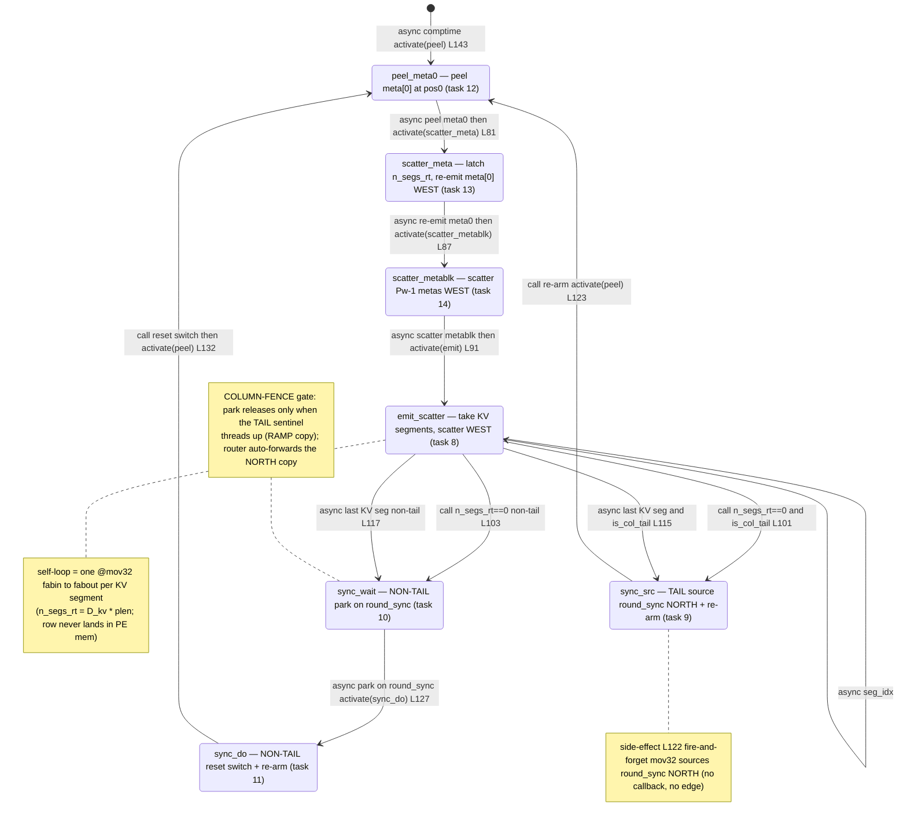

# kv_ingress_injector.csl — task/fn state machine

> Model `qwen3_1p7b-decode`, ref config `test_sim_2x2block_kv_varlen.json` (KV_TRANSFER=1, NUM_ROUNDS=3, varlen PREFILL_LENS). Control-flow / state-machine companion to the algo walkthrough. Diagram: `qwen3_1p7b-decode.kv_ingress_injector.statemachine.svg`. This is the *task-graph* view (who activates whom); the P_BLOCK_SIZE-tall switch column, the vertical demux, and the WEST scatter appear only as edge triggers. It is the ingress mirror of prefill's `kv_egress_colmux.csl` — direction reversed (host→device scatter), and with a metadata **peel-and-re-emit** front-end the egress side lacks.

Every injector PE in the switch column runs this same program. The only per-PE branch is `is_col_tail`, resolved at runtime inside `emit_scatter` (and structurally by the comptime queue binding at `kv_ingress_injector.csl:147-151`, which gives the tail a NORTH-emit output queue and every other PE a RAMP-recv input queue). So the graph has **seven** task nodes but any single PE walks only **six** of them: the front-end trio `peel_meta0 → scatter_meta → scatter_metablk → emit_scatter` is shared, then the tail takes `emit_scatter → sync_src → peel_meta0` while a non-tail takes `emit_scatter → sync_wait → sync_do → peel_meta0`.

## States

**`peel_meta0` (task 12, `@get_local_task_id(12)` `:75`, bound `:140`).** The entry state — the only one activated from `[*]`, via the comptime `@activate(peel_id)` (`:143`). At switch `pos0` it peels the row's leading `meta[0]` word into `meta0_buf` with an async `@mov32(meta0_buf_dsd, meta0_in_dsd, …)` (`:81`); this is the varlen front-end the egress mirror does not have. Out-edge: the async `.activate = scatter_meta_id` callback fires `scatter_meta` once the 1-word peel completes (`:81`). Re-entered every round from `sync_src` / `sync_do` — this is the per-round re-arm back-edge.

**`scatter_meta` (task 13, `:76`, bound `:141`).** Latches the runtime KV segment count `n_segs_rt = D_kv * @as(u16, meta0_buf[0])` — the low 16 bits of `meta[0]` are `plen` (prefill_len_per_pe), truncation-latched exactly as the colmux mirror does (`:85`) — and resets `seg_idx = 0` (`:86`). It then **re-emits** the peeled `meta[0]` WEST with an async `@mov32(meta0_scatter_dsd, meta0_buf_dsd, …)` (`:87`) so the decode block still receives all `Pw` metas. In-edge: async from `peel_meta0`. Out-edge: async `.activate = scatter_metablk_id` (`:87`).

**`scatter_metablk` (task 14, `:77`, bound `:142`).** Scatters the remaining `Pw-1` metas WEST as one fixed op, async `@mov32(metablk_scatter_dsd, metablk_in_dsd, …)` (`:91`). The switch is still `pos0` for the whole meta header (peel + re-emit + metablk) — the adaptor SWITCH_ADVs only between rows. In-edge: async from `scatter_meta`. Out-edge: async `.activate = emit_id` (`:91`).

**`emit_scatter` (task 8, `:71`, bound `:136`).** Takes this PE's KV row body (switch `pos0`, NORTH→RAMP) and scatters it WEST, segmented into `n_segs_rt` back-to-back fabric ops of `seg_len` wavelets — segmentation is a fabric-transport limit (a 16-bit fabric DSD extent ≥ `0x7fff` hangs silently), **not** chunked prefill. In-edges: async from `scatter_metablk` (`:91`) and its own self-loop. It is a three-way branch on the segment counter (`:98-118`):
- **empty-row shortcut** (`n_segs_rt == 0`, `:98-106`): no KV to move; resets `seg_idx` and jumps straight to the role state with a **synchronous** `@activate` — `sync_src` if `is_col_tail==1` (`:101`), else `sync_wait` (`:103`).
- **self-loop** while `seg_idx < n_segs_rt` (`:109-111`): moves the next segment `fabin→fabout` via async `@mov32(scatter_dsd, seg_in_dsd, .activate = emit_id)` (`:110`). This back-edge is the row streaming WEST; bytes never land in PE memory.
- **last segment** (`:113-118`): moves the final segment and piggybacks the role handoff on **its** async callback — `.activate = sync_src_id` on the tail (`:115`), `.activate = sync_wait_id` non-tail (`:117`). So the round-sync fires only after the last KV segment is on the wire.

**`sync_src` (task 9, TAIL only, `:72`, bound `:137`).** The south-most PE took the round's last row, so every row above it has already threaded through. It sources one `round_sync` sentinel NORTH with a fire-and-forget `@mov32(sync_emit_dsd, sync_buf_dsd, …)` (`:122` — async, **no** callback, so no activation edge), then re-arms inline with `@activate(peel_id)` (`:123`) to re-park at `pos0` for the next round. In-edges: from `emit_scatter` (empty-row `:101` or last-seg `:115`). Out-edge: sync `@activate` back to `peel_meta0`.

**`sync_wait` (task 10, NON-TAIL only, `:73`, bound `:138`).** Parks on the column-fence barrier: async `@mov32(sync_buf_dsd, sync_recv_dsd, .activate = sync_do_id)` (`:127`) blocks until the tail's sentinel arrives as the RAMP copy from the south (the router auto-forwards the NORTH copy with `tx=NORTH`, so this PE only consumes + resets). In-edges: from `emit_scatter` (empty-row `:103` or last-seg `:117`). Out-edge: async `.activate` to `sync_do` (`:127`).

**`sync_do` (task 11, NON-TAIL only, `:74`, bound `:139`).** The **column-fence release**, running only after the tail sentinel has threaded up through every PE to its south (all rows below drained) — so the S→N sync never overtakes an un-forwarded slice. It resets this PE's switch to `pos0` with `tile_config.switch_config.clear_current_position(@get_color(in_color))` (`:131`) and re-arms with `@activate(peel_id)` (`:132`). In-edge: async from `sync_wait` (`:127`). Out-edge: sync `@activate` back to `peel_meta0`.

## Loops and the barrier

- **Inner KV-segment loop:** `emit_scatter → emit_scatter` (async, `:110`) — one iteration per `seg_len` transport segment of this PE's row.
- **Per-round re-arm (outer loop):** every path returns to `peel_meta0` — the tail via `sync_src` (`:123`), non-tail via `sync_wait → sync_do` (`:132`). This closes the round back-edge so the same column injects the next round's KV (KV_TRANSFER=1, NUM_ROUNDS rounds).
- **Column-fence barrier:** the `round_sync` color is the gate. The tail *sources* it (`sync_src` `:122`); non-tail PEs *park* on it in `sync_wait` (`:127`) and only release in `sync_do` (`:131`). This forces the switch reset to happen for the whole column together, after the last (south-most) row has been taken — mirroring the egress colmux barrier, direction reversed.

## Legend

- **Node** = a `task` that is `@activate`-d or bound via `@bind_local_task` (all seven here are bound at `:136-142`).
- Edge label prefix **`call`** = synchronous `@activate` (same stack); **`async`** = an async `@mov32` microthread callback (`.activate`) or the comptime `@activate` entry. No `@block`/`@unblock`/`.unblock` sites exist in this kernel.
- `L<n>` in a label = source line in `kv_ingress_injector.csl`.
- `[*]` = the comptime entry (`:143`).
- Two edges each land on `sync_src` and `sync_wait`: the same role state is reached from the empty-row `n_segs_rt==0` shortcut (sync `@activate`) and from the last-KV-segment callback (async `.activate`).
