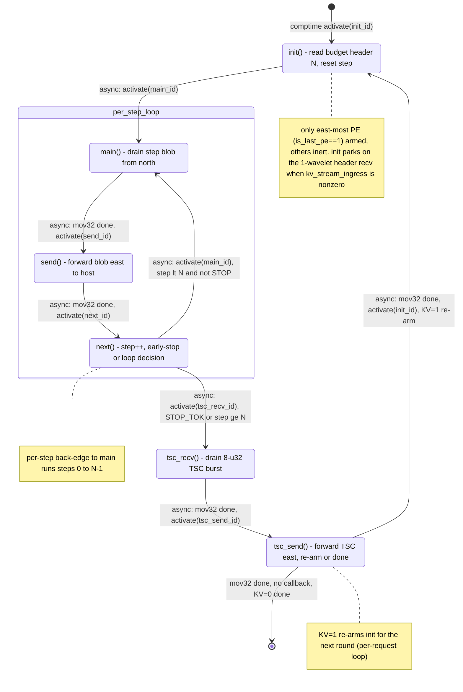

# qwen3_1p7b-decode · mux.csl — task/fn state machine

> Model `qwen3_1p7b-decode`, ref config `test_sim_2x2block_kv_varlen.json`.
> Control-flow / state-machine companion to the algo walkthrough. This file maps the *task/fn
> control flow only* — the spatial "who forwards to whom" story lives in the algo walkthrough.
> Diagram: `qwen3_1p7b-decode.mux.statemachine.svg`.
>
> Decode is the multi-step superset of `qwen3_1p7b-prefill/src/mux.csl`: same
> `main → send → tsc_recv → tsc_send` drain/forward/TSC-relay skeleton, plus an `init()` budget
> header, a `next()` per-step loop with early-stop, and a per-request re-arm.

## Shape of the machine

Six tasks. The steady-state core is a **linear async chain that closes into a per-step loop** —
`main → send → next → main` — repeated once per decode step. When the step budget is spent (or the
model emitted a stop token), `next` breaks the loop into the **TSC tail relay** `tsc_recv → tsc_send`.
Around the whole thing sits `init`, which reads the per-round budget header and is itself re-armed by
`tsc_send`, giving a **per-request outer loop** when KV streaming is on.

Every fabric-move transition is an **async activation** fired by the `.activate` callback of an
`@mov32` microthread; the intra-task control decisions (`init → main`, `next`'s two branches) are
plain `@activate` task enqueues. There are **no** synchronous `fn` calls, **no** `@block`/`@unblock`
gating, and **no** data/control-task bindings. The whole kernel is armed **only on the east-most PE**
(`is_last_pe == 1`); on every other mux PE the tasks are never bound or activated, so the PE is inert
(`mux.csl:101-113`).

Two nested loop scopes:
- **Per-step loop** (`main → send → next → main`): one pass per decode step, steps `0 .. N-1`
  (`mux.csl:74-85`).
- **Per-request loop** (`… → tsc_send → init → …`): re-armed only when `kv_stream_ingress != 0`
  (`mux.csl:94-98`); with KV off, `tsc_send` is terminal.

## States

### `init()` — read the budget header, reset the step counter
- **Bound / entry:** `@bind_local_task(init, init_id)` (`mux.csl:104`); `init_id = @get_local_task_id(13)` (`mux.csl:39`).
- **In-edge:** the single comptime entry `@activate(init_id)` (`mux.csl:110`), and the per-request
  loop back-edge from `tsc_send` when KV streaming is on (`mux.csl:95`).
- **Body:** resets `step = 0`; if `kv_stream_ingress != 0`, does a **blocking** 1-wavelet
  `@mov32(nstep_hdr_buf_dsd, nstep_hdr_recv_dsd)` to read this round's budget `N` off `in_color`, then
  overwrites `n_steps_runtime` (`mux.csl:57-62`). This recv is a fabric **park** — init stalls here
  until HT_tail emits the header. With KV off, `n_steps_runtime` keeps its compile-time
  `MAX_OUTPUT_LEN` ceiling (`mux.csl:46`).
- **Out-edge:** `async: @activate(main_id)` (`mux.csl:63`).

### `main()` — drain one step's top-k blob from the north
- **Bound:** `@bind_local_task(main, main_id)` (`mux.csl:105`); `main_id = @get_local_task_id(8)` (`mux.csl:40`).
- **In-edge:** `async: activate(main_id)` from `init` (`mux.csl:63`), and the per-step back-edge from
  `next` (`mux.csl:83`).
- **Body:** async `@mov32(blob_dsd, recv_dsd, …)` — drains the `N = wavelets_per_step` u32 result blob
  arriving from the north (HT_tail east-most) over `in_color`/`in_q` into local `blob`
  (`mux.csl:66-68`, DSDs at `mux.csl:26-32`).
- **Out-edge:** `async: activate(send_id)` on mov32 completion (`mux.csl:67`).

### `send()` — forward the blob east to the host
- **Bound:** `@bind_local_task(send, send_id)` (`mux.csl:106`); `send_id = @get_local_task_id(9)` (`mux.csl:41`).
- **In-edge:** `async: activate(send_id)` from `main` (`mux.csl:67`).
- **Body:** async `@mov32(send_dsd, blob_dsd, …)` — pushes the buffered blob out east on
  `host_color`/`host_oq` toward the host stream at the east edge (`mux.csl:70-72`, `send_dsd` at
  `mux.csl:32`).
- **Out-edge:** `async: activate(next_id)` on completion (`mux.csl:71`).

### `next()` — advance the step, decide loop vs. stop
- **Bound:** `@bind_local_task(next, next_id)` (`mux.csl:107`); `next_id = @get_local_task_id(10)` (`mux.csl:42`).
- **In-edge:** `async: activate(next_id)` from `send` (`mux.csl:71`).
- **Body:** `step += 1`, then reads the sampled-token slot `blob[sampled_off]` of the blob just
  forwarded (`mux.csl:75-79`). This is a **synchronous branch**, not a fabric op.
- **Out-edges (two, mutually exclusive):**
  - `async: @activate(tsc_recv_id)` if the sampled slot is `STOP_TOK` (HT_tail halted, the next blob
    will never arrive) **or** `step >= n_steps_runtime` — leaves the per-step loop (`mux.csl:80-81`).
  - `async: @activate(main_id)` otherwise — the per-step back-edge (`mux.csl:82-83`).

### `tsc_recv()` — drain the 8-u32 TSC burst from the north
- **Bound:** `@bind_local_task(tsc_recv, tsc_recv_id)` (`mux.csl:108`); `tsc_recv_id = @get_local_task_id(11)` (`mux.csl:54`).
- **In-edge:** `async: activate(tsc_recv_id)` from `next`'s stop branch (`mux.csl:81`).
- **Body:** async `@mov32(tsc_blob_dsd, tsc_recv_dsd, …)` — drains one 8-u32 TSC timestamp burst
  piggybacked from the north (HT_tail TSC PE), reusing `in_q` (`mux.csl:87-89`, DSDs at `mux.csl:50-52`).
- **Out-edge:** `async: activate(tsc_send_id)` on completion (`mux.csl:88`).

### `tsc_send()` — forward the TSC burst east, then re-arm or finish
- **Bound:** `@bind_local_task(tsc_send, tsc_send_id)` (`mux.csl:109`); `tsc_send_id = @get_local_task_id(12)` (`mux.csl:55`).
- **In-edge:** `async: activate(tsc_send_id)` from `tsc_recv` (`mux.csl:88`).
- **Body:** async `@mov32(tsc_send_dsd, tsc_blob_dsd, …)` — forwards the TSC burst east to the host
  edge, reusing `host_oq` (`mux.csl:91-98`, `tsc_send_dsd` at `mux.csl:53`).
- **Out-edges (two, mutually exclusive):**
  - **Per-request back-edge:** `async: activate(init_id)` when `kv_stream_ingress != 0` — re-parks
    `init` for the next round's header (`mux.csl:94-95`).
  - **Terminal:** the same `@mov32` with no `.activate` callback when KV is off — the machine ends
    (`mux.csl:96-97`).

## Legend

- **`[*]`** — kernel entry (the single comptime `@activate`, `mux.csl:110`) and, with KV off, the
  terminal after `tsc_send` (`mux.csl:97`).
- **`async:`** edge — an activation fired either by the `.activate` callback of an `@mov32` async
  microthread (fires when that fabric move completes) or by a direct `@activate` task enqueue. All
  drawn edges are async.
- **`call:`** edge (sync `fn` call) — **none present**.
- **Gating** (`@block`/`@unblock`) — **none present**.
- **`event:`** fabric park — the blocking header recv inside `init` (`mux.csl:60`) is a park, but it
  stays inside `init` rather than being its own transition, so it is noted on the state, not drawn as
  an edge.
- Nodes are `task`s only; there are no `@activate`-d `fn`s, no `@get_data_task_id`/`@get_control_task_id`
  bindings.

## Validation (count-exact)

- **Nodes:** 6 tasks (`init`, `main`, `send`, `next`, `tsc_recv`, `tsc_send`) — all `@bind_local_task`'d
  at `mux.csl:104-109`. No orphans; every node has an in-edge (`init` has two: comptime entry + the
  per-request back-edge).
- **Control-transfer sites vs. edges drawn:**
  - `@activate` sites: **4** — comptime entry (`mux.csl:110`), `init → main` (`mux.csl:63`),
    `next → tsc_recv` stop branch (`mux.csl:81`), `next → main` loop branch (`mux.csl:83`).
  - `.activate` callbacks on `@mov32`: **4** — `main → send` (`mux.csl:67`), `send → next`
    (`mux.csl:71`), `tsc_recv → tsc_send` (`mux.csl:88`), `tsc_send → init` KV=1 re-arm (`mux.csl:95`).
  - `.unblock` callbacks: **0**. `@block`/`@unblock`: **0**. Direct `fn` calls: **0**.
  - **8 activation sites → 8 activation edges drawn**, plus one terminal edge (`tsc_send → [*]`,
    the KV=0 `@mov32` at `mux.csl:97` that carries no callback). Total 9 drawn edges.
- **Loops close:** the per-step back-edge `next → main` (`mux.csl:83`) and the per-request back-edge
  `tsc_send → init` (`mux.csl:95`) both close.

## Ambiguities / notes

- The blocking header recv in `init` (`mux.csl:60`) is control-relevant (init cannot proceed until the
  header wavelet lands) but is not a transition to another task, so it is drawn as a note on `init`
  rather than an edge — consistent with the spec's "`event:` fabric recv park" that stays intra-task.
- `next`'s two out-edges are exclusive branches of one `if`; both are plain `@activate` enqueues, drawn
  as two async edges with their branch conditions in the labels.
- `tsc_send`'s two out-edges are the two arms of the `kv_stream_ingress` `if` — the same `@mov32`
  either carries `.activate = init_id` (re-arm) or no callback (terminal). Only the re-arm arm is an
  activation site; the terminal arm is the absence of one, drawn as the `[*]` edge.
