# qwen3_1p7b-e2e-pdSeparate · decode/comm_lib/comm_pe.csl — task/fn state machine

> Model `qwen3_1p7b-e2e-pdSeparate` (**decode-phase device artifact**), ref config
> `test_sim_2x2blk_kv.json`. Control-flow / state-machine companion to the algorithm walkthrough:
> the DECODE-phase comm **library** — a toolbox of collective drivers with per-collective
> sub-machines and **no single `main()`**. Every entry is a driver `noinline fn` that `decode.csl`
> calls in sequence within each layer. This file has **no `task` declarations, no `@block`, and no
> microthread `.activate`/`.unblock` callbacks**: the reduces are fully synchronous. The only
> asynchronous machine is the **one-shot KV-ingress OQ7/IQ7 rebind** (one OQ7 empty-queue handler +
> one `@queue_flush` trigger + one `@activate` into a `decode.csl` continuation). Note: this
> decode-artifact copy is **byte-identical** to the fused `qwen3_1p7b-e2e` decode comm_pe
> (`src/decode/comm_lib/comm_pe.csl` in both), so the state machine is the same; pdSeparate ships it
> as a standalone decode device artifact bridging KV cache through host memory rather than fused with
> prefill. Diagram: `qwen3_1p7b-e2e-pdSeparate.decode-comm_pe.statemachine.svg`.

```mermaid
stateDiagram-v2
    %% qwen3_1p7b-e2e-pdSeparate DECODE-phase comm_pe.csl — library, NO single main, NO tasks.
    %% One sub-machine per collective driver; the only async machine is the
    %% one-shot KV-ingress OQ7/IQ7 rebind. (Byte-identical to the fused e2e decode comm_pe.)

    %% ================= INIT (boot, called once from decode.csl init) =============
    state Init {
        state "init (L617)" as init
        state "precompute_route_words (L586)" as precompute_route_words
        state "write_intra_row_bcast_routes (L564)" as write_intra
        [*] --> init : boot (decode dispatch_init_task activates init)
        init --> precompute_route_words : call: L649
        init --> write_Y_routes : call: boot Y-active L650
        init --> write_intra : call: L651
    }
    note right of init
        get_params from route_calc (L625); then inline set_route_2tx for
        INTER_A / INTER_B colors (L652-653). Strip PEs never run init
        (dispatch_init_task in decode.csl gates the activate) L618-619.
    end note

    %% ================= RECONFIG route machine (the ONE route-switch) =============
    state Reconfig {
        state "reconfig_allreduce_axis (L1295)" as reconfig
        state "write_Y_routes (L545)" as write_Y_routes
        state "write_X_routes (L537)" as write_X_routes
        state "write_X_kv_head_routes (L555)" as write_X_kv_head_routes
        state "apply_route_word / set_route_1tx / set_route_2tx (L509-518)" as route_leaves
        [*] --> reconfig
        reconfig --> write_Y_routes : call: axis==0 dim L1296
        reconfig --> write_X_routes : call: axis==1 head L1298
        reconfig --> write_X_kv_head_routes : call: axis==3 kv-head L1300
        write_Y_routes --> route_leaves : call: apply_route_word x5
        write_X_routes --> route_leaves : call: apply_route_word x5
        write_X_kv_head_routes --> route_leaves : call: apply_route_word x3
    }
    note right of reconfig
        C1 safety: repaints SHARED reduce/bcast colors with no barrier.
        Race-free ONLY because every all_reduce_* is synchronous and
        ends in a multi-tx broadcast (self-fencing). axis else asserts.
    end note

    %% ================= TWO-PHASE ALL-REDUCE (P-block, Y/X axis) ==================
    state AllReduce_TwoPhase {
        state "all_reduce_bsz_f32 (L658)" as ar_f32
        state "all_reduce_bsz_dim (L1008)" as ar_dim
        state "all_reduce_bsz_dim_QKV_fusion (L1088)" as ar_qkv
        state "all_reduce_bsz_ffn_dim_ZZ_fusion (L1168)" as ar_zz
        state "all_reduce_bsz_g (L740)" as ar_g
        state "all_reduceMax_bsz_g (L821)" as ar_max
        state two_phase_body {
            state "1st-phase reduce (remainder chain to root_1st)" as p1
            state "2nd-phase reduce (quotient chain to root_2nd)" as p2
            state "broadcast (root_2nd mov32/mov16 fanout)" as p3
            [*] --> p1
            p1 --> p2 : sync: straight-line
            p2 --> p3 : sync: straight-line
            p3 --> [*] : sync: bcast done (self-fencing)
        }
        [*] --> ar_f32 : RMSNorm sumsq entry (fp32)
        [*] --> ar_dim : hidden X/Z reduce entry
        [*] --> ar_qkv : QKV-fusion reduce entry
        [*] --> ar_zz : FFN gate+up (ZZ) reduce entry
        [*] --> ar_g : softmax sum entry
        [*] --> ar_max : softmax max entry (fmaxh/mov16)
        ar_f32 --> two_phase_body : sync: inline phases
        ar_dim --> two_phase_body : sync: inline phases
        ar_qkv --> two_phase_body : sync: inline phases
        ar_zz --> two_phase_body : sync: inline phases
        ar_g --> two_phase_body : sync: inline phases
        ar_max --> two_phase_body : sync: max variant
    }

    %% ================= BAND-SCOPED ALL-REDUCE (kv-head, single-chain) ============
    state AllReduce_Band {
        state "all_reduce_bsz_g_seq_len_kv_head_scoped (L904)" as ar_score
        state "all_reduce_qk_kv_head_scoped (L960)" as ar_qk
        state band_body {
            state "band chain to kv_head_root (pes_per_kv_head gt 1)" as bp1
            state "band-scoped broadcast (kv_head_root mov32)" as bp2
            [*] --> bp1
            bp1 --> bp2 : sync: straight-line
            bp2 --> [*] : sync: bcast done
        }
        [*] --> ar_score : attn score reduce entry
        [*] --> ar_qk : QK-Norm sumsq entry
        ar_score --> band_body : sync: inline
        ar_qk --> band_body : sync: inline
    }
    note right of ar_qk
        no-op when pes_per_kv_head == 1 (single PE per
        kv-head already holds the full sum) L912,946,966,999
    end note

    %% ================= INTER-REGION pipeline stages (sync leaves) ================
    state InterRegionPipeline {
        state "inter_block_recv_x_sync (L1254)" as recv_x
        state "intra_block_x_broadcast_y_bsz_dim (L1268)" as bcast_x
        state "inter_block_send_z (L1279)" as send_z
        [*] --> recv_x : chain X-recv entry (has_inter_recv)
        [*] --> bcast_x : Y-broadcast entry (intra_row_bcast_color)
        [*] --> send_z : chain Z-send entry (has_inter_send)
    }
    note right of send_z
        three independent sync leaves; the recv to compute to bcast
        to send ordering is decode.csl-sequenced, not here.
    end note

    %% ================= KV-INGRESS REBIND (the only async machine) ================
    state KVIngressRebind {
        state "kv_flush_then_init (L1316)" as flush_init
        state "kv_oq7_empty (L1310)" as oq_empty
        [*] --> flush_init : startup ingress done (decode.csl calls)
        flush_init --> oq_empty : async: queue_flush OQ7 to empty L1317
        oq_empty --> ext_kv_init : async: rebind OQ7/IQ7 to bcast then activate L1311-1314
    }
    note right of oq_empty
        empty-queue handler: re-encode OQ7 and IQ7 to broadcast_color,
        tile_config queue_flush.exit, then activate(kv_init_cont_id).
    end note

    %% ================= EXTERNAL continuation (in decode.csl) =====================
    state "ext: kv_init_cont_id (decode)" as ext_kv_init

    %% ================= LEGEND ====================================================
    state Legend {
        state "call:  direct synchronous fn call" as Lc
        state "async: queue_flush drain to empty-queue handler OR activate(id)" as La
        state "ext:   continuation task bound in decode.csl" as Le
        state "comptime: initialize_queue for all reduce/bcast/inter queues; when kv_transfer, OQ7/IQ7 boot on xfer colors and OQ7 gets set_empty_queue_handler(kv_oq7_empty) L1320-1356; NO tasks, NO block, NO microthreads" as Lcomp
    }
```

## How to read this

The decode-phase `comm_pe.csl` (under `src/decode/comm_lib/`) has **no `main()`** and **no
`task`s**: it is a toolbox of `noinline fn` collective drivers that `decode.csl` calls in
sequence within each transformer layer. So the diagram is **not one flow** — it is **six
independent sub-machines**, each with its own `[*]` entry, plus one external node (`ext:*`) that
is a continuation task living in `decode.csl`. An `ext:*` node is where control leaves this file;
its return path back is `decode.csl`'s decision, not encoded here.

Transition-label prefixes: **`call:`** = synchronous same-stack `fn` call; **`async:`** = an
asynchronous transfer — here either a `@queue_flush` completion routed to the OQ7 empty-queue
handler, or an `@activate(id)` task enqueue. `sync:` on the internal reduce edges marks that the
phases run straight-line within one `fn` body (no fabric microthread callback — the reduce is
self-fencing via router backpressure). There is **no `gate:`/`block:`** class in this file.

## Walk by sub-machine

### Init (boot) — `L617-654`
`init` runs once, activated by `decode.csl`'s `dispatch_init_task` (strip PEs never activate it,
so `init` simply never runs there, `L618-619`). In-edge `[*]`. It computes `rp` (routing params)
via `route_calc.get_params` (`L625`), copies the per-PE runtime scalars out of `rp` (`L633-644`),
then `call:`s `precompute_route_words` (`L649`) to fill every axis's color-config word once from
the layout-painted register base, then `write_Y_routes` (`L650`, cross-edge into **Reconfig** —
the first layer op is RMSNorm's Y-axis allreduce), then `write_intra_row_bcast_routes` (`L651`).
Inline (drawn as the note, not sub-fns) it also sets the two INTER_A/INTER_B relay routes via
`set_route_2tx` (`L652-653`).

### Reconfig — the one route-switch machine — `L1295-1305`
`reconfig_allreduce_axis(axis)` is the single route-repaint entry point. Three modes dispatch to
a named applier: `axis==0 → write_Y_routes` (dim reduce, `L1296`), `axis==1 → write_X_routes`
(head reduce, `L1298`), `axis==3 → write_X_kv_head_routes` (kv-head band reduce, `L1300`); any
other axis `@assert(false)` (`L1303`). `write_Y_routes` / `write_X_routes` (`L545/L537`) each
replay five precomputed words onto the shared reduce/broadcast colors via `apply_route_word`;
`write_X_kv_head_routes` (`L555`) replays three (reduce_2nd is unused in kv-head mode). The
`route_leaves` node collapses the three tiny `noinline` wrappers `apply_route_word` (`L516`),
`set_route_1tx` (`L509`), `set_route_2tx` (`L512`) — terminal leaves that only forward into
`route_util`; `write_intra_row_bcast_routes` and `init` also reach them. The **C1 safety
invariant** (the note) is the load-bearing subtlety: this repaints *shared* colors with no
barrier, race-free **only** because every `all_reduce_*` on those colors is synchronous and ends
in a multi-tx broadcast, leaving the colors globally quiescent on return. `write_Y_routes` here
is the same leaf `init` cross-edges into at boot.

### AllReduce_TwoPhase — P-block two-phase reduces (Y/X axis) — `L658-1246`
Six entries, one per driver `fn`, each `[*]`-entered by `decode.csl` at the matching layer step:
`all_reduce_bsz_f32` (RMSNorm sumsq, fp32, `L658`), `all_reduce_bsz_dim` (hidden X/Z reduce,
`L1008`), `all_reduce_bsz_dim_QKV_fusion` (fused Q+K+V projection reduce, `L1088`),
`all_reduce_bsz_ffn_dim_ZZ_fusion` (fused gate+up FFN reduce, `L1168`), `all_reduce_bsz_g`
(softmax sum, GQA-grouped, `L740`), and `all_reduceMax_bsz_g` (softmax max, `L821`). All six share
the same **inline three-phase body** drawn once as the composite `two_phase_body`: 1st-phase
reduce (the remainder-index bidirectional chain toward `root_1st_phase`) → 2nd-phase reduce (the
quotient-index chain toward `root_2nd_phase`) → broadcast (`root_2nd_phase` fans out via `@mov32`,
or `@mov16` in the fmaxh variant). The phases are `if`-branch structure keyed on
`remainder_pe_id`/`quotient_pe_id`/`pe_id`, **not** fn calls — hence `sync:` self-contained edges.
`all_reduceMax_bsz_g` is the odd one: identical chain shape but `@fmaxh`/`@fmovh` instead of
`@fadds`/`@fmovs` and a 16-bit `@mov16` broadcast (`L895-897`). The fusion variants differ only in
DSD extent (`bsz*(dim_per_pe+2*kv_dim_per_pe)` for QKV, `bsz*2*ffn_dim_per_pe` for ZZ).

### AllReduce_Band — kv-head-scoped single-chain reduces — `L904-1006`
Two entries: `all_reduce_bsz_g_seq_len_kv_head_scoped` (attention score reduce along the Y kv-band,
`L904`) and `all_reduce_qk_kv_head_scoped` (Qwen3 QK-Norm sumsq, fused Q+K, `L960`). Both share the
composite `band_body`: a band-wide bidirectional chain toward `kv_head_root` over `pes_per_kv_head`
PEs, then a band-scoped broadcast (`kv_head_root` fans out via `@mov32`). Both entire bodies are
guarded by `if (pes_per_kv_head > 1)` — a **no-op** when a single PE serves the kv-head (it already
holds the full sum), the note at `L912,946,966,999`. Unlike the two-phase reduces these use only
`reduce_1st_color_0/1` + broadcast (reduce_2nd untouched), matching the kv-head route set painted
by `reconfig_allreduce_axis(3)`.

### InterRegionPipeline — inter-block chain transit (sync leaves) — `L1254-1289`
Three independent sync leaves, each its own `[*]` entry: `inter_block_recv_x_sync` (`L1254`,
receives the chained X tile on the recv-side inter color, no-op when `has_inter_recv_rt == 0`),
`intra_block_x_broadcast_y_bsz_dim` (`L1268`, Y-broadcasts the per-column X tile to every block row
on `intra_row_bcast_color`; strip-source vs root-row-source branch), and `inter_block_send_z`
(`L1279`, sends the chained Z tile on the opposite inter color, no-op when `has_inter_send_rt == 0`).
Their recv→compute→bcast→send ordering is sequenced by `decode.csl`, not encoded here.

### KVIngressRebind — the only async machine — `L1310-1318`, `L1320-1356`
On decode boot, when `kv_transfer != 0`, OQ7/IQ7 boot on the KV-transfer colors (`kv_xfer_color_1`
/ `kv_xfer_color_0`) and OQ7 gets a `@set_empty_queue_handler(kv_oq7_empty, ...)` at comptime
(`L1325`). After the startup KV ingress finishes, `decode.csl` calls `kv_flush_then_init` (`L1316`)
which fires `@queue_flush(broadcast_send_queue_id)` (`L1317`). OQ7 draining to empty triggers the
handler `kv_oq7_empty` (`L1310`): it re-encodes OQ7 **and** IQ7 back to `broadcast_color`
(`L1311-1312`), calls `tile_config.queue_flush.exit` (`L1313`), then `@activate(kv_init_cont_id)`
(`L1314`) — the single external continuation in `decode.csl`. This is a **one-shot** rebind: unlike
the standalone `qwen3_1p7b-decode` comm_pe (which has a two-flag startup-vs-per-round re-arm with
two flushes and two activates), the pdSeparate decode comm_pe has exactly one flush, one handler,
one activate. In pdSeparate, the KV that seeds this ingress arrives from the **separate prefill
device artifact via host memory** (the pdSeparate KV bridge), not from a fused in-wafer producer.

## Legend

- **`call:`** — direct synchronous same-stack `fn` call.
- **`async:`** — an asynchronous transfer: `@queue_flush` draining to the OQ7 empty-queue handler,
  or `@activate(id)`.
- **`sync:`** (internal reduce edges) — straight-line phase progression inside one `fn` body; no
  microthread callback (the collective self-fences via router backpressure, per the C1 note).
- **`ext:`** — a continuation task **bound in `decode.csl`**, not in this file; control leaves here.
- **comptime** (`L1320-1356`) — `@initialize_queue` for all reduce/broadcast/inter queues; when
  `kv_transfer != 0`, OQ7/IQ7 boot on the ingress colors and OQ7 gets the `kv_oq7_empty`
  `@set_empty_queue_handler` (`L1325`). **No `@bind_local_task`, no tasks, no `@block`, no
  microthread queues** — this decode comm library is fn-only plus the one empty-queue handler.

## Site-to-edge reconciliation (count-exact)

| Site kind | Source count | Drawn as |
|---|---|---|
| `@activate(id)` | 1 (`L1314`; `L618` is a comment, not a site) | 1 `async:` edge (`oq_empty → ext_kv_init`) |
| `.activate` / `.unblock` (async microthread) | 0 | none (reduces are synchronous) |
| `@block` / `@unblock` | 0 | none |
| `@queue_flush` | 1 (`L1317`; `L1309` is a comment) | 1 `async:` edge (`flush_init → oq_empty`) |
| `@set_empty_queue_handler` | 1 (`L1325`) | `oq_empty` node (comptime-bound; noted in Legend) |
| `task` decls | 0 | none (this file has no tasks) |
| driver / helper `fn`s | 23 (21 `noinline` + 2 plain) | 6 sub-machines; each collective driver its own `[*]` |

Every drawn node has an in-edge except each sub-machine's `[*]` entry (Init, Reconfig, the 6+2
collective entries, the 3 transit entries, the 1 KV-ingress trigger) and the single terminal
`ext:*` continuation. No orphan nodes; the one async trigger→handler edge and one handler→ext edge
close the only asynchronous path.

## Notes on ambiguous control flow

- **Byte-identical to the fused e2e decode comm_pe.** The pdSeparate decode-artifact copy of this
  library is a byte-for-byte match of `models/qwen3_1p7b-e2e/src/decode/comm_lib/comm_pe.csl`; the
  only pdSeparate-specific fact is deployment (a standalone decode device artifact whose KV ingress
  is seeded from the separate prefill artifact through host memory), not the control flow of this
  file.
- **No per-collective loop back-edges in this file.** Unlike prefill's Cannon/shuttle self-loops,
  decode's reduces are single-shot single-token collectives with no driver-iterated trip count —
  the per-layer / per-round loop lives entirely in `decode.csl`.
- **One-shot KV-ingress rebind.** The pdSeparate decode comm_pe's rebind is startup-only (one flush
  → one handler → one activate into `kv_init_cont_id`). There is no per-round re-arm inside this
  file (contrast the standalone `qwen3_1p7b-decode.comm_pe`, which carries a two-flag re-arm
  machine).
- **Shared inline reduce body.** The six two-phase variants (and two band variants) are distinct
  `fn`s with fully inlined, near-identical phase logic; drawing one shared `two_phase_body` /
  `band_body` composite that all entries flow into is the faithful control-flow abstraction (they
  are not calls to a shared engine — the code is duplicated per extent/dtype).
- **`route_leaves` collapse.** `apply_route_word` / `set_route_1tx` / `set_route_2tx` are drawn as
  one leaf node; they are pure forwarders into `route_util` and carry no branching control flow.
- **`ext:*` return path.** How `decode.csl` resumes after `kv_init_cont_id` fires is control that
  lives in `decode.csl` and is out of scope for this file's state machine.
