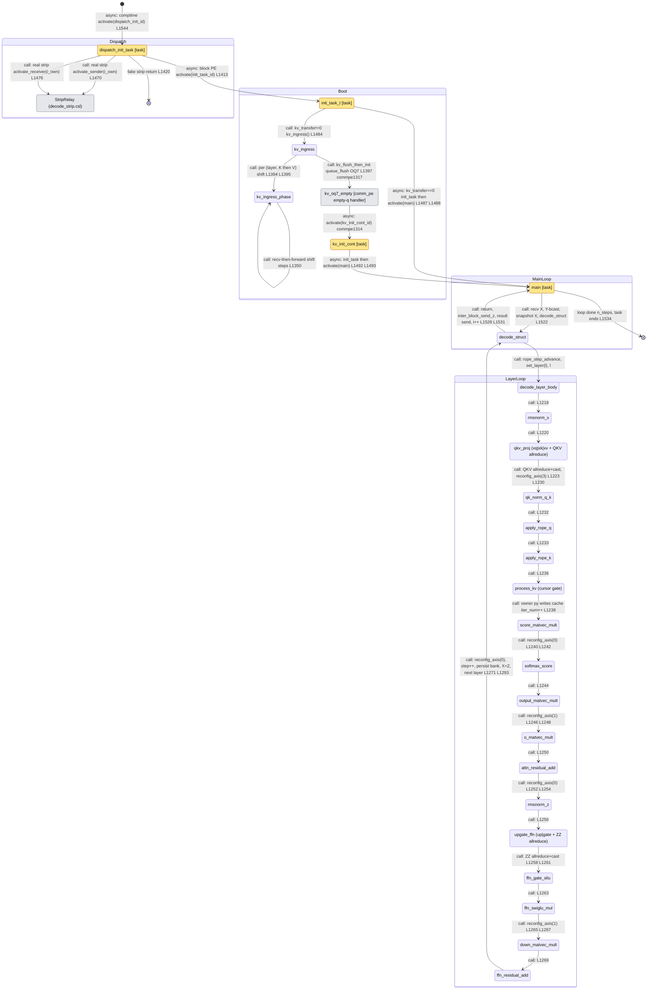

# qwen3_1p7b-e2e-pdSeparate · decode/decode.csl — task/fn state machine

> Control-flow / state-machine companion to the algo walkthrough. Model `qwen3_1p7b-e2e-pdSeparate`
> (**decode phase** — the decode half of the prefill/decode-separated deployment; decode is its own
> device artifact, seeded at boot by an on-device switch-level KV ingress from the prefill region).
> Ref config `test_sim_2x2blk_kv.json` (2×2 blocks, 8 layers → ≤2 layers/block, `KV_TRANSFER=1` so the
> boot-time prefill→decode KV-ingress path is live; `bsz=1`, `PREFILL_LEN=16`, `MAX_SEQ_LEN=32`). Nodes =
> every `task` + every driver/operator `fn` a task calls, plus the `comm_pe` empty-queue handler where the
> post-ingress `@activate` actually fires. Edges = control transfers, labelled `call:` (synchronous
> same-stack call), `async:` (a bare `@activate(id)` local-task activation or a `comm_pe` module callback
> fired on a queue-drain event). Line refs `L####` are `src/decode/decode.csl:####`; `commpe####` is
> `src/decode/comm_lib/comm_pe.csl:####`. Companion diagram:
> `qwen3_1p7b-e2e-pdSeparate.decode-decode.statemachine.svg`.
>
> **Note vs the standalone `qwen3_1p7b-decode` and the fused `qwen3_1p7b-e2e` decode:** the pdSeparate
> decode PE program is structurally identical to the fused-e2e decode (same tasks, same operator pipeline,
> same line numbers) and is likewise **single-shot** — no multi-round KV serve loop (`round_reset` /
> `round_reingress` / `kv_ingress_resume` do not exist here). What differs is deployment, not this file's
> control flow: prefill and decode compile as **two separate artifacts**, and boot does one prefill→decode
> KV ingress (the on-device switch-level gather/scatter north shift, `kv_transfer` path) to seed the cache;
> then `main` runs its per-token loop and the task ends at `[*]`.

## Loop boundaries at a glance

- **No per-round serve loop.** Boot ingests the prefill KV once (from the separate prefill artifact's
  region, via the on-device shift); `main` runs the per-token loop; when it exits the task simply ends at
  `[*]` (L1534). There is no `round_barrier` / `round_reingress` / `round_reset`.
- **Per-step (per-token) loop** — `main`'s `while i < n_steps` (L1504). Each step recv/broadcasts X, snapshots
  it, runs `decode_struct` (one full layer stack, appending one K/V per layer), sends Z inter-block and (on
  the result-sender) streams Z to HT_tail, then re-arms. Back-edge `decode_struct → main` (L1526/1531).
- **Per-layer loop** — `decode_struct`'s `while l < layers_in_this_block` (L1287): `set_layer(l)` →
  `decode_layer_body` → persist `(iter_num, step)` to the per-layer bank → chain `X = Z`. Back-edge
  `ffn_residual_add → decode_struct` (L1293).
- **Operator pipeline** — `decode_layer_body` (L1216) is a **straight-line** driver (no flag hub, no async
  operators — decode's GEMVs are synchronous `@map`s). The chain edges show execution order; each
  `reconfig_allreduce_axis(k)` between operators (L1226/1240/1246/1252/1265/1271) repaints the collective
  routes for the next stage and is folded into the incoming edge label.
- **KV-ingress shift loop** — `kv_ingress` (L1381) loops `kv_ingress_phase` over `(layer, K|V)`
  (L1393-1396); `kv_ingress_phase` (L1348) self-loops the blocking recv-then-forward north shift
  (L1350-1356) then scatters the kept tile into `XKCache_tile`/`XVCache_tile`.

## State-by-state walk

### Dispatch (every PE)

- **dispatch_init_task** (task, L1400, id 12). In-edge: comptime `@activate(dispatch_init_id)` from `[*]`
  (L1544, the single entry — every PE binds and activates it). Recovers strip-vs-block identity from fabric
  coords. Block PE → **async** `@activate(init_task_id)` (L1413). Fake strip (no real inter-region traffic)
  → `return` to `[*]` (L1420). Real strip → rebinds K-pipe queue colors then **call**s `activate_sender`
  (L1470) or `activate_receiver` (L1476) in `decode_strip.csl` (the `StripRelay` external node — its own
  task chain is a separate diagram).

### Boot / KV ingress

- **init_task_t** (task, L1479, id 8). In-edge: L1413. Branches on `kv_transfer`: `!=0` → **call**
  `kv_ingress()` (L1484) then `return` (the OQ7-empty continuation takes over); `==0` (bake) → **call**
  `init_task()` (L1487, one-time collective-route paint + coords + α + per-layer bank seed) then **async**
  `@activate(main_id)` (L1488). `init_task` is folded into the outgoing bake edge label.
- **kv_ingress** (fn, L1381). In-edge: `init_task_t` (L1484). Odd fabric rows swap the IQ7/OQ7↔color
  binding, then loop `kv_ingress_phase(l, n_recv, K)` and `(…, V)` over `max_layers_per_block` (L1393-1396).
  Finally **call**s `comm_mod.kv_flush_then_init()` (L1397 → commpe1316/1317 `@queue_flush`), routing to the
  `kv_oq7_empty` handler.
- **kv_ingress_phase** (fn, L1348). In-edge: `kv_ingress` (L1394/1395) plus its own recv-then-forward shift
  self-loop (L1350-1356): decode row r receives r+1 tiles, forwards all but the last. Then scatters the kept
  tile into the layer's `XKCache_tile` (K, transposed row-into-column, L1357-1368) or `XVCache_tile`
  (V, contiguous, L1369-1378).
- **kv_oq7_empty** (`comm_pe` empty-queue handler, commpe1310 — external). In-edge: `kv_ingress` flush
  (L1397/commpe1317). This is where the post-ingress `@activate` fires: it rebinds OQ7/IQ7 back to the
  `broadcast` color, flushes the broadcast send queue, and **async** `@activate(kv_init_cont_id)`
  (commpe1314). Bound as the empty-queue handler for `broadcast_send_queue_id` at commpe1325 (only when
  `kv_transfer!=0`).
- **kv_init_cont** (task, L1491, id 10). In-edge: commpe1314. **call**s `init_task()` (L1492, same one-time
  paint as the bake path) then **async** `@activate(main_id)` (L1493). Runs once, after the boot KV prefix
  has landed.

### Main serve loop

- **main** (task, L1502, id 9). In-edges: `init_task_t` bake (L1488) and `kv_init_cont` (L1493) — the two
  `@activate(main_id)` sites merge here. The `while i < n_steps` per-step loop: recv X (host stream on
  `is_host_x_receiver` via `x_input_dsd`, else `inter_block_recv_x_sync`, L1506-1510), Y-broadcast X within
  the column (L1514-1519), snapshot X into `X_input_tile` (L1520), **call** `decode_struct()` (L1522), then
  `inter_block_send_z(Z)` (L1526) and the streaming result send on the result-sender PE (L1530-1532). On
  loop exit (`n_steps` reached) the task ends → `[*]` (L1534). `n_steps` is host-set via `set_symbol_all`.
- **decode_struct** (fn, L1281). In-edge: `main` (L1522). Restores `X_tile` from the step snapshot (L1282),
  `rope_step_advance()` (snapshot/advance the shared per-step RoPE angles, L1285), then the per-layer loop
  (L1287): `set_layer(l)` → **call** `decode_layer_body` → persist `(iter_num, step)` bank + chain `X = Z`.
  Returns to `main` (L1526) after all layers.

### Operator pipeline (decode_layer_body, straight-line)

- **decode_layer_body** (fn, L1216). In-edge: `decode_struct` (L1289). Straight-line driver of one layer's
  operators; the chain below runs in source order, each `reconfig_allreduce_axis(k)` repainting collective
  routes for the next stage.
- **rmsnorm_x** (fn, L777) — input RMSNorm (fp32, HF parity), L1218.
- **qkv_proj** (fns `xq/xk/xv_matvec_mult` L779/785/791 + `all_reduce_bsz_dim_QKV_fusion` + cast, L1220-1224)
  — the three GQA projections into one fused `QKV_tile`, one node.
- **qk_norm_q_k** (fn, L935) — Qwen3 per-head QK-Norm; reached after `reconfig_axis(3)` (L1226), L1230.
- **apply_rope_q** (fn, L858) — RoPE on Q pairs (GPT-J interleaved), L1232.
- **apply_rope_k** (fn, L859) — RoPE on K pairs, L1233.
- **process_kv** (fn, L955) — the **KV-cursor gate**: only the owner PE (`local_py == step % P_BLOCK_SIZE`)
  writes the new K/V into cache column `iter_num` and bumps `iter_num`; skipped once
  `iter_num >= seq_len_per_pe` (L957). Entered at L1236.
- **score_matvec_mult** (fn, L995) — `Q·Kᵀ` GEMV over the `iter_num` cached K columns + band all-reduce +
  α-scale, L1238.
- **softmax_score** (fn, L1050) — fp32 two-pass safe softmax: bf16 max → Y all-reduce max → f32 subtract →
  exp → f32 sum → Y all-reduce sum → normalize → bf16; reached after `reconfig_axis(0)` (L1240), L1242.
- **output_matvec_mult** (fn, L1104) — `score·V` GEMV + band all-reduce, L1244.
- **o_matvec_mult** (fn, L1142) — attention out-projection + X all-reduce; after `reconfig_axis(1)` (L1246),
  L1248.
- **attn_residual_add** (fn, L1149) — `Z = X + attn_out`, L1250.
- **rmsnorm_z** (fn, L1156) — post-attention RMSNorm on Z; after `reconfig_axis(0)` (L1252), L1254.
- **upgate_ffn** (fns `up/gate_matvec_mult` L1158/1163 + `all_reduce_bsz_ffn_dim_ZZ_fusion` + cast,
  L1256-1259) — fused up|gate FFN projection, one node.
- **ffn_gate_silu** (fn, L1168) — branchless SIMD-4 f32 SiLU on the gate half, L1261.
- **ffn_swiglu_mul** (fn, L1195) — `swiglu = up * silu(gate)`, L1263.
- **down_matvec_mult** (fn, L1202) — FFN down-projection + X all-reduce; after `reconfig_axis(1)` (L1265),
  L1267.
- **ffn_residual_add** (fn, L1209) — `Z += down`, L1269; then `reconfig_axis(0)` + `step += 1` (L1271/1275)
  and the per-layer back-edge to `decode_struct` (L1293).

## Legend

- **`call:`** — synchronous same-stack `fn`/`task` call (no yield). Chained operator edges represent source
  order within the straight-line `decode_layer_body`; the per-layer/per-step loop back-edges are real `while`
  loops in `decode_struct`/`main`.
- **`async:`** — a bare `@activate(id)` local-task activation (control yields; the target runs as a scheduled
  task) or a `comm_pe` empty-queue callback fired on an OQ7 `@queue_flush` drain event. `commpe####` marks
  where in `comm_lib/comm_pe.csl` the edge actually fires.
- **`[task]`** (amber) — a hardware task (`@get_local_task_id` + `@bind_local_task`). **[…external…]** (grey)
  — a node whose body lives in another module (`decode_strip.csl` relay, `comm_pe.csl` empty-q handler).
  Unmarked nodes are plain `fn`s reached by synchronous call.

## Validation

- **26 nodes**, one entry (`dispatch_init_task` from `[*]`, L1544); every other node has ≥1 in-edge; the two
  `[*]` terminals are the fake-strip return (L1420) and the single-shot `main` end (L1534). No orphans.
- **`@activate` sites in decode.csl: 4** — L1544 (`[*]→dispatch_init_task`), L1413
  (`dispatch_init_task→init_task_t`), L1488 (`init_task_t→main`, bake path), L1493 (`kv_init_cont→main`).
  All 4 drawn.
- **`.activate` (module-fn) sites: 2** — L1470 (`activate_sender`), L1476 (`activate_receiver`), both drawn
  as `dispatch_init_task → StripRelay` edges.
- **`.unblock=` callbacks: 0**; **`@block` / `@unblock` sites: 0** in decode.csl (decode's collectives are
  synchronous; no Cannon/attention operand rendezvous as in prefill).
- **`@bind_local_task` sites: 4** (L1540-1543) — establish the 4 task nodes (`init_task_t`, `main`,
  `dispatch_init_task`, `kv_init_cont`); not edges.
- **Cross-module async edge** (fired in `comm_pe.csl`, id passed in at decode.csl L166): `kv_oq7_empty →
  kv_init_cont` (commpe1314) — the single post-ingress `@activate` that hands boot off to the main loop.
  Drawn.

Edge/site tally: 4 `@activate` + 2 `.activate` + 0 `.unblock` + 0 `@block`/`@unblock` = 6 control-transfer
sites in decode.csl, all 6 drawn, plus the 1 cross-module `@activate` in comm_pe.csl (commpe1314). Total
7 activation/transfer edges, matched one-to-one.

## Ambiguities / modelling choices

- **Identical structure to fused-e2e decode.** This PE program shares the fused `qwen3_1p7b-e2e` decode's
  task graph verbatim (same task ids, same operator order, same line numbers) — the pdSeparate distinction
  is a separate compiled artifact + boot-time KV bridge, not a control-flow change. The diagram is therefore
  the same shape as the e2e-decode companion; only the surrounding deployment note differs.
- **`init_task` folded into edges.** Both `init_task_t` (bake, L1487) and `kv_init_cont` (L1492) call
  `init_task()` (L194 — comm route paint, coords, α, per-layer bank seed) before `@activate(main_id)`. It
  has no downstream control interest, so it is folded into the two `→ main` edge labels rather than drawn as
  a node.
- **`init_task_t → main` vs `→ kv_ingress` are mutually exclusive.** The `kv_transfer` param is compile-time
  per launch; the bake edge (`==0`) and the ingress edge (`!=0`) never both fire on a given build. The ref
  config has `KV_TRANSFER=1`, so the live path is the ingress one; both are drawn to document the two modes.
- **`reconfig_allreduce_axis` as edge labels.** The six `comm.reconfig_allreduce_axis(k)` calls interleaved
  in `decode_layer_body` are route-repaints, not control branches, so they annotate the operator edges
  rather than appearing as nodes.
- **`qkv_proj` / `upgate_ffn` fusion.** The three Q/K/V projection fns (+ QKV fusion all-reduce) and the two
  up/gate fns (+ ZZ fusion all-reduce) are each collapsed into one node — contiguous projection triples/pairs
  feeding a single fused collective.
- **`kv_ingress_phase` self-loop.** The blocking recv-then-forward north shift (L1350) is drawn as a
  self-loop on `kv_ingress_phase`; the per-`(layer, K|V)` outer loop is the `kv_ingress → kv_ingress_phase`
  edge.
- **StripRelay external.** The strip-PE K-pipe relay chain (`activate_sender`/`activate_receiver` in
  `decode_strip.csl`, task ids 13-18 there) is one external node; its internal task graph is a separate
  diagram.
