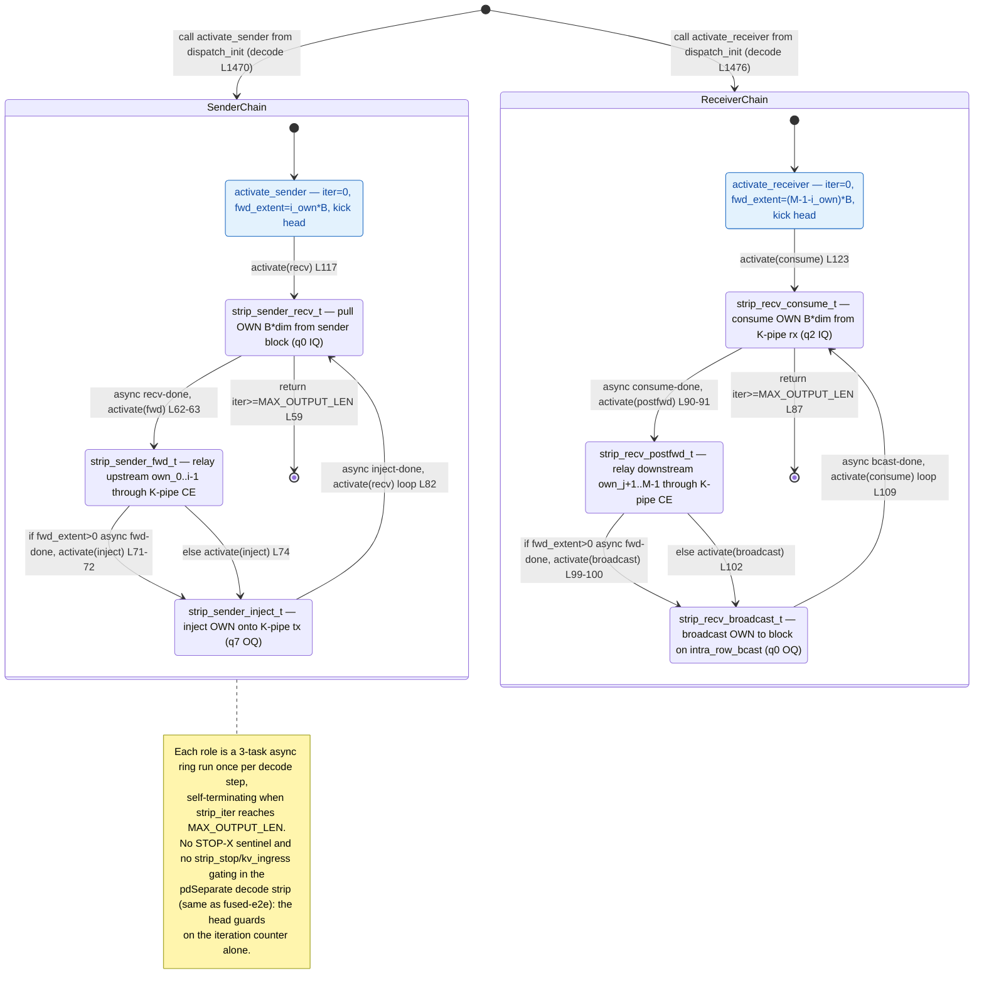

# qwen3_1p7b-e2e-pdSeparate · decode/decode_strip.csl — task/fn state machine

> Model `qwen3_1p7b-e2e-pdSeparate` (phase = decode), ref config `test_sim_2x2blk_kv.json`.
> Control-flow / state-machine companion to the algo walkthroughs. This file maps the **task
> activation graph** (who fires whom, sync vs async) — not the spatial K-pipe / inter-block shift
> geometry. `decode/decode_strip.csl` is a **library** imported by `decode/decode.csl` (no `main`); it
> holds the K-pipe strip relay chain that a strip (edge/IO) PE runs. A strip PE sits at the west/east
> edge of a pdSeparate decode-artifact block and relays K-cache wavelets between the block and the
> cross-region K-pipe. Each strip runs **one of two** async chains for up to `MAX_OUTPUT_LEN` iters:
> *sender* (`recv → fwd → inject`) or *receiver* (`consume → post_fwd → broadcast`).
> Diagram: `qwen3_1p7b-e2e-pdSeparate.decode-decode_strip.statemachine.svg`.
>
> Note: this kernel is **byte-identical** to the fused-`qwen3_1p7b-e2e` `decode/decode_strip.csl`;
> the pdSeparate decode artifact reuses the same strip relay library and the same `dispatch_init_task`
> selection logic (`decode.csl:1400-1477`). The state machine below therefore matches the fused-e2e
> one exactly.

## Two independent sub-machines

There is no single entry. `decode/decode_strip.csl` exports two entry `fn`s — `activate_sender`
(`decode_strip.csl:114-118`) and `activate_receiver` (`decode_strip.csl:120-124`) — and the decode
block's `dispatch_init_task` selects **exactly one** at runtime from the strip's fabric coordinates
and row parity (`decode.csl:1400-1477`): `strip_role == 0` (snake-tail / sender side) calls the sender
at `decode.csl:1470`, else the receiver at `decode.csl:1476`. So a given strip PE ever runs only one
of the two composite chains. The six tasks are bound at `decode_strip.csl:127-132` (task ids 13-18).
**No `.unblock` and no `@block`** appear anywhere in this kernel — control is a pure activation ring
per role, self-guarded by a single iteration counter.

Only real (non-fake) west/east strips reach the entry calls: `dispatch_init_task` returns early for
non-strip block cells (`decode.csl:1412-1415`) and for placeholder "fake" strips
(`decode.csl:1419-1422`), and rebinds the shared K-pipe queues (park IQ3..IQ7, then rx via q2 IQ / tx
via q7 OQ) at `decode.csl:1451-1457` before calling in.

Like the fused-e2e strip, this pdSeparate strip is a **stripped-down** variant of the standalone
`qwen3_1p7b-decode` `decode_strip.csl`: it drops the STOP-X (`buf[0] < -60000`) sentinel detection,
the `strip_stop` flag, and the `kv_stream_ingress` re-arm gate. The head task's only terminal
condition is `strip_iter >= MAX_OUTPUT_LEN`.

### Entry: `activate_sender` / `activate_receiver` (leaf entry `fn`s)
- **In-edge:** a synchronous `call` from `dispatch_init_task` in `decode.csl` — `activate_sender` at
  `decode.csl:1470`, `activate_receiver` at `decode.csl:1476`. These are the two `[*]` entries. The
  dispatcher first rebinds the shared K-pipe queues on the strip (`decode.csl:1451-1457`) before
  calling in.
- **Body:** reset `strip_iter = 0` and set the per-role forward extent — sender forwards `i_own * B`
  wavelets (upstream own cells, `decode_strip.csl:116`), receiver forwards `(M-1-i_own) * B` wavelets
  (downstream own cells, `decode_strip.csl:122`), where `B = bsz * dim_per_pe`.
- **Out-edge:** `@activate` the role's head task — `activate(strip_sender_recv_id)`
  (`decode_strip.csl:117`) or `activate(strip_recv_consume_id)` (`decode_strip.csl:123`).

### Sender chain — `strip_sender_recv_t` → `strip_sender_fwd_t` → `strip_sender_inject_t`

**`strip_sender_recv_t`** (head / loop guard, `decode_strip.csl:58-64`)
- **In-edges:** the entry `activate(recv)` from `activate_sender` (`:117`) and the loop back-edge
  `activate(recv)` from `strip_sender_inject_t` (`:82`).
- **Guard → terminal:** returns (chain ends, node → `[*]`) if `strip_iter >= MAX_OUTPUT_LEN` (`:59`,
  the sole hard ceiling — no stop flag in this variant).
- **Body / out-edge (async):** increments `strip_iter` (`:60`), then Phase 1 pulls this cell's `B`
  wavelets from the sender block over `inter_block_{a,b}_color` (q0 IQ) via `@fmovh`, callback
  `.activate = strip_sender_fwd_id` (`:62-63`).

**`strip_sender_fwd_t`** (`decode_strip.csl:66-76`)
- **In-edge:** async recv-complete from `strip_sender_recv_t` (`:63`).
- **Out-edges (mutually exclusive, both → `strip_sender_inject_t`):**
  - `strip_fwd_extent > 0`: Phase 2 forwards upstream `own_0..own_{i-1}` wavelets through the K-pipe
    CE relay (length-narrowed `@fmovh` off the max-extent template), callback
    `.activate = strip_sender_inject_id` (**async**, `:71-72`).
  - else: `@activate(strip_sender_inject_id)` directly (**synchronous activation**, no transfer,
    `:74`).

**`strip_sender_inject_t`** (`decode_strip.csl:78-83`)
- **In-edge:** from `strip_sender_fwd_t` (async `:72` or direct `:74`).
- **Body / out-edge (async, loop back):** Phase 3 injects this cell's own wavelets onto the K-pipe
  `tx_color` (q7 OQ) via `@fmovh`, callback `.activate = strip_sender_recv_id` (`:82`) — the
  per-iteration back-edge that re-fires the guarded head.

### Receiver chain — `strip_recv_consume_t` → `strip_recv_postfwd_t` → `strip_recv_broadcast_t`

Structurally the mirror of the sender chain (same guard, same async shape); it moves K-pipe → block
instead of block → K-pipe.

**`strip_recv_consume_t`** (head / loop guard, `decode_strip.csl:86-92`)
- **In-edges:** entry `activate(consume)` from `activate_receiver` (`:123`) and the loop back-edge
  `activate(consume)` from `strip_recv_broadcast_t` (`:109`).
- **Guard → terminal:** returns (node → `[*]`) if `strip_iter >= MAX_OUTPUT_LEN` (`:87`).
- **Body / out-edge (async):** increments `strip_iter` (`:88`), then Phase 1 consumes this cell's `B`
  wavelets from the K-pipe `rx_color` (q2 IQ), callback `.activate = strip_recv_postfwd_id`
  (`:90-91`).

**`strip_recv_postfwd_t`** (`decode_strip.csl:94-104`)
- **In-edge:** async consume-complete from `strip_recv_consume_t` (`:91`).
- **Out-edges (both → `strip_recv_broadcast_t`):**
  - `strip_fwd_extent > 0`: Phase 2 forwards downstream `own_{j+1}..own_{M-1}` wavelets through the
    K-pipe CE relay, callback `.activate = strip_recv_broadcast_id` (**async**, `:99-100`).
  - else: `@activate(strip_recv_broadcast_id)` directly (**synchronous activation**, `:102`).

**`strip_recv_broadcast_t`** (`decode_strip.csl:106-110`)
- **In-edge:** from `strip_recv_postfwd_t` (async `:100` or direct `:102`).
- **Body / out-edge (async, loop back):** Phase 3 broadcasts this cell's own wavelets onto
  `intra_row_bcast` (q0 OQ) → block, callback `.activate = strip_recv_consume_id` (`:109`) — the
  per-iteration back-edge.

## Loop / terminal boundaries

- **Per-iteration ring:** each role is a 3-task async ring `head → fwd/postfwd → inject/broadcast →
  head`. One full lap moves one step's worth of K-cache wavelets (one autoregressive decode step).
- **Per-run ceiling:** the head task increments `strip_iter` and self-terminates at `MAX_OUTPUT_LEN`
  (`decode_strip.csl:16`, `:59` / `:87`). This is the only terminal condition — the pdSeparate strip
  has no early-stop / EOS sentinel path.

## Legend

- **`async …`** — an async-op completion callback (`.activate` on an `@fmovh` microthread); the source
  task returns immediately, the edge fires when the transfer drains.
- **`call …`** — a synchronous, same-stack `fn` call (the two `activate_*` entries, invoked from
  `dispatch_init_task`).
- **`activate(x)`** — `@activate` / `.activate = x_id`, an activation edge. There are **no** `@block` /
  `.unblock` gating edges in this kernel.
- **`[*]`** — each composite's own entry (`call activate_*`) and terminal (`return` from the guarded
  head). `SenderChain` / `ReceiverChain` are the per-role composite loops; a strip PE runs exactly one.

## Edge inventory (control-transfer sites vs edges drawn)

| Site (source) | kind | target | edge in diagram |
|---|---|---|---|
| `call strip_mod.activate_sender` `decode.csl:1470` | sync call | activate_sender | `[*] → SenderChain` |
| `call strip_mod.activate_receiver` `decode.csl:1476` | sync call | activate_receiver | `[*] → ReceiverChain` |
| `@activate(strip_sender_recv_id)` `decode_strip.csl:117` | activation | s_recv | activate_sender → s_recv |
| `.activate=strip_sender_fwd_id` `decode_strip.csl:63` | async activation | s_fwd | s_recv → s_fwd |
| `.activate=strip_sender_inject_id` `decode_strip.csl:72` | async activation | s_inject | s_fwd → s_inject (fwd_extent>0) |
| `@activate(strip_sender_inject_id)` `decode_strip.csl:74` | activation | s_inject | s_fwd → s_inject (else) |
| `.activate=strip_sender_recv_id` `decode_strip.csl:82` | async activation | s_recv | s_inject → s_recv (loop) |
| `@activate(strip_recv_consume_id)` `decode_strip.csl:123` | activation | r_consume | activate_receiver → r_consume |
| `.activate=strip_recv_postfwd_id` `decode_strip.csl:91` | async activation | r_postfwd | r_consume → r_postfwd |
| `.activate=strip_recv_broadcast_id` `decode_strip.csl:100` | async activation | r_broadcast | r_postfwd → r_broadcast (fwd_extent>0) |
| `@activate(strip_recv_broadcast_id)` `decode_strip.csl:102` | activation | r_broadcast | r_postfwd → r_broadcast (else) |
| `.activate=strip_recv_consume_id` `decode_strip.csl:109` | async activation | r_consume | r_broadcast → r_consume (loop) |

**10 activation edges inside `decode_strip.csl`** (4 direct `@activate` at `:74,:102,:117,:123` +
6 microthread `.activate` at `:63,:72,:82,:91,:100,:109`), all drawn, plus the **2 synchronous
`call` entries** from `decode.csl` (`:1470,:1476`). **Zero `.unblock`, zero `@block`** — no gating
edges. The two `return` terminals (`decode_strip.csl:59` sender head, `:87` receiver head) are the
`[*]` exits.
