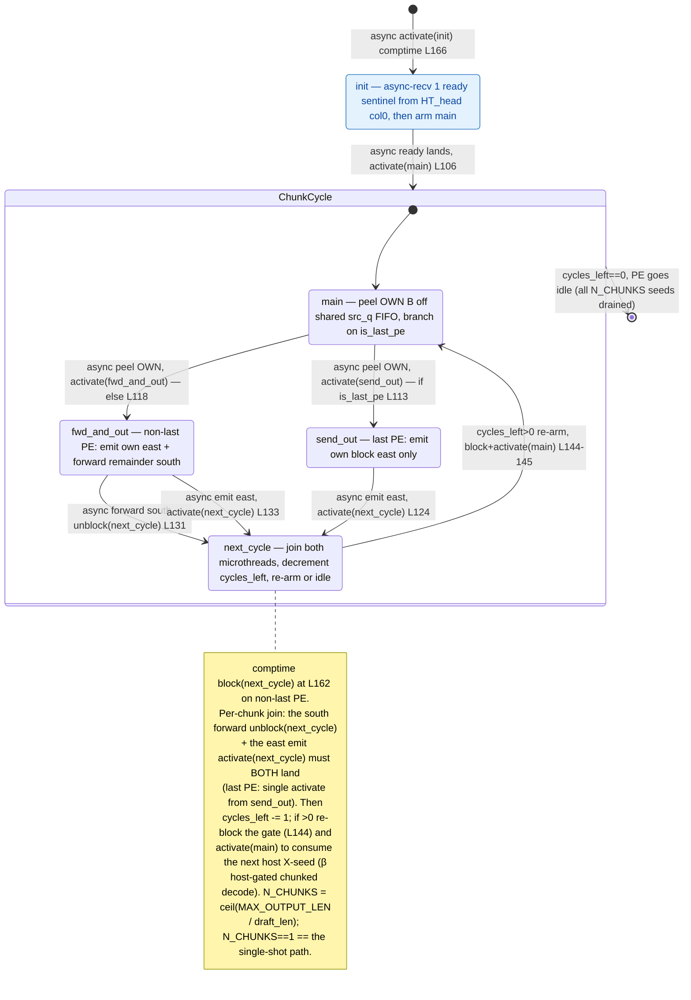

# qwen3_1p7b-e2e-pdSeparate · decode/demux.csl — task/fn state machine

> Model `qwen3_1p7b-e2e-pdSeparate` (phase=decode), ref config `test_sim_2x2blk_kv.json`.
> Control-flow / state-machine companion to the algo walkthrough. Diagram:
> `qwen3_1p7b-e2e-pdSeparate.decode-demux.statemachine.svg`. This file maps the **task activation
> graph** (who fires whom, sync vs async) — not the spatial peel/forward/emit geometry.
>
> pdSeparate DECODE-phase token-id ingress: the P_BLOCK_SIZE×1 store-and-forward demux chain
> (runs N→S, output flows EAST into row_y==0's west edge). Vs the fused `qwen3_1p7b-e2e` decode
> demux state machine: **structurally identical entry + peel + join**, but this pdSeparate variant is
> **multi-cycle (β host-gated chunked decode)** — `next_cycle` decrements `cycles_left` and, while
> seeds remain, re-blocks the join gate and re-arms `main` for the next host X-seed. It fires
> `N_CHUNKS = ceil(MAX_OUTPUT_LEN / draft_len)` times, one per chunk boundary; `N_CHUNKS == 1` is the
> byte-identical single-shot path (the only structural gap from the fused-e2e single-shot demux is the
> presence of this `next_cycle → main` re-arm back-edge). Between boundaries the `draft_len-1`
> intra-window autoregressive tokens close entirely on-chip via HT_tail → `tok_bcast_color` → HT_head
> and never re-enter the demux.

## States

Five nodes, all `@bind_local_task` tasks bound at `decode/demux.csl:154-158`: `init`, `main`,
`send_out`, `fwd_and_out`, `next_cycle`. There is **no plain-`fn` control edge** — every transition is
either a comptime `@activate` or an async `@mov32` completion callback. The same compiled program runs
on every column of the 1×P demux chain; the params `my_idx` / `is_last_pe` select which out-edges a
given PE takes, and `N_CHUNKS` (host-supplied via `set_param_all` in `launch.py`) sets how many times
the chain re-fires.

### `init` — one-time ready barrier (machine entry)
- **In-edge:** comptime `@activate(init_id)` at `decode/demux.csl:166` — the single machine entry,
  drawn from `[*]`.
- **Body:** one async `@mov32` receives exactly 1 ready sentinel wavelet from the HT_head col=0 PE
  (same `fabric_y`) on `ht_ready_color` into `ready_buf` (`decode/demux.csl:104-107`); its completion
  callback is the only work.
- **Out-edge (async):** `.activate = main_id` (`decode/demux.csl:106`). This barrier fires **once** at
  the top of the run — it is *outside* the per-chunk loop, so re-armed cycles re-enter at `main`, not
  `init`.

### `main` — the per-chunk peel (loop head)
- **In-edges:** the async ready-complete from `init` (`decode/demux.csl:106`) on cycle 0, **and** the
  per-chunk re-arm `@activate(main_id)` from `next_cycle` (`decode/demux.csl:145`) on cycles 1..N−1.
- **Body:** one async `@mov32` peels this column's `OWN_B` block off the shared `src_q` FIFO into
  `own_buf` (`decode/demux.csl:109-120`). PE 0's `src_q` is the host `in_color` stream (via `Edge.TOP`);
  PE k≥1's is the north chain color from PE k−1. On a re-armed cycle this async recv **blocks
  event-driven** until the host sends the next chunk's X-seed. The peel's completion callback is the
  branch.
- **Out-edges (async, mutually exclusive on the comptime predicate `is_last_pe`):**
  - `is_last_pe == 1` → `.activate = send_out_id` (`decode/demux.csl:110-113`).
  - else → `.activate = fwd_and_out_id` (`decode/demux.csl:114-118`).

### `fwd_and_out` — non-last PE (`my_idx < P-1`)
- **In-edge:** async peel-complete from `main` (`decode/demux.csl:118`).
- **Body / out-edges (two concurrent microthreads that join at `next_cycle`):**
  - async `@mov32` streams the remaining `FWD_EXTENT = (P-1-my_idx)·OWN_B` wavelets **south** on
    `forward_oq` (a `forward_color` chain hop) to PE k+1, callback `.unblock = next_cycle_id`
    (`decode/demux.csl:130-131`).
  - async `@mov32` emits `own_buf` **east** on `out_oq` (= `pre_embed_x_color`), callback
    `.activate = next_cycle_id` (`decode/demux.csl:132-133`).

### `send_out` — last PE (`my_idx == P-1`)
- **In-edge:** async peel-complete from `main` (`decode/demux.csl:113`).
- **Body / out-edge:** async `@mov32` emits `own_buf` east on `out_oq`, `.activate = next_cycle_id`
  (`decode/demux.csl:122-124`). No south forward exists on the last PE (`FWD_EXTENT = 1` placeholder,
  never executed), so this is the single edge into `next_cycle`.

### `next_cycle` — the join + per-chunk loop tail
- **In-edges:** on the non-last PE, `.unblock(next_cycle_id)` from the south-forward mov
  (`decode/demux.csl:131`) and `.activate(next_cycle_id)` from the east-emit mov
  (`decode/demux.csl:133`); on the last PE, the single `.activate(next_cycle_id)` from `send_out`
  (`decode/demux.csl:124`).
- **The join:** `next_cycle_id` is `@block`-ed at comptime on non-last PEs (`decode/demux.csl:162`). So
  even though the east-emit mov `.activate`s it, the task cannot fire until the south-forward mov
  `.unblock`s it — **both microthreads must complete**. It is a block/unblock barrier, not an ordinary
  activation.
- **Body (`decode/demux.csl:138-147`):** `cycles_left -= 1`; if `cycles_left > 0`, re-establish the loop:
  on non-last PEs `@block(next_cycle_id)` re-arms the join gate (`decode/demux.csl:144`) and
  `@activate(main_id)` re-fires the peel for the next chunk seed (`decode/demux.csl:145`). This is the
  **per-chunk back-edge** `next_cycle → main`.
- **Out-edges:**
  - `cycles_left > 0` → back-edge to `main` (the `ChunkCycle` loop).
  - `cycles_left == 0` → body falls through with no `@activate`, the PE goes idle
    (`ChunkCycle → [*]`): all `N_CHUNKS` host X-seeds have been drained. This is the sole structural
    difference from the fused-e2e decode demux, which has an empty terminal `next_cycle` and no re-arm.

## Legend

- **`async …`** — an async-op completion callback (`.activate` / `.unblock` on an `@mov32`
  microthread); the source task returns immediately and the edge fires later when the transfer drains.
- **`activate(x)`** — `@activate` / `.activate = x_id`, an activation edge. **`unblock(x)`** —
  `.unblock = x_id`, releases a `@block`-gated task. **`block(x)`** — `@block`, holds the join gate.
- **`[*]`** — entry (comptime `@activate(init_id)`) / the composite's initial / the loop-drained idle
  terminal. **`ChunkCycle`** — the composite that runs `N_CHUNKS` times; `next_cycle → main` is its
  back-edge, `ChunkCycle → [*]` its exit when `cycles_left` hits 0.
- Branch guards on edges (`if is_last_pe`, `else`, `cycles_left>0`) mix compile-time predicates
  (`is_last_pe`) and a runtime counter (`cycles_left`); a given column takes only the matching edge.
- No `call:` (sync) edge exists — every intra-machine transfer is an async microthread callback; the
  sole `event`-like park (the ready sentinel) is modeled as `init`'s async in-edge, and the re-armed
  `main` recv is itself an event-driven park on `src_q` waiting for the next host seed.

## Edge inventory (control-transfer sites vs edges drawn)

| Site (source) | kind | target | edge in diagram |
|---|---|---|---|
| `@activate(init_id)` comptime `decode/demux.csl:166` | activation | init | `[*] → init` |
| `.activate=main_id` `decode/demux.csl:106` | async activation | main | init → ChunkCycle (main) |
| `.activate=send_out_id` `decode/demux.csl:113` | async activation | send_out | main → send_out |
| `.activate=fwd_and_out_id` `decode/demux.csl:118` | async activation | fwd_and_out | main → fwd_and_out |
| `.activate=next_cycle_id` `decode/demux.csl:124` | async activation | next_cycle | send_out → next_cycle |
| `.unblock=next_cycle_id` `decode/demux.csl:131` | async unblock | next_cycle | fwd_and_out → next_cycle (south forward) |
| `.activate=next_cycle_id` `decode/demux.csl:133` | async activation | next_cycle | fwd_and_out → next_cycle (east emit) |
| `@activate(main_id)` `decode/demux.csl:145` | activation (re-arm) | main | next_cycle → main (per-chunk back-edge) |
| `@block(next_cycle_id)` `decode/demux.csl:144` | gate (per-chunk re-arm) | next_cycle | join note |
| `@block(next_cycle_id)` comptime `decode/demux.csl:162` | gate (initial) | next_cycle | join note |

**8 activation/unblock edges** (2 `@activate` + 5 `.activate` + 1 `.unblock`), all drawn; the **2
`@block` sites** are gating (the comptime initial gate + the per-chunk re-arm gate, both shown in the
`next_cycle` join note), not separate arrows. No plain-`fn` call edge exists. The single structural
difference from the fused `qwen3_1p7b-e2e` decode demux is the **presence of the `next_cycle → main`
per-chunk re-arm back-edge**: this pdSeparate decode demux is multi-cycle (β host-gated chunked), so it
has one more `@activate` site (8 activation edges here vs 7 there) and `next_cycle` is a conditional
loop tail rather than an empty terminal.
