# qwen3_1p7b-e2e-pdSeparate · decode/ht_tail.csl — task/fn state machine

> Model `qwen3_1p7b-e2e-pdSeparate` (phase=decode), ref config `test_sim_2x2blk_kv.json`.
> Control-flow / state-machine companion to the algo walkthrough for the pdSeparate decode output head.
> Nodes = tasks and the sync fns they drive; edges = control transfers (`async:` @activate / scheduling,
> `call:` direct fn call, `event:` blocking fabric recv park). File:line citations point at
> `models/qwen3_1p7b-e2e-pdSeparate/src/decode/ht_tail.csl`.

The pdSeparate decode tail is the DECODE-phase output head of the prefill/decode-split deployment: same
lm_head mesh-gemv, final-RMSNorm Y-allreduce, X merge-reduce top-K, and on-chip sampling as the fused-e2e
tail. `tail_main` is **single-shot** — one `while (tail_step < n_steps)` loop, then the task terminates.
There is **no** per-round re-arm and **no** KV_TRANSFER budget header on this task (the KV bridge lives in
other kernels), so this machine has just the two tasks and one loop level. The one pdSeparate-specific wrinkle
is the north token emit's β-gate: it is withheld on gate-boundary precursor steps `(tail_step+1) % draft_len == 0`
(the successor seed comes from the host, not this on-chip emit).

```mermaid
stateDiagram-v2
    state "tail_init task (L1064)" as tail_init
    state "tail_main task (L1151)" as tail_main

    [*] --> tail_init : async comptime activate(tail_init) [entry L1255]
    tail_init --> tail_main : async activate(tail_main) L1145
    tail_main --> [*] : loop done, task terminates [single-shot, no re-arm]

    state tail_init {
        state "derive coords + Y/X chain ids (L1065-1076)" as ti_derive
        state "write_Y_routes_tail fn (L421)" as ti_wY
        state "paint static routes: north tok L1083/1085, z_drain L1094/1096, south L1104/1106, xready barrier L1112; seed PRNG L1138; enable TSC L1142" as ti_routes
        [*] --> ti_derive
        ti_derive --> ti_wY : call write_Y_routes_tail() L1078
        ti_wY --> ti_routes : return
        ti_routes --> [*]
    }

    state tail_main {
        state "TSC start (is_tsc_pe, tail_step==warmup): sample start L1156" as st_tsc_start
        state "drain Z: fmovh z_slice from z_recv L1159" as st_drainZ
        state "north emit L1200: sampled token to HT_head (skip last step and gate precursor)" as st_north
        state "south emit L1208: root east-most topk_val+arg+pred to mux OQ0 (every step)" as st_south
        state "TSC end (is_tsc_pe, last iter): sample end + async mov32 burst L1224" as st_tsc_end

        [*] --> st_tsc_start : loop iter (tail_step < n_steps) L1152
        st_tsc_start --> st_drainZ
        st_drainZ --> st_rmsnorm : event Z arrives, call tail_final_rmsnorm() L1162

        state st_rmsnorm {
            state "phase1 per-batch local sumsq (L361-379)" as rn_sumsq
            state "tail_reduce_bsz_f32 fn (L736), Y allreduce + bcast" as rn_reduce
            state "phase3 normalize + cast + mul W_final_norm (L387-416)" as rn_norm
            [*] --> rn_sumsq
            rn_sumsq --> rn_reduce : call tail_reduce_bsz_f32() L385
            rn_reduce --> rn_norm : return
            rn_norm --> [*]
        }

        st_rmsnorm --> st_lmhead : call tail_lm_head_matvec() L1164

        state st_lmhead {
            state "vecmat_computation_lm fn (L314)" as lm_vecmat
            state "gemv_lm_step fmachs (L309) via map, loop bsz x V_per_pe_x" as lm_step
            [*] --> lm_vecmat : call vecmat_computation_lm() L344
            lm_vecmat --> lm_step : map over left_vector L326
            lm_step --> lm_step : per-K fmachs accumulate
            lm_step --> [*] : per-batch done L319
        }

        st_lmhead --> st_logred : call tail_logits_reduce_bsz_vocab() L1166

        state st_logred {
            state "tail_logits_reduce_bsz_vocab fn (L657): Y 2-phase reduce, NO broadcast" as lr_reduce
            [*] --> lr_reduce
            lr_reduce --> [*] : logits land on root_2nd_phase row only
        }

        st_logred --> st_topk : root row (tail_my_py==root_2nd_phase) L1171
        st_logred --> st_north : non-root row skip top-K

        state st_topk {
            state "write_X_routes_tail fn (L533): repaint reduce colors Y to X" as tk_wX
            state "xready barrier: root_2nd_phase_x sends go L1177 / others recv L1179 (event)" as tk_barrier
            state "tail_local_topk fn (L824): K masked-argmax passes, loop bsz" as tk_local
            state "tail_topk_mergereduce_x fn (L878): X 2-phase reduce, per-hop merge + bcast" as tk_merge
            state "topk_merge_local fn (L852): 2-pointer K-list merge, loop bsz" as tk_mergefn
            state "tail_sample_token fn (L1007): softmax, top-p, PRNG draw (root_2nd_phase_x only)" as tk_sample
            state "predtok X-bcast L1187 send / L1189 recv" as tk_predbcast
            state "write_Y_routes_tail fn (L421): restore Y routes" as tk_wY
            [*] --> tk_wX : call write_X_routes_tail() L1172
            tk_wX --> tk_barrier : return
            tk_barrier --> tk_local : call tail_local_topk() L1181
            tk_local --> tk_merge : call tail_topk_mergereduce_x() L1182
            tk_merge --> tk_mergefn : call topk_merge_local() per hop L884
            tk_mergefn --> tk_merge : return per hop
            tk_merge --> tk_sample : call tail_sample_token() if root_2nd_phase_x L1186
            tk_merge --> tk_predbcast : else recv bcast L1189
            tk_sample --> tk_predbcast : return + send bcast L1187
            tk_predbcast --> tk_wY : call write_Y_routes_tail() L1191
            tk_wY --> [*]
        }

        st_topk --> st_north : proceed
        st_north --> st_south
        st_south --> st_tsc_end : is_tsc_pe and tail_step==MAX_OUTPUT_LEN-1 L1216
        st_south --> st_tsc_start : while tail_step<n_steps, next step L1152
        st_south --> [*] : loop done (non-tsc last step)
        st_tsc_end --> [*] : loop done (tsc last step)
    }

    note right of st_drainZ
        Event-driven fabric parks (not activate/block):
        z_recv L1159, xready recv L1179.
    end note
    note left of st_tsc_end
        Fire-and-forget async send (no callback, not an
        activation edge): TSC burst L1224 (last iter).
    end note

    state Legend {
        state "async: microthread callback / activate (scheduling edge)" as L1
        state "call: direct synchronous fn call (same stack)" as L2
        state "event: blocking fabric recv park (not activate/block)" as L3
    }
```

## States

Only two things are real scheduling units — the tasks `tail_init` and `tail_main` (bound at
`ht_tail.csl:1252-1253`, ids 10/11). Everything else runs on `tail_main`'s stack as synchronous fn calls
inside the per-step `while` loop; the composite `state { }` blocks below bound those sub-flows.

### Entry and the two tasks

- **`[*] → tail_init`** — the only entry. The comptime block schedules it with `@activate(tail_init_id)`
  (`ht_tail.csl:1255`). This is the single in-edge with no source state.
- **`tail_init` (`:1064`)** — one-shot per-PE setup: reads its wafer coord, derives local `(x_local, py)`
  plus the Y and X chain ids (`:1065-1076`); **calls** `write_Y_routes_tail()` (`:1078`); then paints all
  static routes (north sampled-token emit `:1083/1085`, Z-drain multicast `:1094/1096`, south top-K emit
  `:1104/1106`, cross-column X-phase barrier `:1112-1133`), seeds the PRNG on the sampling PE (`:1138`),
  and enables the TSC counter on `is_tsc_pe` (`:1142`). In-edge: entry. Out-edge:
  **`async: @activate(tail_main_id)`** (`:1145`).
- **`tail_main` (`:1151`)** — the per-step pipeline. Single in-edge: the activation from `tail_init`
  (`:1145`). It is **single-shot** — the `while (tail_step < n_steps)` loop (`:1152`) runs to completion
  and the task terminates (`tail_main → [*]`). There is no self re-arm and no KV_TRANSFER round budget on
  this task; the pdSeparate KV bridge is handled by other decode kernels, not the output head.

### `tail_init` internals

`ti_derive → ti_wY → ti_routes`, all synchronous. `ti_wY` is `write_Y_routes_tail` (`:421`) called at
`:1078`; it returns to the caller, then `ti_routes` paints the remaining static routes. Composite exit
`→ [*]` precedes the `async: activate(tail_main)` out-edge drawn at the top level.

### `tail_main` — per-step loop body

The internal `[*] → st_tsc_start` is one loop iteration; the back-edge `st_south → st_tsc_start` (`:1152`)
is the `while` re-entry (`tail_step += 1`), and `→ [*]` marks loop exit / task termination.

1. **`st_tsc_start`** — on `is_tsc_pe` at `tail_step == warmup_cycles` only: samples the start TSC
   (`:1156`). Non-TSC PEs / non-warmup iters fall through.
2. **`st_drainZ`** — `@fmovh(z_slice_buf, z_recv)` (`:1159`): a **blocking fabric recv** that parks until
   the last decode block multicasts `Z` (raw hidden state) into the tail row. Out-edge triggered by
   `event: Z arrives`, then **calls** `tail_final_rmsnorm()` (`:1162`).
3. **`st_rmsnorm`** (composite, `tail_final_rmsnorm` `:354`) — `rn_sumsq` computes the per-batch fp32
   sum-of-squares (`:361-379`), **calls** `tail_reduce_bsz_f32` (`:736`, at `:385`) — a Y-axis 2-phase
   all-reduce **with broadcast** of the `bsz` sums, so every dim-shard row gets the normalized result.
   Control returns to `rn_norm` (`:387-416`) for normalize + cast-back + `* W_final_norm`, in place over
   `z_slice_buf`.
4. **`st_lmhead`** (composite, `tail_lm_head_matvec` `:336`) — **calls** `vecmat_computation_lm` (`:314`,
   at `:344`), which `@map`s `gemv_lm_step` (`:309`) over the left vector (`:326`). `lm_step → lm_step` is
   the **per-K `@fmachs` accumulate loop**; the outer `for b in bsz` (`:319`) closes the composite. Purely
   local — `partials[V_per_pe_x, bsz] = lm_head_tile @ z_slice`, accumulated in fp32.
5. **`st_logred`** (composite, `tail_logits_reduce_bsz_vocab` `:657`) — a Y-axis 2-phase reduce over the
   `bsz*V_per_pe_x` logits extent, **no broadcast** (comment `:729`); the full logits land only on the
   `root_2nd_phase` row. This kernel splits the reduce into two dedicated fns — `tail_logits_reduce_bsz_vocab`
   here and `tail_reduce_bsz_f32` for the RMSNorm sumsq — sharing the same reduce colors/queues at different
   extents.
6. **Root-row branch** (`:1171`): `st_logred → st_topk` when `tail_my_py == root_2nd_phase`; otherwise
   `st_logred → st_north` (non-root rows skip top-K and fall through to the guarded emits).

### `st_topk` internals (root row only)

- **`tk_wX`** — `write_X_routes_tail` (`:533`, called `:1172`): repaints reduce colors 1-5 from Y to X for
  the horizontal top-K reduce.
- **`tk_barrier`** — the X-phase fence (`:1176`): `root_2nd_phase_x` sends a 1-wavelet "go" (`@mov32`
  `:1177`); every other root column does a **blocking recv** (`:1179`, event) before any X send, so no
  column emits an X-mode wavelet into a neighbor still painted for Y.
- **`tk_local`** — `tail_local_topk` (`:824`, called `:1181`): per-batch local top-K over this PE's
  `V_per_pe_x` slice via **K masked-argmax passes** (masking selected entries and padded vocab to
  `NEG_SENT`); seeds `topk_val`/`topk_arg`.
- **`tk_merge`** — `tail_topk_mergereduce_x` (`:878`, called `:1182`): X-axis 2-phase reduce whose per-hop
  combine **calls** `topk_merge_local` (`tk_mergefn`, `:852`, first at `:884`). `tk_merge ↔ tk_mergefn` is
  the **per-hop merge loop**; each hop recvs `KB=TOP_K*bsz` fp16 vals + `KB` i32 ids, 2-pointer-merges
  into the running top-K, sends it on; the final broadcast (`:994-1000`) replicates the global top-K across
  the root row.
- **`tk_sample`** — `tail_sample_token` (`:1007`, called `:1186`, `root_2nd_phase_x` only): temperature →
  fp32 softmax → top-p nucleus truncation → categorical PRNG draw into `pred_token_buf`. Non-root columns
  instead `recv` the broadcast (`tk_merge → tk_predbcast`).
- **`tk_predbcast`** — X-broadcasts the sampled `bsz` ids to every root column (`:1187` send / `:1189`
  recv) for the north emit.
- **`tk_wY`** — `write_Y_routes_tail` (`:421`, called `:1191`): restores Y routes for the next step's
  RMSNorm/logits reduce. Composite exit `→ [*]`.

### Tail of the loop body

- **`st_north`** (`:1198`) — every `tail_is_token_emitter` root-row column emits the sampled `bsz` ids
  north to HT_head (`@mov32`, `:1200`), skipping the true last step (`tail_step < MAX_OUTPUT_LEN-1`)
  **and** every β-gate-boundary precursor (`(tail_step+1) % draft_len != 0`, `:1199`) — on a gate boundary
  the successor seed arrives from the host, not this on-chip emit, so the sender/receiver wavelet counts
  stay matched. Both the `st_topk` exit and the non-root bypass converge here (non-emitters no-op).
- **`st_south`** (`:1207`) — the east-most root PE (`x_local == HT_WIDTH-1 && py == root_2nd_phase`) emits
  `topk_val` + `topk_arg` + `pred_token` (+ even-count `SOUTH_PAD`) south on `logits_south_color` (OQ 0)
  to the mux → host, **every step** (so host receive count == MAX_OUTPUT_LEN).
- **`st_tsc_end`** (`:1216`) — on the last iter (`tail_step == MAX_OUTPUT_LEN-1`) `is_tsc_pe` samples the
  end TSC, packs start+end into an 8-u32 burst, and **async-emits** it (`@mov32 … .async = true`, `:1224`)
  piggybacked on OQ 0 — a fire-and-forget send with no callback, so it is a note, not an activation edge.
- Loop control: `st_south → st_tsc_start` is the `while` back-edge (`:1152`, `tail_step += 1`); `st_south →
  [*]` / `st_tsc_end → [*]` are the loop-exit edges. Both exit into the task terminal `[*]` — `tail_main`
  ends after the loop.

## Legend

- **`async:`** — a scheduling edge: `@activate` (task activation). Exactly **two** in this kernel: entry
  `:1255` and `tail_init → tail_main` `:1145`. There are **no** `.activate`/`.unblock`/`@block` microthread
  or gating edges, and **no** per-round re-arm. The one `.async = true` mov32 TSC burst (`:1224`) is
  fire-and-forget with no callback and is drawn as a note, not an edge.
- **`call:`** — a direct synchronous fn call on the same stack; `return` edges close each sub-call back to
  its caller.
- **`event:`** — a blocking fabric recv park (`z_recv` `:1159`, xready `:1179`). These gate progress but
  are not `@activate`/`@block` primitives.
