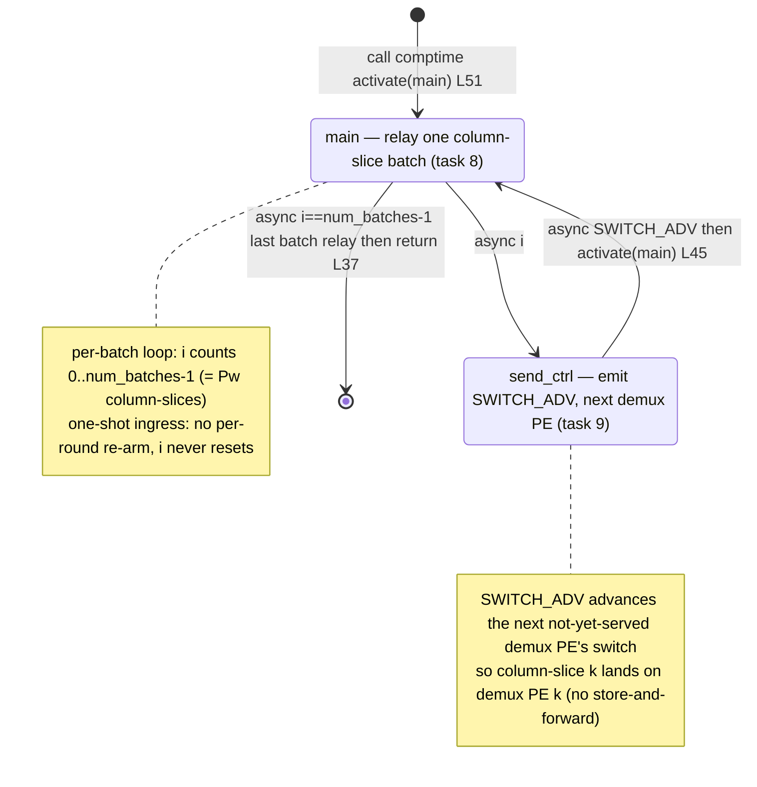

# qwen3_1p7b-e2e-pdSeparate · decode/kv_adaptor.csl — task/fn state machine

> Model `qwen3_1p7b-e2e-pdSeparate` (decode phase), ref config `test_sim_2x2blk_kv.json`. Control-flow / state-machine companion to the algo walkthrough. Diagram: `qwen3_1p7b-e2e-pdSeparate.decode-kv_adaptor.statemachine.svg`. This is the *task-graph* view (who activates whom); the geometry (host KV stream in on `in_color`, relay + SWITCH_ADV out on `out_color` to the `kv_demux` switch layer) appears only as edge triggers. This is the pdSeparate DECODE-side KV bridge: a single relay PE that adapts the KV cache arriving from the prefill artifact (via host round-trip) into decode's layout, one demux-PE-per-column column-slice at a time.

One PE runs this whole graph. Both tasks are `@bind_local_task`-bound (`kv_adaptor.csl:49-50`); the comptime block activates only `main_id` (`:51`). This is the pdSeparate twin of the standalone `qwen3_1p7b-decode.kv_ingress_adaptor` and of the gemv-05 `demux_adaptor.csl` it is derived from (`:1`), but far simpler: no varlen meta peel, no per-row `n_segs_rt` branch, and — critically — **no per-round re-arm**. It is a one-shot ingress that relays `num_batches` column-slices once, emitting a `SWITCH_ADV` control wavelet between every pair, then terminates. The only runtime branch is the last-batch test `i == num_batches - 1`.

## States

**`main` (task 8, `@get_local_task_id(8)` `:32`, bound `:49`).** The entry state — the only task activated from `[*]`, via the comptime `@activate(main_id)` (`:51`). Each entry relays one column-slice (one decode-block column = one batch) of `batch_size` 32-bit wavelets `fabin→fabout` via async `@mov32(outDSD, inDSD, …)`; the KV rides 2-per-u32 and is moved as whole 32-bit wavelets, so `batch_size` is the per-column *wavelet* count (`:10-13`). Branch on the batch counter `i` (`:36`):
- **not last batch** (`i != num_batches - 1`): async `@mov32(outDSD, inDSD, .{ .async = true, .activate = send_ctrl_id })` (`:40`) — the relay mov32 carries a callback that fires `send_ctrl`; then `i += 1` (`:41`). This is the loop out-edge to `send_ctrl`.
- **last batch** (`i == num_batches - 1`): async `@mov32(outDSD, inDSD, .{ .async = true })` with **no** callback, then `return` (`:37-38`) — the last demux PE keeps its switch at pos0, so no trailing SWITCH_ADV is emitted. This is the terminal edge; nothing re-activates `main`, so the graph ends here.

In-edges: comptime `@activate` (`:51`) and the async back-edge from `send_ctrl` (`:45`).

**`send_ctrl` (task 9, `@get_local_task_id(9)` `:33`, bound `:50`).** Emits exactly one `SWITCH_ADV` control wavelet on `out_color` via async `@mov32(ctrlOutDSD, ctrl_dsd, …)` from the comptime-built `ctrl_buffer` (`:27`, `:45`). The control wavelet advances the switch of the next not-yet-served `kv_demux` PE (§4.4: a control wavelet advances the receiver's switch), so the following column-slice routes one demux PE further along — no store-and-forward. Out-edge: async `.activate = main_id` (`:45`) back to `main` for the next batch. In-edge: async from `main`'s not-last-batch branch (`:40`).

## Loops

- **Per-batch loop:** `main → send_ctrl → main` (async both legs, `:40` then `:45`), advancing `i` 0..`num_batches - 1`. `num_batches = Pw` (one batch per decode-block column, set in `launch.py:2034`). Each non-last iteration inserts a SWITCH_ADV so column-slice `k` lands on demux PE `k`.
- **Terminal (no outer loop):** the last batch (`i == num_batches - 1`) exits through the `[*]` terminal (`:37-38`) with no SWITCH_ADV and no re-arm. Unlike the standalone decode `kv_ingress_adaptor` (which re-parks on the host stream each round), this pdSeparate adaptor has **no per-round back-edge**: `i` never resets, so the whole task graph runs exactly `num_batches` times over the program lifetime — a single ingress of the prefill→decode KV block.

## Legend

- **Node** = a `task` that is `@activate`-d or bound as a task (both are `@bind_local_task`, `:49-50`).
- Edge label prefix **`call`** = synchronous `@activate` (comptime entry, no mov32 payload); **`async`** = an async `@mov32` microthread callback (`.activate`), which for `:40` also carries the KV column-slice being relayed and for `:45` carries the SWITCH_ADV control wavelet. No `@block`/`@unblock`/`.unblock` sites exist in this kernel.
- `L<n>` in a label = source line in `decode/kv_adaptor.csl`.
- `[*]` = the comptime entry (`:51`) on the way in and the last-batch terminal (`:37`) on the way out.
- Branch labels (`i<num_batches-1`, `i==num_batches-1`) name the runtime counter test that selects the out-edge.
