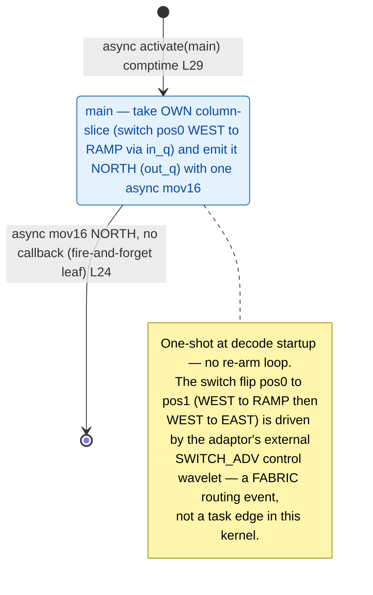

# qwen3_1p7b-e2e-pdSeparate · decode/kv_demux.csl — task/fn state machine

> Model `qwen3_1p7b-e2e-pdSeparate` (phase = decode), ref config `test_sim_2x2blk_kv.json`.
> Control-flow / state-machine companion to the algo walkthrough. This file maps the **task
> activation graph** (who fires whom, sync vs async) — not the spatial scatter geometry, which the
> algo doc covers. Diagram: `qwen3_1p7b-e2e-pdSeparate.decode-kv_demux.statemachine.svg`.
>
> This is the pdSeparate-specific **KV BRIDGE demux on the DECODE side**: the one-shot host→decode
> KV-prefix ingress peel. A `Pw×1` switch-based scatter row, one PE per decode column, that lands each
> column's KV slice into the decode block's bottom row at startup.

## States

**One node.** The kernel has a single `@bind_local_task` task, `main` (bound at `kv_demux.csl:28`,
task id `kv_demux.csl:21`). There is no join, no `fn` reached by synchronous call, and no per-request
re-arm — it is a strict one-shot at decode startup (`launch.py:1985` "One-shot at decode startup").
The same compiled program runs on every one of the `Pw` demux columns; which slice a given PE takes is
selected by its **switch position**, not by any task-graph branch.

### `main` — the per-column peel (entry + leaf, one node)
- **In-edge:** the comptime `@activate(main_id)` at `kv_demux.csl:29`. This is the **only** activation
  in the kernel and the machine's single entry. Because the switch parks each PE's input queue on the
  fabric, `main` waits (fabric recv) until its own column-slice actually arrives from the west.
- **Body:** a single async `@mov16(north_dsd, in_dsd, .{ .async = true })` (`kv_demux.csl:24`). The
  source DSD `in_dsd` reads `slice_len` fp16 operands off the input queue fed by the switch in **pos0
  (WEST→RAMP)** — i.e. this PE's own column-slice, taken off the west link into the ramp
  (`kv_demux.csl:16-18`). The destination DSD `north_dsd` emits those same `slice_len` operands
  **NORTH** on the output queue (`north_color`, `kv_demux.csl:14,19`) into the decode block's bottom
  row, where the `kv_ingress` north-shift fans it across the rows (out of scope here).
- **Out-edge:** none in the task graph. The `@mov16` is `.async = true` with **no `.activate` / `.unblock`
  callback** — fire-and-forget. So `main` is simultaneously the entry node and a control-flow **leaf**:
  once it issues the async mov it returns, and the transfer drains on its own with no follow-on task.
  Drawn as `main → [*]` (terminal).

## The switch advance is NOT a task edge (why the machine is this small)

The interesting control in this kernel lives on the **fabric switch**, not in the task graph, so it
does not appear as a `@block`/`@activate` edge:

- Each demux PE's input color (`demux_in_color`) is painted with **two switch positions** — `kv_take`
  (pos0, WEST→RAMP: take own slice) and `kv_fwd` (pos1, WEST→EAST: forward past this PE) — via
  `paint_all(kv_dmx_in_color, [kv_take, kv_fwd])` (`launch.py:2019`).
- The `kv_adaptor` (1 PE, west of this row, `launch.py:2031-2049`) relays the host KV stream one
  column-slice at a time and emits a **`SWITCH_ADV` control wavelet** after every batch but the last
  (`kv_adaptor.csl:4-7`, `kv_adaptor.csl:27`). Each `SWITCH_ADV` advances the switch of the next
  not-yet-served demux PE from pos0 to pos1.
- Net effect: demux PE `k` starts at pos0, takes its slice `k` into the ramp (feeding `main`'s
  `in_dsd`), then flips to pos1 so slice `k+1` streams **past** it to PE `k+1` at the router — never
  buffered here (`kv_demux.csl:1-10`). This replaces the old store-and-forward chain (which caused the
  i16 forward-extent overflow); peak memory is ~zero (fabin→fabout).

Because the advance is a receiver-side switch event triggered by an **external** control wavelet from
the adaptor, it is a fabric routing action — there is no `@block`/`@unblock`/`@activate` in `kv_demux`
tied to it. The kernel's whole task machine is therefore the single `main` peel.

## Legend

- **`async …`** — an async-op edge (`@mov16` with `.async = true`); the task returns immediately. Here
  the one async mov has no callback, so it produces no follow-on task edge (leaf).
- **`activate(main)`** — the comptime `@activate(main_id)`, the sole activation and the machine entry.
- **`[*]`** — entry (comptime `@activate`) on the left; terminal on the right (the fire-and-forget mov
  has no successor).
- Switch **pos0 (WEST→RAMP)** / **pos1 (WEST→EAST)** and the `SWITCH_ADV` advance are fabric events
  (adaptor-driven), shown only in the note — not task edges.

## Edge inventory (control-transfer sites vs edges drawn)

| Site (source) | kind | target | edge in diagram |
|---|---|---|---|
| `@activate(main_id)` comptime `kv_demux.csl:29` | activation | main | `[*] → main` |
| `@mov16(… .async=true)` `kv_demux.csl:24` | async, no callback | — (drain) | `main → [*]` (leaf) |

**Site counts (grep-confirmed on `kv_demux.csl`):** `@activate` = **1** (comptime L29), `.activate` =
**0**, `.unblock` = **0**, `@block` = **0**. One async `@mov16` (L24) with no callback → control-flow
leaf, no out-edge. **1 activation edge drawn (1:1 with the single `@activate`)**; the async mov is the
terminal leaf. No sync `call` edges, no join, no per-request loop.
