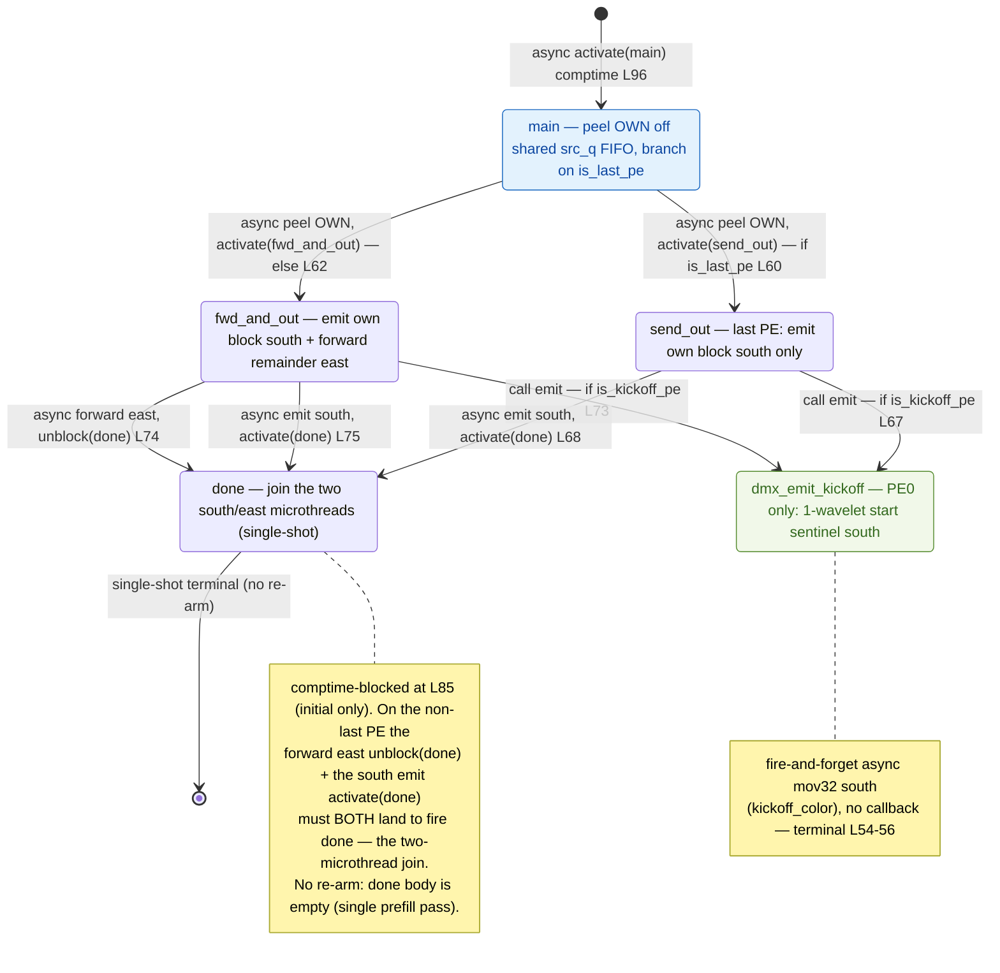

# qwen3_1p7b-e2e-pdSeparate · prefill/demux.csl — task/fn state machine

> Model `qwen3_1p7b-e2e-pdSeparate` (phase = prefill), ref config `test_sim_2x2blk_kv.json`.
> Control-flow / state-machine companion to the algo walkthrough. Diagram:
> `qwen3_1p7b-e2e-pdSeparate.prefill-demux.statemachine.svg`. This maps the **task activation graph**
> of the pdSeparate PREFILL-phase token-id ingress (peel OWN / forward east / emit south) — who fires
> whom, sync vs async — not the spatial peel/forward/fan-out geometry.
>
> **pdSeparate vs the fused-e2e prefill demux:** the two are the *same single-shot kernel* — this file
> is compiled into the **standalone prefill device artifact** (the `pf_demux` HWh×1 row at
> `launch.py:2711`, placed at `(HT_HEAD_X, DEMUX_Y)`), whereas the fused copy lives inside the fused
> e2e artifact. The demux control flow is identical: `done` is an empty terminal task, there is **no
> `done → main` per-request re-arm**, and `@block(done_id)` fires once at comptime (initial gate only).
> One prefill pass over the whole prompt, then the machine quiesces. (The re-arming variant is the
> standalone `qwen3_1p7b-prefill` demux; both fused and pdSeparate prefill demuxes are single-shot.)

## States

Five nodes: four `@bind_local_task` tasks (`main`, `send_out`, `fwd_and_out`, `done`, bound at
`prefill/demux.csl:81-84`) plus the one plain `fn` reached by a synchronous call (`dmx_emit_kickoff`,
`prefill/demux.csl:54-56`). The same compiled program runs on every column of the 1×P demux row
(`HWh×1`, `launch.py:2711`); `my_idx` / `is_last_pe` / `is_kickoff_pe` are compile-time params
(`launch.py:2725-2728`) that select which out-edges a given PE actually takes.

### `main` — the entry / peel
- **In-edge:** the comptime `@activate(main_id)` at `prefill/demux.csl:96` (the single entry — no
  re-arm back-edge exists, unlike the standalone prefill demux).
- **Body:** one async `@mov32` peels this column's `OWN` block off the shared `src_q` FIFO into
  `own_buf` (`prefill/demux.csl:58-63`). The peel's completion callback is the branch — the only work
  `main` does.
- **Out-edges (async, mutually exclusive on `is_last_pe`):**
  - `is_last_pe == 1` → `.activate = send_out_id` (`prefill/demux.csl:60`).
  - else → `.activate = fwd_and_out_id` (`prefill/demux.csl:62`).

### `fwd_and_out` — non-last PE (`my_idx < P-1`)
- **In-edge:** async peel-complete from `main` (`prefill/demux.csl:62`).
- **Body / out-edges:**
  - if `is_kickoff_pe != 0`: **synchronous** `call dmx_emit_kickoff()` (`prefill/demux.csl:73`) —
    same-stack, runs before the two movs are issued.
  - async `@mov32` streams the remaining `FWD_EXTENT` wavelets east on `forward_oq`, callback
    `.unblock = done_id` (`prefill/demux.csl:74`).
  - async `@mov32` emits `own_buf` south on `out_oq`, callback `.activate = done_id`
    (`prefill/demux.csl:75`).
  - These two are the **concurrent microthreads that join at `done`** (see the join note).

### `send_out` — last PE (`my_idx == P-1`)
- **In-edge:** async peel-complete from `main` (`prefill/demux.csl:60`).
- **Body / out-edges:**
  - if `is_kickoff_pe != 0`: synchronous `call dmx_emit_kickoff()` (`prefill/demux.csl:67`). (PE 0 is
    the kickoff PE and is never the last PE, so on the last column this branch is dormant — the program
    is column-generic.)
  - async `@mov32` emits `own_buf` south on `out_oq`, `.activate = done_id` (`prefill/demux.csl:68`).
    No east forward exists on the last PE (`FWD_EXTENT = 1` placeholder, `prefill/demux.csl:22`), so
    this is its single edge into `done`.

### `dmx_emit_kickoff` — PE0 start-of-forward sentinel (leaf `fn`)
- **In-edges:** synchronous `call` from `fwd_and_out` (`prefill/demux.csl:73`) or `send_out`
  (`prefill/demux.csl:67`), guarded by `is_kickoff_pe`.
- **Body:** one async `@mov32` pushes the 1-wavelet `kickoff_buf` south on `kickoff_oq`/`kickoff_color`
  (`prefill/demux.csl:54-56`). That async op has **no `.activate`/`.unblock`** — fire-and-forget, so
  the node is a control-flow **leaf** (no out-edge back into the state machine). It is a plain `fn`, not
  a bound task; it appears here only because it is the sole synchronous-call edge in the kernel. The
  sentinel is routed south (`launch.py:2744`, `rp_R_S`) down the HT_head west column into HT_tail's TSC
  PE to mark the forward's true start.

### `done` — the join (single-shot terminal)
- **In-edges:** on the non-last PE, `.unblock(done_id)` from the east-forward mov
  (`prefill/demux.csl:74`) and `.activate(done_id)` from the south-emit mov (`prefill/demux.csl:75`);
  on the last PE, the single `.activate(done_id)` from `send_out` (`prefill/demux.csl:68`).
- **The join:** `done_id` is `@block`-ed at comptime on non-last PEs (`prefill/demux.csl:85`). So even
  though the south-emit mov `.activate`s `done`, the task cannot fire until the east-forward mov
  `.unblock`s it — **both microthreads must complete**. This is a block/unblock barrier, not an
  ordinary activation, and is why `done` has two distinct in-edges from `fwd_and_out`.
- **Out-edge:** none. `task done() void {}` is empty (`prefill/demux.csl:78`) — **single-shot**. Like
  the fused e2e prefill demux and unlike the standalone prefill demux, there is no `@block(done_id)`
  re-arm and no `@activate(main_id)` re-park; a single prefill pass drains the whole prompt and the
  machine quiesces.

## Legend

- **`async …`** — the transition is an async-op completion callback (`.activate` / `.unblock` on an
  `@mov32` microthread); the source task returns immediately and the edge fires later when the transfer
  drains.
- **`call …`** — a synchronous, same-stack `fn` call (`dmx_emit_kickoff`); runs inline before the
  caller continues.
- **`activate(x)`** — `@activate` / `.activate = x_id`, an activation edge. **`unblock(x)`** —
  `.unblock = x_id`, releases a `@block`-gated task. **`block(x)`** — `@block`, holds the join gate.
- **`[*]`** — entry (comptime `@activate`) and, here, the single-shot terminal (`done` has no back-edge).
- Branch guards on edges (`if is_last_pe`, `else`, `if is_kickoff_pe`) are compile-time PE-role
  predicates; a given column takes only the matching edges.

## Edge inventory (control-transfer sites vs edges drawn)

| Site (source) | kind | target | edge in diagram |
|---|---|---|---|
| `@activate(main_id)` comptime `prefill/demux.csl:96` | activation | main | `[*] → main` |
| `.activate=send_out_id` `prefill/demux.csl:60` | async activation | send_out | main → send_out |
| `.activate=fwd_and_out_id` `prefill/demux.csl:62` | async activation | fwd_and_out | main → fwd_and_out |
| `call dmx_emit_kickoff()` `prefill/demux.csl:67` | sync call | dmx_emit_kickoff | send_out → dmx_emit_kickoff |
| `call dmx_emit_kickoff()` `prefill/demux.csl:73` | sync call | dmx_emit_kickoff | fwd_and_out → dmx_emit_kickoff |
| `.activate=done_id` `prefill/demux.csl:68` | async activation | done | send_out → done |
| `.unblock=done_id` `prefill/demux.csl:74` | async unblock | done | fwd_and_out → done (forward east) |
| `.activate=done_id` `prefill/demux.csl:75` | async activation | done | fwd_and_out → done (emit south) |
| `@block(done_id)` comptime `prefill/demux.csl:85` | gate (initial) | done | join note |

**6 activation/unblock edges** (1 `@activate` + 4 `.activate` + 1 `.unblock`) + **2 sync `call`
edges**, all drawn; the **1 `@block` site** is gating (shown as the `done` join note), not a separate
arrow. One inline async `@mov32` (`prefill/demux.csl:55`) inside `dmx_emit_kickoff` has no callback, so
it is a control-flow leaf with no out-edge. There is **no `done → main` re-arm** (single-shot); this
pdSeparate prefill demux matches the fused e2e prefill demux exactly and differs from the standalone
`qwen3_1p7b-prefill` demux only by that one absent re-arm edge.
