# qwen3_1p7b-e2e-pdSeparate · prefill/ht_tail.csl — task/fn state machine

> Model `qwen3_1p7b-e2e-pdSeparate` (phase = prefill), ref config `test_sim_2x2blk_kv.json`.
> Control-flow / state-machine companion to the algo walkthrough for this kernel.
> Nodes = tasks and the sync fns they drive; edges = control transfers (`async:` @activate / scheduling,
> `call:` direct fn call, `event:` blocking fabric recv park). File:line citations point at
> `models/qwen3_1p7b-e2e-pdSeparate/src/prefill/ht_tail.csl`.
>
> **Orientation.** In the PD-separated model the prefill artifact is a *standalone device program*; its
> tail is **not** a passthrough/relay. It runs the full lm_head mesh-GEMV + final RMSNorm + top-K
> merge-reduce + on-chip categorical sampling and **samples its own first token**, emitting it south to
> the mux → host. The pipeline is **one-shot**: prefill produces exactly one token (its first) and stops;
> in pdSeparate the *separate* decode device artifact — reloading KV cache bridged through host memory —
> owns every subsequent token, so there is no per-step re-arm back-edge. Structurally the two Y-axis
> reductions are **two self-contained fns** (`tail_reduce_bsz_f32`, `tail_logits_reduce_bsz_vocab`), not a
> shared `tail_reduce_2phase`. This prefill-tail source is byte-identical to the fused `qwen3_1p7b-e2e`
> prefill tail; the difference is deployment (separate artifact + host-bridged KV), not control flow.

```mermaid
stateDiagram-v2
    state "tail_init task (L1057)" as tail_init
    state "tail_main task (L1150)" as tail_main

    [*] --> tail_init : async comptime activate(tail_init) [entry L1246]
    tail_init --> tail_main : async activate(tail_main) L1143

    state tail_init {
        state "derive coords + Y/X chain ids (L1058-1065)" as ti_derive
        state "write_Y_routes_tail fn (L417)" as ti_wY
        state "paint static routes: Z-drain L1075, south L1084, xready L1094, kickoff L1126; seed PRNG L1119; enable TSC L1140" as ti_routes
        [*] --> ti_derive
        ti_derive --> ti_wY : call write_Y_routes_tail() L1067
        ti_wY --> ti_routes : return
        ti_routes --> [*]
    }

    state tail_main {
        state "TSC start (is_tsc_pe): park on kickoff sentinel L1156, sample start L1157" as tm_tsc_start
        state "drain Z: fmovh z_slice from z_recv L1160" as tm_drainZ
        state "tail_final_rmsnorm fn (L350): fp32 sumsq, Y-allreduce+bcast, normalize x W" as tm_rmsnorm
        state "tail_lm_head_matvec fn (L332): local GEMV partials = lm_head @ Z" as tm_lmhead
        state "tail_logits_reduce_bsz_vocab fn (L653): Y 2-phase reduce, NO bcast" as tm_logred
        state "south emit L1197 (x==HT_WIDTH-1 and root row): topk_val + topk_arg + pred_token to mux OQ0" as tm_south
        state "TSC end (is_tsc_pe): sample end L1207, async mov32 8-u32 burst to OQ0 L1214" as tm_tsc_end

        [*] --> tm_tsc_start
        tm_tsc_start --> tm_drainZ : event kickoff sentinel (is_tsc_pe) / else fall through
        tm_drainZ --> tm_rmsnorm : event Z arrives from last block

        state tm_rmsnorm {
            state "phase1 per-batch local sumsq (L357)" as rn_sumsq
            state "tail_reduce_bsz_f32 fn (L732): Y 2-phase reduce + bcast, fp32" as rn_wrap
            state "phase3 normalize + cast + mul W_final_norm (L385)" as rn_norm
            [*] --> rn_sumsq
            rn_sumsq --> rn_wrap : call tail_reduce_bsz_f32() L381
            rn_wrap --> rn_norm : return
            rn_norm --> [*]
        }

        tm_rmsnorm --> tm_lmhead : call tail_lm_head_matvec() L1165

        state tm_lmhead {
            state "vecmat_computation_lm fn (L310)" as lm_vecmat
            state "gemv_lm_step fmachs (L305) via map, loop bsz x dim_per_pe" as lm_step
            [*] --> lm_vecmat : call vecmat_computation_lm() L340
            lm_vecmat --> lm_step : map over left_vector L322
            lm_step --> lm_step : per-K fmachs accumulate
            lm_step --> [*] : per-batch done L315
        }

        tm_lmhead --> tm_logred : call tail_logits_reduce_bsz_vocab() L1167

        state tm_logred {
            state "self-contained Y 2-phase reduce (L657-723), len bsz x V_per_pe_x, no bcast" as lr_reduce
            [*] --> lr_reduce
            lr_reduce --> [*] : logits land on root_2nd_phase row
        }

        tm_logred --> tm_topk : call if tail_my_py==root_2nd_phase L1172
        tm_logred --> tm_south : else (non-root rows skip top-K)

        state tm_topk {
            state "write_X_routes_tail fn (L529): repaint reduce colors Y to X" as tk_wX
            state "xready barrier L1177: root_2nd_phase_x sends go / others recv (event)" as tk_barrier
            state "tail_local_topk fn (L820): loop bsz x TOP_K masked-argmax" as tk_local
            state "tail_topk_mergereduce_x fn (L874): X 2-phase reduce, per-hop merge + bcast" as tk_merge
            state "topk_merge_local fn (L848): 2-pointer K-list merge, loop bsz" as tk_mergefn
            state "tail_sample_token fn (L1003): softmax, top-p, PRNG draw (root_2nd_phase_x only)" as tk_sample
            state "predtok X-bcast L1188 / recv L1190" as tk_predbcast
            state "write_Y_routes_tail fn (L417): restore Y routes" as tk_wY
            [*] --> tk_wX : call write_X_routes_tail() L1173
            tk_wX --> tk_barrier : return
            tk_barrier --> tk_local : call tail_local_topk() L1182
            tk_local --> tk_merge : call tail_topk_mergereduce_x() L1183
            tk_merge --> tk_mergefn : call topk_merge_local() per hop L880
            tk_mergefn --> tk_merge : return per hop
            tk_merge --> tk_sample : call tail_sample_token() if root_2nd_phase_x L1187
            tk_sample --> tk_predbcast : return
            tk_predbcast --> tk_wY : call write_Y_routes_tail() L1192
            tk_wY --> [*]
        }

        tm_topk --> tm_south : proceed
        tm_south --> tm_tsc_end : if is_tsc_pe L1206
        tm_south --> [*] : else exit (one-shot, no re-arm)
        tm_tsc_end --> [*]
    }

    note right of tm_drainZ
        Event-driven fabric parks (not activate/block):
        kickoff L1156, z_recv L1160, xready L1180.
    end note
    note right of tm_rmsnorm
        Two reduces, two SELF-CONTAINED fns (no shared
        tail_reduce_2phase): tail_reduce_bsz_f32 (L732,
        bcast, bsz) vs tail_logits_reduce_bsz_vocab
        (L653, no bcast, bsz x V_per_pe_x).
    end note
    note left of tm_topk
        X merge-reduce loops per hop; each hop recvs KB
        val + KB id, merges via topk_merge_local, sends.
    end note
    note right of tm_tsc_end
        pdSeparate PREFILL is ONE-SHOT: tail_main does NOT
        re-arm. It samples the prefill's first token once;
        the SEPARATE decode artifact owns all later tokens.
    end note

    state Legend {
        state "async: microthread callback / activate (scheduling edge)" as L1
        state "call: direct synchronous fn call (same stack)" as L2
        state "event: blocking fabric recv park (not activate/block)" as L3
    }
```

## States

Only two things are real scheduling units — the tasks `tail_init` and `tail_main` (bound at
`ht_tail.csl:1243-1244`, ids 10/11). Everything else runs on `tail_main`'s stack as synchronous fn calls;
the composite `state { }` blocks below bound those sub-flows.

### Entry and the two tasks

- **`[*] → tail_init`** — the only entry. The comptime block schedules it with `@activate(tail_init_id)`
  (`ht_tail.csl:1246`). This is the single in-edge with no source state.
- **`tail_init` (`:1057`)** — one-shot per-PE setup: reads its wafer coord, derives local `(x, py)` plus the
  Y and X chain ids (`:1058-1065`); **calls** `write_Y_routes_tail()` (`:1067`); then paints all static
  routes (Z-drain multicast `:1075`, south emit `:1084`, X-phase barrier tree `:1094`, TSC kickoff `:1126`),
  seeds the PRNG on the sampling PE (`:1119`), and enables the TSC counter on `is_tsc_pe` (`:1140`).
  In-edge: entry. Out-edge: **`async: @activate(tail_main_id)`** (`:1143`).
- **`tail_main` (`:1150`)** — the per-request pipeline, run **exactly once**. In-edge: the activation from
  `tail_init` (`:1143`). **There is no re-arm back-edge** — after emitting the token (and, on `is_tsc_pe`,
  the TSC burst) the task simply ends. This is the pdSeparate prefill contract: the prefill artifact
  produces exactly one token (its first), then the *separate* decode artifact — fed the KV cache bridged
  through host memory — takes over for all subsequent tokens. (Contrast the standalone `qwen3_1p7b-prefill`
  tail, which re-activates itself and re-parks on `z_recv`.)

### `tail_init` internals

`ti_derive → ti_wY → ti_routes`, all synchronous. `ti_wY` is `write_Y_routes_tail` (`:417`) called at
`:1067`; it returns to the caller (`return` edge), then `ti_routes` paints the remaining static routes.
Composite exit `→ [*]` precedes the `async: activate(tail_main)` out-edge drawn at the top level.

### `tail_main` pipeline

1. **`tm_tsc_start`** — on `is_tsc_pe` only: parks on the kickoff sentinel (`@mov32` from `kickoff_recv`,
   `:1156`, **event-driven**) then samples the start TSC (`:1157`). Non-TSC PEs fall straight through.
2. **`tm_drainZ`** — `@fmovh(z_slice_buf, z_recv)` (`:1160`): a **blocking fabric recv** that parks until the
   prefill region's last block ships `Z` west into the tail. Out-edge triggered by `event: Z arrives`.
3. **`tm_rmsnorm`** (composite, `tail_final_rmsnorm` `:350`) — `rn_sumsq` computes the per-batch fp32
   sum-of-squares (`:357`), **calls** `tail_reduce_bsz_f32` (`:732`, at `:381`) — a self-contained Y-axis
   2-phase all-reduce **with broadcast** of the `bsz` sums (broadcast at `:805-809`). Control returns to
   `rn_norm` (`:385`) for normalize + cast + `* W_final_norm`, in place over `z_slice_buf`.
4. **`tm_lmhead`** (composite, `tail_lm_head_matvec` `:332`) — **calls** `vecmat_computation_lm` (`:310`, at
   `:340`), which `@map`s `gemv_lm_step` (`:305`) over the left vector (`:322`). `lm_step → lm_step` is the
   **per-K `@fmachs` accumulate loop**; the outer `for b in bsz` (`:315`) closes the composite. Purely local,
   no comms.
5. **`tm_logred`** (composite, `tail_logits_reduce_bsz_vocab` `:653`) — a **separate self-contained** Y-axis
   2-phase reduce (`:657-723`) with the wider `bsz*V_per_pe_x` extent and **no broadcast**; the full logits
   land only on the `root_2nd_phase` row. Unlike the standalone prefill (which shared one
   `tail_reduce_2phase` between rmsnorm and logits), here rmsnorm and logits use two distinct fns.
6. **Root-row branch** (`:1172`): `tm_logred → tm_topk` when `tail_my_py == root_2nd_phase`; otherwise
   `tm_logred → tm_south` (non-root rows stay in Y-route mode and skip the top-K block entirely).

### `tm_topk` internals (root row only)

- **`tk_wX`** — `write_X_routes_tail` (`:529`, called `:1173`): repaints reduce colors 1-5 from Y to X.
- **`tk_barrier`** — the X-phase fence (`:1177`): `root_2nd_phase_x` sends a 1-wavelet "go" (`:1178`); every
  other root column does a **blocking recv** (`:1180`, event) before any X send, so no column emits an X-mode
  wavelet into a neighbor still painted for Y.
- **`tk_local`** — `tail_local_topk` (`:820`, called `:1182`): the **top-K loop**, `bsz × TOP_K`
  masked-argmax passes over this PE's `V_per_pe_x` logit slice (with trailing-pad masking at `:827`); seeds
  `topk_val`/`topk_arg`.
- **`tk_merge`** — `tail_topk_mergereduce_x` (`:874`, called `:1183`): X-axis 2-phase reduce whose per-hop
  combine **calls** `topk_merge_local` (`tk_mergefn`, `:848`, first at `:880`). `tk_merge ↔ tk_mergefn` is
  the **per-hop merge loop**; each hop recvs `KB` fp16 vals + `KB` i32 ids, merges into the running top-K,
  sends it on; the final broadcast (`:990`) replicates the global top-K across the root row.
- **`tk_sample`** — `tail_sample_token` (`:1003`, called `:1187`, `root_2nd_phase_x` only): temperature →
  fp32 softmax → top-p nucleus → categorical PRNG draw into `pred_token_buf`.
- **`tk_predbcast`** — X-broadcasts the sampled id to every root column (`:1188` send / `:1190` recv) so the
  east-most column has it.
- **`tk_wY`** — `write_Y_routes_tail` (`:417`, called `:1192`): restores Y routes. Composite exit `→ [*]`.

### Tail of `tail_main`

- **`tm_south`** (`:1197`) — only the east-most root PE (`x == HT_WIDTH-1 && y == root_2nd_phase`) emits
  `topk_val` + `topk_arg` + `pred_token` (+ even-count pad at `:1201`) south on `logits_south_color` (OQ 0)
  to the mux → host. Both the `tm_topk` exit and the non-root bypass converge here.
- **`tm_tsc_end`** (`:1206`) — `is_tsc_pe` samples the end TSC (`:1207`), packs start+end into an 8-u32 burst,
  and **async-emits** it (`@mov32 … .{ .async = true }`, `:1214`) — a fire-and-forget send with no callback,
  so it is a note, not an activation edge.
- Composite exit `→ [*]`, then the task **ends** — no re-arm. The pdSeparate prefill tail runs once per
  program.

## Validation (count-exact)

- **Nodes:** 2 real tasks (`tail_init`, `tail_main`) + composite sub-states. Every non-entry node has an
  in-edge; both composite entries (`tail_init [*]`, `tail_main [*]`) and the top-level `[*] → tail_init` are
  the only sourceless edges. No orphans.
- **Control-flow primitive sites, source-grepped one-to-one with edges drawn:**
  - `@activate` — **2 sites**: `:1246` (comptime entry → `tail_init`) and `:1143` (`tail_init` → `tail_main`).
    Both drawn as `async:` edges. There is **no** `@activate(tail_main_id)` at the end of `tail_main` — hence
    no re-arm back-edge (the key contrast with standalone prefill).
  - `.activate` / `.unblock` microthread callbacks — **0 sites** (grep clean).
  - `@block` / `@unblock` — **0 sites** (grep clean). No gating edges.
  - `.async = true` — **1 site**: `:1214` (TSC burst emit), fire-and-forget with no callback → rendered as a
    `note`, not an edge.
- **`@bind_local_task`** — 2 (`:1243`, `:1244`), matching the two tasks. `@get_local_task_id` — 2 (`:1041`,
  `:1042`).
- The `event:` edges (blocking fabric recv parks — kickoff `:1156`, `z_recv` `:1160`, xready `:1180`) are not
  `@activate`/`@block` primitives; they are noted separately and drawn as `event:` transitions.

## Legend

- **`async:`** — a scheduling edge: `@activate` (task activation) or a microthread callback. Exactly two
  in this kernel (both `@activate`): entry `:1246` and `tail_init → tail_main` `:1143`. (No re-arm edge.)
- **`call:`** — a direct synchronous fn call on the same stack; `return` edges close each sub-call back to
  its caller.
- **`event:`** — a blocking fabric recv park (kickoff `:1156`, `z_recv` `:1160`, xready `:1180`). These gate
  progress but are not `@activate`/`@block` primitives.
