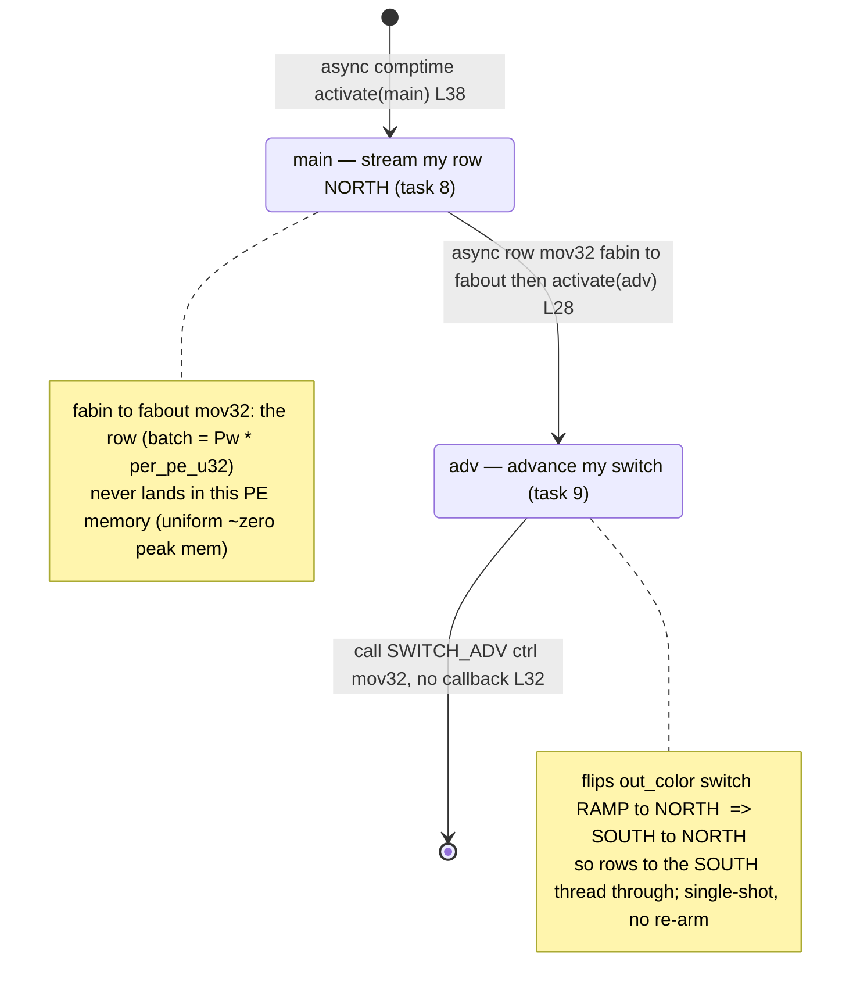

# qwen3_1p7b-e2e-pdSeparate · prefill-kv_mux.csl — task/fn state machine

> Model `qwen3_1p7b-e2e-pdSeparate` (phase = prefill), ref config `test_sim_2x2blk_kv.json`. Control-flow / state-machine companion to the algo walkthroughs. This is the *task-graph* view (who activates whom); the vertical switch-gather comm pattern and spatial sharding appear only as edge triggers. Diagram: `qwen3_1p7b-e2e-pdSeparate.prefill-kv_mux.statemachine.svg`.

This is the pdSeparate-side **KV bridge egress** on the PREFILL artifact: one `kv_mux` PE per prefill block row (a `1×Ph` column placed at the block's east edge, `launch.py:2863-2881`). Each PE receives its row's already-gathered batch from the block EAST edge (`in_color`, RAMP) and streams it NORTH to the host output stream (`out_color`), a pure `fabin→fabout` `@mov32` so the row never lands in this PE's memory. The muxed D2H stream is the KV cache that the *separate* decode artifact later ingests. Compared to the standalone-prefill `kv_egress_colmux` (the style reference), this is the **simpler single-shot gemv-05 `mux.csl` shape**: no per-request re-arm, no column-fence barrier — each PE fires exactly once per program invocation.

Every mux PE in the column runs this identical program; there is **no** per-PE role branch (unlike `kv_egress_colmux`'s tail/non-tail split). Ordering across the column is handled entirely by the fabric switch and the per-PE `SWITCH_ADV`, not by task-graph branching: the north-most PE holds the host output port and drains first, and each PE's `adv` flips its own switch so the next-south row threads up. The graph therefore has exactly **two** task nodes, and every PE walks both (`main`→`adv`).

## States

**`main` (task 8, `@get_local_task_id(8)` `kv_mux.csl:24`, bound `:36`).** The entry state — the only one activated from `[*]`, via the comptime `@activate(main_id)` (`:38`). It streams this PE's row to the host with a single async `@mov32(out_dsd, in_dsd, .{ .async = true, .activate = adv_id })` (`:28`): `in_dsd` is a `fabin` DSD on `in_color`'s input queue (the row gathered from the block's east edge, `extent = batch = Pw * per_pe_u32`), `out_dsd` is a `fabout` DSD on `out_color`'s output queue heading NORTH. Because it is `fabin→fabout`, the row bytes pass straight through the router and never occupy PE memory (uniform near-zero peak memory, no store-and-forward). Out-edge: the async `.activate = adv_id` callback fires `adv` once the row transfer completes (`:28`). No in-edge other than the comptime entry — `main` is single-shot (nothing re-activates it).

**`adv` (task 9, `@get_local_task_id(9)` `:25`, bound `:37`).** The switch-advance state. It emits one control wavelet on `out_color` with a synchronous `@mov32(ctrl_out, ctrl.encode_single_payload(ctrl.opcode.SWITCH_ADV, true, {}, 0))` (`:32`), where `ctrl_out` is a 1-extent `fabout` control DSD (`.control = true`, `:22`). This flips this PE's `out_color` switch from routing position 0 (`RAMP→NORTH`, its own row) to position 1 (`SOUTH→NORTH`, forward the rows below) — the two positions painted in `launch.py:2870-2872`. The `@mov32` has no `.async` and no `.activate`, so it is a terminal, fire-and-forget control emit — no callback edge. In-edge: from `main`'s async callback (`:28`). Out-edge: none (terminal → `[*]`).

## Loops and ordering

- **No inner loop, no per-request re-arm.** Unlike `kv_egress_colmux` (segmented drain self-loop + re-arm back to `peel_meta`), each `kv_mux` PE runs `main`→`adv` exactly once per program invocation. There is no back-edge in the task graph.
- **Column ordering is a fabric-switch effect, not a task edge.** The single `SWITCH_ADV` per PE (in `adv`) cascades the vertical gather: after a PE has streamed its own row and advanced its switch, rows arriving from the SOUTH thread straight through it to the north-most host port. This sequencing lives in the router/switch, so it shows up only as the `adv` side-effect note, not as an activation edge.

## Legend

- **Node** = a `task`/`fn` that is `@activate`-d or bound as a task (both nodes here are `@bind_local_task`).
- Edge label prefix **`call:`** (written `call`) = synchronous `@mov32`/`@activate` (same stack, no microthread callback); **`async:`** (written `async`) = a microthread callback (`.activate`) or the comptime activation of a task body. `SWITCH_ADV` is a synchronous control emit, hence `call`.
- `L<n>` in a label = source line in `kv_mux.csl`.
- `[*]` = the comptime entry (`:38`) / terminal (after `adv`).
- No `@block`/`@unblock` and no `.unblock` sites exist in this kernel.
