# qwen3_1p7b-e2e-pdSeparate · prefill/mux.csl — task/fn state machine

> Model `qwen3_1p7b-e2e-pdSeparate` (phase=prefill), ref config `test_sim_2x2blk_kv.json`.
> Control-flow / state-machine companion to the algo walkthrough. This file maps the *task/fn control
> flow only* — the spatial "who forwards to whom" (pdSeparate PREFILL-phase logits/token egress,
> serialize-through-collector at the east edge) story lives in the algo walkthrough.
> Diagram: `qwen3_1p7b-e2e-pdSeparate.prefill-mux.statemachine.svg`.
>
> Note: this kernel is byte-identical to `qwen3_1p7b-e2e`'s `prefill/mux.csl`; pdSeparate splits the
> fused e2e artifact into separate prefill/decode devices, but the prefill logits-mux egress is unchanged.

```mermaid
stateDiagram-v2
    [*] --> main : comptime activate(main_id) [is_last_pe==1]

    state "main() — drain blob from north" as main
    state "send() — forward blob east to host" as send
    state "tsc_recv() — drain 8-u32 TSC burst" as tsc_recv
    state "tsc_send() — forward TSC east (done)" as tsc_send

    main --> send : async: mov32 done, activate(send_id)
    send --> tsc_recv : async: mov32 done, activate(tsc_recv_id)
    tsc_recv --> tsc_send : async: mov32 done, activate(tsc_send_id)
    tsc_send --> [*] : async: mov32 done, no callback (terminal)

    note right of main : only east-most PE (is_last_pe==1) is armed; all other mux PEs inert
    note right of tsc_send : one-shot chain, no re-arm (prefill is one-shot per launch)
```

## Shape of the machine

Four tasks form a single **linear async chain**: `main → send → tsc_recv → tsc_send → [*]`. Every
transition is an **async activation** fired by the `.activate` callback of an `@mov32` microthread —
there are no synchronous `fn` calls, no `@block`/`@unblock` gating, and no data/control-task bindings.
The whole kernel is armed **only on the east-most PE** (`is_last_pe == 1`); on every other mux PE the four
tasks are never bound or activated, so the PE is inert (`mux.csl:49-60`).

Unlike a re-armed pipeline, this chain is **one-shot**: the final task's `@mov32` carries **no**
`.activate` callback (`mux.csl:46`), so control simply drains and the machine terminates. This matches the
pdSeparate **prefill** role — the mux forwards exactly one top-K + sampled-token blob (plus its trailing TSC
burst) per launch, not a per-request loop. (Contrast the decode-side mux, which re-parks `main`.)

## States

### `main()` — drain the blob from the north
- **Bound / entry:** `@bind_local_task(main, main_id)` (`mux.csl:52`); `main_id = @get_local_task_id(8)` (`mux.csl:28`).
- **In-edge:** the single entry — `@activate(main_id)` in the comptime block (`mux.csl:56`).
- **Body:** async `@mov32(blob_dsd, recv_dsd, …)` — drains the `N = wlts_per_step` (= `TOP_K*bsz` packed
  f16 values + i32 indices + sampled token) u32 blob arriving from the north (HT_tail east-most) over
  `in_color`/`in_q` into local `blob` (`mux.csl:33-35`; DSDs at `mux.csl:13-19`).
- **Out-edge:** `async: activate(send_id)` on mov32 completion (`mux.csl:34`).

### `send()` — forward the blob east to the host
- **Bound:** `@bind_local_task(send, send_id)` (`mux.csl:53`); `send_id = @get_local_task_id(9)` (`mux.csl:29`).
- **In-edge:** `async: activate(send_id)` from `main` (`mux.csl:34`).
- **Body:** async `@mov32(send_dsd, blob_dsd, …)` — pushes the buffered blob out east on
  `host_color`/`host_oq` toward the host stream at the east edge (`mux.csl:37-39`; `send_dsd` at `mux.csl:19`).
- **Out-edge:** `async: activate(tsc_recv_id)` on completion (`mux.csl:38`).

### `tsc_recv()` — drain the 8-u32 TSC burst from the north
- **Bound:** `@bind_local_task(tsc_recv, tsc_recv_id)` (`mux.csl:54`); `tsc_recv_id = @get_local_task_id(10)` (`mux.csl:30`).
- **In-edge:** `async: activate(tsc_recv_id)` from `send` (`mux.csl:38`).
- **Body:** async `@mov32(tsc_blob_dsd, tsc_recv_dsd, …)` — drains one 8-u32 TSC timestamp burst
  piggybacked from the north (HT_tail TSC PE), reusing `in_q` (`mux.csl:41-43`; DSDs at `mux.csl:23-25`).
- **Out-edge:** `async: activate(tsc_send_id)` on completion (`mux.csl:42`).

### `tsc_send()` — forward the TSC burst east, then terminate
- **Bound:** `@bind_local_task(tsc_send, tsc_send_id)` (`mux.csl:55`); `tsc_send_id = @get_local_task_id(11)` (`mux.csl:31`).
- **In-edge:** `async: activate(tsc_send_id)` from `tsc_recv` (`mux.csl:42`).
- **Body:** async `@mov32(tsc_send_dsd, tsc_blob_dsd, .{ .async = true })` — forwards the TSC burst east to
  the host edge, reusing `host_oq` (`mux.csl:45-47`; `tsc_send_dsd` at `mux.csl:26`).
- **Out-edge / terminal:** **no `.activate` callback** on this mov32 (`mux.csl:46`) — the chain ends here; the
  machine has no loop back-edge (one-shot per launch).

## Legend

- **`[*]`** — kernel entry (the single comptime `@activate`, `mux.csl:56`) and terminal (chain end after
  `tsc_send`, `mux.csl:46`).
- **`async:`** edge — an activation delivered by the `.activate` callback of an `@mov32` async microthread,
  i.e. fires when that fabric move completes. All three chain edges here are async.
- **`call:`** edge (sync `fn` call) — **none present** in this kernel.
- **Gating** (`@block`/`@unblock`) — **none present**.
- Nodes are `task`s only; there are no `@activate`-d `fn`s, no `@get_data_task_id`/`@get_control_task_id`
  bindings.

## Validation (count-exact)

- **Nodes:** 4 tasks (`main`, `send`, `tsc_recv`, `tsc_send`) — all `@bind_local_task`'d at
  `mux.csl:52-55`. No orphans.
- **Control-transfer sites vs edges drawn:**
  - `@activate` sites: **1** comptime (`mux.csl:56`) → drawn as the `[*] → main` entry edge.
  - `.activate` callbacks on `@mov32`: **3** (`mux.csl:34, 38, 42`) → drawn as the 3 chain edges
    (`main→send`, `send→tsc_recv`, `tsc_recv→tsc_send`).
  - `.unblock` callbacks: **0**. `@block`/`@unblock`: **0**. Direct `fn` calls: **0**.
  - **Total: 4 control edges (1 entry + 3 async), matching the 4 control-transfer sites.** The
    `tsc_send → [*]` terminal transition is not a control-transfer site (its mov32 at `mux.csl:46` has no
    callback); it is drawn only to mark chain end.
- Every node has exactly one in-edge; the single entry is `main` (comptime `@activate`). No loop back-edge —
  the machine terminates at `tsc_send` (one-shot per launch), distinguishing it from the re-armed decode mux.
