# qwen3_1p7b-e2e-pdSeparate · prefill/prefill.csl — task/fn state machine

> Control-flow / state-machine companion to the algo walkthrough. Model
> `qwen3_1p7b-e2e-pdSeparate` (**PREFILL phase**, the standalone prefill device artifact of the
> prefill/decode-separated pair), ref config `test_sim_2x2blk_kv.json` (2×2 blocks, 8×8 PE/block,
> 8 layers → 2 layers/block, PREFILL_LEN=16, bsz=1). Nodes = every `task` + every `fn` that is
> `@activate`-d, task-bound, or the target of a comm_pe async callback. Edges = control transfers,
> labelled `call:` (synchronous same-stack call), `async:` (microthread `.activate`/`@activate` or a
> comm_pe callback), `gate:` (`@unblock` of a `@block`-ed task), or `event:` (empty-queue handler
> fired by a `@queue_flush` drain). Line refs `L####` are `prefill.csl:####`; `commpe` marks where a
> cross-module async edge is actually fired in `comm_lib/comm_pe.csl`. Companion diagram:
> `qwen3_1p7b-e2e-pdSeparate.prefill-prefill.statemachine.svg`.
>
> **Fork note (vs fused `qwen3_1p7b-e2e` PREFILL).** The layer machine, Cannon, and single-pass
> Attention are byte-for-byte the same fork as the fused e2e prefill: **no FlashAttention-2**
> (`grep` finds no `flash_combine` / `attn_pair` / `attn_finalize` / `scorev_ring_mac`), a single
> whole-sequence attention pass, and **no per-request / per-chunk serve loop** (prefill runs once).
> The distinguishing feature of this **PD-separate** fork is the **KV egress to host**: after its
> layers, a block can either scatter K/V on-device into an abutting decode region
> (`kv_transfer != 0`, the `kv_step` machine — the ref-config path) **or**, mutually exclusive,
> **switch-gather raw K/V EAST to a host stream** (`kv_egress != 0`, the `kv_egress_*` chain that
> feeds `prefill/kv_mux.csl` → host DRAM → decode ingress). The standalone PD-separate prefill
> artifact is built with `KV_EGRESS=1` (launch.py:3610; `assert not (kv_egress and kv_transfer)`,
> launch.py:2415) — so both terminus paths are compiled into every PE but only one is live per run.
> Both are drawn below (green = the PD-separate host-egress chain).

```mermaid
stateDiagram-v2
    classDef task fill:#fde68a,stroke:#b45309,color:#111
    classDef egress fill:#bbf7d0,stroke:#15803d,color:#111

    [*] --> init_task : async: comptime activate(init_id) L1325

    state Boot {
        state "init_task [task]" as init_task
        state "enter_x_chain" as enter_x_chain
        state "x_chain_recv_finish [task]" as x_chain_recv_finish
        state "x_chain_fwd_finish [task]" as x_chain_fwd_finish
        init_task --> enter_x_chain : call: is_x_receiver block 0 L1281
        enter_x_chain --> x_chain_recv_finish : async: mov16 recv done L673
        x_chain_recv_finish --> x_chain_fwd_finish : async: fwd-mov done or activate if last col L678 L680
    }
    init_task --> start_layers : call: interior block after enter_dest_shuttle L1289
    x_chain_fwd_finish --> start_layers : call: X in place L687

    state LayerMachine {
        state "start_layers" as start_layers
        state "prefill_struct (14-flag hub)" as prefill_struct
        state "rmsnorm_full" as rmsnorm_full
        state "p_qkv_matmul" as p_qkv_matmul
        state "p_qk_norm_q (+qk_norm_q_gqa)" as p_qk_norm_q
        state "p_qk_norm_k" as p_qk_norm_k
        state "p_rope_q" as p_rope_q
        state "p_rope_k (+cache_kv)" as p_rope_k
        state "p_attn_score" as p_attn_score
        state "p_o_matmul" as p_o_matmul
        state "p_z_residual" as p_z_residual
        state "p_rmsnorm_z" as p_rmsnorm_z
        state "p_upgate_matmul" as p_upgate_matmul
        state "p_swiglu" as p_swiglu
        state "p_down_matmul" as p_down_matmul
        state "p_ffn_residual_next_layer" as p_ffn_residual_next_layer

        start_layers --> prefill_struct : call: layer 0 flag 0 L1275
        prefill_struct --> rmsnorm_full : call: flag 0 attn-norm L1255
        prefill_struct --> p_qkv_matmul : call: flag 1 L1256
        prefill_struct --> p_qk_norm_q : call: flag 2 L1257
        prefill_struct --> p_qk_norm_k : call: flag 3 L1258
        prefill_struct --> p_rope_q : call: flag 4 L1259
        prefill_struct --> p_rope_k : call: flag 5 L1260
        prefill_struct --> p_attn_score : call: flag 6 L1261
        prefill_struct --> p_o_matmul : call: flag 7 L1262
        prefill_struct --> p_z_residual : call: flag 8 L1263
        prefill_struct --> p_rmsnorm_z : call: flag 9 L1264
        prefill_struct --> p_upgate_matmul : call: flag 10 L1265
        prefill_struct --> p_swiglu : call: flag 11 L1266
        prefill_struct --> p_down_matmul : call: flag 12 L1267
        prefill_struct --> p_ffn_residual_next_layer : call: flag 13 else L1268

        rmsnorm_full --> prefill_struct : call: return next flag L1255
        p_qk_norm_q --> prefill_struct : call: return L886
        p_qk_norm_k --> prefill_struct : call: return L928
        p_rope_q --> prefill_struct : call: return L932
        p_rope_k --> prefill_struct : call: return L937
        p_z_residual --> prefill_struct : call: return L1210
        p_rmsnorm_z --> rmsnorm_full : call: rmsnorm(Z) L1214
        p_swiglu --> prefill_struct : call: return L1223
        p_ffn_residual_next_layer --> prefill_struct : call: more layers set_layer flag 0 L1234
    }

    state Cannon {
        state "setup_matmul" as setup_matmul
        state "left_matrix_shift_callback" as left_matrix_shift_callback
        state "matmul_compute" as matmul_compute
        state "left_matrix_finish [task]" as left_matrix_finish
        state "right_matrix_finish [task]" as right_matrix_finish
        state "two_hop_comm_finish [task]" as two_hop_comm_finish
        state "next_step [task]" as next_step

        setup_matmul --> left_matrix_shift_callback : call: kick skew L546
        left_matrix_shift_callback --> left_matrix_shift_callback : async: skew hop under mm_root L556 commpe
        left_matrix_shift_callback --> matmul_compute : call: skew done L565
        matmul_compute --> left_matrix_finish : async: two_hop_comm left operand L574 commpe
        matmul_compute --> right_matrix_finish : async: two_hop_comm right operand L574 commpe
        matmul_compute --> next_step : async: activate(next_step) gated L589
        left_matrix_finish --> two_hop_comm_finish : gate: unblock(two_hop_comm_finish) L602
        right_matrix_finish --> two_hop_comm_finish : async: activate(two_hop_comm_finish) L606
        two_hop_comm_finish --> next_step : gate: unblock(next_step) L610
        next_step --> matmul_compute : call: mm_mode 0 next P-step L614
    }
    p_qkv_matmul --> setup_matmul : call: X_norm at QKV to XQKV L881
    p_o_matmul --> setup_matmul : call: attn_out at O to h1 L1206
    p_upgate_matmul --> setup_matmul : call: Z_norm at UPGATE L1218
    p_down_matmul --> setup_matmul : call: z3 at DOWN L1226
    matmul_compute --> prefill_struct : call: Cannon done step eq P L596

    state Attention {
        state "p_attn_softmax" as p_attn_softmax
        state "attn_score_step" as attn_score_step
        state "attn_finish [task]" as attn_finish
        state "p_attn_scorev" as p_attn_scorev
        state "scorev_score_preskew" as scorev_score_preskew
        state "scorev_v_preskew_step" as scorev_v_preskew_step
        state "scorev_compute" as scorev_compute

        attn_score_step --> attn_finish : async: Q Kt K X-hop step under P L1067 commpe
        attn_finish --> attn_score_step : call: stage 0 K-hop loop L1195
        attn_score_step --> p_attn_softmax : call: K-hops done L1075
        p_attn_softmax --> p_attn_scorev : call: Stage B done L1105
        p_attn_scorev --> scorev_score_preskew : call: Stage C start L1125
        scorev_score_preskew --> left_matrix_shift_callback : async: band-Y preskew shift L1133 commpe
        left_matrix_shift_callback --> scorev_score_preskew : call: mm_mode 1 preskew loop L550
        scorev_score_preskew --> scorev_v_preskew_step : call: band preskew done stage 2 L1138
        scorev_v_preskew_step --> attn_finish : async: V full-X preskew hop L1146 commpe
        attn_finish --> scorev_v_preskew_step : call: stage 2 V-preskew loop L1195
        scorev_v_preskew_step --> scorev_compute : call: preskew done L1151
        scorev_compute --> next_step : async: activate(next_step) ring step L1181
        next_step --> scorev_compute : call: mm_mode 1 ring step L614
    }
    p_attn_score --> attn_score_step : call: Stage A start L1203
    scorev_compute --> prefill_struct : call: ring done step eq P restore_x_band flag 7 L1189

    state PerBlockEnd {
        state "emit_z_last_token" as emit_z_last_token
        state "start_kv_transfer" as start_kv_transfer
        state "kv_step [task]" as kv_step
        start_kv_transfer --> kv_step : async: kv_flush_70_then_step activate(kv_step) L821 commpe
        kv_step --> kv_step : async: state 0-3 advance kv_flush_then_step activate(kv_step) L832 L849 L857 commpe
    }
    p_ffn_residual_next_layer --> emit_z_last_token : call: last layer is_z_sender east col L1242
    p_ffn_residual_next_layer --> start_kv_transfer : call: last layer kv_transfer set L1245
    p_ffn_residual_next_layer --> [*] : call: last layer out_shuttle no kv path L1239
    kv_step --> [*] : call: state 4 north-shift into decode L858

    state KVEgress {
        state "start_kv_egress" as start_kv_egress
        state "kv_egress_oq5_empty" as kv_egress_oq5_empty
        state "kv_egress_emit_k [task]" as kv_egress_emit_k
        state "kv_egress_emit_v [task]" as kv_egress_emit_v
        state "kv_egress_adv [task]" as kv_egress_adv
        start_kv_egress --> kv_egress_oq5_empty : event: queue_flush OQ5 drained empty-queue handler L757
        kv_egress_oq5_empty --> kv_egress_emit_k : async: rebind OQ5 activate(emit_k) L754
        kv_egress_emit_k --> kv_egress_emit_v : async: mov16 K bank EAST done L738
        kv_egress_emit_v --> kv_egress_adv : async: mov16 V bank EAST done L742
    }
    p_ffn_residual_next_layer --> start_kv_egress : call: last layer kv_egress set L1248
    kv_egress_adv --> [*] : call: SWITCH_ADV or west-end return L745 L746

    class init_task,x_chain_recv_finish,x_chain_fwd_finish task
    class left_matrix_finish,right_matrix_finish,two_hop_comm_finish,next_step task
    class attn_finish,kv_step task
    class kv_egress_emit_k,kv_egress_emit_v,kv_egress_adv egress
```

## Loop boundaries at a glance

- **Runs once (no serve loop).** `init_task` runs once, the block runs its layers once, then
  terminates at a shuttle / z-emit / KV-transfer / KV-egress terminus. No per-chunk loop either
  (single chunk = whole PREFILL_LEN).
- **Per-layer loop** — `p_ffn_residual_next_layer → prefill_struct` (L1234) with `flag = 0` and the
  next weight bank (`set_layer(cur_layer)`), re-running the 14 flags for the next layer of this
  block (ref config: 2 layers/block).
- **14-flag layer machine** — `prefill_struct` (L1254) is the hub; each synchronous operator returns
  to it at the next `flag`. The operators that go **asynchronous** (`p_*_matmul` → Cannon,
  `p_attn_score` → Attention) re-enter `prefill_struct` only when their async chain completes
  (`matmul_compute` L596, `scorev_compute` L1189).
- **Cannon P-step loop** — `matmul_compute ⇄ next_step` (L614/L589) runs `P` systolic steps; the
  skew pre-loop is the `left_matrix_shift_callback` self-edge (L556).
- **Attention loops (single-pass, no FA-2 fold)** — inner **Stage A K-hop** loop
  `attn_score_step ⇄ attn_finish` (L1067/L1195); **Score×V ring** loop
  `scorev_compute → next_step → scorev_compute` (L1181/L614, `mm_mode == 1`); two **preskew** loops
  (`scorev_score_preskew` via `left_matrix_shift_callback` L1133/L550, `scorev_v_preskew_step` via
  `attn_finish` L1146/L1195).
- **KV-transfer loop** (`kv_transfer != 0`) — `kv_step` self-loops over its flush-gated states
  0→1→2→3 per (layer, K|V), then state 4 does the whole north shift back-to-back (L832/L849/L857
  self-edges; L858 terminal into the abutting decode region).
- **KV-egress chain** (`kv_egress != 0`, PD-separate) — a **linear async chain** (not a loop):
  `start_kv_egress → kv_egress_oq5_empty → kv_egress_emit_k → kv_egress_emit_v → kv_egress_adv`,
  fired once per PE after the layers; terminal.

## State-by-state walk

### Boot / X ingress

- **init_task** (task, `prefill.csl:1278`). In-edge: comptime `@activate(init_id)` from `[*]`
  (L1325, the single entry). Runs `comm.init()` (paints reduce/shuttle/MeshGEMM routes once, L1279),
  then branches: block 0 (`is_x_receiver`) **call**s `enter_x_chain` and returns (L1281); an
  interior block first **blocks** on `comm.enter_dest_shuttle(&X_tile)` (waits for the
  serpentine-prev block's tile, L1287), then **call**s `start_layers` (L1289). Runs once.
- **enter_x_chain** (fn, L658). In-edge: `init_task` (L1281). Rebinds IQ4 to the parity color, sets
  the WEST-recv + EAST-forward routes, posts the async recv of the embedding chunk into `X_tile`,
  and forwards the rest east. Out-edge **async** `@mov16 .activate = x_chain_recv_finish_id` (L673).
- **x_chain_recv_finish** (task, L676). In-edge: L673. Either posts the async forward-mov
  (`.activate = x_chain_fwd_finish_id`, L678) or `@activate(x_chain_fwd_finish_id)` when nothing to
  forward (L680) — one merged out-edge **async** to `x_chain_fwd_finish`.
- **x_chain_fwd_finish** (task, L684). In-edge: L678/L680. OQ4 stays on the chain color (block 0 is
  never the last block); **call**s `start_layers` (L687) — X is now resident.

### Layer machine

- **start_layers** (fn, L1271). In-edges: `x_chain_fwd_finish` (L687), `init_task` (L1289). Sets
  `cur_layer = 0`, `set_layer(0)`, `flag = 0`, **call**s `prefill_struct` (L1275).
- **prefill_struct** (fn, L1254) — the **14-flag hub**. In-edges: `start_layers` and the return edge
  of every synchronous operator (L1255/886/928/932/937/1210/1223), plus the async re-entries from
  Cannon (`matmul_compute` L596) and Attention (`scorev_compute` L1189), plus the per-layer
  back-edge (`p_ffn_residual_next_layer` L1234). **call**s the operator matching `flag`, incrementing
  `flag` (L1255-1268). Flag 0 is special: it runs `rmsnorm_full(&X_tile,…)` inline then recurses into
  `prefill_struct` (L1255).
- **rmsnorm_full** (fn, L281). In-edges: `prefill_struct` flag 0 (L1255) and `p_rmsnorm_z` flag 9
  (L1214). Local sum-of-squares → `comm.all_reduce_full` (Y-axis all-reduce, L293) → rsqrt → scale;
  **call** returns to `prefill_struct`.
- **p_qkv_matmul / p_o_matmul / p_upgate_matmul / p_down_matmul** (fns L880/1205/1217/1225) — flags
  1/7/10/12. Each **call**s `setup_matmul` (L881/1206/1218/1226) entering **Cannon**; control returns
  to `prefill_struct` only from `matmul_compute` (L596).
- **p_qk_norm_q** (fn, L883) — flag 2. `comm.reconfig(1)` + `qk_norm_q_gqa` (per-q-head band-scoped
  head_dim reduce over the interleaved layout, L892); **call** return (L886).
- **p_qk_norm_k** (fn, L925) — flag 3. `comm.reconfig(2)` + `qk_norm` over the K head band; **call**
  return (L928).
- **p_rope_q** (fn, L930) — flag 4. Local RoPE θ=1e6 on the `gqa_group_size` Q bands; **call**
  return (L932).
- **p_rope_k** (fn, L934) — flag 5. RoPE on the K band + `cache_kv` (K is final post QK-Norm+RoPE →
  bank K and raw V at `[cur_layer]`, L936); **call** return (L937). `cache_kv` is what fills
  `K_cache_bank` / `V_cache_bank`, the buffers both KV terminus paths later drain.
- **p_attn_score** (fn, L1198) — flag 6. Sets `attn_stage = 0`, `attn_step_n = 0`, points the right
  operand at the K block, **call**s `attn_score_step` (L1203) entering **Attention**; returns to
  `prefill_struct` only from `scorev_compute` (L1189).
- **p_z_residual** (fn, L1208) — flag 8. `Z = X + O(attn)`; **call** return (L1210).
- **p_rmsnorm_z** (fn, L1212) — flag 9. `comm.reconfig(0)` (X-full reduce routes) then **call**s
  `rmsnorm_full(&Z, &Z_norm, l_rms_w_z)` (L1214).
- **p_swiglu** (fn, L1220) — flag 11. `silu_gate` (in-place SiLU on gate) + `z3 = silu(gate)*up`;
  **call** return (L1223).
- **p_ffn_residual_next_layer** (fn, L1228) — flag 13 (`else`). `X = Z + down(SwiGLU)`, `cur_layer++`.
  The **loop/terminus junction**: more layers → `set_layer`, `flag = 0`, `prefill_struct` (L1234,
  per-layer loop); else `done_flag = 1` and, on the last layer, ship this block's `[dim,seq]` output
  — `comm.enter_source_shuttle(&X_tile)` (interior block, blocking, L1239) **or**
  `emit_z_last_token` (last block east column, `is_z_sender`, L1242) — then two **independent**
  guarded continuations: if `kv_transfer != 0` **call** `start_kv_transfer` (L1245); if
  `kv_egress != 0` **call** `start_kv_egress` (L1248). (The two are asserted mutually exclusive at
  compile time, so exactly one KV path fires per build.)

### Cannon (projection + Score×V MeshGEMM driver)

- **setup_matmul** (fn, L518). In-edges: the four `p_*_matmul` operators. Sets `mm_mode = 0`, the
  skew counts (`total_shift_step`, the meshRT forward-only offset), and **call**s
  `left_matrix_shift_callback` (L546).
- **left_matrix_shift_callback** (fn, L549) — the shared left-channel driver. In-edges:
  `setup_matmul` (L546), its own skew self-loop, and the Score×V band-shift edge
  (`scorev_score_preskew` L1133). Branches: `mm_mode == 1` **call**s `scorev_score_preskew` (L550);
  skew step `step < mm_root` posts `comm.left_matrix_shift` → **async** self (L556 → commpe); skew
  done **call**s `matmul_compute` (L565).
- **matmul_compute** (fn, L569). In-edges: `left_matrix_shift_callback` (L565), `next_step` (L614).
  Per step posts `comm.two_hop_comm` (fires **async** `left_matrix_finish` and `right_matrix_finish`,
  L574→commpe), runs the `mm_Kt` inner `@map`/`@fmachs`, and `@activate(next_step)` (**async**,
  gated, L589); when `step == P` casts f32→bf16 and **call**s `prefill_struct` (L596) — **Cannon
  exit**.
- **left_matrix_finish** (task, L600). In-edge: L574/commpe. `@block(self)` re-arm (L601), then
  **gate** `@unblock(two_hop_comm_finish)` (L602).
- **right_matrix_finish** (task, L604). In-edge: L574/commpe. `@block(self)` (L605), then **async**
  `@activate(two_hop_comm_finish)` (L606). (left unblocks + right activates ⇒ the operand
  rendezvous.)
- **two_hop_comm_finish** (task, L608). In-edges: L602 + L606. `@block(self)` (L609), then **gate**
  `@unblock(next_step)` (L610).
- **next_step** (task, L612). In-edges: L589 (armed) + L610 (unblocked). `@block(self)` (L613), then
  **call**s `matmul_compute` (`mm_mode 0`) or `scorev_compute` (`mm_mode 1`, the Score×V ring)
  (L614). The `matmul_compute ⇄ next_step` cycle is the **projection P-step loop**;
  `scorev_compute ⇄ next_step` is the **Score×V ring loop**.

### Attention (single-pass GQA — no FlashAttention-2 fold)

- **attn_score_step** (fn, L1063) — Stage A `Q·Kᵀ`. In-edges: `p_attn_score` (L1203),
  `attn_finish` stage-0 (L1195). Per K X-hop posts `comm.attn_right_hop` (**async** `attn_finish`,
  L1067→commpe) + local `attn_partial` + `comm.attn_score_reduce` (cycling-root band reduce into the
  counter slot); when hops done **call**s `p_attn_softmax` (L1075). The `attn_score_step ⇄
  attn_finish` cycle is the **Stage A K-hop loop**.
- **attn_finish** (task, L1193). In-edges: the K-hops and the V-preskew hops (both commpe).
  `@block(self)` (L1194); dispatches on `attn_stage`: stage 0 → **call** `attn_score_step` (L1195);
  else (stage 2) → **call** `scorev_v_preskew_step` (L1195).
- **p_attn_softmax** (fn, L1082) — Stage B. α-scale, host-precomputed additive causal mask,
  per-`(b,h)` max/sum via `comm.attn_vec_allreduce`, `exp`, reciprocal-normalize (whole-stash DSD
  ops, no per-element branch); **call**s `p_attn_scorev` (L1105).
- **p_attn_scorev** (fn, L1116) — Stage C entry. Clears the O accumulator, casts softmaxed score to
  fp16, `comm.rebind_x_to_band` (queue 2 → band colors), `mm_mode = 1`, **call**s
  `scorev_score_preskew` (L1125).
- **scorev_score_preskew** (fn, L1130). Score (LEFT) band-local Y preskew: posts
  `comm.left_matrix_shift` → **async** `left_matrix_shift_callback` (which loops back here via
  `mm_mode 1`, L550); when `pS` hops done sets `attn_stage = 2` and **call**s `scorev_v_preskew_step`
  (L1138).
- **scorev_v_preskew_step** (fn, L1143). V (RIGHT) full-P X preskew: posts `comm.attn_right_hop` →
  **async** `attn_finish` (stage-2 loop, L1146→commpe); when `pV` hops done **call**s
  `scorev_compute` (L1151).
- **scorev_compute** (fn, L1156) — the Score×V ring step. In-edges: `scorev_v_preskew_step` (L1151),
  `next_step` mm_mode 1 (L614). `step < P` posts the fused `comm.two_hop_comm` (score band-Y / V
  full-X), runs the slot-select `@map`/`@fmachs` MAC **inline** (into `out_acc_f32`), and
  `@activate(next_step)` (**async**, L1181); `step == P` casts f32→bf16 into `attn_out`,
  `comm.restore_x_band` (queue 2 → x colors), and **call**s `prefill_struct` at flag 7 (L1189) —
  **Attention exit**. (No `scorev_ring_mac` task and no `flash_combine` — the MAC is folded into this
  fn and there is no cross-pair rescale.)

### Per-block end — on-device KV-cache transfer (`kv_transfer != 0`, ref-config path)

- **emit_z_last_token** (fn, L633). In-edge: `p_ffn_residual_next_layer` (L1242, last layer, terminal
  block, this PE owns the last-token east column). Gathers the last token's dim shard from `X_tile`
  and ships it WEST to HT_tail on `z_drain_color`, then returns to the terminus junction (which
  independently fires the KV path). Not a KV node — it feeds the lm_head, not the KV bridge.
- **start_kv_transfer** (fn, L819). In-edge: `p_ffn_residual_next_layer` (L1245). Resets
  `kv_state/kv_layer/kv_m = 0` and posts `comm.kv_flush_70_then_step()` which drains OQ7/OQ0 then
  fires **async** `@activate(kv_step)` (L821 → commpe).
- **kv_step** (task, L824). The flush-gated KV-scatter machine. In-edges: `start_kv_transfer` (L821)
  and its own self-loop. Per (layer, K|V): state 0 = W sweep, state 1 = E sweep (diagonal PE ends
  holding the row), state 2 = N emit from diagonal, state 3 = S emit + `kv_transform` into decode
  slab order then advance `kv_m`/`kv_layer` (`kv_state = 0` more phases, else 4); each of states 0-3
  ends with `comm.kv_flush_then_step()` → **async** self (L832/L849/L857 → commpe). State 4 runs the
  whole north shift through the relay seam into the abutting decode block back-to-back (L859-864) —
  **terminal** (L858).

### Per-block end — PD-separate KV egress to host (`kv_egress != 0`, the distinguishing path)

This is the fork's raison d'être: instead of scattering K/V into an on-die decode region, the
prefill artifact **switch-gathers raw `K_cache_bank`/`V_cache_bank` EAST to the block edge**, where
`prefill/kv_mux.csl` drains each fabric row NORTH into a host output stream; the host then
transforms and re-injects K/V into the separately-compiled decode artifact. OQ5 (the `reduce_1st_0`
send queue, idle after the layers) is reclaimed for the emit via an event-driven flush.

- **start_kv_egress** (fn, L756). In-edge: `p_ffn_residual_next_layer` (L1248). Posts
  `@queue_flush(kv_egr_oq)` (L757) — an **event**-driven OQ5 reclaim: when OQ5 drains (its
  `reduce_1st` leftovers gone) the registered empty-queue handler fires. (Handler registered only
  under `kv_egress`, L1323.)
- **kv_egress_oq5_empty** (fn, L751). In-edge: the OQ5 empty-queue **event** (L757 flush →
  handler). Exits the queue-flush guard, rebinds OQ5 to `kv_egress_color` (the EAST row-gather switch
  color), then **async** `@activate(kv_egress_emit_k_id)` (L754).
- **kv_egress_emit_k** (task, L736). In-edge: L754. Points `kv_egr_src` at `K_cache_bank[0]` and
  posts `@mov16` of the whole K bank EAST (RAMP→EAST, switch pos0), out-edge **async**
  `.activate = kv_egress_emit_v_id` (L738).
- **kv_egress_emit_v** (task, L740). In-edge: L738. Same for the V bank, out-edge **async**
  `.activate = kv_egress_adv_id` (L742).
- **kv_egress_adv** (task, L744). In-edge: L742. Advances this PE's switch so the PE to its west
  streams through (`@mov32` SWITCH_ADV control payload, L746); the west-most PE (`kv_is_west_end`,
  the chain head) has nothing to forward and just returns (L745) — **terminal** either way.

## Legend

- **`call:`** — synchronous same-stack `fn`/`task` call (solid control transfer, no yield).
- **`async:`** — a microthread callback (`@mov*` with `.activate`), a bare `@activate(id)`, or a
  comm_pe module callback fired when a fabric transfer completes. Control yields; the target runs as
  a task/continuation. `commpe` marks a cross-module edge fired inside `comm_lib/comm_pe.csl`.
- **`gate:`** — an `@unblock(id)` releasing a `@block`-ed task (the Cannon operand rendezvous). Each
  Cannon finish task and `attn_finish` also `@block`s itself on entry (L601/605/609/613/1194) to
  re-arm for the next step; those self-blocks are the re-arm mechanism behind the loops, not drawn as
  edges. Five comptime `@block`s (L1311-1315) plus `@activate(init_id)` (L1325) prime the machine.
- **`event:`** — an empty-queue handler fired by a `@queue_flush` drain (the OQ5 reclaim for the
  KV-egress emit; handler set at L1323, fired via the flush at L757).
- **`[task]`** — a hardware task (id via `@get_local_task_id`, bound `@bind_local_task`). Unmarked
  nodes are plain `fn`s reached by synchronous call. Amber fill = task; green fill = the PD-separate
  KV-egress-to-host emit chain.

## Validation

- **42 nodes**, one entry (`init_task` from `[*]`); every other node has ≥1 in-edge; no orphans.
  Terminals: `p_ffn_residual_next_layer → [*]` (no-KV shuttle build, L1239), `kv_step → [*]`
  (KV-transfer state-4 north shift, L858), and `kv_egress_adv → [*]` (PD-separate host-egress chain
  end, L745/746).
- **`@activate` sites in prefill.csl: 6** (L589 `next_step`, L606 `two_hop_comm_finish`, L680
  `x_chain_fwd_finish`, L754 `kv_egress_emit_k`, L1181 `next_step`, L1325 `init_id`) — all drawn
  (L680 merged with the L678 `.activate=` into the one `x_chain_recv_finish → x_chain_fwd_finish`
  edge).
- **`.activate=` microthread callbacks: 4** (L673 recv → `x_chain_recv_finish`, L678 fwd →
  `x_chain_fwd_finish`, L738 K-emit → `kv_egress_emit_v`, L742 V-emit → `kv_egress_adv`) — all drawn
  (L678 merged with L680 as above).
- **`.unblock=` callbacks in prefill.csl: 0** (the `.unblock` rendezvous of Cannon/attention live in
  `comm_pe.csl`, surfaced here as the `async: … commpe` comm edges).
- **`@unblock` sites: 2** (L602, L610) — both drawn as `gate:` edges.
- **`@block` sites: 10** (L601/605/609/613 Cannon-task re-arm, L1194 `attn_finish` re-arm;
  L1311-1315 comptime initial blocks) — self-gating/comptime, noted in the Legend, not inter-node
  edges.
- **`@set_empty_queue_handler`: 1** (L1323, `kv_egress_oq5_empty` on `kv_egr_oq`, only under
  `kv_egress`) — the `event:` edge `start_kv_egress → kv_egress_oq5_empty` (the `@queue_flush` fire
  is L757).
- **Cross-module async edges** (comm_pe fires the callback/task; not in the prefill.csl `@activate`
  grep but real control transfers): `attn_right_hop → attn_finish` (2 prefill sites: K-hop L1067,
  V-preskew L1146); `two_hop_comm → left/right_matrix_finish` (2 sites: `matmul_compute` L574,
  `scorev_compute` L1160 — the ring reuses the projection's finish chain);
  `left_matrix_shift → left_matrix_shift_callback` (2 sites: skew L556, score preskew L1133);
  `kv_flush_*/step advance → kv_step` (`start_kv_transfer` L821 + each kv_step state L832/L849/L857).

## Ambiguities / modelling choices

- **Two mutually-exclusive KV terminus paths, both compiled in.** `p_ffn_residual_next_layer`
  (L1244/1247) guards `start_kv_transfer` (on-device scatter into the abutting decode region) and
  `start_kv_egress` (PD-separate switch-gather to a host stream) with **independent `if`s**;
  launch.py asserts `not (kv_egress and kv_transfer)` (line 2415) so exactly one is live per build.
  The ref config `test_sim_2x2blk_kv.json` sets `KV_TRANSFER=1` (so `kv_step` state 4 is the live
  terminus), while the standalone PD-separate prefill artifact is built with `KV_EGRESS=1`
  (launch.py:3610), making the green `kv_egress_*` chain live. Both drawn to document the full fork.
- **`emit_z_last_token` is not a KV node and does not chain to the KV path.** It returns to the
  `p_ffn_residual_next_layer` terminus junction (unlike the fused-e2e diagram's drawn
  `emit_z_last_token → start_kv_transfer` shortcut); the KV continuation is fired independently by
  the junction's own guarded `if`s (L1245/1248), so both KV starts are drawn from
  `p_ffn_residual_next_layer`, not from `emit_z_last_token`.
- **KV egress is a linear async chain, not a loop.** Unlike the flush-gated `kv_step` self-loop,
  `start_kv_egress → oq5_empty → emit_k → emit_v → emit_v_adv` fires once per PE; the per-PE switch
  advance (`kv_egress_adv`, L744) is what lets the west neighbour's banks stream through the shared
  EAST switch — spatial (switch topology), not a control-flow back-edge, so no loop is drawn.
- **e2e/pdSeparate fork drops FlashAttention-2 (verified).** `grep` finds no `flash_combine` /
  `attn_pair` / `attn_finalize` / `scorev_ring_mac` in this `prefill.csl`. Attention is a single
  whole-seq pass whose Score×V MAC is inlined in `scorev_compute`, returning straight to flag 7.
