# qwen3_1p7b-e2e — task/fn state machines (all kernels)

> **Aggregate index** of the per-kernel task/fn state-machine set for `qwen3_1p7b-e2e`. Each kernel below is an independent Mermaid `stateDiagram-v2` (not merged into one diagram), with links to its standalone detail doc (full per-state prose + `file:line` citations) and its rendered SVG under `assets/kernel-algo/`. Control-flow companion to the algo walkthroughs. Ref config `test_sim_2x2blk_kv.json`.

**Edge legend (shared by every diagram):** `call:` = synchronous same-stack `fn` call · `async:` = microthread `.activate`/`@activate` callback (incl. cross-module comm_pe) · `gate:` = `@unblock` of a `@block`-ed task · `event:` = fabric recv park. `[task]` marks a real scheduling unit; unmarked nodes are `fn`s on a task's stack.

## Index

| Kernel | Detail doc | Rendered | In-page diagram |
|---|---|---|---|
| `decode/decode.csl` — decode main compute PE | [qwen3_1p7b-e2e.decode-decode.statemachine.md](../../assets/kernel-algo/qwen3_1p7b-e2e.decode-decode.statemachine.md) | [svg](../../assets/kernel-algo/qwen3_1p7b-e2e.decode-decode.statemachine.svg) | [↓](#decode-decode) |
| `decode/decode_strip.csl` — decode strip/helper PE | [qwen3_1p7b-e2e.decode-decode_strip.statemachine.md](../../assets/kernel-algo/qwen3_1p7b-e2e.decode-decode_strip.statemachine.md) | [svg](../../assets/kernel-algo/qwen3_1p7b-e2e.decode-decode_strip.statemachine.svg) | [↓](#decode-decode_strip) |
| `decode/demux.csl` — decode token ingress peel | [qwen3_1p7b-e2e.decode-demux.statemachine.md](../../assets/kernel-algo/qwen3_1p7b-e2e.decode-demux.statemachine.md) | [svg](../../assets/kernel-algo/qwen3_1p7b-e2e.decode-demux.statemachine.svg) | [↓](#decode-demux) |
| `decode/ht_head.csl` — decode embedding LUT | [qwen3_1p7b-e2e.decode-ht_head.statemachine.md](../../assets/kernel-algo/qwen3_1p7b-e2e.decode-ht_head.statemachine.md) | [svg](../../assets/kernel-algo/qwen3_1p7b-e2e.decode-ht_head.statemachine.svg) | [↓](#decode-ht_head) |
| `decode/ht_tail.csl` — decode output head | [qwen3_1p7b-e2e.decode-ht_tail.statemachine.md](../../assets/kernel-algo/qwen3_1p7b-e2e.decode-ht_tail.statemachine.md) | [svg](../../assets/kernel-algo/qwen3_1p7b-e2e.decode-ht_tail.statemachine.svg) | [↓](#decode-ht_tail) |
| `decode/comm_pe.csl` — decode comm library (no main) | [qwen3_1p7b-e2e.decode-comm_pe.statemachine.md](../../assets/kernel-algo/qwen3_1p7b-e2e.decode-comm_pe.statemachine.md) | [svg](../../assets/kernel-algo/qwen3_1p7b-e2e.decode-comm_pe.statemachine.svg) | [↓](#decode-comm_pe) |
| `decode/mux.csl` — decode egress | [qwen3_1p7b-e2e.decode-mux.statemachine.md](../../assets/kernel-algo/qwen3_1p7b-e2e.decode-mux.statemachine.md) | [svg](../../assets/kernel-algo/qwen3_1p7b-e2e.decode-mux.statemachine.svg) | [↓](#decode-mux) |
| `prefill/prefill.csl` — prefill main compute PE | [qwen3_1p7b-e2e.prefill-prefill.statemachine.md](../../assets/kernel-algo/qwen3_1p7b-e2e.prefill-prefill.statemachine.md) | [svg](../../assets/kernel-algo/qwen3_1p7b-e2e.prefill-prefill.statemachine.svg) | [↓](#prefill-prefill) |
| `prefill/ht_head.csl` — prefill embedding LUT | [qwen3_1p7b-e2e.prefill-ht_head.statemachine.md](../../assets/kernel-algo/qwen3_1p7b-e2e.prefill-ht_head.statemachine.md) | [svg](../../assets/kernel-algo/qwen3_1p7b-e2e.prefill-ht_head.statemachine.svg) | [↓](#prefill-ht_head) |
| `prefill/ht_tail.csl` — prefill output head | [qwen3_1p7b-e2e.prefill-ht_tail.statemachine.md](../../assets/kernel-algo/qwen3_1p7b-e2e.prefill-ht_tail.statemachine.md) | [svg](../../assets/kernel-algo/qwen3_1p7b-e2e.prefill-ht_tail.statemachine.svg) | [↓](#prefill-ht_tail) |
| `prefill/comm_pe.csl` — prefill comm library (no main) | [qwen3_1p7b-e2e.prefill-comm_pe.statemachine.md](../../assets/kernel-algo/qwen3_1p7b-e2e.prefill-comm_pe.statemachine.md) | [svg](../../assets/kernel-algo/qwen3_1p7b-e2e.prefill-comm_pe.statemachine.svg) | [↓](#prefill-comm_pe) |
| `prefill/demux.csl` — prefill token ingress peel | [qwen3_1p7b-e2e.prefill-demux.statemachine.md](../../assets/kernel-algo/qwen3_1p7b-e2e.prefill-demux.statemachine.md) | [svg](../../assets/kernel-algo/qwen3_1p7b-e2e.prefill-demux.statemachine.svg) | [↓](#prefill-demux) |
| `prefill/mux.csl` — prefill egress | [qwen3_1p7b-e2e.prefill-mux.statemachine.md](../../assets/kernel-algo/qwen3_1p7b-e2e.prefill-mux.statemachine.md) | [svg](../../assets/kernel-algo/qwen3_1p7b-e2e.prefill-mux.statemachine.svg) | [↓](#prefill-mux) |
| route-only files | — | — | [↓ note](#route-only) |

## `decode/decode.csl` — decode main compute PE

Single-token decode, safe softmax, per-layer + per-iteration re-arm.

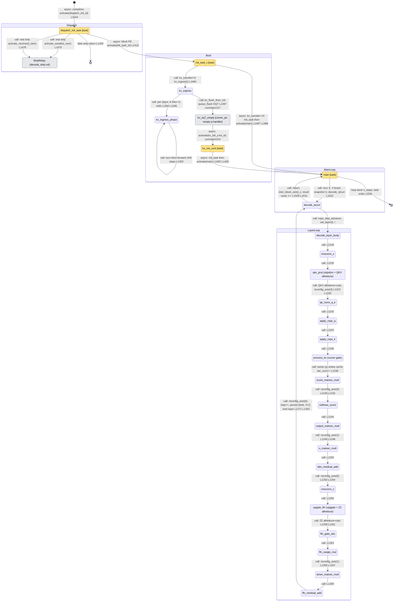

**Links:** detail doc → [qwen3_1p7b-e2e.decode-decode.statemachine.md](../../assets/kernel-algo/qwen3_1p7b-e2e.decode-decode.statemachine.md) · rendered SVG → [qwen3_1p7b-e2e.decode-decode.statemachine.svg](../../assets/kernel-algo/qwen3_1p7b-e2e.decode-decode.statemachine.svg)

## `decode/decode_strip.csl` — decode strip/helper PE

Edge/IO strip in the decode band.

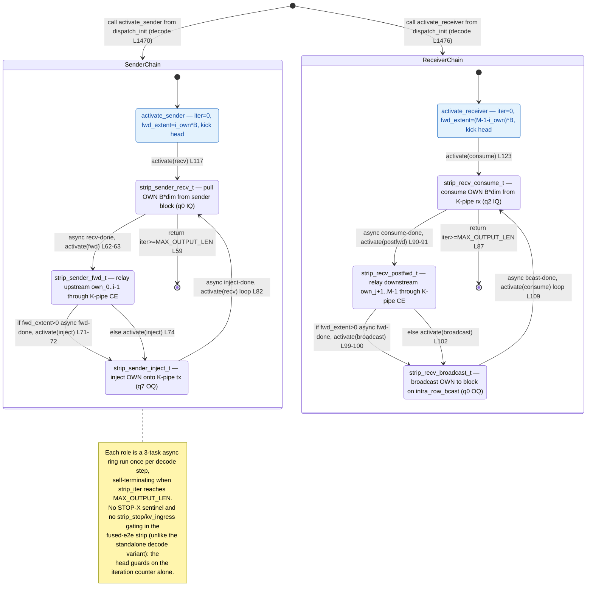

**Links:** detail doc → [qwen3_1p7b-e2e.decode-decode_strip.statemachine.md](../../assets/kernel-algo/qwen3_1p7b-e2e.decode-decode_strip.statemachine.md) · rendered SVG → [qwen3_1p7b-e2e.decode-decode_strip.statemachine.svg](../../assets/kernel-algo/qwen3_1p7b-e2e.decode-decode_strip.statemachine.svg)

## `decode/demux.csl` — decode token ingress peel

Peel/forward chain, per-iteration re-arm.

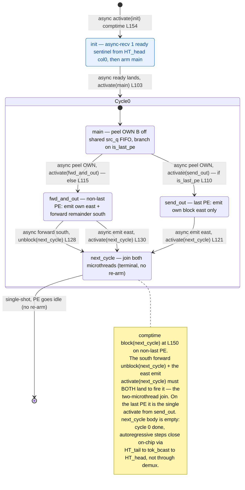

**Links:** detail doc → [qwen3_1p7b-e2e.decode-demux.statemachine.md](../../assets/kernel-algo/qwen3_1p7b-e2e.decode-demux.statemachine.md) · rendered SVG → [qwen3_1p7b-e2e.decode-demux.statemachine.svg](../../assets/kernel-algo/qwen3_1p7b-e2e.decode-demux.statemachine.svg)

## `decode/ht_head.csl` — decode embedding LUT

Vocab-rotation ring; per-iteration ingress re-arm.

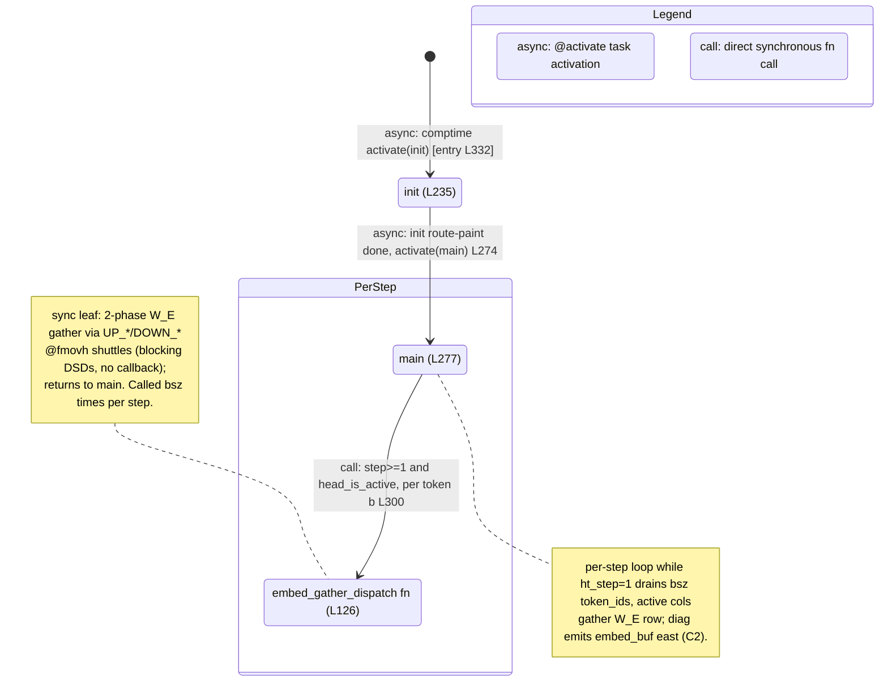

**Links:** detail doc → [qwen3_1p7b-e2e.decode-ht_head.statemachine.md](../../assets/kernel-algo/qwen3_1p7b-e2e.decode-ht_head.statemachine.md) · rendered SVG → [qwen3_1p7b-e2e.decode-ht_head.statemachine.svg](../../assets/kernel-algo/qwen3_1p7b-e2e.decode-ht_head.statemachine.svg)

## `decode/ht_tail.csl` — decode output head

RMSNorm to lm_head GEMV to top-K to sampling; owns the running decode tokens.

```mermaid
stateDiagram-v2
    state "tail_init task (L1057)" as tail_init
    state "tail_main task (L1144)" as tail_main

    [*] --> tail_init : async comptime activate(tail_init) [entry L1247]
    tail_init --> tail_main : async activate(tail_main) L1138
    tail_main --> [*] : loop done, task terminates [single-shot, no re-arm]

    state tail_init {
        state "derive coords + Y/X chain ids (L1058-1069)" as ti_derive
        state "write_Y_routes_tail fn (L414)" as ti_wY
        state "paint static routes: north tok L1076/1078, z_drain L1087/1089, south L1097/1099, xready barrier L1105; seed PRNG L1131; enable TSC L1135" as ti_routes
        [*] --> ti_derive
        ti_derive --> ti_wY : call write_Y_routes_tail() L1071
        ti_wY --> ti_routes : return
        ti_routes --> [*]
    }

    state tail_main {
        state "TSC start (is_tsc_pe, tail_step==warmup): sample start L1149" as st_tsc_start
        state "drain Z: fmovh z_slice from z_recv L1152" as st_drainZ
        state "north emit L1190: sampled token to HT_head (skip last step)" as st_north
        state "south emit L1199: root east-most topk_val+arg+pred to mux OQ0 (every step)" as st_south
        state "TSC end (is_tsc_pe, last iter): sample end + async mov32 burst L1216" as st_tsc_end

        [*] --> st_tsc_start : loop iter (tail_step < n_steps) L1145
        st_tsc_start --> st_drainZ
        st_drainZ --> st_rmsnorm : event Z arrives, call tail_final_rmsnorm() L1155

        state st_rmsnorm {
            state "phase1 per-batch local sumsq (L354-375)" as rn_sumsq
            state "tail_reduce_bsz_f32 fn (L729), Y allreduce + bcast" as rn_reduce
            state "phase3 normalize + cast + mul W_final_norm (L382-409)" as rn_norm
            [*] --> rn_sumsq
            rn_sumsq --> rn_reduce : call tail_reduce_bsz_f32() L378
            rn_reduce --> rn_norm : return
            rn_norm --> [*]
        }

        st_rmsnorm --> st_lmhead : call tail_lm_head_matvec() L1157

        state st_lmhead {
            state "vecmat_computation_lm fn (L307)" as lm_vecmat
            state "gemv_lm_step fmachs (L302) via map, loop bsz x V_per_pe_x" as lm_step
            [*] --> lm_vecmat : call vecmat_computation_lm() L337
            lm_vecmat --> lm_step : map over left_vector L319
            lm_step --> lm_step : per-K fmachs accumulate
            lm_step --> [*] : per-batch done L312
        }

        st_lmhead --> st_logred : call tail_logits_reduce_bsz_vocab() L1159

        state st_logred {
            state "tail_logits_reduce_bsz_vocab fn (L650): Y 2-phase reduce, NO broadcast" as lr_reduce
            [*] --> lr_reduce
            lr_reduce --> [*] : logits land on root_2nd_phase row only
        }

        st_logred --> st_topk : root row (tail_my_py==root_2nd_phase) L1164
        st_logred --> st_north : non-root row skip top-K

        state st_topk {
            state "write_X_routes_tail fn (L526): repaint reduce colors Y to X" as tk_wX
            state "xready barrier: root_2nd_phase_x sends go L1170 / others recv L1172 (event)" as tk_barrier
            state "tail_local_topk fn (L817): K masked-argmax passes, loop bsz" as tk_local
            state "tail_topk_mergereduce_x fn (L871): X 2-phase reduce, per-hop merge + bcast" as tk_merge
            state "topk_merge_local fn (L845): 2-pointer K-list merge, loop bsz" as tk_mergefn
            state "tail_sample_token fn (L1000): softmax, top-p, PRNG draw (root_2nd_phase_x only)" as tk_sample
            state "predtok X-bcast L1180 send / L1182 recv" as tk_predbcast
            state "write_Y_routes_tail fn (L414): restore Y routes" as tk_wY
            [*] --> tk_wX : call write_X_routes_tail() L1165
            tk_wX --> tk_barrier : return
            tk_barrier --> tk_local : call tail_local_topk() L1174
            tk_local --> tk_merge : call tail_topk_mergereduce_x() L1175
            tk_merge --> tk_mergefn : call topk_merge_local() per hop L877
            tk_mergefn --> tk_merge : return per hop
            tk_merge --> tk_sample : call tail_sample_token() if root_2nd_phase_x L1179
            tk_merge --> tk_predbcast : else recv bcast L1182
            tk_sample --> tk_predbcast : return + send bcast L1180
            tk_predbcast --> tk_wY : call write_Y_routes_tail() L1184
            tk_wY --> [*]
        }

        st_topk --> st_north : proceed
        st_north --> st_south
        st_south --> st_tsc_end : is_tsc_pe and tail_step==MAX_OUTPUT_LEN-1 L1208
        st_south --> st_tsc_start : while tail_step<n_steps, next step L1145
        st_south --> [*] : loop done (non-tsc last step)
        st_tsc_end --> [*] : loop done (tsc last step)
    }

    note right of st_drainZ
        Event-driven fabric parks (not activate/block):
        z_recv L1152, xready recv L1172.
    end note
    note left of st_tsc_end
        Fire-and-forget async send (no callback, not an
        activation edge): TSC burst L1216 (last iter).
    end note

    state Legend {
        state "async: microthread callback / activate (scheduling edge)" as L1
        state "call: direct synchronous fn call (same stack)" as L2
        state "event: blocking fabric recv park (not activate/block)" as L3
    }
```

**Links:** detail doc → [qwen3_1p7b-e2e.decode-ht_tail.statemachine.md](../../assets/kernel-algo/qwen3_1p7b-e2e.decode-ht_tail.statemachine.md) · rendered SVG → [qwen3_1p7b-e2e.decode-ht_tail.statemachine.svg](../../assets/kernel-algo/qwen3_1p7b-e2e.decode-ht_tail.statemachine.svg)

## `decode/comm_pe.csl` — decode comm library (no main)

Per-collective sub-machines; all_reduce variants + reconfig.

```mermaid
stateDiagram-v2
    %% qwen3_1p7b-e2e DECODE-phase comm_pe.csl — library, NO single main, NO tasks.
    %% One sub-machine per collective driver; the only async machine is the
    %% one-shot KV-ingress OQ7/IQ7 rebind.

    %% ================= INIT (boot, called once from decode.csl init) =============
    state Init {
        state "init (L617)" as init
        state "precompute_route_words (L586)" as precompute_route_words
        state "write_intra_row_bcast_routes (L564)" as write_intra
        [*] --> init : boot (decode dispatch_init_task activates init)
        init --> precompute_route_words : call: L649
        init --> write_Y_routes : call: boot Y-active L650
        init --> write_intra : call: L651
    }
    note right of init
        get_params from route_calc (L625); then inline set_route_2tx for
        INTER_A / INTER_B colors (L652-653). Strip PEs never run init
        (dispatch_init_task in decode.csl gates the activate) L618-619.
    end note

    %% ================= RECONFIG route machine (the ONE route-switch) =============
    state Reconfig {
        state "reconfig_allreduce_axis (L1295)" as reconfig
        state "write_Y_routes (L545)" as write_Y_routes
        state "write_X_routes (L537)" as write_X_routes
        state "write_X_kv_head_routes (L555)" as write_X_kv_head_routes
        state "apply_route_word / set_route_1tx / set_route_2tx (L509-518)" as route_leaves
        [*] --> reconfig
        reconfig --> write_Y_routes : call: axis==0 dim L1296
        reconfig --> write_X_routes : call: axis==1 head L1298
        reconfig --> write_X_kv_head_routes : call: axis==3 kv-head L1300
        write_Y_routes --> route_leaves : call: apply_route_word x5
        write_X_routes --> route_leaves : call: apply_route_word x5
        write_X_kv_head_routes --> route_leaves : call: apply_route_word x3
    }
    note right of reconfig
        C1 safety: repaints SHARED reduce/bcast colors with no barrier.
        Race-free ONLY because every all_reduce_* is synchronous and
        ends in a multi-tx broadcast (self-fencing). axis else asserts.
    end note

    %% ================= TWO-PHASE ALL-REDUCE (P-block, Y/X axis) ==================
    state AllReduce_TwoPhase {
        state "all_reduce_bsz_f32 (L658)" as ar_f32
        state "all_reduce_bsz_dim (L1008)" as ar_dim
        state "all_reduce_bsz_dim_QKV_fusion (L1088)" as ar_qkv
        state "all_reduce_bsz_ffn_dim_ZZ_fusion (L1168)" as ar_zz
        state "all_reduce_bsz_g (L740)" as ar_g
        state "all_reduceMax_bsz_g (L821)" as ar_max
        state two_phase_body {
            state "1st-phase reduce (remainder chain to root_1st)" as p1
            state "2nd-phase reduce (quotient chain to root_2nd)" as p2
            state "broadcast (root_2nd mov32/mov16 fanout)" as p3
            [*] --> p1
            p1 --> p2 : sync: straight-line
            p2 --> p3 : sync: straight-line
            p3 --> [*] : sync: bcast done (self-fencing)
        }
        [*] --> ar_f32 : RMSNorm sumsq entry (fp32)
        [*] --> ar_dim : hidden X/Z reduce entry
        [*] --> ar_qkv : QKV-fusion reduce entry
        [*] --> ar_zz : FFN gate+up (ZZ) reduce entry
        [*] --> ar_g : softmax sum entry
        [*] --> ar_max : softmax max entry (fmaxh/mov16)
        ar_f32 --> two_phase_body : sync: inline phases
        ar_dim --> two_phase_body : sync: inline phases
        ar_qkv --> two_phase_body : sync: inline phases
        ar_zz --> two_phase_body : sync: inline phases
        ar_g --> two_phase_body : sync: inline phases
        ar_max --> two_phase_body : sync: max variant
    }

    %% ================= BAND-SCOPED ALL-REDUCE (kv-head, single-chain) ============
    state AllReduce_Band {
        state "all_reduce_bsz_g_seq_len_kv_head_scoped (L904)" as ar_score
        state "all_reduce_qk_kv_head_scoped (L960)" as ar_qk
        state band_body {
            state "band chain to kv_head_root (pes_per_kv_head gt 1)" as bp1
            state "band-scoped broadcast (kv_head_root mov32)" as bp2
            [*] --> bp1
            bp1 --> bp2 : sync: straight-line
            bp2 --> [*] : sync: bcast done
        }
        [*] --> ar_score : attn score reduce entry
        [*] --> ar_qk : QK-Norm sumsq entry
        ar_score --> band_body : sync: inline
        ar_qk --> band_body : sync: inline
    }
    note right of ar_qk
        no-op when pes_per_kv_head == 1 (single PE per
        kv-head already holds the full sum) L912,946,966,999
    end note

    %% ================= INTER-REGION pipeline stages (sync leaves) ================
    state InterRegionPipeline {
        state "inter_block_recv_x_sync (L1254)" as recv_x
        state "intra_block_x_broadcast_y_bsz_dim (L1268)" as bcast_x
        state "inter_block_send_z (L1279)" as send_z
        [*] --> recv_x : chain X-recv entry (has_inter_recv)
        [*] --> bcast_x : Y-broadcast entry (intra_row_bcast_color)
        [*] --> send_z : chain Z-send entry (has_inter_send)
    }
    note right of send_z
        three independent sync leaves; the recv to compute to bcast
        to send ordering is decode.csl-sequenced, not here.
    end note

    %% ================= KV-INGRESS REBIND (the only async machine) ================
    state KVIngressRebind {
        state "kv_flush_then_init (L1316)" as flush_init
        state "kv_oq7_empty (L1310)" as oq_empty
        [*] --> flush_init : startup ingress done (decode.csl calls)
        flush_init --> oq_empty : async: queue_flush OQ7 to empty L1317
        oq_empty --> ext_kv_init : async: rebind OQ7/IQ7 to bcast then activate L1311-1314
    }
    note right of oq_empty
        empty-queue handler: re-encode OQ7 and IQ7 to broadcast_color,
        tile_config queue_flush.exit, then activate(kv_init_cont_id).
    end note

    %% ================= EXTERNAL continuation (in decode.csl) =====================
    state "ext: kv_init_cont_id (decode)" as ext_kv_init

    %% ================= LEGEND ====================================================
    state Legend {
        state "call:  direct synchronous fn call" as Lc
        state "async: queue_flush drain to empty-queue handler OR activate(id)" as La
        state "ext:   continuation task bound in decode.csl" as Le
        state "comptime: initialize_queue for all reduce/bcast/inter queues; when kv_transfer, OQ7/IQ7 boot on xfer colors and OQ7 gets set_empty_queue_handler(kv_oq7_empty) L1320-1356; NO tasks, NO block, NO microthreads" as Lcomp
    }
```

**Links:** detail doc → [qwen3_1p7b-e2e.decode-comm_pe.statemachine.md](../../assets/kernel-algo/qwen3_1p7b-e2e.decode-comm_pe.statemachine.md) · rendered SVG → [qwen3_1p7b-e2e.decode-comm_pe.statemachine.svg](../../assets/kernel-algo/qwen3_1p7b-e2e.decode-comm_pe.statemachine.svg)

## `decode/mux.csl` — decode egress

Serialize through a collector PE to host.

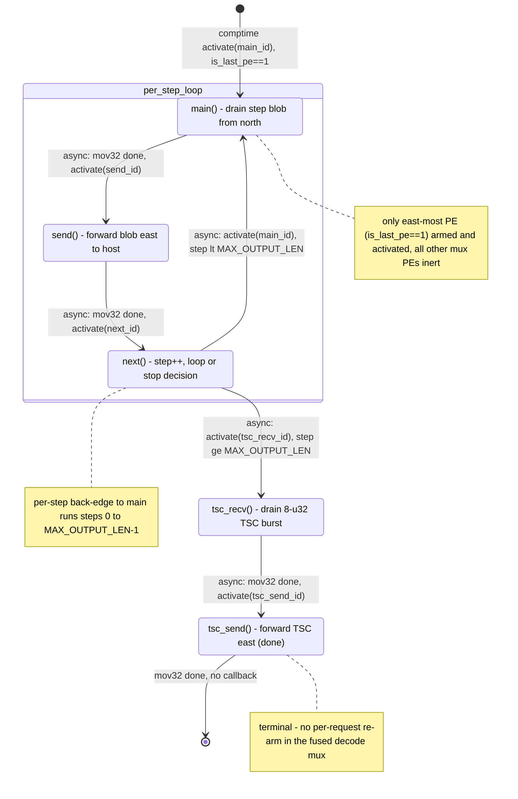

**Links:** detail doc → [qwen3_1p7b-e2e.decode-mux.statemachine.md](../../assets/kernel-algo/qwen3_1p7b-e2e.decode-mux.statemachine.md) · rendered SVG → [qwen3_1p7b-e2e.decode-mux.statemachine.svg](../../assets/kernel-algo/qwen3_1p7b-e2e.decode-mux.statemachine.svg)

## `prefill/prefill.csl` — prefill main compute PE

Serpentine layers, dispatch hub, Cannon shift-MAC, chunked attention. e2e fork drops flash_combine vs standalone.

```mermaid
stateDiagram-v2
    classDef task fill:#fde68a,stroke:#b45309,color:#111
    classDef comm fill:#bae6fd,stroke:#0369a1,color:#111

    [*] --> init_task : async: comptime activate(init_id) L1256

    state Boot {
        state "init_task [task]" as init_task
        state "enter_x_chain" as enter_x_chain
        state "x_chain_recv_finish [task]" as x_chain_recv_finish
        state "x_chain_fwd_finish [task]" as x_chain_fwd_finish
        init_task --> enter_x_chain : call: is_x_receiver block 0 L1222
        enter_x_chain --> x_chain_recv_finish : async: mov16 recv done L664
        x_chain_recv_finish --> x_chain_fwd_finish : async: fwd-mov done or activate if last col L669 L671
    }
    init_task --> start_layers : call: interior block after enter_dest_shuttle L1229
    x_chain_fwd_finish --> start_layers : call: X in place L678

    state LayerMachine {
        state "start_layers" as start_layers
        state "prefill_struct (14-flag hub)" as prefill_struct
        state "rmsnorm_full" as rmsnorm_full
        state "p_qkv_matmul" as p_qkv_matmul
        state "p_qk_norm_q" as p_qk_norm_q
        state "p_qk_norm_k" as p_qk_norm_k
        state "p_rope_q" as p_rope_q
        state "p_rope_k (+cache_kv)" as p_rope_k
        state "p_attn_score" as p_attn_score
        state "p_o_matmul" as p_o_matmul
        state "p_z_residual" as p_z_residual
        state "p_rmsnorm_z" as p_rmsnorm_z
        state "p_upgate_matmul" as p_upgate_matmul
        state "p_swiglu" as p_swiglu
        state "p_down_matmul" as p_down_matmul
        state "p_ffn_residual_next_layer" as p_ffn_residual_next_layer

        start_layers --> prefill_struct : call: layer 0 flag 0 L1215
        prefill_struct --> rmsnorm_full : call: flag 0 attn-norm L1195
        prefill_struct --> p_qkv_matmul : call: flag 1 L1196
        prefill_struct --> p_qk_norm_q : call: flag 2 L1197
        prefill_struct --> p_qk_norm_k : call: flag 3 L1198
        prefill_struct --> p_rope_q : call: flag 4 L1199
        prefill_struct --> p_rope_k : call: flag 5 L1200
        prefill_struct --> p_attn_score : call: flag 6 L1201
        prefill_struct --> p_o_matmul : call: flag 7 L1202
        prefill_struct --> p_z_residual : call: flag 8 L1203
        prefill_struct --> p_rmsnorm_z : call: flag 9 L1204
        prefill_struct --> p_upgate_matmul : call: flag 10 L1205
        prefill_struct --> p_swiglu : call: flag 11 L1206
        prefill_struct --> p_down_matmul : call: flag 12 L1207
        prefill_struct --> p_ffn_residual_next_layer : call: flag 13 else L1208

        rmsnorm_full --> prefill_struct : call: return next flag L1195
        p_qk_norm_q --> prefill_struct : call: return L829
        p_qk_norm_k --> prefill_struct : call: return L871
        p_rope_q --> prefill_struct : call: return L875
        p_rope_k --> prefill_struct : call: return L880
        p_z_residual --> prefill_struct : call: return L1153
        p_rmsnorm_z --> rmsnorm_full : call: rmsnorm(Z) L1157
        p_swiglu --> prefill_struct : call: return L1166
        p_ffn_residual_next_layer --> prefill_struct : call: more layers set_layer flag 0 L1177
    }

    state Cannon {
        state "setup_matmul" as setup_matmul
        state "left_matrix_shift_callback" as left_matrix_shift_callback
        state "matmul_compute" as matmul_compute
        state "left_matrix_finish [task]" as left_matrix_finish
        state "right_matrix_finish [task]" as right_matrix_finish
        state "two_hop_comm_finish [task]" as two_hop_comm_finish
        state "next_step [task]" as next_step

        setup_matmul --> left_matrix_shift_callback : call: kick skew L537
        left_matrix_shift_callback --> left_matrix_shift_callback : async: skew hop under mm_root L547 commpe708
        left_matrix_shift_callback --> matmul_compute : call: skew done L556
        matmul_compute --> left_matrix_finish : async: two_hop_comm left operand L565 commpe737
        matmul_compute --> right_matrix_finish : async: two_hop_comm right operand L565 commpe739
        matmul_compute --> next_step : async: activate(next_step) gated L580
        left_matrix_finish --> two_hop_comm_finish : gate: unblock(two_hop_comm_finish) L593
        right_matrix_finish --> two_hop_comm_finish : async: activate(two_hop_comm_finish) L597
        two_hop_comm_finish --> next_step : gate: unblock(next_step) L601
        next_step --> matmul_compute : call: mm_mode 0 next P-step L605
    }
    p_qkv_matmul --> setup_matmul : call: X_norm at QKV to XQKV L824
    p_o_matmul --> setup_matmul : call: attn_out at O to h1 L1149
    p_upgate_matmul --> setup_matmul : call: Z_norm at UPGATE L1161
    p_down_matmul --> setup_matmul : call: z3 at DOWN L1169
    matmul_compute --> prefill_struct : call: Cannon done step eq P L587

    state Attention {
        state "p_attn_softmax" as p_attn_softmax
        state "attn_score_step" as attn_score_step
        state "attn_finish [task]" as attn_finish
        state "p_attn_scorev" as p_attn_scorev
        state "scorev_score_preskew" as scorev_score_preskew
        state "scorev_v_preskew_step" as scorev_v_preskew_step
        state "scorev_compute" as scorev_compute

        attn_score_step --> attn_finish : async: Q Kt K X-hop step under P L1010 commpe597
        attn_finish --> attn_score_step : call: stage 0 K-hop loop L1138
        attn_score_step --> p_attn_softmax : call: K-hops done L1018
        p_attn_softmax --> p_attn_scorev : call: Stage B done L1048
        p_attn_scorev --> scorev_score_preskew : call: Stage C start L1068
        scorev_score_preskew --> left_matrix_shift_callback : async: band-Y preskew shift L1076 commpe708
        left_matrix_shift_callback --> scorev_score_preskew : call: mm_mode 1 preskew loop L541
        scorev_score_preskew --> scorev_v_preskew_step : call: band preskew done stage 2 L1081
        scorev_v_preskew_step --> attn_finish : async: V full-X preskew hop L1089 commpe597
        attn_finish --> scorev_v_preskew_step : call: stage 2 V-preskew loop L1138
        scorev_v_preskew_step --> scorev_compute : call: preskew done L1094
        scorev_compute --> next_step : async: activate(next_step) ring step L1124
        next_step --> scorev_compute : call: mm_mode 1 ring step L605
    }
    p_attn_score --> attn_score_step : call: Stage A start L1146
    scorev_compute --> prefill_struct : call: ring done step eq P restore_x_band flag 7 L1132

    state PerBlockEnd {
        state "emit_z_last_token" as emit_z_last_token
        state "start_kv_transfer" as start_kv_transfer
        state "kv_step [task]" as kv_step
        start_kv_transfer --> kv_step : async: kv_flush_70_then_step activate(kv_step) L764 commpe860
        kv_step --> kv_step : async: state advance kv_flush_then_step activate(kv_step) L800 commpe860
    }
    p_ffn_residual_next_layer --> emit_z_last_token : call: last layer is_z_sender east col L1185
    p_ffn_residual_next_layer --> start_kv_transfer : call: last layer kv_transfer after shuttle L1188
    emit_z_last_token --> start_kv_transfer : call: kv_transfer set L1188
    p_ffn_residual_next_layer --> [*] : call: last layer out_shuttle no kv_transfer L1182
    kv_step --> [*] : call: state 4 north-shift into decode L801

    class init_task,x_chain_recv_finish,x_chain_fwd_finish task
    class left_matrix_finish,right_matrix_finish,two_hop_comm_finish,next_step task
    class attn_finish,kv_step task
```

**Links:** detail doc → [qwen3_1p7b-e2e.prefill-prefill.statemachine.md](../../assets/kernel-algo/qwen3_1p7b-e2e.prefill-prefill.statemachine.md) · rendered SVG → [qwen3_1p7b-e2e.prefill-prefill.statemachine.svg](../../assets/kernel-algo/qwen3_1p7b-e2e.prefill-prefill.statemachine.svg)

## `prefill/ht_head.csl` — prefill embedding LUT

Richer than standalone (12 task-decls / 9 activation sites).

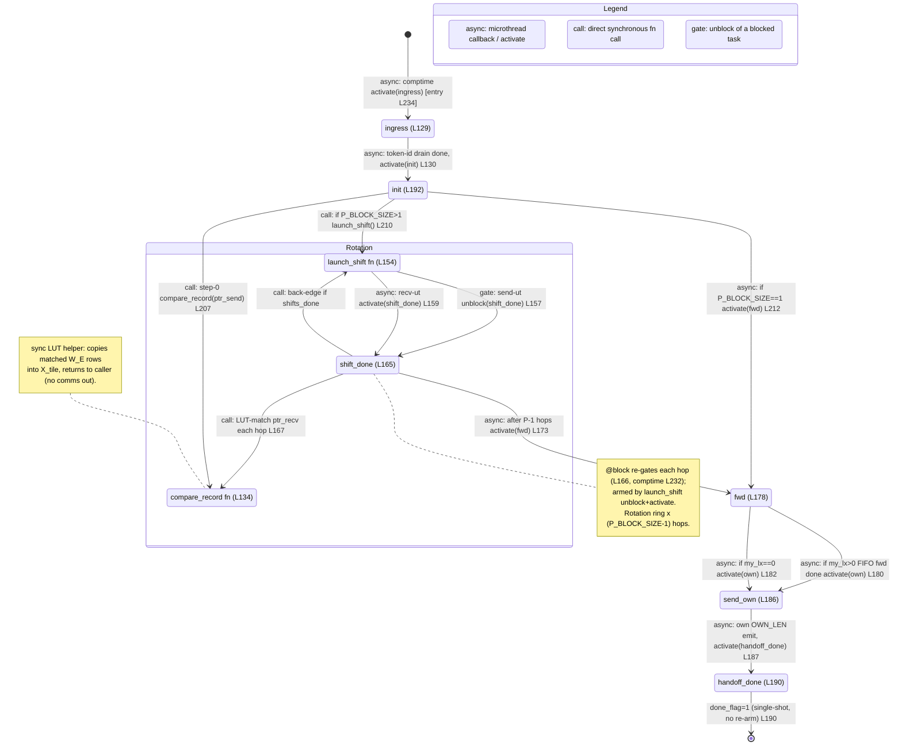

**Links:** detail doc → [qwen3_1p7b-e2e.prefill-ht_head.statemachine.md](../../assets/kernel-algo/qwen3_1p7b-e2e.prefill-ht_head.statemachine.md) · rendered SVG → [qwen3_1p7b-e2e.prefill-ht_head.statemachine.svg](../../assets/kernel-algo/qwen3_1p7b-e2e.prefill-ht_head.statemachine.svg)

## `prefill/ht_tail.csl` — prefill output head

Samples its OWN first token (not a passthrough); ONE-SHOT, no re-arm; two self-contained Y-reductions.

```mermaid
stateDiagram-v2
    state "tail_init task (L1057)" as tail_init
    state "tail_main task (L1150)" as tail_main

    [*] --> tail_init : async comptime activate(tail_init) [entry L1246]
    tail_init --> tail_main : async activate(tail_main) L1143

    state tail_init {
        state "derive coords + Y/X chain ids (L1058-1065)" as ti_derive
        state "write_Y_routes_tail fn (L417)" as ti_wY
        state "paint static routes: Z-drain L1075, south L1084, xready L1094, kickoff L1126; seed PRNG L1119; enable TSC L1140" as ti_routes
        [*] --> ti_derive
        ti_derive --> ti_wY : call write_Y_routes_tail() L1067
        ti_wY --> ti_routes : return
        ti_routes --> [*]
    }

    state tail_main {
        state "TSC start (is_tsc_pe): park on kickoff sentinel L1156, sample start L1157" as tm_tsc_start
        state "drain Z: fmovh z_slice from z_recv L1160" as tm_drainZ
        state "tail_final_rmsnorm fn (L350): fp32 sumsq, Y-allreduce+bcast, normalize x W" as tm_rmsnorm
        state "tail_lm_head_matvec fn (L332): local GEMV partials = lm_head @ Z" as tm_lmhead
        state "tail_logits_reduce_bsz_vocab fn (L653): Y 2-phase reduce, NO bcast" as tm_logred
        state "south emit L1197 (x==HT_WIDTH-1 and root row): topk_val + topk_arg + pred_token to mux OQ0" as tm_south
        state "TSC end (is_tsc_pe): sample end L1207, async mov32 8-u32 burst to OQ0 L1214" as tm_tsc_end

        [*] --> tm_tsc_start
        tm_tsc_start --> tm_drainZ : event kickoff sentinel (is_tsc_pe) / else fall through
        tm_drainZ --> tm_rmsnorm : event Z arrives from last block

        state tm_rmsnorm {
            state "phase1 per-batch local sumsq (L357)" as rn_sumsq
            state "tail_reduce_bsz_f32 fn (L732): Y 2-phase reduce + bcast, fp32" as rn_wrap
            state "phase3 normalize + cast + mul W_final_norm (L385)" as rn_norm
            [*] --> rn_sumsq
            rn_sumsq --> rn_wrap : call tail_reduce_bsz_f32() L381
            rn_wrap --> rn_norm : return
            rn_norm --> [*]
        }

        tm_rmsnorm --> tm_lmhead : call tail_lm_head_matvec() L1165

        state tm_lmhead {
            state "vecmat_computation_lm fn (L310)" as lm_vecmat
            state "gemv_lm_step fmachs (L305) via map, loop bsz x dim_per_pe" as lm_step
            [*] --> lm_vecmat : call vecmat_computation_lm() L340
            lm_vecmat --> lm_step : map over left_vector L322
            lm_step --> lm_step : per-K fmachs accumulate
            lm_step --> [*] : per-batch done L315
        }

        tm_lmhead --> tm_logred : call tail_logits_reduce_bsz_vocab() L1167

        state tm_logred {
            state "self-contained Y 2-phase reduce (L657-723), len bsz x V_per_pe_x, no bcast" as lr_reduce
            [*] --> lr_reduce
            lr_reduce --> [*] : logits land on root_2nd_phase row
        }

        tm_logred --> tm_topk : call if tail_my_py==root_2nd_phase L1172
        tm_logred --> tm_south : else (non-root rows skip top-K)

        state tm_topk {
            state "write_X_routes_tail fn (L529): repaint reduce colors Y to X" as tk_wX
            state "xready barrier L1177: root_2nd_phase_x sends go / others recv (event)" as tk_barrier
            state "tail_local_topk fn (L820): loop bsz x TOP_K masked-argmax" as tk_local
            state "tail_topk_mergereduce_x fn (L874): X 2-phase reduce, per-hop merge + bcast" as tk_merge
            state "topk_merge_local fn (L848): 2-pointer K-list merge, loop bsz" as tk_mergefn
            state "tail_sample_token fn (L1003): softmax, top-p, PRNG draw (root_2nd_phase_x only)" as tk_sample
            state "predtok X-bcast L1188 / recv L1190" as tk_predbcast
            state "write_Y_routes_tail fn (L417): restore Y routes" as tk_wY
            [*] --> tk_wX : call write_X_routes_tail() L1173
            tk_wX --> tk_barrier : return
            tk_barrier --> tk_local : call tail_local_topk() L1182
            tk_local --> tk_merge : call tail_topk_mergereduce_x() L1183
            tk_merge --> tk_mergefn : call topk_merge_local() per hop L880
            tk_mergefn --> tk_merge : return per hop
            tk_merge --> tk_sample : call tail_sample_token() if root_2nd_phase_x L1187
            tk_sample --> tk_predbcast : return
            tk_predbcast --> tk_wY : call write_Y_routes_tail() L1192
            tk_wY --> [*]
        }

        tm_topk --> tm_south : proceed
        tm_south --> tm_tsc_end : if is_tsc_pe L1206
        tm_south --> [*] : else exit (one-shot, no re-arm)
        tm_tsc_end --> [*]
    }

    note right of tm_drainZ
        Event-driven fabric parks (not activate/block):
        kickoff L1156, z_recv L1160, xready L1180.
    end note
    note right of tm_rmsnorm
        Two reduces, two SELF-CONTAINED fns (no shared
        tail_reduce_2phase): tail_reduce_bsz_f32 (L732,
        bcast, bsz) vs tail_logits_reduce_bsz_vocab
        (L653, no bcast, bsz x V_per_pe_x).
    end note
    note left of tk_merge
        X merge-reduce loops per hop; each hop recvs KB
        val + KB id, merges via topk_merge_local, sends.
    end note
    note right of tm_tsc_end
        E2E PREFILL is ONE-SHOT: tail_main does NOT
        re-arm. It samples the prefill's first token
        once; decode owns all subsequent tokens.
    end note

    state Legend {
        state "async: microthread callback / activate (scheduling edge)" as L1
        state "call: direct synchronous fn call (same stack)" as L2
        state "event: blocking fabric recv park (not activate/block)" as L3
    }
```

**Links:** detail doc → [qwen3_1p7b-e2e.prefill-ht_tail.statemachine.md](../../assets/kernel-algo/qwen3_1p7b-e2e.prefill-ht_tail.statemachine.md) · rendered SVG → [qwen3_1p7b-e2e.prefill-ht_tail.statemachine.svg](../../assets/kernel-algo/qwen3_1p7b-e2e.prefill-ht_tail.statemachine.svg)

## `prefill/comm_pe.csl` — prefill comm library (no main)

Per-collective sub-machines (all-reduce, Cannon, band reduce, shuttle, reconfig).

```mermaid
stateDiagram-v2
    %% qwen3_1p7b-e2e PREFILL comm_pe.csl — library, NO single main; one sub-machine per collective driver.
    %% e2e fork: FA-2 flash_combine ABSENT; adds the KV-cache transfer machine (prefill->decode).

    %% ================= INIT (boot, called once from prefill init) =================
    state Init {
        state "init (L210)" as init
        state "precompute_route_words (L196)" as precompute_route_words
        state "precompute_attn_root_words (L397)" as precompute_attn_root_words
        [*] --> init : boot (prefill init calls it)
        init --> precompute_route_words : call: L233
        init --> precompute_attn_root_words : call: per-root kv-band words L234
        init --> write_full_routes : call: boot full-reduce active L235
        init --> reconfig : call: reconfig(SH_OUT/IN) if hop L241,242
        init --> rebind_shuttle_7_0 : call: if first hop E/W L245
    }

    %% ================= RECONFIG route machine (the ONE route-switch) =============
    state Reconfig {
        state "reconfig (L256)" as reconfig
        state "write_full_routes (L170)" as write_full_routes
        state "write_Q_band_routes (L175)" as write_Q_band_routes
        state "write_K_band_routes (L180)" as write_K_band_routes
        [*] --> reconfig
        reconfig --> write_full_routes : call: RECFG_FULL L257
        reconfig --> write_Q_band_routes : call: RECFG_Q L258
        reconfig --> write_K_band_routes : call: RECFG_K L259
    }
    note right of reconfig
        RECFG_SH_OUT / RECFG_SH_IN paint this block's
        shuttle hop route INLINE (parity + block-edge
        guards, apply_route_word) L261-290
    end note

    %% ================= ALL-REDUCE (one-phase full-col / Q,K band) ================
    state AllReduce {
        state "all_reduce_full (L297)" as all_reduce_full
        state "all_reduce_q_band (L359)" as all_reduce_q_band
        state "all_reduce_k_band (L362)" as all_reduce_k_band
        [*] --> all_reduce_full : RMSNorm full-col entry
        [*] --> all_reduce_q_band : QK-Norm Q-band entry
        [*] --> all_reduce_k_band : QK-Norm K-band entry
        state all_reduce_band {
            state "chain toward band_root (L317-348)" as ar_chain
            state "band broadcast-back (L350-356)" as ar_bcast
            [*] --> ar_chain
            ar_chain --> ar_bcast : sync: fadds/fmovs chain done
            ar_bcast --> [*] : sync: mov32 bcast done
        }
        all_reduce_full --> all_reduce_band : call: full col, root_2nd_phase L298
        all_reduce_q_band --> all_reduce_band : call: Q band, q_head_root L360
        all_reduce_k_band --> all_reduce_band : call: K band, kv_head_root L363
    }

    %% ================= GQA ATTENTION band reduces (Q@Kt / softmax) ===============
    state GQA_Attention {
        state "attn_score_reduce (L411)" as attn_score_reduce
        state "restore_k_band_routes (L498)" as restore_k_band_routes
        state "attn_vec_allreduce (L458)" as attn_vec_allreduce
        state "attn_right_hop (L583)" as attn_right_hop
        [*] --> attn_score_reduce : Q@Kt score reduce entry (stage A)
        [*] --> attn_vec_allreduce : softmax max/sum entry (stage B)
        [*] --> attn_right_hop : K|V X-hop entry
        attn_score_reduce --> attn_score_reduce : call: per key-block step, cycling root, repaint on change L418-422
        attn_score_reduce --> restore_k_band_routes : call: after root cycling
        restore_k_band_routes --> write_K_band_routes : call: L499
        attn_vec_allreduce --> attn_vec_allreduce : call: max then sum (driver)
    }
    attn_right_hop --> ext_attn_finish : async: activate/unblock L587,588,596,597

    %% ================= MeshGEMM two-hop matmul comm (Cannon) =====================
    state MeshGEMM {
        state "left_matrix_shift (L694)" as left_matrix_shift
        state "left_matrix_shift_finish (L685)" as left_matrix_shift_finish
        state "two_hop_comm (L712)" as two_hop_comm
        [*] --> left_matrix_shift : skew entry (P/2 hops)
        [*] --> two_hop_comm : systolic step entry (P steps)
        left_matrix_shift --> left_matrix_shift : call: skew loop, P/2 hops (driver)
        left_matrix_shift --> left_matrix_shift_finish : async: activate/unblock L698,699,707,708
        left_matrix_shift_finish --> left_matrix_shift_finish : block: re-arm self L686
        two_hop_comm --> two_hop_comm : call: systolic loop, P steps (driver)
        two_hop_comm --> ext_left_finish : async: activate/unblock L720,721,737,738
        two_hop_comm --> ext_right_finish : async: activate/unblock L722,723,739,740
    }
    left_matrix_shift_finish --> ext_left_shift_cb : call: L687

    %% ================= SCORE x V band-shift (borrows reduce queues 5,6,1) ========
    state ScoreV_Band {
        state "rebind_x_to_band (L568)" as rebind_x_to_band
        state "paint_band_routes (L525)" as paint_band_routes
        state "restore_x_band (L576)" as restore_x_band
        [*] --> rebind_x_to_band : band-shift entry
        [*] --> restore_x_band : band-shift exit
        rebind_x_to_band --> paint_band_routes : call: 3-color interleave + band routes L569
        rebind_x_to_band --> two_hop_comm : call: LEFT channel steered onto q5,6,1 (band_active) L696,716
    }
    note right of restore_x_band
        exit just clears band_active (L577); the e2e
        prefill fork has NO band drain task / queue_flush
        (queue 2 untouched, reduce colors keep band routes)
    end note

    %% ================= SERPENTINE inter-block shuttle ============================
    state Shuttle {
        state "enter_source_shuttle (L1031)" as enter_source_shuttle
        state "enter_dest_shuttle (L1041)" as enter_dest_shuttle
        state "run_shuttle (L772)" as run_shuttle
        state "rebind_shuttle_7_0 (L1019)" as rebind_shuttle_7_0
        [*] --> enter_source_shuttle : source hop entry
        [*] --> enter_dest_shuttle : dest hop entry
        enter_source_shuttle --> rebind_shuttle_7_0 : call: turn block, to out-axis colors L1034,1036
        enter_source_shuttle --> run_shuttle : call: out hop L1039
        enter_dest_shuttle --> run_shuttle : call: in hop L1044
        run_shuttle --> run_shuttle : call: P-step blocking shift register L802
    }
    note right of run_shuttle
        parity ordering: even PE send-then-recv,
        odd PE recv-then-send -> deadlock-free
    end note

    %% ================= KV-CACHE TRANSFER (prefill -> decode) =====================
    state KV_Transfer {
        state "kv_rebind_sweep_w/e (L1010,1011)" as kv_rebind_sweep
        state "kv_rebind_ns (L1012)" as kv_rebind_ns
        state "kv_rebind_xfer (L1013)" as kv_rebind_xfer
        state "rebind_kv_5_6 (L1002)" as rebind_kv_5_6
        state "kv_paint_col_chain (L972)" as kv_paint_col_chain
        state "kv_paint_chain (L956)" as kv_paint_chain
        state "kv_sweep (L888)" as kv_sweep
        state "kv_col_emit (L924)" as kv_col_emit
        state "kv_north_shift (L985)" as kv_north_shift
        state "kv_flush_70_then_step (L851)" as kv_flush_70
        state "kv_flush_then_step (L862)" as kv_flush_56
        state "kv_oq7_empty (L843)" as kv_oq7
        state "kv_oq0_empty (L847)" as kv_oq0
        state "kv_oq5_empty (L854)" as kv_oq5
        state "kv_oq6_empty (L858)" as kv_oq6
        [*] --> kv_rebind_sweep : stage A queue rebind
        [*] --> kv_rebind_ns : stage B queue rebind
        [*] --> kv_rebind_xfer : north-shift queue rebind
        [*] --> kv_paint_col_chain : stage B route paint
        [*] --> kv_sweep : stage A E/W sweep
        [*] --> kv_col_emit : stage B N/S column emit
        [*] --> kv_north_shift : north shift
        [*] --> kv_flush_70 : drain 7,0 before rebind
        [*] --> kv_flush_56 : drain 5,6 before rebind
        kv_rebind_sweep --> rebind_kv_5_6 : call: rebind q5,6 L1010,1011
        kv_rebind_ns --> rebind_kv_5_6 : call: rebind q5,6 to N/S L1012
        kv_rebind_xfer --> rebind_shuttle_7_0 : call: rebind q7,0 to xfer L1013
        kv_paint_col_chain --> kv_paint_chain : call: L976,977
        kv_sweep --> kv_sweep : call: P-step blocking shift register L900
        kv_col_emit --> kv_col_emit : call: directed pass loop L932,942
        kv_north_shift --> kv_north_shift : call: north shift loop L994
        kv_flush_70 --> kv_oq7 : async: queue_flush q7 empty L852
        kv_oq7 --> kv_oq0 : async: queue_flush q0 empty L845
        kv_oq0 --> ext_kv_step : async: activate kv_step_id L849
        kv_flush_56 --> kv_oq5 : async: queue_flush q5 empty L863
        kv_oq5 --> kv_oq6 : async: queue_flush q6 empty L856
        kv_oq6 --> ext_kv_step : async: activate kv_step_id L860
    }
    note right of kv_sweep
        Whole KV_Transfer machine is stepped by the
        external kv_step_id driver task (prefill.csl);
        each [*] = one driver-dispatched fn. The two
        drain chains re-activate kv_step_id when 7,0 / 5,6
        are provably empty (rebinds are legal only empty).
    end note

    %% ================= EXTERNAL driver tasks / callbacks (in prefill.csl) ========
    state "ext: left_matrix_finish_id (prefill)" as ext_left_finish
    state "ext: right_matrix_finish_id (prefill)" as ext_right_finish
    state "ext: attn_finish_id (prefill)" as ext_attn_finish
    state "ext: left_matrix_shift_callback" as ext_left_shift_cb
    state "ext: kv_step_id (prefill)" as ext_kv_step

    %% ================= LEGEND ====================================================
    state Legend {
        state "call:  direct synchronous fn call" as Lc
        state "async: microthread .activate/.unblock OR @activate task enqueue" as La
        state "block: @block gating (re-arm)" as Lb
        state "ext:   driver task / callback bound in prefill.csl" as Le
        state "comptime: @initialize_queue all queues; recv q2,q3 @block L1065-66; left_matrix_shift_finish @bind+@block L1068-69; 4 T29 kv handlers @set_empty_queue_handler L1072-75" as Lcomp
    }
```

**Links:** detail doc → [qwen3_1p7b-e2e.prefill-comm_pe.statemachine.md](../../assets/kernel-algo/qwen3_1p7b-e2e.prefill-comm_pe.statemachine.md) · rendered SVG → [qwen3_1p7b-e2e.prefill-comm_pe.statemachine.svg](../../assets/kernel-algo/qwen3_1p7b-e2e.prefill-comm_pe.statemachine.svg)

## `prefill/demux.csl` — prefill token ingress peel

Peel/forward chain.

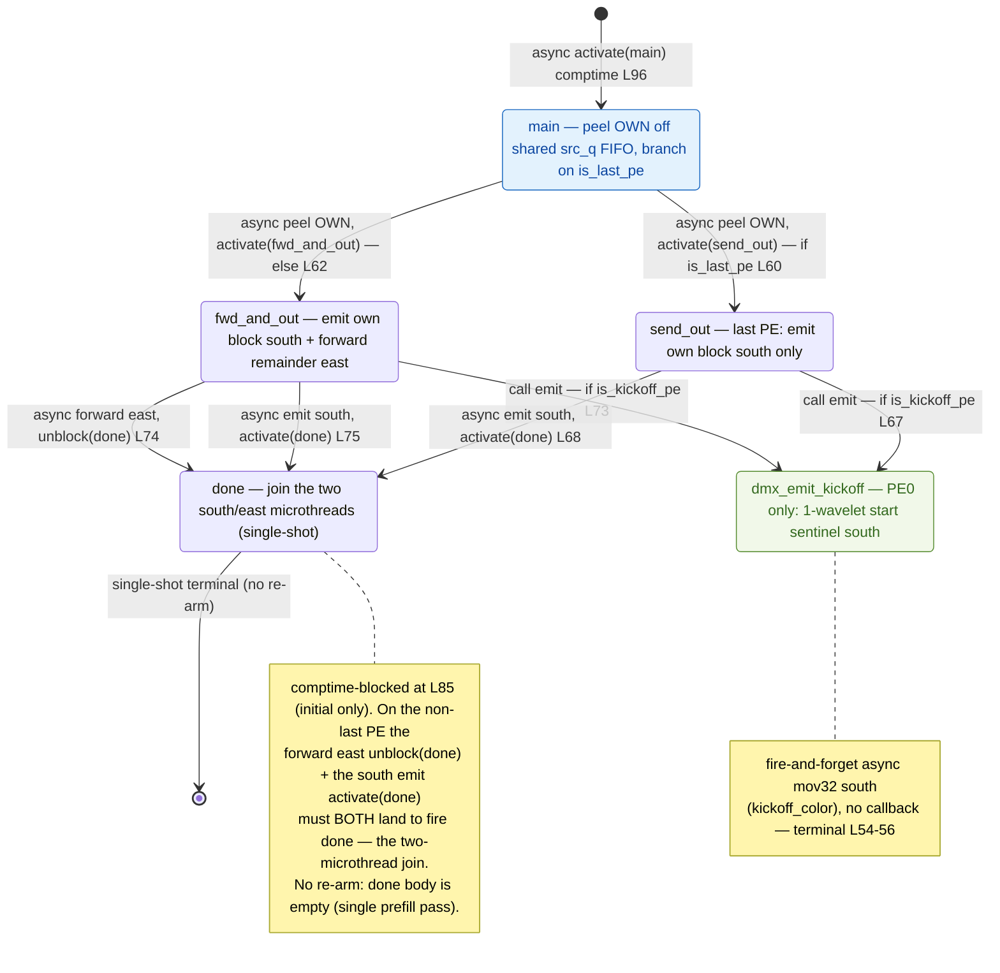

**Links:** detail doc → [qwen3_1p7b-e2e.prefill-demux.statemachine.md](../../assets/kernel-algo/qwen3_1p7b-e2e.prefill-demux.statemachine.md) · rendered SVG → [qwen3_1p7b-e2e.prefill-demux.statemachine.svg](../../assets/kernel-algo/qwen3_1p7b-e2e.prefill-demux.statemachine.svg)

## `prefill/mux.csl` — prefill egress

Serialize-through-collector.

```mermaid
stateDiagram-v2
    [*] --> main : comptime activate(main_id) [is_last_pe==1]

    state "main() — drain blob from north" as main
    state "send() — forward blob east to host" as send
    state "tsc_recv() — drain 8-u32 TSC burst" as tsc_recv
    state "tsc_send() — forward TSC east (done)" as tsc_send

    main --> send : async: mov32 done, activate(send_id)
    send --> tsc_recv : async: mov32 done, activate(tsc_recv_id)
    tsc_recv --> tsc_send : async: mov32 done, activate(tsc_send_id)
    tsc_send --> [*] : async: mov32 done, no callback (terminal)

    note right of main : only east-most PE (is_last_pe==1) is armed; all other mux PEs inert
    note right of tsc_send : one-shot chain, no re-arm (prefill is one-shot per launch)
```

**Links:** detail doc → [qwen3_1p7b-e2e.prefill-mux.statemachine.md](../../assets/kernel-algo/qwen3_1p7b-e2e.prefill-mux.statemachine.md) · rendered SVG → [qwen3_1p7b-e2e.prefill-mux.statemachine.svg](../../assets/kernel-algo/qwen3_1p7b-e2e.prefill-mux.statemachine.svg)

## Route-only files (no task/fn state machine)

- **`relay.csl`** — 5-line task-less pass-through relay across the phase gap. No task graph.
- **`decode/route_calc.csl`, `prefill/route_calc.csl`** — init-time per-PE route-direction calc; pure data-flow, no tasks.
- **`decode/route_util.csl`, `prefill/route_util.csl`** — synchronous route-config helper `inline fn`s; no task graph.
