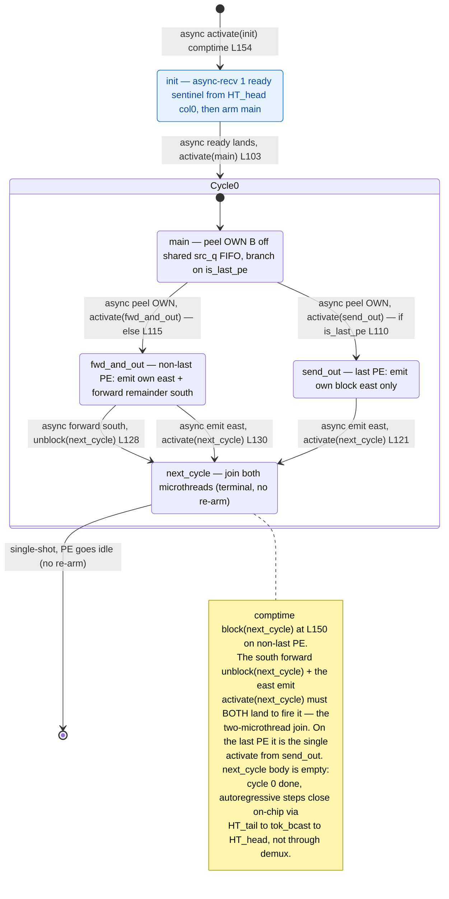

# qwen3_1p7b-e2e · decode/demux.csl — task/fn state machine

> Model `qwen3_1p7b-e2e` (phase=decode), ref config `test_sim_2x2blk_kv.json`.
> Control-flow / state-machine companion to the algo walkthrough. Diagram:
> `qwen3_1p7b-e2e.decode-demux.statemachine.svg`. This file maps the **task activation graph**
> (who fires whom, sync vs async) — not the spatial peel/forward/emit geometry.
>
> Fused-e2e DECODE-phase token-id ingress: the P_BLOCK_SIZE×1 store-and-forward demux chain
> (runs N→S, output flows EAST into row_y==0's west edge). Vs the standalone `qwen3_1p7b-decode`
> demux state machine: **structurally identical entry + peel + join**, but this fused variant is
> **single-shot** — `next_cycle` is terminal (empty body, no per-round re-arm). It processes only
> cycle 0 (the host X[0] seed); autoregressive steps then close entirely on-chip via
> HT_tail → tok_bcast_color → HT_head, so demux never re-parks. There is no `KV_TRANSFER` re-arm
> back-edge here.

## States

Five nodes, all `@bind_local_task` tasks bound at `decode/demux.csl:142-146`: `init`, `main`,
`send_out`, `fwd_and_out`, `next_cycle`. There is **no plain-`fn` control edge** — every transition is
either a comptime `@activate` or an async `@mov32` completion callback. The same compiled program runs
on every column of the 1×P demux chain; the params `my_idx` / `is_last_pe` select which out-edges a
given PE takes.

### `init` — one-time ready barrier (machine entry)
- **In-edge:** comptime `@activate(init_id)` at `decode/demux.csl:154` — the single machine entry,
  drawn from `[*]`.
- **Body:** one async `@mov32` receives exactly 1 ready sentinel wavelet from the HT_head col=0 PE
  (same `fabric_y`) on `ht_ready_color` into `ready_buf` (`decode/demux.csl:101-104`); its completion
  callback is the only work.
- **Out-edge (async):** `.activate = main_id` (`decode/demux.csl:103`). This barrier fires once — the
  fused decode demux is single-shot, so there is no re-wait after cycle 0.

### `main` — the cycle-0 peel
- **In-edge:** the async ready-complete from `init` (`decode/demux.csl:103`). There is no re-arm
  in-edge (single-shot).
- **Body:** one async `@mov32` peels this column's `OWN_B` block off the shared `src_q` FIFO into
  `own_buf` (`decode/demux.csl:106-116`). PE 0's `src_q` is the host `in_color` stream (via `Edge.TOP`);
  PE k≥1's is the north chain color from PE k−1. The peel's completion callback is the branch.
- **Out-edges (async, mutually exclusive on the comptime predicate `is_last_pe`):**
  - `is_last_pe == 1` → `.activate = send_out_id` (`decode/demux.csl:107-110`).
  - else → `.activate = fwd_and_out_id` (`decode/demux.csl:111-115`).

### `fwd_and_out` — non-last PE (`my_idx < P-1`)
- **In-edge:** async peel-complete from `main` (`decode/demux.csl:115`).
- **Body / out-edges (two concurrent microthreads that join at `next_cycle`):**
  - async `@mov32` streams the remaining `FWD_EXTENT = (P-1-my_idx)·OWN_B` wavelets **south** on
    `forward_oq` (a `forward_color` chain hop) to PE k+1, callback `.unblock = next_cycle_id`
    (`decode/demux.csl:127-128`).
  - async `@mov32` emits `own_buf` **east** on `out_oq` (= `pre_embed_x_color`), callback
    `.activate = next_cycle_id` (`decode/demux.csl:129-130`).

### `send_out` — last PE (`my_idx == P-1`)
- **In-edge:** async peel-complete from `main` (`decode/demux.csl:110`).
- **Body / out-edge:** async `@mov32` emits `own_buf` east on `out_oq`, `.activate = next_cycle_id`
  (`decode/demux.csl:119-121`). No south forward exists on the last PE (`FWD_EXTENT = 1` placeholder,
  never executed), so this is the single edge into `next_cycle`.

### `next_cycle` — the join + terminal
- **In-edges:** on the non-last PE, `.unblock(next_cycle_id)` from the south-forward mov
  (`decode/demux.csl:128`) and `.activate(next_cycle_id)` from the east-emit mov
  (`decode/demux.csl:130`); on the last PE, the single `.activate(next_cycle_id)` from `send_out`
  (`decode/demux.csl:121`).
- **The join:** `next_cycle_id` is `@block`-ed at comptime on non-last PEs (`decode/demux.csl:150`). So
  even though the east-emit mov `.activate`s it, the task cannot fire until the south-forward mov
  `.unblock`s it — **both microthreads must complete**. It is a block/unblock barrier, not an ordinary
  activation.
- **Out-edge (terminal):** the body is **empty** (`decode/demux.csl:132-135`, "Single-shot: cycle 0
  done, PE goes idle (no re-arm)"). Unlike the standalone `qwen3_1p7b-decode` demux, there is **no
  `KV_TRANSFER`-guarded `@activate(main_id)` re-arm** — cycle 0 is the only cycle this chain runs, and
  the machine goes idle (the `next_cycle → [*]` edge). Subsequent autoregressive tokens are produced
  on-chip by HT_tail → `tok_bcast_color` → HT_head and never re-enter the demux.

## Legend

- **`async …`** — an async-op completion callback (`.activate` / `.unblock` on an `@mov32`
  microthread); the source task returns immediately and the edge fires later when the transfer drains.
- **`activate(x)`** — `@activate` / `.activate = x_id`, an activation edge. **`unblock(x)`** —
  `.unblock = x_id`, releases a `@block`-gated task. **`block(x)`** — `@block`, holds the join gate.
- **`[*]`** — entry (comptime `@activate(init_id)`) / the composite's initial / the single-shot idle
  terminal. **`Cycle0`** — the composite that runs exactly once; there is no back-edge out of it.
- Branch guards on edges (`if is_last_pe`, `else`) are compile-time predicates; a given column takes
  only the matching edge.
- No `call:` (sync) edge exists — every intra-machine transfer is an async microthread callback; the
  sole `event`-like park (the ready sentinel) is modeled as `init`'s async in-edge.

## Edge inventory (control-transfer sites vs edges drawn)

| Site (source) | kind | target | edge in diagram |
|---|---|---|---|
| `@activate(init_id)` comptime `decode/demux.csl:154` | activation | init | `[*] → init` |
| `.activate=main_id` `decode/demux.csl:103` | async activation | main | init → Cycle0 (main) |
| `.activate=send_out_id` `decode/demux.csl:110` | async activation | send_out | main → send_out |
| `.activate=fwd_and_out_id` `decode/demux.csl:115` | async activation | fwd_and_out | main → fwd_and_out |
| `.activate=next_cycle_id` `decode/demux.csl:121` | async activation | next_cycle | send_out → next_cycle |
| `.unblock=next_cycle_id` `decode/demux.csl:128` | async unblock | next_cycle | fwd_and_out → next_cycle (south forward) |
| `.activate=next_cycle_id` `decode/demux.csl:130` | async activation | next_cycle | fwd_and_out → next_cycle (east emit) |
| `@block(next_cycle_id)` comptime `decode/demux.csl:150` | gate (initial) | next_cycle | join note |

**7 activation/unblock edges** (1 `@activate` + 5 `.activate` + 1 `.unblock`), all drawn; the **1
`@block` site** is gating (shown as the `next_cycle` join note), not a separate arrow. No plain-`fn`
call edge exists. The single structural difference from the standalone `qwen3_1p7b-decode` demux state
machine is the **absence of the `next_cycle → main` per-round re-arm back-edge**: this fused-e2e decode
demux is single-shot, so it has one fewer `@activate` site (7 activation edges here vs 8 there) and
`next_cycle` is terminal rather than a conditional loop head.
