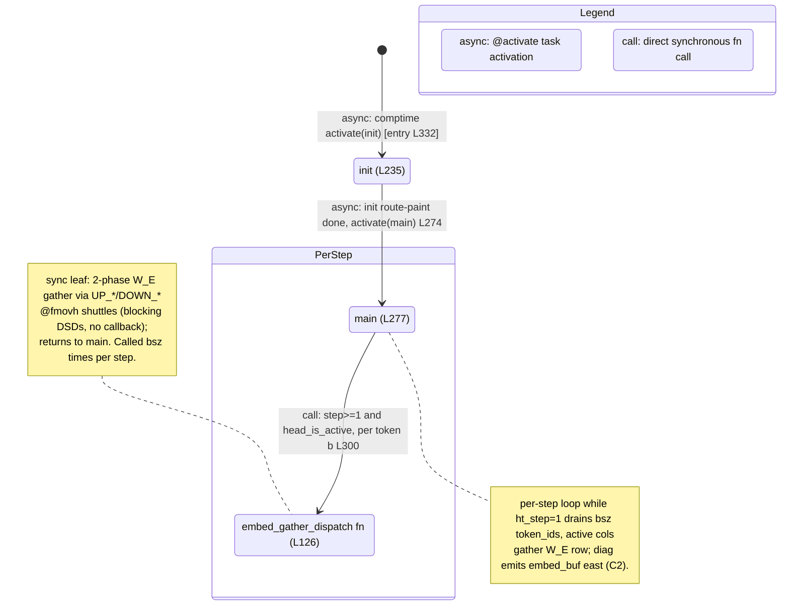

# qwen3_1p7b-e2e · decode/ht_head.csl — task/fn state machine

> Model `qwen3_1p7b-e2e` (phase=decode), ref config `test_sim_2x2blk_kv.json`. Control-flow /
> state-machine companion to the algo walkthrough. Nodes = tasks + directly-called fns; edges = control
> transfers (async `@activate` task activation vs synchronous `call`). Diagram:
> `qwen3_1p7b-e2e.decode-ht_head.statemachine.svg`.
>
> Fused-e2e DECODE-phase vocab head: token id → embedding-row lookup. Like the standalone decode head it
> **statically shards** the vocab along Y and **gathers** the owning row over 4 statically-painted relay
> colors (UP_A/UP_B north, DOWN_A/DOWN_B south). The machine is small and strictly linear: two tasks
> (`init`, `main`) and one synchronous leaf fn (`embed_gather_dispatch`), with **no** async microthread
> callbacks — every fabric op is a blocking DSD move. Compared with the standalone `qwen3_1p7b-decode`
> head it drops the `kv_stream_ingress` per-round re-arm and the `STOP_TOK` early break, so `main` is
> single-shot with just one internal per-step loop.

## States, in-edges, out-edges

Entry is the single `@activate(init_id)` in the comptime block (`ht_head.csl:332`), drawn from `[*]`. The
machine is fully linear — `init → main` — with a single loop **inside** `main`: the per-step `while
(ht_step < n_steps)`. There is **no** per-round self back-edge (unlike the standalone decode head): the
fused decode head has no `kv_stream_ingress` path, so `main` runs once and terminates.

- **init** (`ht_head.csl:235`, task). Reads the PE's wafer coords via `tile_config.get_fabric_coord`
  (L236–237), derives its local `head_my_x_local` / `head_my_py`, the effective embedding col
  `eff_x = x_local - x_offset`, the diag-pair pys, and the `head_is_active` / `head_am_diag` /
  `head_my_py_is_even` flags (L242–252). It then paints the two per-row routes: `c1_color`
  (pre_embed_x) west→east on relay cols and west→ramp at the row's diag col (L256–260), and `c2_color`
  ramp→east on the diag PE / west→east east of it (L263–267). Col=0 PEs also fire the ready sentinel
  west via `@mov32` (L271 — a blocking send with **no** callback, so no control edge). *In:* entry
  `@activate` (L332, async). *Out:* one async edge — `@activate(main_id)` (L274).

- **main** (`ht_head.csl:277`, task). Drives the decode step loop `while (ht_step < n_steps)` (L278).
  **Step 0** the diag PE parks the host-pre-embedded X (`@fmovh` from `c1_recv_dsd` into `embed_buf`,
  L281). **Step ≥ 1** every column drains its per-step token id off `tok_recv_dsd` (`@mov32`, L287);
  only the active east embedding columns (`head_is_active != 0`) then loop `b` over `bsz`, split each
  i32 token into `(py_b, v_off)` by the vocab Y-shard (L294–299), and **synchronously call**
  `embed_gather_dispatch` per token (L300); west relay columns drain and discard. Every step the diag
  PE emits `embed_buf` east on `c2_send_dsd` (`@fmovh`, L307). *In:* async from `init` (L274). *Out:* a
  **sync call** to `embed_gather_dispatch` (L300); no async out-edge — `main` terminates when the loop
  exits (single-shot).

- **embed_gather_dispatch** (`ht_head.csl:126`, fn — inside `PerStep`). Pure fabric-shuffle leaf: given
  `(b, py_b, v_off)` it computes the four `case_src_*` predicates against its diag pair (L127–130) and
  issues the `@fmovh` shuttles that move the owning vocab row's two half-vectors along the UP_* (north)
  or DOWN_* (south) relay chain into the requesting diag PE's `embed_buf` slot (L143–225). All moves are
  blocking DSD ops (no `.activate`/`.unblock` microthread callbacks). *In:* one **sync call** edge from
  `main` (L300). *Out:* none — it returns synchronously to `main` (the one sink; no control transfer or
  task activation out).

## Loop boundaries

- **Per-step loop** (`PerStep` composite): `while (ht_step < n_steps)` at `ht_head.csl:278`. This is a
  plain `while` **inside** `main`, not a task transition — the only control transfer it contains is the
  synchronous `embed_gather_dispatch` call (L300). Shown as a note on `main` plus the `main → dispatch`
  call edge nested in `PerStep`.
- **No per-round loop.** The fused decode head has no `kv_stream_ingress` re-arm, so there is no
  `main → main` back-edge; `n_steps` is host-set once (L58) and `main` is single-shot.

## Legend

- **`async:`** — a task `@activate` (comptime entry, or `init`'s handoff to `main`). The successor task
  is scheduled to run later.
- **`call:`** — a direct synchronous fn call on the same stack (`embed_gather_dispatch`); returns to the
  caller.
- No `.activate`/`.unblock`/`@block` primitives exist in this kernel — every `@mov32`/`@fmovh` is a
  blocking DSD move executed inline in the task, so there are no async microthread callback edges.

## Edge/site accounting

Grep of `ht_head.csl` control-flow sites vs. edges drawn:

- **`@activate`** — 2 sites (L274, L332) → 3 edges (`[*]`→init entry from L332, init→main from L274).
  The L332 comptime site draws the `[*]`→init entry edge. Match (2 activate sites → 2 activation edges;
  `[*]` is the entry sentinel, not a source site).
- **`.activate`** (microthread callbacks) — 0 sites → 0 edges. Match.
- **`.unblock`** — 0 sites → 0 edges. Match.
- **`@block`** — 0 sites → 0 edges (no gating note). Match.
- **Direct fn calls** (sync) — 1 edge: main→embed_gather_dispatch (L300).

Total: 3 nodes (2 tasks + 1 fn), 3 control-transfer edges (`[*]`→init, init→main, main→dispatch). Every
node has an in-edge except the single entry `init`; `embed_gather_dispatch` is the one sink (sync leaf
helper); the per-step loop is internal to `main` and there is no back-edge to close.
