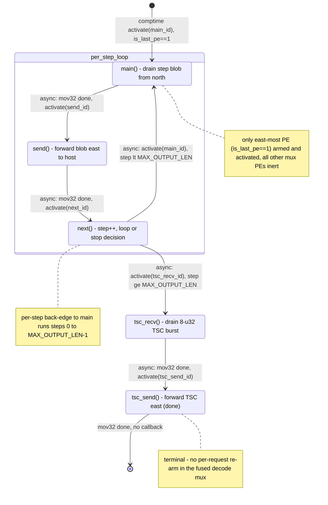

# qwen3_1p7b-e2e · decode/mux.csl — task/fn state machine

> Model `qwen3_1p7b-e2e` (fused prefill+decode, **phase = decode**), ref config `test_sim_2x2blk_kv.json`.
> Control-flow / state-machine companion to the algo walkthrough. This file maps the *task/fn
> control flow only* — the spatial "who forwards to whom" story lives in the algo walkthrough.
> Diagram: `qwen3_1p7b-e2e.decode-mux.statemachine.svg`.
>
> Role: logits/token **egress serialize-through-collector**. The east-most PE (`is_last_pe==1`) drains
> each decode step's global top-k blob arriving from the north (HT_tail east-most) and forwards it east
> to the host stream at the east edge; all other mux PEs are inert. After the last step it relays one
> piggybacked TSC burst, then finishes.
>
> This is the **middle** of the mux family: it keeps the standalone-decode per-step `next` loop but
> **drops** the `init()` budget-header park and the per-request re-arm — the fused decode mux runs one
> fixed-length request bounded by the compile-time `MAX_OUTPUT_LEN`. Compare `qwen3_1p7b-decode.mux`
> (adds `init` + per-request loop) and `qwen3_1p7b-prefill/src/mux.csl` (single step, no `next` loop).

## Shape of the machine

Five tasks. The steady-state core is a **linear async chain that closes into a per-step loop** —
`main → send → next → main` — repeated once per decode step. When the step budget is spent
(`step >= MAX_OUTPUT_LEN`), `next` breaks the loop into the **TSC tail relay** `tsc_recv → tsc_send`,
whose final `@mov32` carries no callback and terminates the machine.

Every fabric-move transition is an **async activation** fired by the `.activate` callback of an
`@mov32` microthread; the intra-task control decisions (comptime entry, `next`'s two branches) are
plain `@activate` task enqueues. There are **no** synchronous `fn` calls, **no** `@block`/`@unblock`
gating, **no** `.unblock` callbacks, and **no** data/control-task bindings. The whole kernel is armed
**only on the east-most PE** (`is_last_pe == 1`); on every other mux PE the tasks are never bound or
activated, so the PE is inert (`mux.csl:58-70`).

Compared with the standalone `qwen3_1p7b-decode.mux`, this fused decode mux **omits** the `init()`
state (no per-round budget-header recv/park) and the per-request back-edge: the step ceiling is the
compile-time `MAX_OUTPUT_LEN` param (`mux.csl:6`, `mux.csl:46`), so there is a single per-step loop and
no outer per-request loop.

One loop scope:
- **Per-step loop** (`main → send → next → main`): one pass per decode step, steps `0 .. MAX_OUTPUT_LEN-1`
  (`mux.csl:36-48`).

## States

### `main()` — drain one step's top-k blob from the north
- **Bound / entry:** `@bind_local_task(main, main_id)` (`mux.csl:61`); `main_id = @get_local_task_id(8)` (`mux.csl:21`).
- **In-edge:** the single comptime entry `@activate(main_id)` (`mux.csl:66`), and the per-step
  back-edge from `next` (`mux.csl:46`).
- **Body:** async `@mov32(blob_dsd, recv_dsd, …)` — drains the `N = wlts_per_step` u32 result blob
  (`TOP_K*bsz*3/2` wavelets: packed-f16 values + i32 indices) arriving from the north (HT_tail
  east-most) over `in_color`/`in_q` into local `blob` (`mux.csl:36-38`, DSDs at `mux.csl:13-18`).
- **Out-edge:** `async: activate(send_id)` on mov32 completion (`mux.csl:37`).

### `send()` — forward the blob east to the host
- **Bound:** `@bind_local_task(send, send_id)` (`mux.csl:62`); `send_id = @get_local_task_id(9)` (`mux.csl:22`).
- **In-edge:** `async: activate(send_id)` from `main` (`mux.csl:37`).
- **Body:** async `@mov32(send_dsd, blob_dsd, …)` — pushes the buffered blob out east on
  `host_color`/`host_oq` (RAMP→EAST at the east edge) toward the host stream (`mux.csl:40-42`,
  `send_dsd` at `mux.csl:19`).
- **Out-edge:** `async: activate(next_id)` on completion (`mux.csl:41`).

### `next()` — advance the step, decide loop vs. stop
- **Bound:** `@bind_local_task(next, next_id)` (`mux.csl:63`); `next_id = @get_local_task_id(10)` (`mux.csl:23`).
- **In-edge:** `async: activate(next_id)` from `send` (`mux.csl:41`).
- **Body:** `step += 1`, then a **synchronous branch** on the step counter (`mux.csl:44-47`). No fabric
  op — unlike the standalone decode mux there is no sampled-token / STOP_TOK read here; the only stop
  condition is the fixed step ceiling.
- **Out-edges (two, mutually exclusive):**
  - `async: @activate(main_id)` if `step < MAX_OUTPUT_LEN` — the per-step back-edge (`mux.csl:46`).
  - `async: @activate(tsc_recv_id)` otherwise (`step >= MAX_OUTPUT_LEN`) — leaves the per-step loop into
    the TSC relay (`mux.csl:47`).

### `tsc_recv()` — drain the 8-u32 TSC burst from the north
- **Bound:** `@bind_local_task(tsc_recv, tsc_recv_id)` (`mux.csl:64`); `tsc_recv_id = @get_local_task_id(11)` (`mux.csl:33`).
- **In-edge:** `async: activate(tsc_recv_id)` from `next`'s stop branch (`mux.csl:47`).
- **Body:** async `@mov32(tsc_blob_dsd, tsc_recv_dsd, …)` — drains one 8-u32 TSC timestamp burst
  piggybacked from the north on `in_color`, reusing `in_q` (`mux.csl:50-52`, DSDs at `mux.csl:29-31`).
- **Out-edge:** `async: activate(tsc_send_id)` on completion (`mux.csl:51`).

### `tsc_send()` — forward the TSC burst east, then finish
- **Bound:** `@bind_local_task(tsc_send, tsc_send_id)` (`mux.csl:65`); `tsc_send_id = @get_local_task_id(12)` (`mux.csl:34`).
- **In-edge:** `async: activate(tsc_send_id)` from `tsc_recv` (`mux.csl:51`).
- **Body:** async `@mov32(tsc_send_dsd, tsc_blob_dsd, …)` — forwards the TSC burst east to the host
  edge on `host_color`, reusing `host_oq` (`mux.csl:54-56`, `tsc_send_dsd` at `mux.csl:32`).
- **Out-edge:** **terminal** — the `@mov32` carries no `.activate` callback, so the machine ends when
  the move completes (`mux.csl:55`). There is no per-request re-arm.

## Legend

- **`[*]`** — kernel entry (the single comptime `@activate`, `mux.csl:66`) and the terminal after
  `tsc_send` (the callback-less `@mov32` at `mux.csl:55`).
- **`async:`** edge — an activation fired either by the `.activate` callback of an `@mov32` async
  microthread (fires when that fabric move completes) or by a direct `@activate` task enqueue. All
  drawn edges are async.
- **`call:`** edge (sync `fn` call) — **none present**.
- **Gating** (`@block`/`@unblock`) — **none present**.
- **`event:`** fabric park — **none present** as a drawn transition (no blocking header recv; the fused
  decode mux has no `init()` park, unlike the standalone decode mux).
- Nodes are `task`s only; there are no `@activate`-d `fn`s, no `@get_data_task_id`/`@get_control_task_id`
  bindings.

## Validation (count-exact)

- **Nodes:** 5 tasks (`main`, `send`, `next`, `tsc_recv`, `tsc_send`) — all `@bind_local_task`'d at
  `mux.csl:61-65`. No orphans; every node has an in-edge (`main` has two: comptime entry + the per-step
  back-edge).
- **Control-transfer sites vs. edges drawn:**
  - `@activate` sites: **3** — comptime entry (`mux.csl:66`), `next → main` loop branch (`mux.csl:46`),
    `next → tsc_recv` stop branch (`mux.csl:47`).
  - `.activate` callbacks on `@mov32`: **3** — `main → send` (`mux.csl:37`), `send → next`
    (`mux.csl:41`), `tsc_recv → tsc_send` (`mux.csl:51`).
  - `.unblock` callbacks: **0**. `@block`/`@unblock`: **0**. Direct `fn` calls: **0**.
  - **6 activation sites → 6 activation edges drawn**, plus one terminal edge (`tsc_send → [*]`, the
    callback-less `@mov32` at `mux.csl:55`). Total 7 drawn edges.
- **Loops close:** the per-step back-edge `next → main` (`mux.csl:46`) closes; there is no per-request
  loop in this fused decode mux.

## Ambiguities / notes

- The stop condition here is purely the fixed step ceiling `MAX_OUTPUT_LEN` (`mux.csl:6`, `mux.csl:46`).
  Unlike `qwen3_1p7b-decode.mux`, `next()` does **not** inspect a sampled-token slot for an early
  STOP_TOK break, and there is no per-round budget header — so no early-stop edge and no `init()` state.
- `next`'s two out-edges are exclusive branches of one `if`; both are plain `@activate` enqueues, drawn
  as two async edges with their branch conditions in the labels.
- `tsc_send` is unconditionally terminal — its `@mov32` never carries an `.activate`, so (unlike the
  standalone decode mux's KV=1 re-arm) there is no per-request back-edge. Drawn as the single `[*]` edge.
