# qwen3_1p7b-e2e · prefill/comm_lib/comm_pe.csl — task/fn state machine

> Model `qwen3_1p7b-e2e` (phase = **prefill**), ref config `test_sim_2x2blk_kv.json`. Control-flow /
> state-machine companion to the algorithm walkthrough: a **library** with per-collective sub-machines
> and **no single `main()`** — every entry is a driver invoked from `prefill.csl`. This is the **fused-e2e
> fork** of the standalone prefill `comm_pe`: the FA-2 `flash_combine` combine machine is **absent** here,
> and a new **KV-cache transfer** machine (prefill → decode) is present. Diagram:
> `qwen3_1p7b-e2e.prefill-comm_pe.statemachine.svg`.

```mermaid
stateDiagram-v2
    %% qwen3_1p7b-e2e PREFILL comm_pe.csl — library, NO single main; one sub-machine per collective driver.
    %% e2e fork: FA-2 flash_combine ABSENT; adds the KV-cache transfer machine (prefill->decode).

    %% ================= INIT (boot, called once from prefill init) =================
    state Init {
        state "init (L210)" as init
        state "precompute_route_words (L196)" as precompute_route_words
        state "precompute_attn_root_words (L397)" as precompute_attn_root_words
        [*] --> init : boot (prefill init calls it)
        init --> precompute_route_words : call: L233
        init --> precompute_attn_root_words : call: per-root kv-band words L234
        init --> write_full_routes : call: boot full-reduce active L235
        init --> reconfig : call: reconfig(SH_OUT/IN) if hop L241,242
        init --> rebind_shuttle_7_0 : call: if first hop E/W L245
    }

    %% ================= RECONFIG route machine (the ONE route-switch) =============
    state Reconfig {
        state "reconfig (L256)" as reconfig
        state "write_full_routes (L170)" as write_full_routes
        state "write_Q_band_routes (L175)" as write_Q_band_routes
        state "write_K_band_routes (L180)" as write_K_band_routes
        [*] --> reconfig
        reconfig --> write_full_routes : call: RECFG_FULL L257
        reconfig --> write_Q_band_routes : call: RECFG_Q L258
        reconfig --> write_K_band_routes : call: RECFG_K L259
    }
    note right of reconfig
        RECFG_SH_OUT / RECFG_SH_IN paint this block's
        shuttle hop route INLINE (parity + block-edge
        guards, apply_route_word) L261-290
    end note

    %% ================= ALL-REDUCE (one-phase full-col / Q,K band) ================
    state AllReduce {
        state "all_reduce_full (L297)" as all_reduce_full
        state "all_reduce_q_band (L359)" as all_reduce_q_band
        state "all_reduce_k_band (L362)" as all_reduce_k_band
        [*] --> all_reduce_full : RMSNorm full-col entry
        [*] --> all_reduce_q_band : QK-Norm Q-band entry
        [*] --> all_reduce_k_band : QK-Norm K-band entry
        state all_reduce_band {
            state "chain toward band_root (L317-348)" as ar_chain
            state "band broadcast-back (L350-356)" as ar_bcast
            [*] --> ar_chain
            ar_chain --> ar_bcast : sync: fadds/fmovs chain done
            ar_bcast --> [*] : sync: mov32 bcast done
        }
        all_reduce_full --> all_reduce_band : call: full col, root_2nd_phase L298
        all_reduce_q_band --> all_reduce_band : call: Q band, q_head_root L360
        all_reduce_k_band --> all_reduce_band : call: K band, kv_head_root L363
    }

    %% ================= GQA ATTENTION band reduces (Q@Kt / softmax) ===============
    state GQA_Attention {
        state "attn_score_reduce (L411)" as attn_score_reduce
        state "restore_k_band_routes (L498)" as restore_k_band_routes
        state "attn_vec_allreduce (L458)" as attn_vec_allreduce
        state "attn_right_hop (L583)" as attn_right_hop
        [*] --> attn_score_reduce : Q@Kt score reduce entry (stage A)
        [*] --> attn_vec_allreduce : softmax max/sum entry (stage B)
        [*] --> attn_right_hop : K|V X-hop entry
        attn_score_reduce --> attn_score_reduce : call: per key-block step, cycling root, repaint on change L418-422
        attn_score_reduce --> restore_k_band_routes : call: after root cycling
        restore_k_band_routes --> write_K_band_routes : call: L499
        attn_vec_allreduce --> attn_vec_allreduce : call: max then sum (driver)
    }
    attn_right_hop --> ext_attn_finish : async: activate/unblock L587,588,596,597

    %% ================= MeshGEMM two-hop matmul comm (Cannon) =====================
    state MeshGEMM {
        state "left_matrix_shift (L694)" as left_matrix_shift
        state "left_matrix_shift_finish (L685)" as left_matrix_shift_finish
        state "two_hop_comm (L712)" as two_hop_comm
        [*] --> left_matrix_shift : skew entry (P/2 hops)
        [*] --> two_hop_comm : systolic step entry (P steps)
        left_matrix_shift --> left_matrix_shift : call: skew loop, P/2 hops (driver)
        left_matrix_shift --> left_matrix_shift_finish : async: activate/unblock L698,699,707,708
        left_matrix_shift_finish --> left_matrix_shift_finish : block: re-arm self L686
        two_hop_comm --> two_hop_comm : call: systolic loop, P steps (driver)
        two_hop_comm --> ext_left_finish : async: activate/unblock L720,721,737,738
        two_hop_comm --> ext_right_finish : async: activate/unblock L722,723,739,740
    }
    left_matrix_shift_finish --> ext_left_shift_cb : call: L687

    %% ================= SCORE x V band-shift (borrows reduce queues 5,6,1) ========
    state ScoreV_Band {
        state "rebind_x_to_band (L568)" as rebind_x_to_band
        state "paint_band_routes (L525)" as paint_band_routes
        state "restore_x_band (L576)" as restore_x_band
        [*] --> rebind_x_to_band : band-shift entry
        [*] --> restore_x_band : band-shift exit
        rebind_x_to_band --> paint_band_routes : call: 3-color interleave + band routes L569
        rebind_x_to_band --> two_hop_comm : call: LEFT channel steered onto q5,6,1 (band_active) L696,716
    }
    note right of restore_x_band
        exit just clears band_active (L577); the e2e
        prefill fork has NO band drain task / queue_flush
        (queue 2 untouched, reduce colors keep band routes)
    end note

    %% ================= SERPENTINE inter-block shuttle ============================
    state Shuttle {
        state "enter_source_shuttle (L1031)" as enter_source_shuttle
        state "enter_dest_shuttle (L1041)" as enter_dest_shuttle
        state "run_shuttle (L772)" as run_shuttle
        state "rebind_shuttle_7_0 (L1019)" as rebind_shuttle_7_0
        [*] --> enter_source_shuttle : source hop entry
        [*] --> enter_dest_shuttle : dest hop entry
        enter_source_shuttle --> rebind_shuttle_7_0 : call: turn block, to out-axis colors L1034,1036
        enter_source_shuttle --> run_shuttle : call: out hop L1039
        enter_dest_shuttle --> run_shuttle : call: in hop L1044
        run_shuttle --> run_shuttle : call: P-step blocking shift register L802
    }
    note right of run_shuttle
        parity ordering: even PE send-then-recv,
        odd PE recv-then-send -> deadlock-free
    end note

    %% ================= KV-CACHE TRANSFER (prefill -> decode) =====================
    state KV_Transfer {
        state "kv_rebind_sweep_w/e (L1010,1011)" as kv_rebind_sweep
        state "kv_rebind_ns (L1012)" as kv_rebind_ns
        state "kv_rebind_xfer (L1013)" as kv_rebind_xfer
        state "rebind_kv_5_6 (L1002)" as rebind_kv_5_6
        state "kv_paint_col_chain (L972)" as kv_paint_col_chain
        state "kv_paint_chain (L956)" as kv_paint_chain
        state "kv_sweep (L888)" as kv_sweep
        state "kv_col_emit (L924)" as kv_col_emit
        state "kv_north_shift (L985)" as kv_north_shift
        state "kv_flush_70_then_step (L851)" as kv_flush_70
        state "kv_flush_then_step (L862)" as kv_flush_56
        state "kv_oq7_empty (L843)" as kv_oq7
        state "kv_oq0_empty (L847)" as kv_oq0
        state "kv_oq5_empty (L854)" as kv_oq5
        state "kv_oq6_empty (L858)" as kv_oq6
        [*] --> kv_rebind_sweep : stage A queue rebind
        [*] --> kv_rebind_ns : stage B queue rebind
        [*] --> kv_rebind_xfer : north-shift queue rebind
        [*] --> kv_paint_col_chain : stage B route paint
        [*] --> kv_sweep : stage A E/W sweep
        [*] --> kv_col_emit : stage B N/S column emit
        [*] --> kv_north_shift : north shift
        [*] --> kv_flush_70 : drain 7,0 before rebind
        [*] --> kv_flush_56 : drain 5,6 before rebind
        kv_rebind_sweep --> rebind_kv_5_6 : call: rebind q5,6 L1010,1011
        kv_rebind_ns --> rebind_kv_5_6 : call: rebind q5,6 to N/S L1012
        kv_rebind_xfer --> rebind_shuttle_7_0 : call: rebind q7,0 to xfer L1013
        kv_paint_col_chain --> kv_paint_chain : call: L976,977
        kv_sweep --> kv_sweep : call: P-step blocking shift register L900
        kv_col_emit --> kv_col_emit : call: directed pass loop L932,942
        kv_north_shift --> kv_north_shift : call: north shift loop L994
        kv_flush_70 --> kv_oq7 : async: queue_flush q7 empty L852
        kv_oq7 --> kv_oq0 : async: queue_flush q0 empty L845
        kv_oq0 --> ext_kv_step : async: activate kv_step_id L849
        kv_flush_56 --> kv_oq5 : async: queue_flush q5 empty L863
        kv_oq5 --> kv_oq6 : async: queue_flush q6 empty L856
        kv_oq6 --> ext_kv_step : async: activate kv_step_id L860
    }
    note right of kv_sweep
        Whole KV_Transfer machine is stepped by the
        external kv_step_id driver task (prefill.csl);
        each [*] = one driver-dispatched fn. The two
        drain chains re-activate kv_step_id when 7,0 / 5,6
        are provably empty (rebinds are legal only empty).
    end note

    %% ================= EXTERNAL driver tasks / callbacks (in prefill.csl) ========
    state "ext: left_matrix_finish_id (prefill)" as ext_left_finish
    state "ext: right_matrix_finish_id (prefill)" as ext_right_finish
    state "ext: attn_finish_id (prefill)" as ext_attn_finish
    state "ext: left_matrix_shift_callback" as ext_left_shift_cb
    state "ext: kv_step_id (prefill)" as ext_kv_step

    %% ================= LEGEND ====================================================
    state Legend {
        state "call:  direct synchronous fn call" as Lc
        state "async: microthread .activate/.unblock OR @activate task enqueue" as La
        state "block: @block gating (re-arm)" as Lb
        state "ext:   driver task / callback bound in prefill.csl" as Le
        state "comptime: @initialize_queue all queues; recv q2,q3 @block L1065-66; left_matrix_shift_finish @bind+@block L1068-69; 4 T29 kv handlers @set_empty_queue_handler L1072-75" as Lcomp
    }
```

## How to read this

`comm_pe.csl` has **no `main()`**: it is a toolbox of collective drivers that `prefill.csl` calls in
sequence within each layer. So the diagram is **not one flow** — it is **eight independent sub-machines**
(Init, Reconfig, AllReduce, GQA_Attention, MeshGEMM, ScoreV_Band, Shuttle, KV_Transfer), each with its own
`[*]` entry, plus five external nodes (`ext:*`) that are driver tasks / callbacks living in `prefill.csl`.
An `ext:*` node is where control leaves this file; its return path back into a `comm_pe` entry is the
driver's decision, not encoded here.

Transition label prefixes: **`call:`** = synchronous same-stack fn call; **`async:`** = an asynchronous
control transfer, either a microthread completion callback (`.activate` / `.unblock` on a `@mov16` /
`@load_to_dsr`) or an `@activate(id)` task enqueue (includes the `@queue_flush` → empty-queue-handler
edges); **`block:`** = an `@block` gating edge; **`sync:`** = an internal synchronous phase boundary inside a
composite (drawn only for `all_reduce_band`).

### Difference vs the standalone-prefill fork
- **No FA-2 `flash_combine`** machine here — this fused-e2e prefill fork does not carry the flash-attention
  online combine collective present in the standalone kernel.
- **The Shuttle is simpler:** no `enter_dest_shuttle_drained` / `shuttle_drain_*` drain tasks. Turn-block
  7,0 rebinds happen **inline** in `enter_source_shuttle` (`L1031-1040`), empty-safe (7,0 sit idle through
  the layer body, so no `@queue_flush`).
- **ScoreV_Band exit is simpler:** `restore_x_band` just clears `band_active` (`L577`) — no band drain task,
  no `@queue_flush` (queue 2 is never touched; the band borrows reduce queues 5,6,1).
- **New KV_Transfer machine** (`L819-1045`), only wired when `kv_transfer != 0` — the sole async-task-driven
  collective in this file besides MeshGEMM.

## Walk by sub-machine

### Init (boot) — `L210-247`
`init` runs once (called from `prefill.csl`'s init). In-edge `[*]`. It calls `precompute_route_words`
(`L233`), `precompute_attn_root_words` (per-root kv-band words for attention stage A, `L234`), then
`write_full_routes` to boot in full-reduce mode (`L235`, cross-edge into **Reconfig**). If this block has a
shuttle hop it calls `reconfig(RECFG_SH_OUT/IN)` to paint the hop route once (`L241-242`, cross into
**Reconfig**), and if the block's first hop is E/W it calls `rebind_shuttle_7_0` to move queues 7,0 onto the
E/W colors while still empty (`L245`, cross into **Shuttle**).

### Reconfig — the one route-switch machine — `L256-291`
`reconfig` is the single route repaint entry point. In-edges from `init`, `enter_source_shuttle`,
`kv_rebind_xfer` (indirectly), and any driver calling it. Three of its five modes dispatch to a **named
applier**: `RECFG_FULL → write_full_routes` (`L257`), `RECFG_Q → write_Q_band_routes` (`L258`),
`RECFG_K → write_K_band_routes` (`L259`). The two shuttle modes (`RECFG_SH_OUT`/`RECFG_SH_IN`) paint the hop
route **inline** (`L261-290`, see the note) — no sub-fn, no out-edge. The three `write_*_routes` appliers
are terminal (they only call external `route_util.apply_route_word`).

### AllReduce — one-phase full-col and Q/K band reduce — `L297-364`
Three entries: `all_reduce_full` (RMSNorm, whole Y column), `all_reduce_q_band` (QK-Norm Q head), and
`all_reduce_k_band` (QK-Norm kv head); all three `call:` the shared engine `all_reduce_band` (`L298`,
`L360`, `L363`). `all_reduce_band` is a **composite**: `ar_chain` (the synchronous bidirectional
`@fadds`/`@fmovs` chain toward `band_root`, `L317-348`) → `ar_bcast` (the `@mov32` router-multicast
broadcast-back, `L350-356`) → done. The reduce is **one-phase** (a single chain, not decode's two-phase
split), which frees the `reduce_2nd` color pair for the shuttle. Fully synchronous: no task, no async edges.

### GQA_Attention — Q@Kᵀ / softmax band reduces — `L411-597`
`attn_score_reduce` (entry, stage A) is the score chain-to-root with a **cycling root and per-change route
repaint** — when `root != attn_root_painted` it repaints the two reduce_1st route words inline
(`L418-422`); the driver re-invokes it per key-block step, drawn as the **self-loop**. After the root cycling
it `call:`s `restore_k_band_routes` → `write_K_band_routes` (`L499`, cross into **Reconfig**) to restore the
fixed-root routes. `attn_vec_allreduce` (separate entry, stage B) is the softmax max/sum band allreduce +
broadcast (self-loop = max then sum, driver-driven). `attn_right_hop` is a **third entry** (the
right-channel-only K|V X hop): its async `@mov16`/`@load_to_dsr` completions fire the external driver task
`attn_finish_id` (one collapsed `async:` edge for 4 sites `L587,588,596,597`). Unlike the standalone fork,
there is **no 7,0 rebind inside attention** here — `attn_score_reduce` paints only reduce_1st colors.

### MeshGEMM — two-hop systolic matmul comm — `L685-741`
Two entries. `left_matrix_shift` is the initial P/2-hop left skew (self-loop = the driver's skew loop); its
async completions fire the local task `left_matrix_shift_finish` (collapsed `async:` edge, 4 sites
`L698,699,707,708`). `left_matrix_shift_finish` re-`@block`s itself to re-arm (`block:` self-edge `L686`)
then `call:`s the external `left_matrix_shift_callback` (`L687`). `two_hop_comm` is one systolic step
(self-loop = the driver's P-step loop); its left/right async completions fire the **external** driver tasks
`left_matrix_finish_id` (4 sites `L720,721,737,738`) and `right_matrix_finish_id` (4 sites
`L722,723,739,740`), each drawn as one collapsed `async:` edge.

### ScoreV_Band — Score×V band-shift borrowing reduce queues 5,6,1 — `L568-578`
`rebind_x_to_band` (entry) `call:`s `paint_band_routes` (3-color interleave role select + band-local
`trace_perm` routes, `L569`) and sets `band_active`. The actual shift reuses **MeshGEMM**'s
`left_matrix_shift`/`two_hop_comm` with the LEFT channel steered onto queues 5,6,1 via `_band_in_dsd`/
`_band_out_dsd` (`call:` cross-edge to `two_hop_comm`, band branches at `L696,716`). Exit `restore_x_band`
(second entry) just clears `band_active` (`L577`) — **no drain, no `@queue_flush`** (queue 2 untouched;
reduce colors keep their band routes until the next reduce reconfig).

### Shuttle — serpentine inter-block hop — `L772-1044`
Two entries. `enter_source_shuttle` may `call: rebind_shuttle_7_0` on a **turn block** (in-hop and out-hop on
different axes, rebind 7,0 to the out-hop colors — empty-safe, `L1034,1036`), then `call: run_shuttle` for
the out hop (`L1039`). `enter_dest_shuttle` just `call: run_shuttle` for the in hop (7,0 already bound to the
in-axis at init, `L1044`). `run_shuttle` is the P-step **blocking shift register** (self-loop `L802`; the
note records the parity ordering that makes it deadlock-free). `rebind_shuttle_7_0` is a shared leaf
(in-edges from Init, `enter_source_shuttle`, and `kv_rebind_xfer`).

### KV_Transfer — prefill → decode KV-cache movement — `L843-1044` (only when `kv_transfer != 0`)
The sole new machine vs the standalone fork. The **whole machine is stepped by the external `kv_step_id`
driver task** in `prefill.csl`; each `[*]` is one driver-dispatched fn (there is no single internal entry).
Sub-parts:
- **Queue rebinds:** `kv_rebind_sweep_w/e` and `kv_rebind_ns` `call: rebind_kv_5_6` (`L1010-1012`);
  `kv_rebind_xfer` `call: rebind_shuttle_7_0` (`L1013`, cross into **Shuttle**).
- **Route paint:** `kv_paint_col_chain` `call: kv_paint_chain` twice (N/S column shift chain, `L976,977`).
- **Movement drivers** (each a P-step / directed blocking shift register, self-loop): `kv_sweep` (stage A
  E/W diagonal funnel, `L900`), `kv_col_emit` (stage B N/S column emit, `L932,942`), `kv_north_shift`
  (inter-region north shift, `L994`).
- **Drain chains** (the async part). `kv_flush_70_then_step` `@queue_flush`es reduce_2nd_0 send (q7); when it
  empties the T29 handler `kv_oq7_empty` fires (`async: L852`), which acks q7 and `@queue_flush`es reduce_2nd_1
  (q0); when q0 empties `kv_oq0_empty` fires (`async: L845`) and `@activate`s the external `kv_step_id`
  (`L849`). Symmetrically, `kv_flush_then_step` → `kv_oq5_empty` (q5 empty, `L863`) → `kv_oq6_empty` (q6 empty,
  `L856`) → `@activate kv_step_id` (`L860`). Both chains resume the driver only when the queues about to be
  rebound are **provably empty** (queue rebinds are legal only on empty queues).

## Legend

- **`call:`** — direct synchronous fn call (same stack, returns to caller).
- **`async:`** — asynchronous control transfer: a microthread `.activate`/`.unblock` completion callback, or
  an `@activate(id)` task enqueue (includes the `@queue_flush` → empty-queue-handler edges).
- **`sync:`** — an internal synchronous phase boundary inside a composite (only `all_reduce_band`).
- **`block:`** — `@block` gating (here, `left_matrix_shift_finish` re-arming itself).
- **`ext:`** — a driver task or callback **bound in `prefill.csl`**, not in this file; control leaves here.
- **comptime** (`L1047-1077`) — `@initialize_queue` for all reduce/shuttle/matmul queues; recv queues q2,q3
  `@block`ed for async recv (`L1065-66`); `left_matrix_shift_finish` `@bind_local_task` + initial `@block`
  (`L1068-69`); the 4 KV T29 empty-queue handlers `@set_empty_queue_handler` (`L1072-75`, guarded by
  `kv_transfer != 0`).

## Site-to-edge reconciliation (count-exact)

| Site kind | Source count | Drawn as |
|---|---|---|
| `@activate(id)` | 2 (`L849,860`) | 2 `async:` edges (both → `ext_kv_step`) |
| `.activate` (async) | 8 (`L587,597,699,708,720,722,738,740`) | folded into 4 collapsed `async:` edges |
| `.unblock` (async) | 8 (`L588,596,698,707,721,723,737,739`) | folded into the same 4 collapsed edges |
| `@block` | 4 (`L686,1065,1066,1069`) | 1 drawn `block:` self-edge (`L686`); 3 comptime, noted in Legend |
| `@queue_flush` | 4 (`L845,852,856,863`) | 4 `async:` empty-queue edges (flush → handler) |
| `task` decls | 1 (`left_matrix_shift_finish` `L685`) | 1 node |
| `@get_local_task_id` | 1 (`L683`) | id for that 1 task |
| `@bind_local_task` | 1 (`L1068`) | binds that task |
| `@set_empty_queue_handler` | 4 (`L1072-75`) | 4 KV handler nodes (`kv_oq7/0/5/6_empty`) |

The 16 `.activate`/`.unblock` sites collapse to **4** async edges because each async op-pair (a send
`.unblock` + a recv `.activate`, ×2 for the DSR load + the mov) targets the same completion task:
`attn_right_hop → attn_finish_id` (4 sites), `left_matrix_shift → left_matrix_shift_finish` (4),
`two_hop_comm → left_matrix_finish_id` (4), `two_hop_comm → right_matrix_finish_id` (4). Drawing one edge per
(source, target) task pair is the faithful control-flow rendering. The 4 `@queue_flush` sites are the two KV
drain chains (7,0 and 5,6), each two flushes deep; `queue_flush.exit` at `L844,848,855,859` are the
handler-internal acks that are part of those same edges (not separate transfers).

**Node count:** 40 drawn nodes — 3 (Init) + 4 (Reconfig) + 5 (AllReduce incl. 2 composite-internal) +
4 (GQA_Attention) + 3 (MeshGEMM) + 3 (ScoreV_Band) + 4 (Shuttle) + 15 (KV_Transfer) + 5 (ext) − 6 (Legend
rows are descriptive, not control nodes). Counting only control-flow states: **34 kernel nodes + 5 ext = 39**.

## Notes on ambiguous control flow

- **Driver-owned loop bounds.** The skew loop (`left_matrix_shift` ×P/2), the systolic loop (`two_hop_comm`
  ×P), the Q@Kᵀ per-step root cycle (`attn_score_reduce`), softmax's max-then-sum (`attn_vec_allreduce`), and
  the KV movement drivers (`kv_sweep`/`kv_col_emit`/`kv_north_shift`) are iterated by `prefill.csl`'s drivers,
  not by a loop inside these fns (the internal `while` in each is the per-hop blocking shift register, drawn
  as the self-loop). The exact trip counts live in the driver.
- **KV_Transfer has no single internal entry.** Every KV fn is dispatched directly by the external
  `kv_step_id` task, so each is drawn with its own `[*]`. The ordering of the stages (A sweep → B column emit
  → north shift, with drain barriers between rebinds) is sequenced entirely by the `kv_step_id` state machine
  in `prefill.csl` and is not encoded here.
- **ScoreV ↔ MeshGEMM coupling.** The Score×V band shift has no shift primitive of its own — it reuses
  `left_matrix_shift`/`two_hop_comm` with `band_active` steering the LEFT channel onto queues 5,6,1. The
  `rebind_x_to_band → two_hop_comm` edge marks this reuse; the precise interleaving of shift steps vs
  `restore_x_band` is driver-sequenced.
- **`ext:*` return paths.** The five external nodes are terminal in this diagram. How a driver task resumes a
  `comm_pe` entry (e.g. `kv_step_id` dispatching the next KV fn, or `attn_finish_id` re-invoking
  `attn_right_hop`) is control that lives in `prefill.csl` and is out of scope for this file's state machine.
