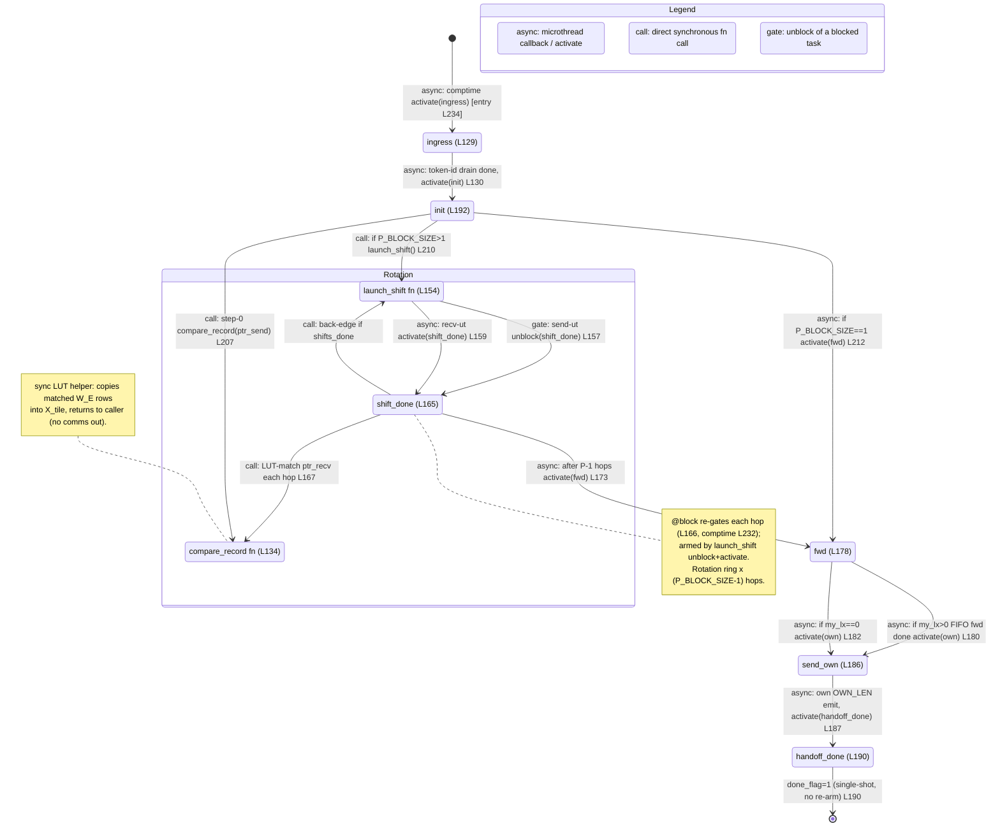

# qwen3_1p7b-e2e · prefill/ht_head.csl — task/fn state machine

> Model `qwen3_1p7b-e2e` (fused-e2e, PREFILL phase), ref config `test_sim_2x2blk_kv.json`. Control-flow /
> state-machine companion to the algo walkthrough. Nodes = tasks + directly-called fns; edges = control
> transfers (async microthread/`@activate` vs synchronous `call` vs `gate` = `@unblock` of a `@block`-ed task).
> Diagram: `qwen3_1p7b-e2e.prefill-ht_head.statemachine.svg`.
>
> This is the fused-e2e prefill-phase token-embedding LUT: an `HEAD_WIDTH×P` band west of block0 that resolves
> token ids into `W_E` embedding rows by rotating vocab chunks around a two-hop y-channel ring, then hands the
> assembled `X_tile` east into block0. Unlike the standalone `qwen3_1p7b-prefill` ht_head, this variant is a
> **single-shot** machine: no `metainfo`/`ingress_ids` header peel, no per-chunk handoff loop, and no
> per-request re-arm — `handoff_done` sets `done_flag=1` and terminates.

## States, in-edges, out-edges

Entry is the single `@activate(ingress_id)` in the comptime block (`ht_head.csl:234`), drawn from `[*]`. The
one inner loop is the **rotation ring** (`launch_shift ↔ shift_done`, run `P_BLOCK_SIZE-1` times). The overall
flow `ingress → init → ring → fwd → send_own → handoff_done` runs once per program instance and terminates.

- **ingress** (`ht_head.csl:129`, task). Drains this column's `2*reduce_len` token ids off the demux
  `tok_bcast` multicast into `token_id_buf`. *In:* entry `@activate(ingress_id)` (comptime L234, async). *Out:*
  the `@mov32` token-id drain arms `.activate = init_id` — one async edge to `init` (L130).

- **init** (`ht_head.csl:192`, task). Derives this PE's column index `lx` from the fabric coord, sizes the
  west-forward extent `fwd_len = lx * OWN_LEN`, tags `we_buf_0[WE_LEN]` with `lx` (the riding chunk_col), and
  runs step 0. *In:* async from `ingress` (L130). *Out:* three edges — a **sync call** to `compare_record` on
  the local chunk (step 0, L207), then a branch on `P_BLOCK_SIZE`: `>1` → **sync call** `launch_shift()`
  (L210) to enter the ring; `==1` (one column owns the whole vocab, no rotation needed) → async
  `@activate(fwd_id)` (L212), skipping the ring entirely.

- **compare_record** (`ht_head.csl:134`, fn — inside `Rotation`). Pure local LUT match: for every token id
  whose value lands in the currently-held vocab tile's `[chunk_base, chunk_hi)` range, copies the matching
  `W_E` row (contiguous) into the chunk-major `X_tile` column (strided by `reduce_len`) via `@fmovh`. *In:*
  two **sync call** edges — from `init` step 0 (L207) and from `shift_done` each hop (L167). *Out:* none drawn
  — it returns synchronously to its caller (leaf helper, no control transfer or comms).

- **launch_shift** (`ht_head.csl:154`, fn — inside `Rotation`). Arms one ring hop on the two-hop y-channel:
  loads the send fabout DSR with `.unblock = shift_done_id` (send ut, L157) and the recv fabin DSR with
  `.activate = shift_done_id` (recv ut, L159), then fires the two disjoint microthreads (`@mov16` send +
  recv). *In:* two **sync call** edges — from `init` (L210) and from `shift_done` back-edge (L171). *Out:* two
  edges into `shift_done` — the send-ut **`gate`** `unblock` (L157) and the recv-ut **async** `activate`
  (L159); both must complete for the `@block`-ed `shift_done` to run.

- **shift_done** (`ht_head.csl:165`, task — inside `Rotation`). Re-`@block`s itself (L166), always calls
  `compare_record(ptr_recv)` on the freshly-received tile (L167), increments `shifts_done`, swaps the
  ping-pong pointers, then loops or exits. *In:* the `gate` + async microthread edges from `launch_shift`
  (L157/L159). *Out:* a **sync call** to `compare_record` every hop (L167); a **sync call** back to
  `launch_shift` while `shifts_done < P_BLOCK_SIZE-1` (rotation back-edge, L171); and — on the last hop — an
  **async** `@activate(fwd_id)` (L173) leaving the ring.

- **fwd** (`ht_head.csl:178`, task). Starts the eastward ordered-concat handoff: forwards all `2*lx` upstream
  chunks off the west FIFO. *In:* async from `shift_done` after the ring (L173) and from `init` in the `P==1`
  case (L212). *Out:* two async edges to `send_own` — `my_lx>0` fires the `@mov16` FIFO forward with
  `.activate = own_id` (L180); `my_lx==0` (no west neighbour) `@activate(own_id)` directly (L182).

- **send_own** (`ht_head.csl:186`, task). Emits this column's own `OWN_LEN` (2 block-col chunks) east on the
  handoff color. *In:* two async edges from `fwd` (L180/L182). *Out:* one async edge to `handoff_done` — the
  `@mov16 ... .activate = handoff_done_id` (L187).

- **handoff_done** (`ht_head.csl:190`, task — terminal). Sets `done_flag = 1` (sim-readable completion
  marker). *In:* async from `send_own` (L187). *Out:* none — single-shot, no per-request re-arm (contrast the
  standalone prefill ht_head, which loops back to `ingress`). Drawn to `[*]`.

## Legend

- `async:` — microthread callback (`.activate` on `@mov16`/`@mov32`) or explicit `@activate`.
- `call:` — direct synchronous fn call (same stack, returns to caller).
- `gate:` — `@unblock` (here `.unblock`) of a `@block`-ed task; `shift_done` is gated and released by the
  send-ut unblock paired with the recv-ut activate.
- Loop note: the **Rotation** composite is the only loop, run `P_BLOCK_SIZE-1` hops; the outer path is
  single-shot (no per-request / per-chunk back-edge).

## Validation (count-exact)

Source grep of control-transfer sites (`ht_head.csl`):

- `@activate` (explicit): L173, L182, L212, L234 = **4**
- `.activate` (microthread callback): L130, L159, L180, L187 = **4**
- `.unblock`: L157 = **1**
- `@block`: L166 (self re-gate), L232 (comptime initial) = **2**
- Total grep sites = **11**.

Edges drawn: the 9 `@activate`/`.activate`/`.unblock` sites map **1:1** to the 9 async/gate edges in the
diagram (entry `[*]→ingress` from L234; `ingress→init` L130; `init→fwd` L212; `shift_done→fwd` L173;
`fwd→send_own` L180 and L182; `send_own→handoff_done` L187; `launch_shift→shift_done` L157 gate and L159
async). The 2 `@block` sites are the `shift_done` re-gate note (not edges). Additionally, 4 **sync `call`**
edges come from direct fn calls not in the grep above (`init→compare_record` L207, `init→launch_shift` L210,
`shift_done→compare_record` L167, `shift_done→launch_shift` L171), plus the `handoff_done→[*]` terminal.

Node count = **8** (6 tasks: ingress, init, shift_done, fwd, send_own, handoff_done; 2 fns: compare_record,
launch_shift). Every node has an in-edge except the single entry `ingress`; the rotation back-edge closes; no
orphans.
