# qwen3_1p7b-e2e · prefill/prefill.csl — task/fn state machine

> Control-flow / state-machine companion to the algo walkthrough. Model `qwen3_1p7b-e2e`
> (**PREFILL phase** of the fused e2e artifact), ref config `test_sim_2x2blk_kv.json`
> (2×2 blocks, 8×8 PE/block, 8 layers → 2 layers/block, PREFILL_LEN=16, bsz=1, KV_TRANSFER=1).
> Nodes = every `task` + every `fn` that is `@activate`-d, task-bound, or the target of a comm_pe
> async callback. Edges = control transfers, labelled `call:` (synchronous same-stack call),
> `async:` (microthread `.activate`/`@activate` or a comm_pe callback), or `gate:` (`@unblock` of a
> `@block`-ed task). Line refs `L####` are `prefill.csl:####`; `commpe####` is
> `comm_lib/comm_pe.csl:####` (where a cross-module async edge is actually fired). Companion diagram:
> `qwen3_1p7b-e2e.prefill-prefill.statemachine.svg`.
>
> **Fork note (vs standalone `qwen3_1p7b-prefill`).** This e2e PREFILL fork **drops** FlashAttention-2:
> there is **no `flash_combine`, no `attn_pair` causal-chunk loop, no `attn_finalize`, no separate
> `scorev_ring_mac`** — attention is a single whole-sequence pass (Stage A `Q·Kᵀ` K-hops → Stage B
> softmax → Stage C Score×V ring, then straight back to `prefill_struct` at flag 7). It also has **no
> per-request / per-chunk serve loop** (`enter_request`, `seed_chunk_x`, `arm_dest_block_and_run` are
> gone — prefill runs **once**), and **replaces the KV-egress fabric emit** with the on-device
> **`kv_step` KV-cache-transfer state machine** that scatters K/V straight into the abutting decode
> region (`kv_transfer != 0`).

```mermaid
stateDiagram-v2
    classDef task fill:#fde68a,stroke:#b45309,color:#111
    classDef comm fill:#bae6fd,stroke:#0369a1,color:#111

    [*] --> init_task : async: comptime activate(init_id) L1256

    state Boot {
        state "init_task [task]" as init_task
        state "enter_x_chain" as enter_x_chain
        state "x_chain_recv_finish [task]" as x_chain_recv_finish
        state "x_chain_fwd_finish [task]" as x_chain_fwd_finish
        init_task --> enter_x_chain : call: is_x_receiver block 0 L1222
        enter_x_chain --> x_chain_recv_finish : async: mov16 recv done L664
        x_chain_recv_finish --> x_chain_fwd_finish : async: fwd-mov done or activate if last col L669 L671
    }
    init_task --> start_layers : call: interior block after enter_dest_shuttle L1229
    x_chain_fwd_finish --> start_layers : call: X in place L678

    state LayerMachine {
        state "start_layers" as start_layers
        state "prefill_struct (14-flag hub)" as prefill_struct
        state "rmsnorm_full" as rmsnorm_full
        state "p_qkv_matmul" as p_qkv_matmul
        state "p_qk_norm_q" as p_qk_norm_q
        state "p_qk_norm_k" as p_qk_norm_k
        state "p_rope_q" as p_rope_q
        state "p_rope_k (+cache_kv)" as p_rope_k
        state "p_attn_score" as p_attn_score
        state "p_o_matmul" as p_o_matmul
        state "p_z_residual" as p_z_residual
        state "p_rmsnorm_z" as p_rmsnorm_z
        state "p_upgate_matmul" as p_upgate_matmul
        state "p_swiglu" as p_swiglu
        state "p_down_matmul" as p_down_matmul
        state "p_ffn_residual_next_layer" as p_ffn_residual_next_layer

        start_layers --> prefill_struct : call: layer 0 flag 0 L1215
        prefill_struct --> rmsnorm_full : call: flag 0 attn-norm L1195
        prefill_struct --> p_qkv_matmul : call: flag 1 L1196
        prefill_struct --> p_qk_norm_q : call: flag 2 L1197
        prefill_struct --> p_qk_norm_k : call: flag 3 L1198
        prefill_struct --> p_rope_q : call: flag 4 L1199
        prefill_struct --> p_rope_k : call: flag 5 L1200
        prefill_struct --> p_attn_score : call: flag 6 L1201
        prefill_struct --> p_o_matmul : call: flag 7 L1202
        prefill_struct --> p_z_residual : call: flag 8 L1203
        prefill_struct --> p_rmsnorm_z : call: flag 9 L1204
        prefill_struct --> p_upgate_matmul : call: flag 10 L1205
        prefill_struct --> p_swiglu : call: flag 11 L1206
        prefill_struct --> p_down_matmul : call: flag 12 L1207
        prefill_struct --> p_ffn_residual_next_layer : call: flag 13 else L1208

        rmsnorm_full --> prefill_struct : call: return next flag L1195
        p_qk_norm_q --> prefill_struct : call: return L829
        p_qk_norm_k --> prefill_struct : call: return L871
        p_rope_q --> prefill_struct : call: return L875
        p_rope_k --> prefill_struct : call: return L880
        p_z_residual --> prefill_struct : call: return L1153
        p_rmsnorm_z --> rmsnorm_full : call: rmsnorm(Z) L1157
        p_swiglu --> prefill_struct : call: return L1166
        p_ffn_residual_next_layer --> prefill_struct : call: more layers set_layer flag 0 L1177
    }

    state Cannon {
        state "setup_matmul" as setup_matmul
        state "left_matrix_shift_callback" as left_matrix_shift_callback
        state "matmul_compute" as matmul_compute
        state "left_matrix_finish [task]" as left_matrix_finish
        state "right_matrix_finish [task]" as right_matrix_finish
        state "two_hop_comm_finish [task]" as two_hop_comm_finish
        state "next_step [task]" as next_step

        setup_matmul --> left_matrix_shift_callback : call: kick skew L537
        left_matrix_shift_callback --> left_matrix_shift_callback : async: skew hop under mm_root L547 commpe708
        left_matrix_shift_callback --> matmul_compute : call: skew done L556
        matmul_compute --> left_matrix_finish : async: two_hop_comm left operand L565 commpe737
        matmul_compute --> right_matrix_finish : async: two_hop_comm right operand L565 commpe739
        matmul_compute --> next_step : async: activate(next_step) gated L580
        left_matrix_finish --> two_hop_comm_finish : gate: unblock(two_hop_comm_finish) L593
        right_matrix_finish --> two_hop_comm_finish : async: activate(two_hop_comm_finish) L597
        two_hop_comm_finish --> next_step : gate: unblock(next_step) L601
        next_step --> matmul_compute : call: mm_mode 0 next P-step L605
    }
    p_qkv_matmul --> setup_matmul : call: X_norm at QKV to XQKV L824
    p_o_matmul --> setup_matmul : call: attn_out at O to h1 L1149
    p_upgate_matmul --> setup_matmul : call: Z_norm at UPGATE L1161
    p_down_matmul --> setup_matmul : call: z3 at DOWN L1169
    matmul_compute --> prefill_struct : call: Cannon done step eq P L587

    state Attention {
        state "p_attn_softmax" as p_attn_softmax
        state "attn_score_step" as attn_score_step
        state "attn_finish [task]" as attn_finish
        state "p_attn_scorev" as p_attn_scorev
        state "scorev_score_preskew" as scorev_score_preskew
        state "scorev_v_preskew_step" as scorev_v_preskew_step
        state "scorev_compute" as scorev_compute

        attn_score_step --> attn_finish : async: Q Kt K X-hop step under P L1010 commpe597
        attn_finish --> attn_score_step : call: stage 0 K-hop loop L1138
        attn_score_step --> p_attn_softmax : call: K-hops done L1018
        p_attn_softmax --> p_attn_scorev : call: Stage B done L1048
        p_attn_scorev --> scorev_score_preskew : call: Stage C start L1068
        scorev_score_preskew --> left_matrix_shift_callback : async: band-Y preskew shift L1076 commpe708
        left_matrix_shift_callback --> scorev_score_preskew : call: mm_mode 1 preskew loop L541
        scorev_score_preskew --> scorev_v_preskew_step : call: band preskew done stage 2 L1081
        scorev_v_preskew_step --> attn_finish : async: V full-X preskew hop L1089 commpe597
        attn_finish --> scorev_v_preskew_step : call: stage 2 V-preskew loop L1138
        scorev_v_preskew_step --> scorev_compute : call: preskew done L1094
        scorev_compute --> next_step : async: activate(next_step) ring step L1124
        next_step --> scorev_compute : call: mm_mode 1 ring step L605
    }
    p_attn_score --> attn_score_step : call: Stage A start L1146
    scorev_compute --> prefill_struct : call: ring done step eq P restore_x_band flag 7 L1132

    state PerBlockEnd {
        state "emit_z_last_token" as emit_z_last_token
        state "start_kv_transfer" as start_kv_transfer
        state "kv_step [task]" as kv_step
        start_kv_transfer --> kv_step : async: kv_flush_70_then_step activate(kv_step) L764 commpe860
        kv_step --> kv_step : async: state advance kv_flush_then_step activate(kv_step) L800 commpe860
    }
    p_ffn_residual_next_layer --> emit_z_last_token : call: last layer is_z_sender east col L1185
    p_ffn_residual_next_layer --> start_kv_transfer : call: last layer kv_transfer after shuttle L1188
    emit_z_last_token --> start_kv_transfer : call: kv_transfer set L1188
    p_ffn_residual_next_layer --> [*] : call: last layer out_shuttle no kv_transfer L1182
    kv_step --> [*] : call: state 4 north-shift into decode L801

    class init_task,x_chain_recv_finish,x_chain_fwd_finish task
    class left_matrix_finish,right_matrix_finish,two_hop_comm_finish,next_step task
    class attn_finish,kv_step task
```

## Loop boundaries at a glance

- **Runs once (no serve loop).** Unlike the standalone prefill, this fork has no `enter_request` head:
  `init_task` runs once, the block runs its layers once, then terminates at a shuttle / z-emit / KV
  transfer. There is **no per-chunk loop** either (single chunk = whole PREFILL_LEN).
- **Per-layer loop** — `p_ffn_residual_next_layer → prefill_struct` (L1177) with `flag = 0` and the
  next weight bank (`set_layer(cur_layer)`), re-running the 14 flags for the next layer of this block
  (ref config: 2 layers/block).
- **14-flag layer machine** — `prefill_struct` (L1194) is the hub; each synchronous operator returns
  to it at the next `flag`. The three operators that go **asynchronous** (`p_*_matmul` → Cannon,
  `p_attn_score` → Attention) re-enter `prefill_struct` only when their async chain completes
  (`matmul_compute` L587, `scorev_compute` L1132).
- **Cannon P-step loop** — `matmul_compute ⇄ next_step` (L605/L580) runs `P` systolic steps; the skew
  pre-loop is the `left_matrix_shift_callback` self-edge (L547).
- **Attention loops (single-pass, no FA-2 fold)** — inner **Stage A K-hop** loop
  `attn_score_step ⇄ attn_finish` (L1010/L1138); **Score×V ring** loop
  `scorev_compute → next_step → scorev_compute` (L1124/L605, `mm_mode == 1`); two **preskew** loops
  (`scorev_score_preskew` via `left_matrix_shift_callback` L1076/L541, `scorev_v_preskew_step` via
  `attn_finish` L1089/L1138).
- **KV-transfer loop** — `kv_step` self-loops over its flush-gated states 0→1→2→3 per (layer, K|V),
  then state 4 does the whole north shift back-to-back (L800 self-edge; L801 terminal).

## State-by-state walk

### Boot / X ingress

- **init_task** (task, `prefill.csl:1218`). In-edge: comptime `@activate(init_id)` from `[*]`
  (L1256, the single entry). Runs `comm.init()` (paints reduce/shuttle/MeshGEMM routes once, L1219),
  then branches: block 0 (`is_x_receiver`) **call**s `enter_x_chain` and returns (L1222); an interior
  block first **blocks** on `comm.enter_dest_shuttle(&X_tile)` (waits for the serpentine-prev block's
  tile, L1227), then **call**s `start_layers` (L1229). Runs exactly once.
- **enter_x_chain** (fn, L649). In-edge: `init_task` (L1222). Rebinds IQ4 to the parity color, sets
  the WEST-recv + EAST-forward routes, posts the async recv of the embedding chunk into `X_tile`, and
  forwards the rest east. Out-edge **async** `@mov16 .activate = x_chain_recv_finish_id` (L664).
- **x_chain_recv_finish** (task, L667). In-edge: L664. Either posts the async forward-mov
  (`.activate = x_chain_fwd_finish_id`, L669) or `@activate(x_chain_fwd_finish_id)` when nothing to
  forward (L671) — one merged out-edge **async** to `x_chain_fwd_finish`.
- **x_chain_fwd_finish** (task, L675). In-edge: L669/L671. OQ4 stays on the chain color (block 0 is
  never the last block); **call**s `start_layers` (L678) — X is now resident.

### Layer machine

- **start_layers** (fn, L1211). In-edges: `x_chain_fwd_finish` (L678), `init_task` (L1229). Sets
  `cur_layer = 0`, `set_layer(0)`, `flag = 0`, **call**s `prefill_struct` (L1215).
- **prefill_struct** (fn, L1194) — the **14-flag hub**. In-edges: `start_layers` and the return edge
  of every synchronous operator (L1195/829/871/875/880/1153/1166), plus the async re-entries from
  Cannon (`matmul_compute` L587) and Attention (`scorev_compute` L1132), plus the per-layer back-edge
  (`p_ffn_residual_next_layer` L1177). **call**s the operator matching `flag`, incrementing `flag`
  (L1195-1208). Flag 0 is special: it runs `rmsnorm_full(&X_tile,…)` inline then recurses into
  `prefill_struct` (L1195).
- **rmsnorm_full** (fn, L272). In-edges: `prefill_struct` flag 0 (L1195) and `p_rmsnorm_z` flag 9
  (L1157). Local sum-of-squares → `comm.all_reduce_full` (Y-axis all-reduce, L284) → rsqrt → scale;
  **call** returns to `prefill_struct`.
- **p_qkv_matmul / p_o_matmul / p_upgate_matmul / p_down_matmul** (fns L823/1148/1160/1168) — flags
  1/7/10/12. Each **call**s `setup_matmul` (L824/1149/1161/1169) entering **Cannon**; control returns
  to `prefill_struct` only from `matmul_compute` (L587).
- **p_qk_norm_q** (fn, L826) — flag 2. `comm.reconfig(1)` + `qk_norm_q_gqa` (per-q-head band-scoped
  head_dim reduce over the interleaved layout); **call** return (L829).
- **p_qk_norm_k** (fn, L868) — flag 3. `comm.reconfig(2)` + `qk_norm` over the K head band; **call**
  return (L871).
- **p_rope_q** (fn, L873) — flag 4. Local RoPE θ=1e6 on the `gqa_group_size` Q bands; **call** return
  (L875).
- **p_rope_k** (fn, L877) — flag 5. RoPE on the K band + `cache_kv` (K is final post QK-Norm+RoPE →
  bank K and raw V at `[cur_layer]`, L879); **call** return (L880).
- **p_attn_score** (fn, L1141) — flag 6. Sets `attn_stage = 0`, `attn_step_n = 0`, points the right
  operand at the K block, **call**s `attn_score_step` (L1146) entering **Attention**; returns to
  `prefill_struct` only from `scorev_compute` (L1132).
- **p_z_residual** (fn, L1151) — flag 8. `Z = X + O(attn)`; **call** return (L1153).
- **p_rmsnorm_z** (fn, L1155) — flag 9. `comm.reconfig(0)` (X-full reduce routes) then **call**s
  `rmsnorm_full(&Z, &Z_norm, l_rms_w_z)` (L1157).
- **p_swiglu** (fn, L1163) — flag 11. `silu_gate` (in-place SiLU on gate) + `z3 = silu(gate)*up`;
  **call** return (L1166).
- **p_ffn_residual_next_layer** (fn, L1171) — flag 13 (`else`). `X = Z + down(SwiGLU)`, `cur_layer++`.
  The **loop/terminus junction**: more layers → `set_layer`, `flag = 0`, `prefill_struct` (L1177,
  per-layer loop); else `done_flag = 1` and, on the last layer, ship this block's `[dim,seq]` output —
  `comm.enter_source_shuttle(&X_tile)` (interior block, blocking, L1182) **or** `emit_z_last_token`
  (last block east column, `is_z_sender`, L1185) — then, if `kv_transfer != 0`, **call**s
  `start_kv_transfer` (L1188).

### Cannon (projection + Score×V MeshGEMM driver)

- **setup_matmul** (fn, L509). In-edges: the four `p_*_matmul` operators. Sets `mm_mode = 0`, the skew
  counts (`total_shift_step`, the meshRT forward-only offset), and **call**s
  `left_matrix_shift_callback` (L537).
- **left_matrix_shift_callback** (fn, L540) — the shared left-channel driver. In-edges: `setup_matmul`
  (L537), its own skew self-loop, and the Score×V band-shift edge (`scorev_score_preskew` L1076).
  Branches: `mm_mode == 1` **call**s `scorev_score_preskew` (L541); skew step `step < mm_root` posts
  `comm.left_matrix_shift` → **async** self (L547 → commpe708); skew done **call**s `matmul_compute`
  (L556).
- **matmul_compute** (fn, L560). In-edges: `left_matrix_shift_callback` (L556), `next_step` (L605).
  Per step posts `comm.two_hop_comm` (fires **async** `left_matrix_finish` L565→commpe737 and
  `right_matrix_finish` L565→commpe739), runs the `mm_Kt` inner `@map`/`@fmachs`, and
  `@activate(next_step)` (**async**, gated, L580); when `step == P` casts f32→bf16 and **call**s
  `prefill_struct` (L587) — **Cannon exit**.
- **left_matrix_finish** (task, L591). In-edge: L565/commpe737. `@block(self)` re-arm, then **gate**
  `@unblock(two_hop_comm_finish)` (L593).
- **right_matrix_finish** (task, L595). In-edge: L565/commpe739. `@block(self)`, then **async**
  `@activate(two_hop_comm_finish)` (L597). (left unblocks + right activates ⇒ the operand rendezvous.)
- **two_hop_comm_finish** (task, L599). In-edges: L593 + L597. `@block(self)`, then **gate**
  `@unblock(next_step)` (L601).
- **next_step** (task, L603). In-edges: L580 (armed) + L601 (unblocked). `@block(self)`, then **call**s
  `matmul_compute` (`mm_mode 0`) or `scorev_compute` (`mm_mode 1`, the Score×V ring) (L605). The
  `matmul_compute ⇄ next_step` cycle is the **projection P-step loop**; `scorev_compute ⇄ next_step`
  is the **Score×V ring loop**.

### Attention (single-pass GQA — no FlashAttention-2 fold)

- **attn_score_step** (fn, L1006) — Stage A `Q·Kᵀ`. In-edges: `p_attn_score` (L1146),
  `attn_finish` stage-0 (L1138). Per K X-hop posts `comm.attn_right_hop` (**async** `attn_finish`,
  L1010→commpe597) + local `attn_partial` + `comm.attn_score_reduce` (cycling-root band reduce into
  the counter slot); when hops done **call**s `p_attn_softmax` (L1018). The
  `attn_score_step ⇄ attn_finish` cycle is the **Stage A K-hop loop**.
- **attn_finish** (task, L1136). In-edges: the K-hops and the V-preskew hops (both commpe597).
  `@block(self)`; dispatches on `attn_stage`: stage 0 → **call** `attn_score_step` (L1138); else
  (stage 2) → **call** `scorev_v_preskew_step` (L1138).
- **p_attn_softmax** (fn, L1025) — Stage B. α-scale, host-precomputed additive causal mask, per-`(b,h)`
  max/sum via `comm.attn_vec_allreduce`, `exp`, reciprocal-normalize (whole-stash DSD ops, no
  per-element branch); **call**s `p_attn_scorev` (L1048).
- **p_attn_scorev** (fn, L1059) — Stage C entry. Clears the O accumulator, casts softmaxed score to
  fp16, `comm.rebind_x_to_band` (queue 2 → band colors), `mm_mode = 1`, **call**s
  `scorev_score_preskew` (L1068).
- **scorev_score_preskew** (fn, L1073). Score (LEFT) band-local Y preskew: posts
  `comm.left_matrix_shift` → **async** `left_matrix_shift_callback` (which loops back here via
  `mm_mode 1`, L541); when `pS` hops done sets `attn_stage = 2` and **call**s `scorev_v_preskew_step`
  (L1081).
- **scorev_v_preskew_step** (fn, L1086). V (RIGHT) full-P X preskew: posts `comm.attn_right_hop` →
  **async** `attn_finish` (stage-2 loop, L1089→commpe597); when `pV` hops done **call**s
  `scorev_compute` (L1094).
- **scorev_compute** (fn, L1099) — the Score×V ring step. In-edges: `scorev_v_preskew_step` (L1094),
  `next_step` mm_mode 1 (L605). `step < P` posts the fused `comm.two_hop_comm` (score band-Y / V
  full-X), runs the slot-select `@map`/`@fmachs` MAC **inline** (into `out_acc_f32`), and
  `@activate(next_step)` (**async**, L1124); `step == P` casts f32→bf16 into `attn_out`,
  `comm.restore_x_band` (queue 2 → x colors), and **call**s `prefill_struct` at flag 7 (L1132) —
  **Attention exit**. (No `scorev_ring_mac` task and no `flash_combine` — the MAC is folded into this
  fn and there is no cross-pair rescale.)

### Per-block end / KV-cache transfer

- **emit_z_last_token** (fn, L624). In-edge: `p_ffn_residual_next_layer` (L1185, last layer, terminal
  block, this PE owns the last-token east column). Gathers the last token's dim shard from `X_tile`
  and ships it WEST to HT_tail on `z_drain_color`; the same terminus then **call**s `start_kv_transfer`
  when `kv_transfer != 0` (L1188).
- **start_kv_transfer** (fn, L762). In-edges: `p_ffn_residual_next_layer` (L1188),
  `emit_z_last_token` (L1188). Resets `kv_state/kv_layer/kv_m = 0` and posts
  `comm.kv_flush_70_then_step()` which drains OQ7/OQ0 then fires **async** `@activate(kv_step)`
  (L764 → commpe860).
- **kv_step** (task, L767). The flush-gated KV-scatter machine. In-edges: `start_kv_transfer` (L764)
  and its own self-loop (L800). Per (layer, K|V): state 0 = W sweep, state 1 = E sweep (diagonal PE
  ends holding the row), state 2 = N emit from diagonal, state 3 = S emit + `kv_transform` into decode
  slab order then advance `kv_m`/`kv_layer` (`kv_state = 0` more phases, else 4); each of states 0-3
  ends with `comm.kv_flush_then_step()` → **async** self (L800 → commpe860). State 4 runs the whole
  north shift through the relay seam into the decode block back-to-back (L801-807) — **terminal**.

## Legend

- **`call:`** — synchronous same-stack `fn`/`task` call (solid control transfer, no yield).
- **`async:`** — a microthread callback (`@mov*` / `@load_to_dsr` with `.activate`/`.unblock`), a bare
  `@activate(id)`, or a comm_pe module callback fired when a fabric transfer completes. Control yields;
  the target runs as a task/continuation. `commpe####` marks where in `comm_lib/comm_pe.csl` the edge
  is actually fired.
- **`gate:`** — an `@unblock(id)` releasing a `@block`-ed task (the Cannon operand rendezvous). Each
  Cannon finish task and `attn_finish` also `@block`s itself on entry (L592/596/600/604/1137) to
  re-arm for the next step; those self-blocks are the re-arm mechanism behind the loops, not drawn as
  edges. Five comptime `@block`s (L1251-1255) plus `@activate(init_id)` (L1256) prime the machine.
- **`[task]`** — a hardware task (id via `@get_local_task_id`, bound `@bind_local_task`). Unmarked
  nodes are plain `fn`s reached by synchronous call. Amber fill = task.

## Validation

- **33 nodes**, one entry (`init_task` from `[*]`); every other node has ≥1 in-edge; no orphans.
  Terminals: `p_ffn_residual_next_layer → [*]` (no-KV-transfer shuttle build, L1182) and
  `kv_step → [*]` (state-4 north shift, L801).
- **`@activate` sites in prefill.csl: 5** (L580 `next_step`, L597 `two_hop_comm_finish`, L671
  `x_chain_fwd_finish`, L1124 `next_step`, L1256 `init_id`) — all drawn (L671 merged with the L669
  `.activate=` into the one `x_chain_recv_finish → x_chain_fwd_finish` edge).
- **`.activate=` microthread callbacks: 2** (L664 recv → `x_chain_recv_finish`, L669 fwd →
  `x_chain_fwd_finish`) — both drawn (L669 merged with L671 as above).
- **`.unblock=` callbacks in prefill.csl: 0** (the `.unblock` rendezvous of Cannon/attention live in
  `comm_pe.csl`: commpe721/723/737-740 for left/right_matrix_finish, commpe588/596 for attn_finish,
  commpe698/707 for left_matrix_shift_callback — surfaced here as the `async: … commpe###` comm edges).
- **`@unblock` sites: 2** (L593, L601) — both drawn as `gate:` edges.
- **`@block` sites: 10** (L592/596/600/604 Cannon-task re-arm, L1137 `attn_finish` re-arm; L1251-1255
  comptime initial blocks) — self-gating/comptime, noted in the Legend, not inter-node edges.
- **Cross-module async edges** (comm_pe fires the callback/task; not in the prefill.csl `@activate`
  grep but real control transfers): `attn_right_hop → attn_finish` (commpe587/597; 2 prefill sites:
  K-hop L1010, V-preskew L1089); `two_hop_comm → left/right_matrix_finish` (commpe737/739; 2 sites:
  `matmul_compute` L565, `scorev_compute` L1103 — the ring reuses the projection's finish chain);
  `left_matrix_shift → left_matrix_shift_callback` (commpe698/708; 2 sites: skew L547, score preskew
  L1076); `kv_flush_*/kv step advance → kv_step` (commpe849/860; `start_kv_transfer` L764 + each
  kv_step state L764-800).

## Ambiguities / modelling choices

- **e2e fork drops FlashAttention-2 (verified).** The standalone `qwen3_1p7b-prefill` has
  `flash_combine`, an `attn_pair` causal-chunk outer loop, `attn_finalize`, and a separate
  `scorev_ring_mac` task. This e2e PREFILL fork has **none** of them: `grep` finds no `flash_combine` /
  `attn_pair` / `attn_finalize` / `scorev_ring_mac` in `prefill.csl`. Attention is a single whole-seq
  pass whose Score×V MAC is inlined in `scorev_compute` (L1106-1122), returning straight to flag 7.
- **Shared Cannon finish chain across projection and Score×V ring.** `left_matrix_finish`,
  `right_matrix_finish`, `two_hop_comm_finish`, `next_step` serve **both** the projection MeshGEMM
  (`mm_mode 0`) and the Score×V ring (`mm_mode 1`); `next_step` (L605) dispatches on `mm_mode`. Both
  `@activate(next_step)` sites (L580 matmul, L1124 scorev) are drawn.
- **`enter_dest_shuttle` is blocking here.** Unlike the standalone's async `chunk_resume_callback`,
  the interior-block path in `init_task` (L1227) is a synchronous blocking `comm.enter_dest_shuttle`
  that returns before `start_layers` — drawn as the single `init_task → start_layers` call edge.
- **Per-block terminus fan-out.** On the last layer, an interior block runs `enter_source_shuttle`
  (folded into the L1182 edge to `[*]` for the no-KV-transfer build) and the terminal east-column
  block runs `emit_z_last_token`; **independently**, any block with `kv_transfer != 0` proceeds to
  `start_kv_transfer`. The `emit_z_last_token → start_kv_transfer` edge (L1188) is that post-emit
  continuation; the direct `p_ffn_residual_next_layer → start_kv_transfer` edge covers the
  non-z-column blocks. In the ref config `KV_TRANSFER=1`, so the live terminus is `kv_step` state 4.
