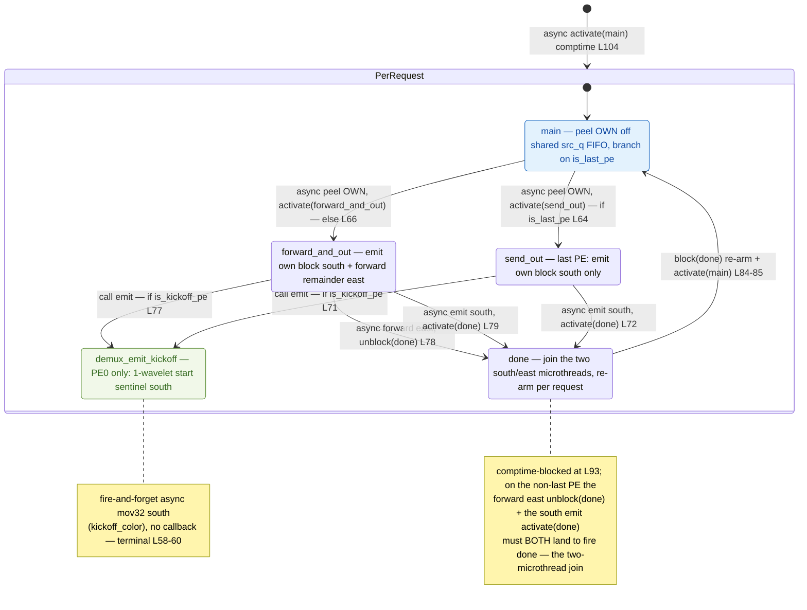
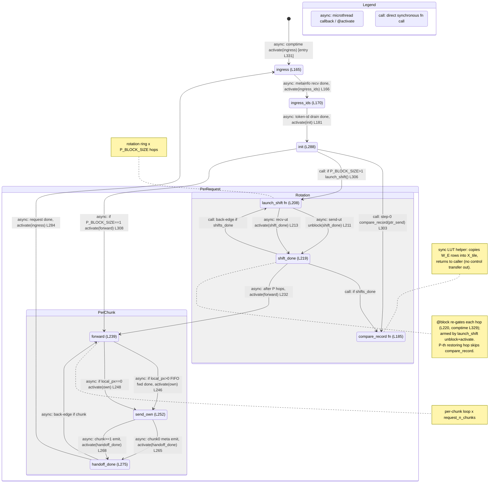
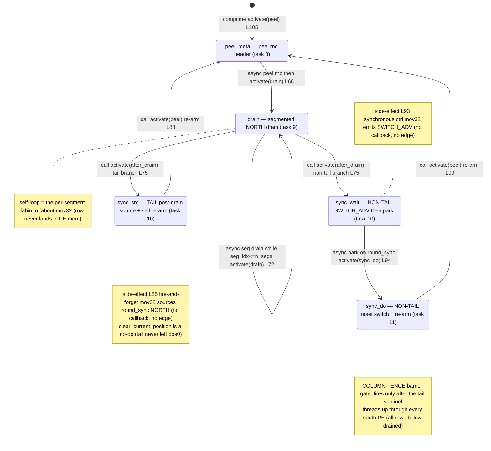

# qwen3_1p7b-prefill — task/fn state machines (all kernels)

> **Aggregate index** of the per-kernel task/fn state-machine set. Each kernel below is an independent Mermaid `stateDiagram-v2` (not merged into one diagram), with links to its standalone detail doc (full per-state prose + `file:line` citations) and its rendered SVG. This is the control-flow companion to the algo walkthroughs (`qwen3_1p7b-prefill.<kernel>.md`). Model `qwen3_1p7b-prefill`, ref config `test_sim_2x4_kv_varlen.json`.

**Edge legend (shared by every diagram):** `call:` = synchronous same-stack `fn` call · `async:` = microthread `.activate`/`@activate` callback (incl. cross-module comm_pe) · `gate:` = `@unblock` of a `@block`-ed task · `event:` = fabric recv park. `[task]` marks a real scheduling unit (`@bind_local_task`/`@get_*_task_id`); unmarked nodes are `fn`s on a task's stack.

## Index

| Kernel | Detail doc | Rendered | In-page diagram |
|---|---|---|---|
| `demux.csl` — Host token-id ingress — 1×P store-and-forward peel chain | [qwen3_1p7b-prefill.demux.statemachine.md](qwen3_1p7b-prefill.demux.statemachine.md) | [svg](qwen3_1p7b-prefill.demux.statemachine.svg) | [↓ diagram](#demux) |
| `ht_head.csl` — Token→embedding LUT via a vocab-rotation ring | [qwen3_1p7b-prefill.ht_head.statemachine.md](qwen3_1p7b-prefill.ht_head.statemachine.md) | [svg](qwen3_1p7b-prefill.ht_head.statemachine.svg) | [↓ diagram](#ht_head) |
| `prefill.csl` — Main compute PE — serpentine layer pipeline | [qwen3_1p7b-prefill.prefill.statemachine.md](qwen3_1p7b-prefill.prefill.statemachine.md) | [svg](qwen3_1p7b-prefill.prefill.statemachine.svg) | [↓ diagram](#prefill) |
| `comm_pe.csl` — Comm library — no main, per-collective sub-machines | [qwen3_1p7b-prefill.comm_pe.statemachine.md](qwen3_1p7b-prefill.comm_pe.statemachine.md) | [svg](qwen3_1p7b-prefill.comm_pe.statemachine.svg) | [↓ diagram](#comm_pe) |
| `ht_tail.csl` — Output head — RMSNorm → lm_head GEMV → top-K → sampling | [qwen3_1p7b-prefill.ht_tail.statemachine.md](qwen3_1p7b-prefill.ht_tail.statemachine.md) | [svg](qwen3_1p7b-prefill.ht_tail.statemachine.svg) | [↓ diagram](#ht_tail) |
| `mux.csl` — One-shot logits/token egress — single async chain | [qwen3_1p7b-prefill.mux.statemachine.md](qwen3_1p7b-prefill.mux.statemachine.md) | [svg](qwen3_1p7b-prefill.mux.statemachine.svg) | [↓ diagram](#mux) |
| `kv_egress_colmux.csl` — KV-cache egress — switch-gather + column-mux drain | [qwen3_1p7b-prefill.kv_egress_colmux.statemachine.md](qwen3_1p7b-prefill.kv_egress_colmux.statemachine.md) | [svg](qwen3_1p7b-prefill.kv_egress_colmux.statemachine.svg) | [↓ diagram](#kv_egress_colmux) |
| route-only (`kickoff_relay`/`route_util`/`route_calc`) | [qwen3_1p7b-prefill.route-only.statemachine.md](qwen3_1p7b-prefill.route-only.statemachine.md) | — | [↓ note](#route-only) |

## `demux.csl` — Host token-id ingress — 1×P store-and-forward peel chain

`main` peels this PE's block, branches to `forward_and_out` (non-last: forward remainder east + emit own block south) or `send_out` (last: emit south only); both join at `done`, which re-arms `main` for the next request. PE 0 also fires the kickoff sentinel.

**Links:** detail doc → [qwen3_1p7b-prefill.demux.statemachine.md](qwen3_1p7b-prefill.demux.statemachine.md) · rendered SVG → [qwen3_1p7b-prefill.demux.statemachine.svg](qwen3_1p7b-prefill.demux.statemachine.svg)

## `ht_head.csl` — Token→embedding LUT via a vocab-rotation ring

Rotate the table, don't route on the key. Per-request token ingress re-arm closes the loop.

**Links:** detail doc → [qwen3_1p7b-prefill.ht_head.statemachine.md](qwen3_1p7b-prefill.ht_head.statemachine.md) · rendered SVG → [qwen3_1p7b-prefill.ht_head.statemachine.svg](qwen3_1p7b-prefill.ht_head.statemachine.svg)

## `prefill.csl` — Main compute PE — serpentine layer pipeline

`prefill_struct` is a 14-flag dispatch hub over the layer stages; `Cannon` is the shift-MAC matmul sub-machine; `Attention` is chunked FlashAttention-2. Three nested loops: per-layer, per-chunk, per-request.

```mermaid
stateDiagram-v2
    classDef task fill:#fde68a,stroke:#b45309,color:#111
    classDef comm fill:#bae6fd,stroke:#0369a1,color:#111

    [*] --> init_task : async: comptime activate(init_id) L1621

    state Boot {
        state "init_task [task]" as init_task
        state "enter_request" as enter_request
        init_task --> enter_request : call: comm.init then enter_request L1589
    }

    state XIngress {
        state "enter_x_chain" as enter_x_chain
        state "x_chain_recv_finish [task]" as x_chain_recv_finish
        state "x_chain_fwd_finish [task]" as x_chain_fwd_finish
        state "seed_chunk_x" as seed_chunk_x
        state "arm_dest_block_and_run" as arm_dest_block_and_run
        enter_x_chain --> x_chain_recv_finish : async: mov16 recv done L753
        x_chain_recv_finish --> x_chain_fwd_finish : async: fwd-mov done or activate if last col L758 L760
        seed_chunk_x --> enter_x_chain : call: re-arm HT_head chain L940
    }
    enter_request --> enter_x_chain : call: is_x_receiver, block 0 L1572
    enter_request --> arm_dest_block_and_run : call: dest block L1575
    x_chain_fwd_finish --> start_layers : call: X in place L767
    arm_dest_block_and_run --> start_layers : call: non-turn blocking recv L1540
    arm_dest_block_and_run --> start_layers : async: turn block chunk_resume_callback L1537 commpe1025

    state LayerMachine {
        state "start_layers" as start_layers
        state "prefill_struct (14-flag hub)" as prefill_struct
        state "rmsnorm_full" as rmsnorm_full
        state "p_qkv_matmul" as p_qkv_matmul
        state "p_qk_norm_q" as p_qk_norm_q
        state "p_qk_norm_k" as p_qk_norm_k
        state "p_rope_q" as p_rope_q
        state "p_rope_k (+cache_kv)" as p_rope_k
        state "p_attn_score" as p_attn_score
        state "p_o_matmul" as p_o_matmul
        state "p_z_residual" as p_z_residual
        state "p_rmsnorm_z" as p_rmsnorm_z
        state "p_upgate_matmul" as p_upgate_matmul
        state "p_swiglu" as p_swiglu
        state "p_down_matmul" as p_down_matmul
        state "p_ffn_residual_next_layer" as p_ffn_residual_next_layer

        start_layers --> prefill_struct : call: layer 0 flag 0 L1528
        prefill_struct --> rmsnorm_full : call: flag 0 attn-norm L1496
        prefill_struct --> p_qkv_matmul : call: flag 1 L1497
        prefill_struct --> p_qk_norm_q : call: flag 2 L1498
        prefill_struct --> p_qk_norm_k : call: flag 3 L1499
        prefill_struct --> p_rope_q : call: flag 4 L1500
        prefill_struct --> p_rope_k : call: flag 5 L1501
        prefill_struct --> p_attn_score : call: flag 6 L1502
        prefill_struct --> p_o_matmul : call: flag 7 L1503
        prefill_struct --> p_z_residual : call: flag 8 L1504
        prefill_struct --> p_rmsnorm_z : call: flag 9 L1505
        prefill_struct --> p_upgate_matmul : call: flag 10 L1506
        prefill_struct --> p_swiglu : call: flag 11 L1507
        prefill_struct --> p_down_matmul : call: flag 12 L1508
        prefill_struct --> p_ffn_residual_next_layer : call: flag 13 else L1509

        rmsnorm_full --> prefill_struct : call: return next flag L1496
        p_qk_norm_q --> prefill_struct : call: return L949
        p_qk_norm_k --> prefill_struct : call: return L991
        p_rope_q --> prefill_struct : call: return L996
        p_rope_k --> prefill_struct : call: return L1002
        p_z_residual --> prefill_struct : call: return L1426
        p_rmsnorm_z --> rmsnorm_full : call: rmsnorm(Z) L1430
        p_swiglu --> prefill_struct : call: return L1439

        p_ffn_residual_next_layer --> prefill_struct : call: more layers set_layer flag 0 L1450
    }

    state Cannon {
        state "setup_matmul" as setup_matmul
        state "left_matrix_shift_callback" as left_matrix_shift_callback
        state "matmul_compute" as matmul_compute
        state "left_matrix_finish [task]" as left_matrix_finish
        state "right_matrix_finish [task]" as right_matrix_finish
        state "two_hop_comm_finish [task]" as two_hop_comm_finish
        state "next_step [task]" as next_step

        setup_matmul --> left_matrix_shift_callback : call: kick skew L588
        left_matrix_shift_callback --> left_matrix_shift_callback : async: skew hop step under mm_root L605 commpe798
        left_matrix_shift_callback --> matmul_compute : call: skew done L614
        matmul_compute --> left_matrix_finish : async: two_hop_comm left operand L623 commpe831
        matmul_compute --> right_matrix_finish : async: two_hop_comm right operand L623 commpe833
        matmul_compute --> next_step : async: activate(next_step) gated L638
        left_matrix_finish --> two_hop_comm_finish : gate: unblock(two_hop_comm_finish) L651
        right_matrix_finish --> two_hop_comm_finish : async: activate(two_hop_comm_finish) L655
        two_hop_comm_finish --> next_step : gate: unblock(next_step) L659
        next_step --> matmul_compute : call: mm_mode 0 next P-step L663
    }
    p_qkv_matmul --> setup_matmul : call: X_norm at QKV to XQKV L944
    p_o_matmul --> setup_matmul : call: attn_out at O to h1 L1422
    p_upgate_matmul --> setup_matmul : call: Z_norm at UPGATE L1434
    p_down_matmul --> setup_matmul : call: z3 at DOWN L1442
    matmul_compute --> prefill_struct : call: Cannon done step eq P L645

    state Attention {
        state "p_attn_softmax" as p_attn_softmax
        state "attn_pair_begin" as attn_pair_begin
        state "attn_score_step" as attn_score_step
        state "attn_finish [task]" as attn_finish
        state "p_attn_scorev" as p_attn_scorev
        state "scorev_score_preskew" as scorev_score_preskew
        state "scorev_v_preskew_step" as scorev_v_preskew_step
        state "scorev_compute" as scorev_compute
        state "scorev_ring_mac" as scorev_ring_mac
        state "scorev_terminal" as scorev_terminal
        state "scorev_drain_done" as scorev_drain_done
        state "flash_combine (FA-2 fold)" as flash_combine
        state "attn_finalize" as attn_finalize

        attn_pair_begin --> attn_score_step : call: Stage A start L1357
        attn_score_step --> attn_finish : async: Q Kt K X-hop step under P L1176 commpe698
        attn_finish --> attn_score_step : call: stage 0 K-hop loop L1333
        attn_score_step --> p_attn_softmax : call: K-hops done L1184
        p_attn_softmax --> p_attn_scorev : call: Stage B done L1211
        p_attn_scorev --> scorev_score_preskew : call: Stage C start L1233
        scorev_score_preskew --> left_matrix_shift_callback : async: band-Y preskew shift L1241 commpe798
        left_matrix_shift_callback --> scorev_score_preskew : call: mm_mode 1 preskew loop L599
        scorev_score_preskew --> scorev_v_preskew_step : call: band preskew done stage 2 L1246
        scorev_v_preskew_step --> attn_finish : async: V full-X preskew hop L1254 commpe698
        attn_finish --> scorev_v_preskew_step : call: stage 2 V-preskew loop L1333
        scorev_v_preskew_step --> scorev_compute : call: preskew done L1259
        scorev_compute --> left_matrix_shift_callback : async: ring band-shift scorev_in_ring L1319 commpe798
        left_matrix_shift_callback --> attn_finish : async: ring V-hop scorev_in_ring L596 commpe698
        attn_finish --> scorev_ring_mac : call: ring MAC scorev_in_ring L1328
        scorev_ring_mac --> scorev_compute : call: step++ next ring step L1330
        scorev_compute --> scorev_terminal : call: ring done step eq P L1321
        scorev_terminal --> scorev_drain_done : async: restore_x_band drain L1295 commpe672
        scorev_drain_done --> flash_combine : call: fold pair m l O L1301
        flash_combine --> attn_pair_begin : call: attn_pair under current_chunk next pair L1302
        flash_combine --> attn_finalize : call: all pairs folded L1306
    }
    p_attn_score --> attn_pair_begin : call: attn_pair 0 L1362
    attn_finalize --> prefill_struct : call: attn_out O_run over l_run then flag 7 L1308

    state PerRequestEnd {
        state "emit_z_last_token" as emit_z_last_token
        state "start_kv_egress" as start_kv_egress
        state "kv_egress_emit_k [task]" as kv_egress_emit_k
        state "kv_egress_emit_v [task]" as kv_egress_emit_v
        state "kv_egress_adv [task]" as kv_egress_adv
        state "kv_egress_drain [task]" as kv_egress_drain
        state "kv_egress_oq_empty [empty-q handler]" as kv_egress_oq_empty

        start_kv_egress --> kv_egress_emit_k : async: row-head meta mov32 or activate L915 L917
        kv_egress_emit_k --> kv_egress_emit_k : async: K chunk mov16 layer under max L860
        kv_egress_emit_k --> kv_egress_emit_v : async: K done activate L864
        kv_egress_emit_v --> kv_egress_emit_v : async: V chunk mov16 layer under max L873
        kv_egress_emit_v --> kv_egress_adv : async: V done activate L877
        kv_egress_adv --> kv_egress_drain : async: turn mov32 activate L886
        kv_egress_drain --> kv_egress_oq_empty : async: queue_flush OQ4 empty event L893 L1614
    }
    p_ffn_residual_next_layer --> seed_chunk_x : call: chunk under rnc-1 is_x_receiver L1467
    p_ffn_residual_next_layer --> arm_dest_block_and_run : call: chunk under rnc-1 dest block L1469
    p_ffn_residual_next_layer --> emit_z_last_token : call: last chunk terminal block emit col L1480
    p_ffn_residual_next_layer --> start_kv_egress : call: last chunk kv_egress L1487
    p_ffn_residual_next_layer --> enter_request : call: last chunk no egress L1489
    emit_z_last_token --> start_kv_egress : call: z shipped then egress L1487
    emit_z_last_token --> enter_request : call: z shipped no egress L1489
    kv_egress_oq_empty --> enter_request : call: re-arm ingress next request L900

    class init_task,x_chain_recv_finish,x_chain_fwd_finish task
    class left_matrix_finish,right_matrix_finish,two_hop_comm_finish,next_step task
    class attn_finish,kv_egress_emit_k,kv_egress_emit_v,kv_egress_adv,kv_egress_drain task
```

**Links:** detail doc → [qwen3_1p7b-prefill.prefill.statemachine.md](qwen3_1p7b-prefill.prefill.statemachine.md) · rendered SVG → [qwen3_1p7b-prefill.prefill.statemachine.svg](qwen3_1p7b-prefill.prefill.statemachine.svg)

## `comm_pe.csl` — Comm library — no main, per-collective sub-machines

Each collective is its own sub-machine with its own entry: two-phase all-reduce, Cannon two-hop matmul, band reduce, serpentine shuttle, and the `reconfig` route machine.

```mermaid
stateDiagram-v2
    %% comm_pe.csl — library, NO single main; one sub-machine per collective driver.

    %% ================= INIT (boot, called once from prefill init) =================
    state Init {
        state "init (L239)" as init
        state "precompute_route_words (L226)" as precompute_route_words
        [*] --> init : boot (prefill init calls it)
        init --> precompute_route_words : call: L261
        init --> write_full_routes : call: boot full-reduce active L262
        init --> reconfig : call: reconfig(SH_OUT/IN) if hop L268-269
        init --> rebind_shuttle_7_0 : call: if first hop E/W L272
    }

    %% ================= RECONFIG route machine (the ONE route-switch) =============
    state Reconfig {
        state "reconfig (L283)" as reconfig
        state "write_full_routes (L205)" as write_full_routes
        state "write_K_band_routes (L210)" as write_K_band_routes
        [*] --> reconfig
        reconfig --> write_full_routes : call: RECFG_FULL L284
        reconfig --> write_K_band_routes : call: RECFG_K L285
    }
    note right of reconfig
        RECFG_SH_OUT / RECFG_SH_IN paint this
        block's hop route INLINE (parity + block-edge
        guards, route_util.apply_route_word) L287-316
    end note

    %% ================= ALL-REDUCE (one-phase full-col / kv-band) =================
    state AllReduce {
        state "all_reduce_full (L323)" as all_reduce_full
        state "all_reduce_k_band (L385)" as all_reduce_k_band
        [*] --> all_reduce_full : RMSNorm full-col entry
        [*] --> all_reduce_k_band : QK-Norm band entry
        state all_reduce_band {
            state "chain toward band_root (L343-374)" as ar_chain
            state "band broadcast-back (L376-382)" as ar_bcast
            [*] --> ar_chain
            ar_chain --> ar_bcast : sync: fadds/fmovs chain done
            ar_bcast --> [*] : sync: mov32 bcast done
        }
        all_reduce_full --> all_reduce_band : call: full col, root_2nd_phase L324
        all_reduce_k_band --> all_reduce_band : call: kv band, kv_head_root L386
    }

    %% ================= GQA ATTENTION band reduces (Q@Kt / softmax) ===============
    state GQA_Attention {
        state "enter_qkt_reduce (L430)" as enter_qkt_reduce
        state "attn_score_reduce (L457)" as attn_score_reduce
        state "restore_k_band_routes (L547)" as restore_k_band_routes
        state "attn_vec_allreduce (L501)" as attn_vec_allreduce
        state "attn_right_hop (L694)" as attn_right_hop
        [*] --> enter_qkt_reduce : QKt reduce entry
        [*] --> attn_right_hop : K|V X-hop entry
        enter_qkt_reduce --> attn_score_reduce : call: routes painted once, driver runs steps
        attn_score_reduce --> attn_score_reduce : call: per key-block step, cycling root (driver) L457
        attn_score_reduce --> restore_k_band_routes : call: after root cycling
        restore_k_band_routes --> write_K_band_routes : call: L548
        restore_k_band_routes --> attn_vec_allreduce : call: softmax stage B
        attn_vec_allreduce --> attn_vec_allreduce : call: max then sum (driver)
    }
    enter_qkt_reduce --> rebind_shuttle_7_0 : call: bind 7,0 to north colors 3,4 L434
    attn_right_hop --> ext_attn_finish : async: activate/unblock L698,699,707,708

    %% ================= CANNON / MeshGEMM two-hop matmul comm =====================
    state Cannon {
        state "left_matrix_shift (L805)" as left_matrix_shift
        state "left_matrix_shift_finish (L796)" as left_matrix_shift_finish
        state "two_hop_comm (L823)" as two_hop_comm
        [*] --> left_matrix_shift : skew entry (P/2 hops)
        [*] --> two_hop_comm : systolic step entry (P steps)
        left_matrix_shift --> left_matrix_shift : call: skew loop, P/2 hops (driver)
        left_matrix_shift --> left_matrix_shift_finish : async: activate/unblock L809,810,818,819
        left_matrix_shift_finish --> left_matrix_shift_finish : block: re-arm self L797
        two_hop_comm --> two_hop_comm : call: systolic loop, P steps (driver)
        two_hop_comm --> ext_left_finish : async: activate/unblock L831,832,848,849
        two_hop_comm --> ext_right_finish : async: activate/unblock L833,834,850,851
    }
    left_matrix_shift_finish --> ext_left_shift_cb : call: L798

    %% ================= SCORE x V band-shift (borrows reduce queues 5,6,1) ========
    state ScoreV_Band {
        state "rebind_x_to_band (L648)" as rebind_x_to_band
        state "restore_x_band (L663)" as restore_x_band
        state "band_drain_q5 (L669)" as band_drain_q5
        state "band_drain_q6 (L670)" as band_drain_q6
        state "band_drain_q1 (L671)" as band_drain_q1
        state "band_drain_done_q5 (L676)" as band_drain_done_q5
        state "band_drain_done_q6 (L677)" as band_drain_done_q6
        state "band_drain_done_q1 (L678)" as band_drain_done_q1
        state "band_resume (L672)" as band_resume
        [*] --> rebind_x_to_band : band-shift entry
        rebind_x_to_band --> restore_x_band : call: after band-local shift ring
        restore_x_band --> band_drain_q5 : async: activate if send_idx==0 L665
        restore_x_band --> band_drain_q6 : async: activate if send_idx==1 L666
        restore_x_band --> band_drain_q1 : async: activate else L667
        band_drain_q5 --> band_drain_done_q5 : async: queue_flush T29 empty L669
        band_drain_q6 --> band_drain_done_q6 : async: queue_flush T29 empty L670
        band_drain_q1 --> band_drain_done_q1 : async: queue_flush T29 empty L671
        band_drain_done_q5 --> band_resume : call: L676
        band_drain_done_q6 --> band_resume : call: L677
        band_drain_done_q1 --> band_resume : call: L678
    }
    rebind_x_to_band --> two_hop_comm : call: LEFT channel steered onto q5,6,1 (band_active) L807-808,827-828
    band_resume --> ext_scorev_cb : call: L674

    %% ================= SERPENTINE inter-block shuttle ============================
    state Shuttle {
        state "enter_source_shuttle (L950)" as enter_source_shuttle
        state "enter_dest_shuttle (L962)" as enter_dest_shuttle
        state "enter_dest_shuttle_drained (L990)" as enter_dest_shuttle_drained
        state "run_shuttle (L886)" as run_shuttle
        state "rebind_shuttle_7_0 (L937)" as rebind_shuttle_7_0
        state "shuttle_drain_q7 (L1003)" as shuttle_drain_q7
        state "shuttle_drain_q0 (L1004)" as shuttle_drain_q0
        state "shuttle_drain_done_q7 (L1014)" as shuttle_drain_done_q7
        state "shuttle_drain_done_q0 (L1018)" as shuttle_drain_done_q0
        state "shuttle_resume_dest (L1008)" as shuttle_resume_dest
        state "shuttle_run_dest (L1023)" as shuttle_run_dest
        [*] --> enter_source_shuttle : source hop entry
        [*] --> enter_dest_shuttle : dest hop entry (init / non-turn)
        [*] --> enter_dest_shuttle_drained : turn-block dest entry
        enter_source_shuttle --> rebind_shuttle_7_0 : call: to out-axis colors L951-952
        enter_source_shuttle --> reconfig : call: RECFG_SH_OUT L959
        enter_source_shuttle --> run_shuttle : call: L960
        enter_dest_shuttle --> rebind_shuttle_7_0 : call: to in-axis colors L967-968
        enter_dest_shuttle --> reconfig : call: RECFG_SH_IN L969
        enter_dest_shuttle --> run_shuttle : call: L970
        enter_dest_shuttle_drained --> shuttle_drain_q0 : async: activate if out_parity==0 L1000
        enter_dest_shuttle_drained --> shuttle_drain_q7 : async: activate else L1001
        shuttle_drain_q7 --> shuttle_drain_done_q7 : async: queue_flush T29 empty L1003
        shuttle_drain_q0 --> shuttle_drain_done_q0 : async: queue_flush T29 empty L1004
        shuttle_drain_done_q7 --> shuttle_resume_dest : call: L1016
        shuttle_drain_done_q0 --> shuttle_resume_dest : call: L1020
        shuttle_resume_dest --> rebind_shuttle_7_0 : call: to in-axis colors L1009-1010
        shuttle_resume_dest --> reconfig : call: RECFG_SH_IN L1011
        shuttle_resume_dest --> shuttle_run_dest : async: activate L1012
        shuttle_run_dest --> run_shuttle : call: L1024
        run_shuttle --> run_shuttle : call: P-step blocking shift register L916
    }
    shuttle_run_dest --> ext_chunk_cb : call: chunk_resume = start_layers L1025

    %% ================= EXTERNAL driver tasks / callbacks (in prefill.csl) ========
    state "ext: left_matrix_finish_id (prefill)" as ext_left_finish
    state "ext: right_matrix_finish_id (prefill)" as ext_right_finish
    state "ext: attn_finish_id (prefill)" as ext_attn_finish
    state "ext: left_matrix_shift_callback" as ext_left_shift_cb
    state "ext: chunk_resume_callback" as ext_chunk_cb
    state "ext: scorev_drain_done_callback" as ext_scorev_cb

    note right of run_shuttle
        parity ordering: even PE send-then-recv,
        odd PE recv-then-send -> deadlock-free
    end note

    %% ================= LEGEND ====================================================
    state Legend {
        state "call:  direct synchronous fn call" as Lc
        state "async: microthread .activate/.unblock OR @activate task enqueue" as La
        state "block: @block gating (re-arm)" as Lb
        state "ext:   driver task / callback bound in prefill.csl" as Le
        state "comptime: queues @initialize_queue; recv q2,q3 @block L1046-47; left_matrix_shift_finish @block L1050; tasks @bind_local_task, T29 @set_empty_queue_handler L1028-1064" as Lcomp
    }
```

**Links:** detail doc → [qwen3_1p7b-prefill.comm_pe.statemachine.md](qwen3_1p7b-prefill.comm_pe.statemachine.md) · rendered SVG → [qwen3_1p7b-prefill.comm_pe.statemachine.svg](qwen3_1p7b-prefill.comm_pe.statemachine.svg)

## `ht_tail.csl` — Output head — RMSNorm → lm_head GEMV → top-K → sampling

Plus a TSC start/stop sentinel. A shared two-phase tail reduce serves both the RMSNorm sum-of-squares and the logits reduce. Per-request re-arm.

```mermaid
stateDiagram-v2
    state "tail_init task (L1017)" as tail_init
    state "tail_main task (L1110)" as tail_main

    [*] --> tail_init : async comptime activate(tail_init) [entry L1208]
    tail_init --> tail_main : async activate(tail_main) L1103
    tail_main --> tail_main : async re-arm activate(tail_main), re-park on Z L1177

    state tail_init {
        state "derive coords + Y/X chain ids (L1018-1025)" as ti_derive
        state "write_Y_routes_tail fn (L419)" as ti_wY
        state "paint static routes: Z-drain L1035, south L1044, xready L1054, kickoff L1082; seed PRNG L1079; enable TSC L1100" as ti_routes
        [*] --> ti_derive
        ti_derive --> ti_wY : call write_Y_routes_tail() L1027
        ti_wY --> ti_routes : return
        ti_routes --> [*]
    }

    state tail_main {
        state "TSC start (is_tsc_pe): park on kickoff sentinel L1116, sample start L1117" as tm_tsc_start
        state "drain Z: fmovh z_slice from z_recv L1120" as tm_drainZ
        state "tail_final_rmsnorm fn (L352): fp32 sumsq, Y-allreduce, normalize x W" as tm_rmsnorm
        state "tail_lm_head_matvec fn (L334): local GEMV partials = lm_head @ Z" as tm_lmhead
        state "tail_logits_reduce_bsz_vocab fn (L655): Y 2-phase reduce, NO bcast" as tm_logred
        state "south emit L1157 (x==HT_WIDTH-1 and root row): topk_val + topk_arg + pred_token to mux OQ0" as tm_south
        state "TSC end (is_tsc_pe): sample end L1167, async mov32 8-u32 burst to OQ0 L1174" as tm_tsc_end

        [*] --> tm_tsc_start
        tm_tsc_start --> tm_drainZ : event kickoff sentinel (is_tsc_pe) / else fall through
        tm_drainZ --> tm_rmsnorm : event Z arrives from last block

        state tm_rmsnorm {
            state "phase1 per-batch local sumsq (L361)" as rn_sumsq
            state "tail_reduce_bsz_f32 fn (L754)" as rn_wrap
            state "tail_reduce_2phase fn (L661), do_broadcast=1, Y allreduce" as rn_reduce
            state "phase3 normalize + cast + mul W_final_norm (L388)" as rn_norm
            [*] --> rn_sumsq
            rn_sumsq --> rn_wrap : call tail_reduce_bsz_f32() L383
            rn_wrap --> rn_reduce : call tail_reduce_2phase() L755
            rn_reduce --> rn_norm : return
            rn_norm --> [*]
        }

        tm_rmsnorm --> tm_lmhead : call tail_lm_head_matvec() L1125

        state tm_lmhead {
            state "vecmat_computation_lm fn (L313)" as lm_vecmat
            state "gemv_lm_step fmachs (L309) via map, loop bsz x dim_per_pe" as lm_step
            [*] --> lm_vecmat : call vecmat_computation_lm() L342
            lm_vecmat --> lm_step : map over left_vector L325
            lm_step --> lm_step : per-K fmachs accumulate
            lm_step --> [*] : per-batch done L318
        }

        tm_lmhead --> tm_logred : call tail_logits_reduce_bsz_vocab() L1127

        state tm_logred {
            state "tail_reduce_2phase fn (L661), do_broadcast=0, len bsz x V_per_pe_x" as lr_reduce
            [*] --> lr_reduce : call tail_reduce_2phase() L656
            lr_reduce --> [*] : logits land on root_2nd_phase row
        }

        tm_logred --> tm_topk : call if tail_my_py==root_2nd_phase L1132
        tm_logred --> tm_south : else (non-root rows skip top-K)

        state tm_topk {
            state "write_X_routes_tail fn (L531): repaint reduce colors Y to X" as tk_wX
            state "xready barrier L1137: root_2nd_phase_x sends go / others recv (event)" as tk_barrier
            state "tail_local_topk fn (L774): loop bsz x TOP_K masked-argmax" as tk_local
            state "tail_topk_mergereduce_x fn (L834): X 2-phase reduce, per-hop merge + bcast" as tk_merge
            state "topk_merge_local fn (L808): 2-pointer K-list merge, loop bsz" as tk_mergefn
            state "tail_sample_token fn (L963): softmax, top-p, PRNG draw (root_2nd_phase_x only)" as tk_sample
            state "predtok X-bcast L1148 / recv L1150" as tk_predbcast
            state "write_Y_routes_tail fn (L419): restore Y routes" as tk_wY
            [*] --> tk_wX : call write_X_routes_tail() L1133
            tk_wX --> tk_barrier : return
            tk_barrier --> tk_local : call tail_local_topk() L1142
            tk_local --> tk_merge : call tail_topk_mergereduce_x() L1143
            tk_merge --> tk_mergefn : call topk_merge_local() per hop L840
            tk_mergefn --> tk_merge : return per hop
            tk_merge --> tk_sample : call tail_sample_token() if root_2nd_phase_x L1147
            tk_sample --> tk_predbcast : return
            tk_predbcast --> tk_wY : call write_Y_routes_tail() L1152
            tk_wY --> [*]
        }

        tm_topk --> tm_south : proceed
        tm_south --> tm_tsc_end : if is_tsc_pe L1166
        tm_south --> [*] : else exit
        tm_tsc_end --> [*]
    }

    note right of tm_drainZ
        Event-driven fabric parks (not activate/block):
        kickoff L1116, z_recv L1120, xready L1140.
    end note
    note right of tm_rmsnorm
        Two-phase reduce chain shared with tm_logred:
        both call tail_reduce_2phase (L661); rmsnorm
        broadcasts (bsz), logits do not (bsz x V_per_pe_x).
    end note
    note left of tk_merge
        X merge-reduce loops per hop; each hop recvs KB
        val + KB id, merges via topk_merge_local, sends.
    end note

    state Legend {
        state "async: microthread callback / @activate (scheduling edge)" as L1
        state "call: direct synchronous fn call (same stack)" as L2
        state "event: blocking fabric recv park (not activate/block)" as L3
    }
```

**Links:** detail doc → [qwen3_1p7b-prefill.ht_tail.statemachine.md](qwen3_1p7b-prefill.ht_tail.statemachine.md) · rendered SVG → [qwen3_1p7b-prefill.ht_tail.statemachine.svg](qwen3_1p7b-prefill.ht_tail.statemachine.svg)

## `mux.csl` — One-shot logits/token egress — single async chain

A single async `@mov32` chain serializes the result through the east-most collector PE to the host; the tail re-activates `main` once per request. All non-collector mux PEs are inert.

```mermaid
stateDiagram-v2
    [*] --> main : comptime activate(main_id)

    state "main() — drain blob from north" as main
    state "send() — forward blob east" as send
    state "tsc_recv() — drain 8-u32 TSC burst" as tsc_recv
    state "tsc_send() — forward TSC east, re-park" as tsc_send

    main --> send : async: mov32 done, activate(send_id)
    send --> tsc_recv : async: mov32 done, activate(tsc_recv_id)
    tsc_recv --> tsc_send : async: mov32 done, activate(tsc_send_id)
    tsc_send --> main : async: mov32 done, activate(main_id) — re-arm

    note right of main : only east-most PE (is_last_pe==1) is armed; all other mux PEs inert
    note right of tsc_send : re-armed cycle, one pass per request
```

**Links:** detail doc → [qwen3_1p7b-prefill.mux.statemachine.md](qwen3_1p7b-prefill.mux.statemachine.md) · rendered SVG → [qwen3_1p7b-prefill.mux.statemachine.svg](qwen3_1p7b-prefill.mux.statemachine.svg)

## `kv_egress_colmux.csl` — KV-cache egress — switch-gather + column-mux drain

Switch-gather EAST + column-mux drain NORTH into a D2H stream, with a budget/header word and a column-fence barrier. `kv_fwd.csl` is a task-less pass-through extender.

**Links:** detail doc → [qwen3_1p7b-prefill.kv_egress_colmux.statemachine.md](qwen3_1p7b-prefill.kv_egress_colmux.statemachine.md) · rendered SVG → [qwen3_1p7b-prefill.kv_egress_colmux.statemachine.svg](qwen3_1p7b-prefill.kv_egress_colmux.statemachine.svg)

## Route-only files (no task/fn state machine)

- **`kickoff_relay.csl`** — empty `comptime { }`, every PE inert; the host paints `kickoff_color` N→S and the router forwards the 1-wavelet forward-start sentinel with no PE program (`kickoff_relay.csl:1-12`).
- **`route_util.csl`** — synchronous route-config helper `inline fn`s (`set_route_1tx`/`set_route_2tx` `:28-45`, `compute_route_word_*`/`apply_route_word` `:52-74`), called on the caller's stack at init / reconfig. No task graph.
- **`route_calc.csl`** — init-time per-PE route-direction calculation (`band_dirs`, `terminate_*`, `get_params` `:59-185`) returning `runtime_params_t`. Pure data-flow, no tasks.

Full note: [qwen3_1p7b-prefill.route-only.statemachine.md](qwen3_1p7b-prefill.route-only.statemachine.md). Where these appear inside another kernel's machine (e.g. comm_pe's `reconfig` calling `apply_route_word`), they show up there as `call:` edges.
