# comm_pe.csl — task/fn state machine

> Model `qwen3_1p7b-prefill`, ref config `test_sim_2x4_kv_varlen.json`. Control-flow / state-machine
> companion to the algorithm walkthrough (`qwen3_1p7b-prefill.comm_pe.md`): a **library** with
> per-collective sub-machines and **no single `main()`** — every entry is a driver invoked from
> `prefill.csl`. Diagram: `qwen3_1p7b-prefill.comm_pe.statemachine.svg`.

```mermaid
stateDiagram-v2
    %% comm_pe.csl — library, NO single main; one sub-machine per collective driver.

    %% ================= INIT (boot, called once from prefill init) =================
    state Init {
        state "init (L239)" as init
        state "precompute_route_words (L226)" as precompute_route_words
        [*] --> init : boot (prefill init calls it)
        init --> precompute_route_words : call: L261
        init --> write_full_routes : call: boot full-reduce active L262
        init --> reconfig : call: reconfig(SH_OUT/IN) if hop L268-269
        init --> rebind_shuttle_7_0 : call: if first hop E/W L272
    }

    %% ================= RECONFIG route machine (the ONE route-switch) =============
    state Reconfig {
        state "reconfig (L283)" as reconfig
        state "write_full_routes (L205)" as write_full_routes
        state "write_K_band_routes (L210)" as write_K_band_routes
        [*] --> reconfig
        reconfig --> write_full_routes : call: RECFG_FULL L284
        reconfig --> write_K_band_routes : call: RECFG_K L285
    }
    note right of reconfig
        RECFG_SH_OUT / RECFG_SH_IN paint this
        block's hop route INLINE (parity + block-edge
        guards, route_util.apply_route_word) L287-316
    end note

    %% ================= ALL-REDUCE (one-phase full-col / kv-band) =================
    state AllReduce {
        state "all_reduce_full (L323)" as all_reduce_full
        state "all_reduce_k_band (L385)" as all_reduce_k_band
        [*] --> all_reduce_full : RMSNorm full-col entry
        [*] --> all_reduce_k_band : QK-Norm band entry
        state all_reduce_band {
            state "chain toward band_root (L343-374)" as ar_chain
            state "band broadcast-back (L376-382)" as ar_bcast
            [*] --> ar_chain
            ar_chain --> ar_bcast : sync: fadds/fmovs chain done
            ar_bcast --> [*] : sync: mov32 bcast done
        }
        all_reduce_full --> all_reduce_band : call: full col, root_2nd_phase L324
        all_reduce_k_band --> all_reduce_band : call: kv band, kv_head_root L386
    }

    %% ================= GQA ATTENTION band reduces (Q@Kt / softmax) ===============
    state GQA_Attention {
        state "enter_qkt_reduce (L430)" as enter_qkt_reduce
        state "attn_score_reduce (L457)" as attn_score_reduce
        state "restore_k_band_routes (L547)" as restore_k_band_routes
        state "attn_vec_allreduce (L501)" as attn_vec_allreduce
        state "attn_right_hop (L694)" as attn_right_hop
        [*] --> enter_qkt_reduce : QKt reduce entry
        [*] --> attn_right_hop : K|V X-hop entry
        enter_qkt_reduce --> attn_score_reduce : call: routes painted once, driver runs steps
        attn_score_reduce --> attn_score_reduce : call: per key-block step, cycling root (driver) L457
        attn_score_reduce --> restore_k_band_routes : call: after root cycling
        restore_k_band_routes --> write_K_band_routes : call: L548
        restore_k_band_routes --> attn_vec_allreduce : call: softmax stage B
        attn_vec_allreduce --> attn_vec_allreduce : call: max then sum (driver)
    }
    enter_qkt_reduce --> rebind_shuttle_7_0 : call: bind 7,0 to north colors 3,4 L434
    attn_right_hop --> ext_attn_finish : async: activate/unblock L698,699,707,708

    %% ================= CANNON / MeshGEMM two-hop matmul comm =====================
    state Cannon {
        state "left_matrix_shift (L805)" as left_matrix_shift
        state "left_matrix_shift_finish (L796)" as left_matrix_shift_finish
        state "two_hop_comm (L823)" as two_hop_comm
        [*] --> left_matrix_shift : skew entry (P/2 hops)
        [*] --> two_hop_comm : systolic step entry (P steps)
        left_matrix_shift --> left_matrix_shift : call: skew loop, P/2 hops (driver)
        left_matrix_shift --> left_matrix_shift_finish : async: activate/unblock L809,810,818,819
        left_matrix_shift_finish --> left_matrix_shift_finish : block: re-arm self L797
        two_hop_comm --> two_hop_comm : call: systolic loop, P steps (driver)
        two_hop_comm --> ext_left_finish : async: activate/unblock L831,832,848,849
        two_hop_comm --> ext_right_finish : async: activate/unblock L833,834,850,851
    }
    left_matrix_shift_finish --> ext_left_shift_cb : call: L798

    %% ================= SCORE x V band-shift (borrows reduce queues 5,6,1) ========
    state ScoreV_Band {
        state "rebind_x_to_band (L648)" as rebind_x_to_band
        state "restore_x_band (L663)" as restore_x_band
        state "band_drain_q5 (L669)" as band_drain_q5
        state "band_drain_q6 (L670)" as band_drain_q6
        state "band_drain_q1 (L671)" as band_drain_q1
        state "band_drain_done_q5 (L676)" as band_drain_done_q5
        state "band_drain_done_q6 (L677)" as band_drain_done_q6
        state "band_drain_done_q1 (L678)" as band_drain_done_q1
        state "band_resume (L672)" as band_resume
        [*] --> rebind_x_to_band : band-shift entry
        rebind_x_to_band --> restore_x_band : call: after band-local shift ring
        restore_x_band --> band_drain_q5 : async: activate if send_idx==0 L665
        restore_x_band --> band_drain_q6 : async: activate if send_idx==1 L666
        restore_x_band --> band_drain_q1 : async: activate else L667
        band_drain_q5 --> band_drain_done_q5 : async: queue_flush T29 empty L669
        band_drain_q6 --> band_drain_done_q6 : async: queue_flush T29 empty L670
        band_drain_q1 --> band_drain_done_q1 : async: queue_flush T29 empty L671
        band_drain_done_q5 --> band_resume : call: L676
        band_drain_done_q6 --> band_resume : call: L677
        band_drain_done_q1 --> band_resume : call: L678
    }
    rebind_x_to_band --> two_hop_comm : call: LEFT channel steered onto q5,6,1 (band_active) L807-808,827-828
    band_resume --> ext_scorev_cb : call: L674

    %% ================= SERPENTINE inter-block shuttle ============================
    state Shuttle {
        state "enter_source_shuttle (L950)" as enter_source_shuttle
        state "enter_dest_shuttle (L962)" as enter_dest_shuttle
        state "enter_dest_shuttle_drained (L990)" as enter_dest_shuttle_drained
        state "run_shuttle (L886)" as run_shuttle
        state "rebind_shuttle_7_0 (L937)" as rebind_shuttle_7_0
        state "shuttle_drain_q7 (L1003)" as shuttle_drain_q7
        state "shuttle_drain_q0 (L1004)" as shuttle_drain_q0
        state "shuttle_drain_done_q7 (L1014)" as shuttle_drain_done_q7
        state "shuttle_drain_done_q0 (L1018)" as shuttle_drain_done_q0
        state "shuttle_resume_dest (L1008)" as shuttle_resume_dest
        state "shuttle_run_dest (L1023)" as shuttle_run_dest
        [*] --> enter_source_shuttle : source hop entry
        [*] --> enter_dest_shuttle : dest hop entry (init / non-turn)
        [*] --> enter_dest_shuttle_drained : turn-block dest entry
        enter_source_shuttle --> rebind_shuttle_7_0 : call: to out-axis colors L951-952
        enter_source_shuttle --> reconfig : call: RECFG_SH_OUT L959
        enter_source_shuttle --> run_shuttle : call: L960
        enter_dest_shuttle --> rebind_shuttle_7_0 : call: to in-axis colors L967-968
        enter_dest_shuttle --> reconfig : call: RECFG_SH_IN L969
        enter_dest_shuttle --> run_shuttle : call: L970
        enter_dest_shuttle_drained --> shuttle_drain_q0 : async: activate if out_parity==0 L1000
        enter_dest_shuttle_drained --> shuttle_drain_q7 : async: activate else L1001
        shuttle_drain_q7 --> shuttle_drain_done_q7 : async: queue_flush T29 empty L1003
        shuttle_drain_q0 --> shuttle_drain_done_q0 : async: queue_flush T29 empty L1004
        shuttle_drain_done_q7 --> shuttle_resume_dest : call: L1016
        shuttle_drain_done_q0 --> shuttle_resume_dest : call: L1020
        shuttle_resume_dest --> rebind_shuttle_7_0 : call: to in-axis colors L1009-1010
        shuttle_resume_dest --> reconfig : call: RECFG_SH_IN L1011
        shuttle_resume_dest --> shuttle_run_dest : async: activate L1012
        shuttle_run_dest --> run_shuttle : call: L1024
        run_shuttle --> run_shuttle : call: P-step blocking shift register L916
    }
    shuttle_run_dest --> ext_chunk_cb : call: chunk_resume = start_layers L1025

    %% ================= EXTERNAL driver tasks / callbacks (in prefill.csl) ========
    state "ext: left_matrix_finish_id (prefill)" as ext_left_finish
    state "ext: right_matrix_finish_id (prefill)" as ext_right_finish
    state "ext: attn_finish_id (prefill)" as ext_attn_finish
    state "ext: left_matrix_shift_callback" as ext_left_shift_cb
    state "ext: chunk_resume_callback" as ext_chunk_cb
    state "ext: scorev_drain_done_callback" as ext_scorev_cb

    note right of run_shuttle
        parity ordering: even PE send-then-recv,
        odd PE recv-then-send -> deadlock-free
    end note

    %% ================= LEGEND ====================================================
    state Legend {
        state "call:  direct synchronous fn call" as Lc
        state "async: microthread .activate/.unblock OR @activate task enqueue" as La
        state "block: @block gating (re-arm)" as Lb
        state "ext:   driver task / callback bound in prefill.csl" as Le
        state "comptime: queues @initialize_queue; recv q2,q3 @block L1046-47; left_matrix_shift_finish @block L1050; tasks @bind_local_task, T29 @set_empty_queue_handler L1028-1064" as Lcomp
    }
```

## How to read this

`comm_pe.csl` has **no `main()`**: it is a toolbox of collective drivers that `prefill.csl` calls in
sequence within each layer. So the diagram is **not one flow** — it is **seven independent sub-machines**,
each with its own `[*]` entry, plus six external nodes (`ext:*`) that are driver tasks / callbacks living
in `prefill.csl`. An `ext:*` node is where control leaves this file; its return path back into a
`comm_pe` entry is the driver's decision, not encoded here.

Transition label prefixes: **`call:`** = synchronous same-stack fn call; **`async:`** = an asynchronous
control transfer, either a microthread completion callback (`.activate` / `.unblock` on a `@mov16` /
`@load_to_dsr`) or an `@activate(id)` task enqueue; **`block:`** = an `@block` gating edge.

## Walk by sub-machine

### Init (boot) — `L239-274`
`init` runs once (called from `prefill.csl`'s init). In-edge `[*]`. It calls `precompute_route_words`
(`L261`), then `write_full_routes` to boot in full-reduce mode (`L262`, a cross-edge into **Reconfig**),
then — only if this block has a shuttle hop — `reconfig(RECFG_SH_OUT/IN)` to paint the hop route once
(`L268-269`, cross into **Reconfig**), and if the block's first hop is E/W it calls `rebind_shuttle_7_0`
to move queues 7,0 onto the E/W colors while they are still empty (`L272`, cross into **Shuttle**).

### Reconfig — the one route-switch machine — `L283-317`
`reconfig` is the single route repaint entry point. In-edges from `init`, `enter_source_shuttle`,
`enter_dest_shuttle`, `shuttle_resume_dest`. Two of its four modes dispatch to a **named applier**:
`RECFG_FULL → write_full_routes` (`L284`), `RECFG_K → write_K_band_routes` (`L285`). The two shuttle
modes (`RECFG_SH_OUT`/`RECFG_SH_IN`) paint the hop route **inline** (`L287-316`, see the note) — no
sub-fn, so no out-edge. `write_full_routes` / `write_K_band_routes` are terminal appliers (they only call
the external `route_util.apply_route_word`, drawn as no further node).

### AllReduce — one-phase full-col and kv-band reduce — `L323-387`
Two entries: `all_reduce_full` (RMSNorm, whole Y column) and `all_reduce_k_band` (QK-Norm, one kv band);
both `call:` the shared engine `all_reduce_band` (`L324`, `L386`). `all_reduce_band` is a **composite**
showing its two internal phases: `ar_chain` (the synchronous bidirectional `@fadds`/`@fmovs` chain toward
`band_root`, `L343-374`) → `ar_bcast` (the `@mov32` router-multicast broadcast-back, `L376-382`) → done.
The reduce is **one-phase** (a single chain, not decode's two-phase √P split) — the header notes this
freed the `reduce_2nd` pair for the shuttle. Fully synchronous: no task, no async edges.

### GQA_Attention — Q@Kᵀ / softmax band reduces — `L430-539, L694-709`
`enter_qkt_reduce` (entry) first rebinds queues 7,0 from shuttle colors to the north-chain colors 3,4
(`call: rebind_shuttle_7_0`, `L434`, cross into **Shuttle**), then paints the four-color Q@Kᵀ routes
**once**. It then `call:`s `attn_score_reduce`, the score chain-to-root with a **cycling root and zero
route repaint** — the driver re-invokes it per key-block step, drawn as the **self-loop** (`L457`). After
the root cycling it `call:`s `restore_k_band_routes` → `write_K_band_routes` (`L548`, cross into
**Reconfig**) to restore the fixed-root routes, then `attn_vec_allreduce` for softmax max/sum + broadcast
(self-loop = max then sum, driver-driven). `attn_right_hop` is a **separate entry** (the right-channel-only
K|V X hop): its async `@mov16`/`@load_to_dsr` completions fire the external driver task `attn_finish_id`
(one collapsed `async:` edge for 4 sites `L698,699,707,708`).

### Cannon — MeshGEMM two-hop matmul comm — `L796-852`
Two entries. `left_matrix_shift` is the initial P/2-hop left skew (self-loop = the driver's skew loop);
its async completions fire the local task `left_matrix_shift_finish` (collapsed `async:` edge, 4 sites
`L809,810,818,819`). `left_matrix_shift_finish` re-`@block`s itself to re-arm (`block:` self-edge `L797`)
then `call:`s the external `left_matrix_shift_callback` (`L798`). `two_hop_comm` is one systolic step
(self-loop = the driver's P-step loop); its left/right async completions fire the **external** driver
tasks `left_matrix_finish_id` (4 sites `L831,832,848,849`) and `right_matrix_finish_id` (4 sites
`L833,834,850,851`), each drawn as one collapsed `async:` edge.

### ScoreV_Band — Score×V band-shift borrowing reduce queues 5,6,1 — `L648-689`
`rebind_x_to_band` (entry) rebinds queues 5,6,1 to the band colors and paints the band-local routes, sets
`band_active`. The actual shift reuses **Cannon**'s `left_matrix_shift`/`two_hop_comm` with the LEFT
channel steered onto queues 5,6,1 (`call:` cross-edge to `two_hop_comm`, `L807-808,827-828`). On exit
`restore_x_band` `@activate`s exactly one of the three drain tasks by `band_send_idx` (`async:` edges
`L665/666/667`). Each `band_drain_q5/q6/q1` task `@queue_flush`es its OQ; the T29 empty-queue handler
`band_drain_done_q5/q6/q1` fires (`async:` `L669/670/671`), each `call:`ing `band_resume` (`L676/677/678`),
which rebinds 5,6,1 back to the reduce colors and `call:`s the external `scorev_drain_done_callback`
(`L674`).

### Shuttle — serpentine inter-block hop — `L886-1026`
Three entries. `enter_source_shuttle` and `enter_dest_shuttle` each `call: rebind_shuttle_7_0` (per hop
axis), `call: reconfig(RECFG_SH_OUT/IN)` (per-hop route paint, cross into **Reconfig**), then
`call: run_shuttle`. `run_shuttle` is the P-step **blocking shift register** (self-loop `L916`; the note
records the parity ordering that makes it deadlock-free). `enter_dest_shuttle_drained` is the turn-block
dest path: it `@activate`s the matching `shuttle_drain_q7`/`q0` by out-parity (`async:` `L1000/1001`);
that task `@queue_flush`es the OUT-axis OQ; the T29 handler `shuttle_drain_done_q7`/`q0` fires (`async:`
`L1003/1004`) → `call: shuttle_resume_dest` (`L1016/1020`), which rebinds 7,0 to the IN axis, repaints
`RECFG_SH_IN`, and `@activate`s the task `shuttle_run_dest` (`async:` `L1012`). `shuttle_run_dest`
`call:`s `run_shuttle` for the dest hop (`L1024`) then the external `chunk_resume_callback`
(= prefill `start_layers`, `L1025`). `rebind_shuttle_7_0` is a shared leaf (in-edges from Init, GQA,
and every shuttle entry/resume).

## Legend

- **`call:`** — direct synchronous fn call (same stack, returns to caller).
- **`async:`** — asynchronous control transfer: a microthread `.activate`/`.unblock` completion callback,
  or an `@activate(id)` task enqueue (includes the `@queue_flush` → T29 empty-queue-handler edges).
- **`block:`** — `@block` gating (here, `left_matrix_shift_finish` re-arming itself).
- **`ext:`** — a driver task or callback **bound in `prefill.csl`**, not in this file; control leaves here.
- **comptime** (`L1028-1064`) — `@initialize_queue` for all reduce/shuttle/matmul queues; recv queues
  q2,q3 `@block`ed for async recv (`L1046-47`); `left_matrix_shift_finish` initially `@block`ed (`L1050`);
  the 7 tasks `@bind_local_task`; the 5 T29 handlers `@set_empty_queue_handler`.

## Site-to-edge reconciliation (count-exact)

| Site kind | Source count | Drawn as |
|---|---|---|
| `@activate(id)` | 6 (`L665,666,667,1000,1001,1012`) | 6 `async:` edges (one per site) |
| `.activate` (async) | 8 | folded into 4 collapsed `async:` edges (see below) |
| `.unblock` (async) | 8 | folded into the same 4 collapsed edges |
| `@block` | 4 (`L797,1046,1047,1050`) | 1 drawn `block:` self-edge (`L797`); 3 comptime, noted in Legend |
| `@queue_flush` | 5 (`L669,670,671,1003,1004`) | 5 `async:` T29 edges (drain task → done handler) |
| `task` decls | 7 | 7 nodes (all present) |
| `@set_empty_queue_handler` | 5 | 5 T29-handler nodes (all present) |

The 16 `.activate`/`.unblock` sites collapse to **4** async edges because each async op-pair (a send
`.unblock` + a recv `.activate`, ×2 for the DSR load + the mov) targets the same completion task:
`attn_right_hop → attn_finish_id` (4 sites), `left_matrix_shift → left_matrix_shift_finish` (4),
`two_hop_comm → left_matrix_finish_id` (4), `two_hop_comm → right_matrix_finish_id` (4). Drawing one
edge per (source, target) task pair is the faithful control-flow rendering.

## Notes on ambiguous control flow

- **Driver-owned loop bounds.** The skew loop (`left_matrix_shift` ×P/2), the systolic loop
  (`two_hop_comm` ×P), the Q@Kᵀ per-step root cycle (`attn_score_reduce`), and softmax's max-then-sum
  (`attn_vec_allreduce`) are all iterated by `prefill.csl`'s matmul/attention drivers, not by a loop
  inside these fns. They are drawn as **self-loops** with `(driver)` in the label; the exact trip count
  lives in the driver.
- **ScoreV ↔ Cannon coupling.** The Score×V band shift has no shift primitive of its own — it reuses
  `left_matrix_shift`/`two_hop_comm` with `band_active` steering the LEFT channel onto queues 5,6,1
  (`_band_in_dsd`/`_band_out_dsd`). The `rebind_x_to_band → two_hop_comm` edge marks this reuse; the
  precise interleaving of shift steps vs `restore_x_band` is again driver-sequenced.
- **`ext:*` return paths.** The six external nodes are terminal in this diagram. How a driver task resumes
  a `comm_pe` entry (e.g. `attn_finish_id` re-invoking `attn_right_hop` for the next step) is control that
  lives in `prefill.csl` and is out of scope for this file's state machine.
