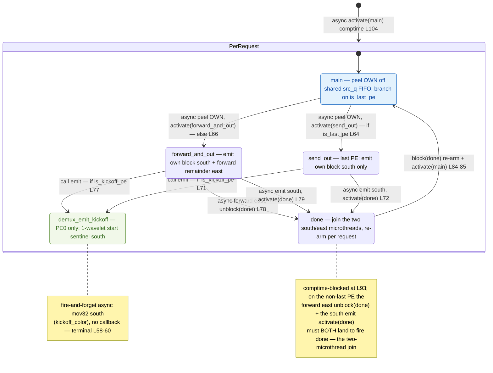

# demux.csl — task/fn state machine

> Model `qwen3_1p7b-prefill`, ref config `test_sim_2x4_kv_varlen.json`.
> Control-flow / state-machine companion to the algo walkthrough (`qwen3_1p7b-prefill.demux.md`).
> Diagram: `qwen3_1p7b-prefill.demux.statemachine.svg`. This file maps the **task activation graph**
> (who fires whom, sync vs async) — not the spatial peel/forward/fan-out geometry, which the algo doc covers.

## States

Five nodes: four `@bind_local_task` tasks (`main`, `send_out`, `forward_and_out`, `done`, bound at
`demux.csl:88-92`) plus the one plain `fn` reached by a synchronous call (`demux_emit_kickoff`,
`demux.csl:58-60`). All four tasks share one `done` join and re-arm per request; the same compiled
program runs on every column, and `my_idx`/`is_last_pe`/`is_kickoff_pe` select which out-edges a given
PE actually takes.

### `main` — the per-request entry / peel
- **In-edges:** the comptime `@activate(main_id)` at `demux.csl:104` (first request), and the re-arm
  `@activate(main_id)` from `done` at `demux.csl:85` (every subsequent request — the loop back-edge).
- **Body:** one async `@mov32` peels this column's `OWN` block off the shared `src_q` FIFO into `own_buf`
  (`demux.csl:62-67`). The peel's completion callback is the branch: it is the **only** work `main` does.
- **Out-edges (async, mutually exclusive on `is_last_pe`):**
  - `is_last_pe == 1` → `.activate = send_out_id` (`demux.csl:63-64`).
  - else → `.activate = forward_and_out_id` (`demux.csl:65-66`).

### `forward_and_out` — non-last PE (`my_idx < P-1`)
- **In-edge:** async peel-complete from `main` (`demux.csl:66`).
- **Body / out-edges:**
  - if `is_kickoff_pe != 0`: **synchronous** `call demux_emit_kickoff()` (`demux.csl:77`) — same-stack,
    runs before the two movs are issued.
  - async `@mov32` streams the remaining `FWD_EXTENT` wavelets east on `forward_oq`, callback
    `.unblock = done_id` (`demux.csl:78`).
  - async `@mov32` emits `own_buf` south on `out_oq`, callback `.activate = done_id` (`demux.csl:79`).
  - These two are the **concurrent microthreads that join at `done`** (see the join note below).

### `send_out` — last PE (`my_idx == P-1`)
- **In-edge:** async peel-complete from `main` (`demux.csl:64`).
- **Body / out-edges:**
  - if `is_kickoff_pe != 0`: synchronous `call demux_emit_kickoff()` (`demux.csl:71`). (In the 2×4 ref
    config the kickoff PE is PE 0, which is never the last PE, so this branch is effectively dormant
    there — but the program is column-generic.)
  - async `@mov32` emits `own_buf` south on `out_oq`, `.activate = done_id` (`demux.csl:72`). No east
    forward exists on the last PE (`FWD_EXTENT = 1` placeholder), so this is the single edge into `done`.

### `demux_emit_kickoff` — PE0 start-of-forward sentinel (leaf `fn`)
- **In-edges:** synchronous `call` from `forward_and_out` (`demux.csl:77`) or `send_out`
  (`demux.csl:71`), guarded by `is_kickoff_pe`.
- **Body:** one async `@mov32` pushes the 1-wavelet `kickoff_buf` south on `kickoff_oq`/`kickoff_color`
  (`demux.csl:58-60`). This async op has **no `.activate`/`.unblock`** — fire-and-forget, so the node is
  a control-flow **leaf** (no out-edge back into the state machine). It is a plain `fn`, not a bound
  task; it appears here only because it is the sole synchronous-call edge in the kernel.

### `done` — the join + per-request re-arm
- **In-edges:** on the non-last PE, `.unblock(done_id)` from the east-forward mov (`demux.csl:78`) and
  `.activate(done_id)` from the south-emit mov (`demux.csl:79`); on the last PE, the single
  `.activate(done_id)` from `send_out` (`demux.csl:72`).
- **The join:** `done_id` is `@block`-ed at comptime on non-last PEs (`demux.csl:93`). So even though the
  south-emit mov `.activate`s `done`, the task cannot fire until the east-forward mov `.unblock`s it —
  **both microthreads must complete**. This is a block/unblock barrier, not an ordinary activation, and
  is why `done` has two distinct in-edges from `forward_and_out`.
- **Out-edge (the loop):** if `is_last_pe != 1`, `@block(done_id)` re-arms the join gate for the next
  request (`demux.csl:84`), then `@activate(main_id)` re-parks `main` on the host/chain stream
  (`demux.csl:85`). This back-edge is what makes one compiled artifact serve arbitrary requests
  back-to-back.

## Legend

- **`async …`** — the transition is an async-op completion callback (`.activate` / `.unblock` on an
  `@mov32` microthread); the source task returns immediately and the edge fires later when the transfer
  drains.
- **`call …`** — a synchronous, same-stack `fn` call (`demux_emit_kickoff`); it runs inline before the
  caller continues.
- **`activate(x)`** — `@activate`/`.activate = x_id`, an activation edge. **`unblock(x)`** —
  `.unblock = x_id`, releases a `@block`-gated task. **`block(x)`** — `@block`, re-arms/holds a gate.
- **`[*]`** — entry (comptime `@activate`) / the composite's initial. **`PerRequest`** — the composite
  loop; `done → main` is the per-request re-arm back-edge.
- Branch guards on edges (`if is_last_pe`, `else`, `if is_kickoff_pe`) are the compile-time PE-role
  predicates; a given column takes only the matching edges.

## Edge inventory (control-transfer sites vs edges drawn)

| Site (source) | kind | target | edge in diagram |
|---|---|---|---|
| `@activate(main_id)` comptime `demux.csl:104` | activation | main | `[*] → PerRequest` |
| `.activate=send_out_id` `demux.csl:64` | async activation | send_out | main → send_out |
| `.activate=forward_and_out_id` `demux.csl:66` | async activation | forward_and_out | main → forward_and_out |
| `call demux_emit_kickoff()` `demux.csl:71` | sync call | demux_emit_kickoff | send_out → demux_emit_kickoff |
| `call demux_emit_kickoff()` `demux.csl:77` | sync call | demux_emit_kickoff | forward_and_out → demux_emit_kickoff |
| `.activate=done_id` `demux.csl:72` | async activation | done | send_out → done |
| `.unblock=done_id` `demux.csl:78` | async unblock | done | forward_and_out → done (forward east) |
| `.activate=done_id` `demux.csl:79` | async activation | done | forward_and_out → done (emit south) |
| `@activate(main_id)` `demux.csl:85` | activation | main | done → main (re-arm) |
| `@block(done_id)` comptime `demux.csl:93` | gate (initial) | done | join note |
| `@block(done_id)` `demux.csl:84` | gate (re-arm) | done | done → main label |

**7 activation/unblock edges** (2 `@activate` + 4 `.activate` + 1 `.unblock`) + **2 sync `call` edges**,
all drawn; the **2 `@block` sites** are gating (shown as the `done` re-arm label + the join note), not
separate arrows. One inline async `@mov32` (`demux.csl:59`) inside `demux_emit_kickoff` has no callback,
so it is a control-flow leaf with no out-edge.
