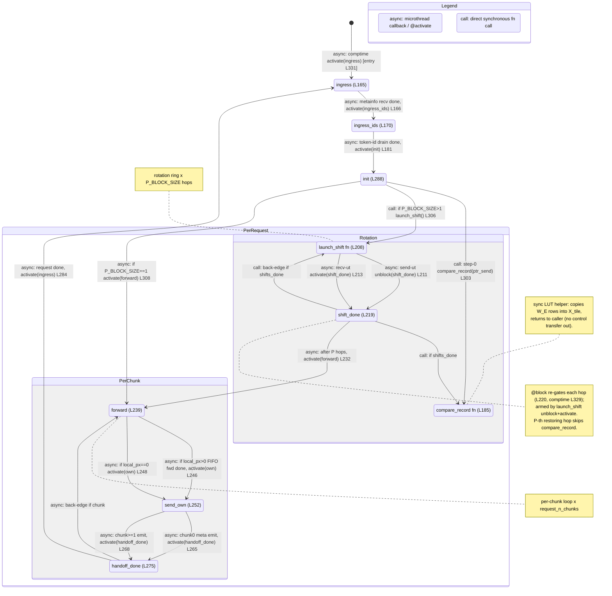

# ht_head.csl — task/fn state machine

> Model `qwen3_1p7b-prefill`, ref config `test_sim_2x4_kv_varlen.json`. Control-flow / state-machine
> companion to the algo walkthrough (`qwen3_1p7b-prefill.ht_head.md`). Nodes = tasks + directly-called fns;
> edges = control transfers (async microthread/`@activate` vs synchronous `call`). Diagram:
> `qwen3_1p7b-prefill.ht_head.statemachine.svg`.

## States, in-edges, out-edges

Entry is the single `@activate(ingress_id)` in the comptime block (`ht_head.csl:331`), drawn from `[*]`.
`ingress → ... → handoff_done → ingress` is the **per-request** loop; inside it the **rotation ring** and the
**per-chunk handoff** are the two inner loops.

- **ingress** (`ht_head.csl:165`). Peels the `metainfo_len`-word header off the front of the demux `tok_bcast`
  stream. *In:* entry `@activate` (L331) and the per-request back-edge from `handoff_done` (L284, async). *Out:*
  the `@mov32` metainfo recv arms `.activate = ingress_ids_id` — one async edge to `ingress_ids` (L166).

- **ingress_ids** (`ht_head.csl:170`). Decodes `request_n_chunks` / `last_token_chunk_pos` / `start_chunk`,
  packs the fp16 metainfo tail, sets `current_prefill_chunk = start_chunk`, and drains the column's token ids.
  *In:* async from `ingress` (L166). *Out:* the `@mov32` token-id drain arms `.activate = init_id` — one async
  edge to `init` (L181).

- **init** (`ht_head.csl:288`). Computes `local_px`, tags `we_buf_0[WE_LEN]`, resets the ping-pong pointers.
  *In:* async from `ingress_ids` (L181). *Out:* three edges — a **sync call** to `compare_record` (step 0,
  L303), then a branch on `P_BLOCK_SIZE`: `>1` → **sync call** `launch_shift()` (L306); `==1` (one column owns
  the whole vocab) → async `@activate(forward)` (L308), skipping the ring entirely.

- **compare_record** (`ht_head.csl:185`, fn — inside `Rotation`). Pure local LUT match: for every token id in
  the currently-held vocab tile it copies the embedding row into `X_tile`. *In:* two **sync call** edges — from
  `init` step 0 (L303) and from `shift_done` per hop (L225). *Out:* none drawn — it returns synchronously to
  its caller (leaf helper, no control transfer or comms).

- **launch_shift** (`ht_head.csl:208`, fn — inside `Rotation`). Arms one ring hop: loads the send fabout DSR
  with `.unblock = shift_done_id` (send ut, L211) and the recv fabin DSR with `.activate = shift_done_id` (recv
  ut, L213), then fires the two disjoint microthreads. *In:* two **sync call** edges — from `init` (L306) and
  from `shift_done` back-edge (L230). *Out:* two **async** edges into `shift_done` — the send-ut `unblock`
  (L211) and the recv-ut `activate` (L213); both must complete for `shift_done` to run.

- **shift_done** (`ht_head.csl:219`, task — inside `Rotation`). Re-`@block`s itself (L220), then for hops
  `0..P-2` calls `compare_record(ptr_recv)`, increments `shifts_done`, swaps the ping-pong pointers, and
  either loops or exits. *In:* the two async microthread edges from `launch_shift` (L211/L213). *Out:* a **sync
  call** back to `launch_shift` while `shifts_done < P_BLOCK_SIZE` (rotation back-edge, L230), a **sync call**
  to `compare_record` while `shifts_done < P-1` (L225), and — after the P-th (restoring) hop — an **async**
  `@activate(forward)` (L232) leaving the ring.

- **forward** (`ht_head.csl:239`, task — inside `PerChunk`). Per prefill chunk, forwards the upstream columns'
  payloads west→east off the FIFO. *In:* async from `shift_done` after the ring (L232), from `init` in the
  `P==1` case (L308), and the per-chunk back-edge from `handoff_done` (L278). *Out:* two async edges to
  `send_own` — `local_px>0` fires the `@mov16` FIFO forward with `.activate = own_id` (L246); `local_px==0`
  (no west neighbour) `@activate(own)` directly (L248).

- **send_own** (`ht_head.csl:252`, task — inside `PerChunk`). Emits this column's own chunk east. *In:* two
  async edges from `forward` (L246/L248). *Out:* two async edges to `handoff_done` — the chunk-0 branch
  assembles `[bcol0][meta][bcol1][meta]` then `@mov16 ... .activate = handoff_done_id` (L265); chunks ≥1 emit
  the clean `OWN_LEN` with the same activation (L268).

- **handoff_done** (`ht_head.csl:275`, task — inside `PerChunk`). One chunk done: `current_prefill_chunk++`.
  *In:* two async edges from `send_own` (L265/L268). *Out:* if more chunks remain, async `@activate(forward)`
  — the **per-chunk back-edge** (L278); else it resets `shifts_done`/`current_prefill_chunk` and async
  `@activate(ingress)` — the **per-request back-edge** (L284) that re-arms ingest.

## Loop boundaries

- **Rotation ring** (`Rotation` composite): `launch_shift → shift_done → launch_shift`, iterated
  `P_BLOCK_SIZE` hops. The back-edge (L230) and the two forward microthread edges (L211/L213) are the ring; the
  P-th hop is the self-restoring rotation that skips `compare_record` and instead `@activate(forward)` (L232).
- **Per-chunk handoff** (`PerChunk` composite): `forward → send_own → handoff_done → forward`, iterated
  `request_n_chunks` times; back-edge L278.
- **Per-request** (`PerRequest` composite): the whole body re-arms via `handoff_done → ingress` (L284).

## Legend

- **`async:`** — an async microthread callback (`.activate` / `.unblock` on a `@mov`/`@load_to_dsr`
  microthread) or a comptime/task `@activate`. The successor runs later, off the fabric/DSR completion.
- **`call:`** — a direct synchronous fn call on the same stack (`compare_record`, `launch_shift`); returns to
  the caller.
- `@block(shift_done_id)` is a **gating** primitive, not a transition: comptime L329 blocks it at startup and
  L220 re-blocks it each hop; `launch_shift`'s `unblock`/`activate` (L211/L213) release it. Shown as a note on
  `shift_done`.

## Edge/site accounting

Grep of `ht_head.csl` control-flow sites vs. edges drawn:

- **`@activate`** — 6 sites (L232, L248, L278, L284, L308, L331) → 6 edges (shift_done→forward, forward→send_own
  local_px==0, handoff_done→forward, handoff_done→ingress, init→forward, `[*]`→ingress). Match.
- **`.activate`** (microthread callbacks) — 6 sites (L166, L181, L213, L246, L265, L268) → 6 edges
  (ingress→ingress_ids, ingress_ids→init, launch_shift→shift_done recv, forward→send_own local_px>0,
  send_own→handoff_done chunk0, send_own→handoff_done chunk≥1). Match.
- **`.unblock`** — 1 site (L211) → 1 edge (launch_shift→shift_done send). Match.
- **`@block`** — 2 sites (L220 re-gate, L329 comptime) → 1 gating note on `shift_done` (self-gate, no
  transition drawn). Accounted.
- **Direct fn calls** (sync) — 4 edges: init→compare_record (L303), init→launch_shift (L306),
  shift_done→compare_record (L225), shift_done→launch_shift (L230).

Total: 9 nodes (7 tasks + 2 fns), 17 control-transfer edges + 1 gating note. Every node has an in-edge except
the single entry `ingress`; `compare_record` is the one sink (sync leaf helper); both inner back-edges and the
per-request back-edge close.
