# ht_tail.csl — task/fn state machine

> Model `qwen3_1p7b-prefill`, ref config `test_sim_2x4_kv_varlen.json`.
> Control-flow / state-machine companion to the algo walkthrough `qwen3_1p7b-prefill.ht_tail.md`.
> Nodes = tasks and the sync fns they drive; edges = control transfers (`async:` @activate / scheduling,
> `call:` direct fn call, `event:` blocking fabric recv park). File:line citations point at `ht_tail.csl`.

```mermaid
stateDiagram-v2
    state "tail_init task (L1017)" as tail_init
    state "tail_main task (L1110)" as tail_main

    [*] --> tail_init : async comptime activate(tail_init) [entry L1208]
    tail_init --> tail_main : async activate(tail_main) L1103
    tail_main --> tail_main : async re-arm activate(tail_main), re-park on Z L1177

    state tail_init {
        state "derive coords + Y/X chain ids (L1018-1025)" as ti_derive
        state "write_Y_routes_tail fn (L419)" as ti_wY
        state "paint static routes: Z-drain L1035, south L1044, xready L1054, kickoff L1082; seed PRNG L1079; enable TSC L1100" as ti_routes
        [*] --> ti_derive
        ti_derive --> ti_wY : call write_Y_routes_tail() L1027
        ti_wY --> ti_routes : return
        ti_routes --> [*]
    }

    state tail_main {
        state "TSC start (is_tsc_pe): park on kickoff sentinel L1116, sample start L1117" as tm_tsc_start
        state "drain Z: fmovh z_slice from z_recv L1120" as tm_drainZ
        state "tail_final_rmsnorm fn (L352): fp32 sumsq, Y-allreduce, normalize x W" as tm_rmsnorm
        state "tail_lm_head_matvec fn (L334): local GEMV partials = lm_head @ Z" as tm_lmhead
        state "tail_logits_reduce_bsz_vocab fn (L655): Y 2-phase reduce, NO bcast" as tm_logred
        state "south emit L1157 (x==HT_WIDTH-1 and root row): topk_val + topk_arg + pred_token to mux OQ0" as tm_south
        state "TSC end (is_tsc_pe): sample end L1167, async mov32 8-u32 burst to OQ0 L1174" as tm_tsc_end

        [*] --> tm_tsc_start
        tm_tsc_start --> tm_drainZ : event kickoff sentinel (is_tsc_pe) / else fall through
        tm_drainZ --> tm_rmsnorm : event Z arrives from last block

        state tm_rmsnorm {
            state "phase1 per-batch local sumsq (L361)" as rn_sumsq
            state "tail_reduce_bsz_f32 fn (L754)" as rn_wrap
            state "tail_reduce_2phase fn (L661), do_broadcast=1, Y allreduce" as rn_reduce
            state "phase3 normalize + cast + mul W_final_norm (L388)" as rn_norm
            [*] --> rn_sumsq
            rn_sumsq --> rn_wrap : call tail_reduce_bsz_f32() L383
            rn_wrap --> rn_reduce : call tail_reduce_2phase() L755
            rn_reduce --> rn_norm : return
            rn_norm --> [*]
        }

        tm_rmsnorm --> tm_lmhead : call tail_lm_head_matvec() L1125

        state tm_lmhead {
            state "vecmat_computation_lm fn (L313)" as lm_vecmat
            state "gemv_lm_step fmachs (L309) via map, loop bsz x dim_per_pe" as lm_step
            [*] --> lm_vecmat : call vecmat_computation_lm() L342
            lm_vecmat --> lm_step : map over left_vector L325
            lm_step --> lm_step : per-K fmachs accumulate
            lm_step --> [*] : per-batch done L318
        }

        tm_lmhead --> tm_logred : call tail_logits_reduce_bsz_vocab() L1127

        state tm_logred {
            state "tail_reduce_2phase fn (L661), do_broadcast=0, len bsz x V_per_pe_x" as lr_reduce
            [*] --> lr_reduce : call tail_reduce_2phase() L656
            lr_reduce --> [*] : logits land on root_2nd_phase row
        }

        tm_logred --> tm_topk : call if tail_my_py==root_2nd_phase L1132
        tm_logred --> tm_south : else (non-root rows skip top-K)

        state tm_topk {
            state "write_X_routes_tail fn (L531): repaint reduce colors Y to X" as tk_wX
            state "xready barrier L1137: root_2nd_phase_x sends go / others recv (event)" as tk_barrier
            state "tail_local_topk fn (L774): loop bsz x TOP_K masked-argmax" as tk_local
            state "tail_topk_mergereduce_x fn (L834): X 2-phase reduce, per-hop merge + bcast" as tk_merge
            state "topk_merge_local fn (L808): 2-pointer K-list merge, loop bsz" as tk_mergefn
            state "tail_sample_token fn (L963): softmax, top-p, PRNG draw (root_2nd_phase_x only)" as tk_sample
            state "predtok X-bcast L1148 / recv L1150" as tk_predbcast
            state "write_Y_routes_tail fn (L419): restore Y routes" as tk_wY
            [*] --> tk_wX : call write_X_routes_tail() L1133
            tk_wX --> tk_barrier : return
            tk_barrier --> tk_local : call tail_local_topk() L1142
            tk_local --> tk_merge : call tail_topk_mergereduce_x() L1143
            tk_merge --> tk_mergefn : call topk_merge_local() per hop L840
            tk_mergefn --> tk_merge : return per hop
            tk_merge --> tk_sample : call tail_sample_token() if root_2nd_phase_x L1147
            tk_sample --> tk_predbcast : return
            tk_predbcast --> tk_wY : call write_Y_routes_tail() L1152
            tk_wY --> [*]
        }

        tm_topk --> tm_south : proceed
        tm_south --> tm_tsc_end : if is_tsc_pe L1166
        tm_south --> [*] : else exit
        tm_tsc_end --> [*]
    }

    note right of tm_drainZ
        Event-driven fabric parks (not activate/block):
        kickoff L1116, z_recv L1120, xready L1140.
    end note
    note right of tm_rmsnorm
        Two-phase reduce chain shared with tm_logred:
        both call tail_reduce_2phase (L661); rmsnorm
        broadcasts (bsz), logits do not (bsz x V_per_pe_x).
    end note
    note left of tk_merge
        X merge-reduce loops per hop; each hop recvs KB
        val + KB id, merges via topk_merge_local, sends.
    end note

    state Legend {
        state "async: microthread callback / @activate (scheduling edge)" as L1
        state "call: direct synchronous fn call (same stack)" as L2
        state "event: blocking fabric recv park (not activate/block)" as L3
    }
```

## States

Only two things are real scheduling units — the tasks `tail_init` and `tail_main` (bound at
`ht_tail.csl:1205-1206`, ids 10/11). Everything else runs on `tail_main`'s stack as synchronous fn calls;
the composite `state { }` blocks below bound those per-request sub-flows.

### Entry and the two tasks

- **`[*] → tail_init`** — the only entry. The comptime block schedules it with `@activate(tail_init_id)`
  (`ht_tail.csl:1208`). This is the single in-edge with no source state.
- **`tail_init` (`:1017`)** — one-shot per-PE setup: reads its wafer coord, derives local `(x, py)` plus the
  Y and X chain ids (`:1018-1025`); **calls** `write_Y_routes_tail()` (`:1027`); then paints all static
  routes (Z-drain multicast `:1035`, south emit `:1044`, X-phase barrier tree `:1054`, TSC kickoff `:1082`),
  seeds the PRNG on the sampling PE (`:1079`), and enables the TSC counter on `is_tsc_pe` (`:1100`).
  In-edge: entry. Out-edge: **`async: @activate(tail_main_id)`** (`:1103`).
- **`tail_main` (`:1110`)** — the per-request pipeline. In-edges: the activation from `tail_init` (`:1103`)
  and its own **re-arm back-edge** `@activate(tail_main_id)` (`:1177`). There is no terminal — after emitting
  the token, `tail_main` re-activates itself and re-parks on `z_recv` for the next request's `Z`
  (prefill is one-shot per request but the task loops across requests).

### `tail_init` internals

`ti_derive → ti_wY → ti_routes`, all synchronous. `ti_wY` is `write_Y_routes_tail` (`:419`) called at
`:1027`; it returns to the caller (`return` edge), then `ti_routes` paints the remaining static routes.
Composite exit `→ [*]` precedes the `async: activate(tail_main)` out-edge drawn at the top level.

### `tail_main` pipeline

1. **`tm_tsc_start`** — on `is_tsc_pe` only: parks on the kickoff sentinel (`@mov32` from `kickoff_recv`,
   `:1116`, **event-driven**) then samples the start TSC (`:1117`). Non-TSC PEs fall straight through.
2. **`tm_drainZ`** — `@fmovh(z_slice_buf, z_recv)` (`:1120`): a **blocking fabric recv** that parks until the
   last serpentine block ships `Z` east into the tail. Out-edge triggered by `event: Z arrives`.
3. **`tm_rmsnorm`** (composite, `tail_final_rmsnorm` `:352`) — `rn_sumsq` computes the per-batch fp32
   sum-of-squares (`:361`), **calls** `tail_reduce_bsz_f32` (`:754`, at `:383`) which **calls**
   `tail_reduce_2phase` (`:661`, at `:755`) with `do_broadcast=1` — a Y-axis 2-phase all-reduce of the `bsz`
   sums. Control returns to `rn_norm` (`:388`) for normalize + cast + `* W_final_norm`, in place over
   `z_slice_buf`.
4. **`tm_lmhead`** (composite, `tail_lm_head_matvec` `:334`) — **calls** `vecmat_computation_lm` (`:313`, at
   `:342`), which `@map`s `gemv_lm_step` (`:309`) over the left vector (`:325`). `lm_step → lm_step` is the
   **per-K `@fmachs` accumulate loop**; the outer `for b in bsz` (`:318`) closes the composite. Purely local,
   no comms.
5. **`tm_logred`** (composite, `tail_logits_reduce_bsz_vocab` `:655`) — **calls** `tail_reduce_2phase`
   (`:661`, at `:656`) with `do_broadcast=0` and the wider `bsz*V_per_pe_x` extent; the full logits land only
   on the `root_2nd_phase` row. This is the **second caller of the shared two-phase reduce** (see the note),
   which is why `tail_reduce_2phase` is drawn once inside each caller's composite rather than as a shared
   global node with an ambiguous return.
6. **Root-row branch** (`:1132`): `tm_logred → tm_topk` when `tail_my_py == root_2nd_phase`; otherwise
   `tm_logred → tm_south` (non-root rows stay in Y-route mode and skip the top-K block entirely).

### `tm_topk` internals (root row only)

- **`tk_wX`** — `write_X_routes_tail` (`:531`, called `:1133`): repaints reduce colors 1-5 from Y to X.
- **`tk_barrier`** — the X-phase fence (`:1137`): `root_2nd_phase_x` sends a 1-wavelet "go"; every other
  root column does a **blocking recv** (`:1140`, event) before any X send, so no column emits an X-mode
  wavelet into a neighbor still painted for Y.
- **`tk_local`** — `tail_local_topk` (`:774`, called `:1142`): the **top-K loop**, `bsz × TOP_K`
  masked-argmax passes over this PE's `V_per_pe_x` logit slice; seeds `topk_val`/`topk_arg`.
- **`tk_merge`** — `tail_topk_mergereduce_x` (`:834`, called `:1143`): X-axis 2-phase reduce whose per-hop
  combine **calls** `topk_merge_local` (`tk_mergefn`, `:808`, first at `:840`). `tk_merge ↔ tk_mergefn` is
  the **per-hop merge loop**; each hop recvs `KB` fp16 vals + `KB` i32 ids, merges into the running top-K,
  sends it on; the final broadcast (`:950`) replicates the global top-K across the root row.
- **`tk_sample`** — `tail_sample_token` (`:963`, called `:1147`, `root_2nd_phase_x` only): temperature →
  fp32 softmax → top-p nucleus → categorical PRNG draw into `pred_token_buf`.
- **`tk_predbcast`** — X-broadcasts the sampled id to every root column (`:1148` send / `:1150` recv) so the
  east-most column has it.
- **`tk_wY`** — `write_Y_routes_tail` (`:419`, called `:1152`): restores Y routes. Composite exit `→ [*]`.

### Tail of `tail_main`

- **`tm_south`** (`:1157`) — only the east-most root PE (`x == HT_WIDTH-1 && y == root_2nd_phase`) emits
  `topk_val` + `topk_arg` + `pred_token` (+ even-count pad) south on `logits_south_color` (OQ 0) to the mux
  → host. Both the `tm_topk` exit and the non-root bypass converge here.
- **`tm_tsc_end`** (`:1166`) — `is_tsc_pe` samples the end TSC (`:1167`), packs start+end into an 8-u32 burst,
  and **async-emits** it (`@mov32 … .{ .async = true }`, `:1174`) — a fire-and-forget send with no callback,
  so it is a note, not an activation edge.
- Composite exit `→ [*]`, then the top-level **`async: re-arm activate(tail_main)`** back-edge (`:1177`)
  returns to park on `Z` for the next request.

## Legend

- **`async:`** — a scheduling edge: `@activate` (task activation) or a microthread callback. Exactly three
  in this kernel (all `@activate`): entry `:1208`, `tail_init → tail_main` `:1103`, and the `tail_main`
  re-arm `:1177`.
- **`call:`** — a direct synchronous fn call on the same stack; `return` edges close each sub-call back to
  its caller.
- **`event:`** — a blocking fabric recv park (kickoff `:1116`, `z_recv` `:1120`, xready `:1140`). These gate
  progress but are not `@activate`/`@block` primitives.
