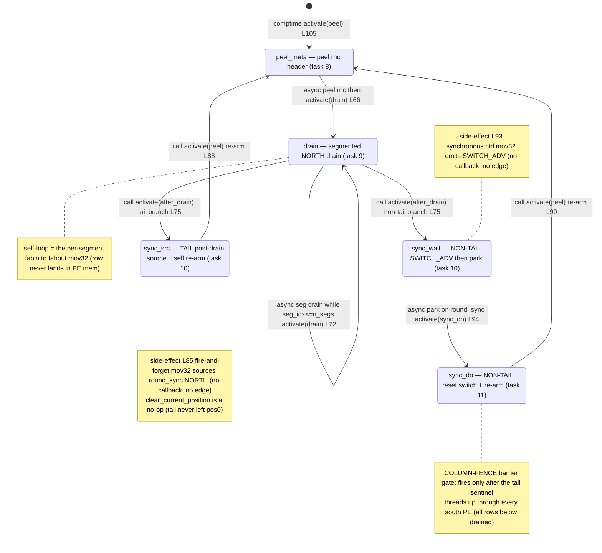

# kv_egress_colmux.csl — task/fn state machine

> Model `qwen3_1p7b-prefill`, ref config `test_sim_2x4_kv_varlen.json`. Control-flow / state-machine companion to the algo walkthrough (`qwen3_1p7b-prefill.kv_egress_colmux.md`). Diagram: `qwen3_1p7b-prefill.kv_egress_colmux.statemachine.svg`. This is the *task-graph* view (who activates whom); spatial sharding and the switch-gather / colmux comm pattern appear only as edge triggers.

Every mux PE runs this same program; the only per-PE branch is `is_col_tail`, which the comptime block resolves by binding either `sync_src` (tail) or `sync_wait`+`sync_do` (non-tail) to `after_drain_id` (`kv_egress_colmux.csl:102-116`). So the graph has **five** task nodes but any single PE walks only **four** of them (tail: `peel_meta`→`drain`→`sync_src`; non-tail: `peel_meta`→`drain`→`sync_wait`→`sync_do`).

## States

**`peel_meta` (task 8, `@get_local_task_id(8)` `:58`, bound `:103`).** The entry state — the only one activated from `[*]`, via the comptime `@activate(peel_id)` (`:105`). Peels the row's leading `request_n_chunks` word into `meta_buf` with an async `@mov32(meta_buf_dsd, meta_in_dsd, …)`; the header is **not** forwarded to the host. Out-edge: the async `.activate = drain_id` callback fires `drain` once the 1-word peel completes (`:66`). Also re-entered every request from `sync_src` / `sync_do`.

**`drain` (task 9, `:59`, bound `:104`).** Segmented NORTH drain of this PE's row. On the first entry (`seg_idx == 0`) it latches `n_segs_rt = meta_buf[0]` (`:69`); each entry drains one `seg_len` segment `fabin→fabout` via `@mov32(seg_out_dsd, seg_in_dsd, …)`. In-edges: from `peel_meta` (`:66`) and its own async self-loop. Out-edges are a branch on the segment counter (`:71-76`):
- **self-loop** while `seg_idx <= n_segs_rt`: the async `.activate = drain_id` re-fires `drain` for the next segment (`:72`). This back-edge is the row streaming out; the row bytes never land in PE memory.
- **exit** when segments are exhausted: `seg_idx` resets to 0 and `@activate(after_drain_id)` hands off to the role-bound post-drain state (`:74-75`).

**`sync_src` (task 10 on the TAIL, bound to `after_drain_id` only when `is_col_tail==1`, `:108-110`).** The south-most PE is structurally the last to drain, so every row above it has already threaded through to the host. It sources one `round_sync` sentinel NORTH with a fire-and-forget `@mov32(sync_emit_dsd, sync_buf_dsd, …)` (`:85` — async, **no** callback, so no activation edge), does a no-op `clear_current_position` (the tail never left `pos0`, `:86`), then re-arms inline with `@activate(peel_id)` (`:88`). In-edge: from `drain` (tail branch). Out-edge: sync `@activate` back to `peel_meta`.

**`sync_wait` (task 10 on NON-TAIL PEs, bound to `after_drain_id` when `is_col_tail==0`, `:112`).** Hands the NORTH path to the rows below, then parks. First it emits one `SWITCH_ADV` control wavelet on `out_color` with a **synchronous** `@mov32(ctrl_out, …)` (`:93` — no callback, no edge) to flip this PE's switch from `RAMP→N` to `S→N`. Then it parks on the barrier: async `@mov32(sync_buf_dsd, sync_recv_dsd, .activate = sync_do_id)` blocks until the tail's sentinel arrives (`:94`). In-edge: from `drain` (non-tail branch). Out-edge: async `.activate` to `sync_do`.

**`sync_do` (task 11, NON-TAIL only, `:60-61`, bound `:113`).** The **column-fence release**. It runs only after the tail-sourced sentinel has threaded up through every PE to its south (i.e. all rows below have finished draining), guaranteeing no early switch reset breaks a still-active forward path. It resets the switch with `clear_current_position(out_color)` back to `pos0`, clears `n_segs_rt`, and re-arms with `@activate(peel_id)` (`:96-100`). In-edge: from `sync_wait` (`:94`). Out-edge: sync `@activate` back to `peel_meta`.

## Loops and the barrier

- **Inner drain loop:** `drain → drain` (async, `:72`) — one iteration per segment.
- **Per-request re-arm (outer loop):** every path returns to `peel_meta` — the tail via `sync_src`, non-tail via `sync_wait → sync_do`. This closes the serve-loop back-edge so the same column drains the next request.
- **Column-fence barrier:** the `round_sync` color is the gate. The tail *sources* it (`sync_src` `:85`); non-tail PEs *park* on it in `sync_wait` (`:94`) and only release in `sync_do` (`:96`). This is what forces the switch reset to happen for the whole column together, after the last (south-most) row has drained.

## kv_fwd.csl

`kv_fwd.csl` is a **task-less pass-through relay** — its entire body is an empty `comptime { }` (`kv_fwd.csl:15`), no queues, no tasks, no `@bind_local_task`; the router forwards its host-painted color untouched, so it has no state machine and gets no diagram.

## Legend

- **Node** = a `task`/`fn` that is `@activate`-d or bound as a task (all five here are `@bind_local_task`).
- Edge label prefix **`call:`** (written `call` in the diagram) = synchronous `@activate`; **`async:`** (written `async`) = an async `@mov32` microthread callback (`.activate`). No `@block`/`@unblock` sites exist in this kernel.
- `L<n>` in a label = source line in `kv_egress_colmux.csl`.
- `[*]` = the comptime entry (`:105`).
- Branches `tail branch` / `non-tail branch` = the single `@activate(after_drain_id)` site (`:75`) resolving to the role-bound target (`sync_src` vs `sync_wait`).
