# mux.csl — task/fn state machine

> Model `qwen3_1p7b-prefill`, ref config `test_sim_2x4_kv_varlen.json`.
> Control-flow / state-machine companion to the algo walkthrough (`qwen3_1p7b-prefill.mux.md`).
> Diagram: `qwen3_1p7b-prefill.mux.statemachine.svg`. This file maps the *task/fn control flow only* —
> the spatial "who forwards to whom" story lives in the algo walkthrough.

```mermaid
stateDiagram-v2
    [*] --> main : comptime activate(main_id)

    state "main() — drain blob from north" as main
    state "send() — forward blob east" as send
    state "tsc_recv() — drain 8-u32 TSC burst" as tsc_recv
    state "tsc_send() — forward TSC east, re-park" as tsc_send

    main --> send : async: mov32 done, activate(send_id)
    send --> tsc_recv : async: mov32 done, activate(tsc_recv_id)
    tsc_recv --> tsc_send : async: mov32 done, activate(tsc_send_id)
    tsc_send --> main : async: mov32 done, activate(main_id) — re-arm

    note right of main : only east-most PE (is_last_pe==1) is armed; all other mux PEs inert
    note right of tsc_send : re-armed cycle, one pass per request
```

## Shape of the machine

Four tasks form a single **linear async chain that closes into a loop**:
`main → send → tsc_recv → tsc_send → main`. Every transition is an **async activation** fired by the
`.activate` callback of an `@mov32` microthread — there are no synchronous `fn` calls, no `@block`/`@unblock`
gating, and no data/control-task bindings. The whole kernel is armed **only on the east-most PE**
(`is_last_pe == 1`); on every other mux PE the four tasks are never bound or activated, so the PE is inert
(`mux.csl:53-63`).

The chain is **re-armed, not one-shot**: the final task activates `main_id` again to re-park for the next
request (`mux.csl:49-50`). Per request it makes exactly one pass through the four states.

## States

### `main()` — drain the blob from the north
- **Bound / entry:** `@bind_local_task(main, main_id)` (`mux.csl:57`); `main_id = @get_local_task_id(8)` (`mux.csl:32`).
- **In-edge:** the single entry — `@activate(main_id)` in the comptime block (`mux.csl:60`); and the loop
  back-edge from `tsc_send` (`mux.csl:50`).
- **Body:** async `@mov32(blob_dsd, recv_dsd, …)` — drains the `N = TOP_K*bsz` u32 result blob arriving from
  the north (HT_tail east-most) over `in_color`/`in_q` into local `blob` (`mux.csl:37-39`, DSDs at `mux.csl:17-22`).
- **Out-edge:** `async: activate(send_id)` on mov32 completion (`mux.csl:38`).

### `send()` — forward the blob east to the host
- **Bound:** `@bind_local_task(send, send_id)` (`mux.csl:58`); `send_id = @get_local_task_id(9)` (`mux.csl:33`).
- **In-edge:** `async: activate(send_id)` from `main` (`mux.csl:38`).
- **Body:** async `@mov32(send_dsd, blob_dsd, …)` — pushes the buffered blob out east on `host_color`/`host_oq`
  toward the host stream at the east edge (`mux.csl:41-43`, `send_dsd` at `mux.csl:23`).
- **Out-edge:** `async: activate(tsc_recv_id)` on completion (`mux.csl:42`).

### `tsc_recv()` — drain the 8-u32 TSC burst from the north
- **Bound:** `@bind_local_task(tsc_recv, tsc_recv_id)` (`mux.csl:59`); `tsc_recv_id = @get_local_task_id(10)` (`mux.csl:34`).
- **In-edge:** `async: activate(tsc_recv_id)` from `send` (`mux.csl:42`).
- **Body:** async `@mov32(tsc_blob_dsd, tsc_recv_dsd, …)` — drains one 8-u32 TSC timestamp burst piggybacked
  from the north (HT_tail TSC PE), reusing `in_q` (`mux.csl:45-47`, DSDs at `mux.csl:27-29`).
- **Out-edge:** `async: activate(tsc_send_id)` on completion (`mux.csl:46`).

### `tsc_send()` — forward the TSC burst east, then re-park
- **Bound:** `@bind_local_task(tsc_send, tsc_send_id)` (`mux.csl:59`); `tsc_send_id = @get_local_task_id(11)` (`mux.csl:35`).
- **In-edge:** `async: activate(tsc_send_id)` from `tsc_recv` (`mux.csl:46`).
- **Body:** async `@mov32(tsc_send_dsd, tsc_blob_dsd, …)` — forwards the TSC burst east to the host edge,
  reusing `host_oq` (`mux.csl:49-51`, `tsc_send_dsd` at `mux.csl:30`).
- **Out-edge / loop back-edge:** `async: activate(main_id)` on completion — **re-arms `main` for the next
  request** (`mux.csl:50`).

## Legend

- **`[*]`** — kernel entry (the single comptime `@activate`, `mux.csl:60`); this machine has no terminal state,
  it loops.
- **`async:`** edge — an activation delivered by the `.activate` callback of an `@mov32` async microthread,
  i.e. fires when that fabric move completes. All four edges here are async.
- **`call:`** edge (sync `fn` call) — **none present** in this kernel.
- **Gating** (`@block`/`@unblock`) — **none present**.
- Nodes are `task`s only; there are no `@activate`-d `fn`s, no `@get_data_task_id`/`@get_control_task_id`
  bindings.

## Validation (count-exact)

- **Nodes:** 4 tasks (`main`, `send`, `tsc_recv`, `tsc_send`) — all `@bind_local_task`'d at `mux.csl:57-59`. No orphans.
- **Control-transfer sites vs edges drawn:**
  - `@activate` sites: 1 comptime (`mux.csl:60`) → drawn as the `[*] → main` entry edge.
  - `.activate` callbacks on `@mov32`: 4 (`mux.csl:38, 42, 46, 50`) → drawn as the 4 chain edges
    (`main→send`, `send→tsc_recv`, `tsc_recv→tsc_send`, `tsc_send→main`).
  - `.unblock` callbacks: 0. `@block`/`@unblock`: 0. Direct `fn` calls: 0.
  - **Total: 5 control edges (1 entry + 4 async), matching 5 drawn edges.**
- Every node has an in-edge; `main` has two (entry + loop back-edge). The `tsc_send → main` back-edge closes the loop.
- **One-shot vs re-armed:** re-armed — the chain re-parks `main` per request (`mux.csl:49-50`); the file header
  calls it "one-shot" meaning one blob pass *per request*, not never-re-armed.
