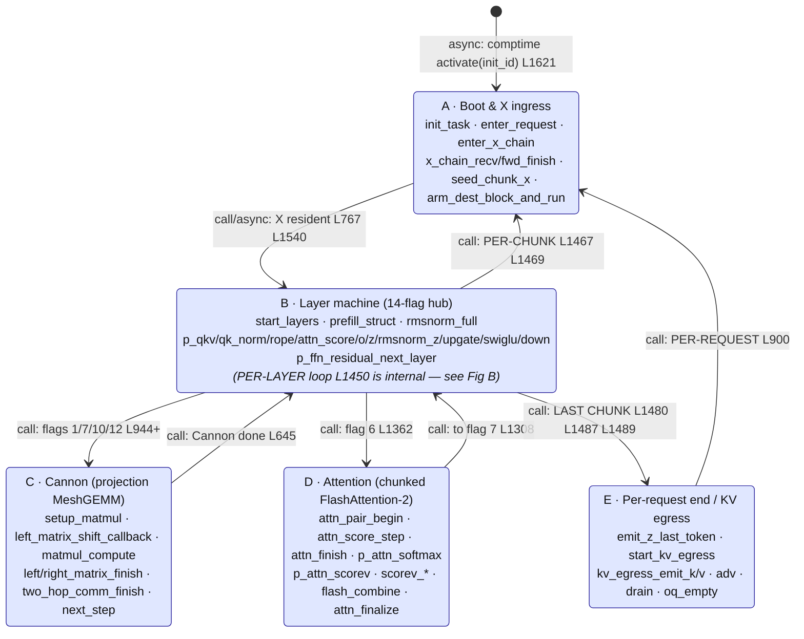
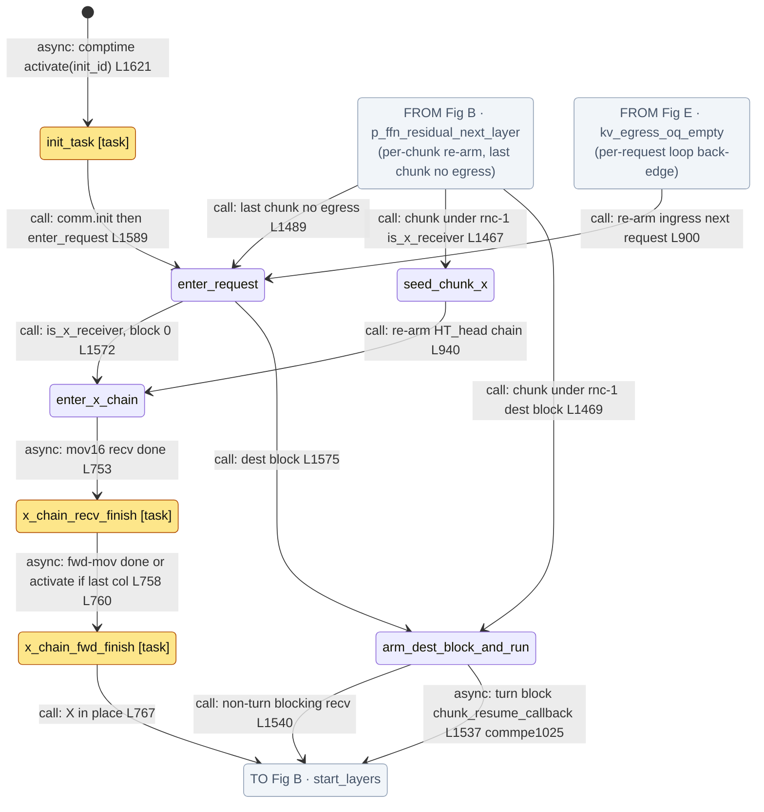
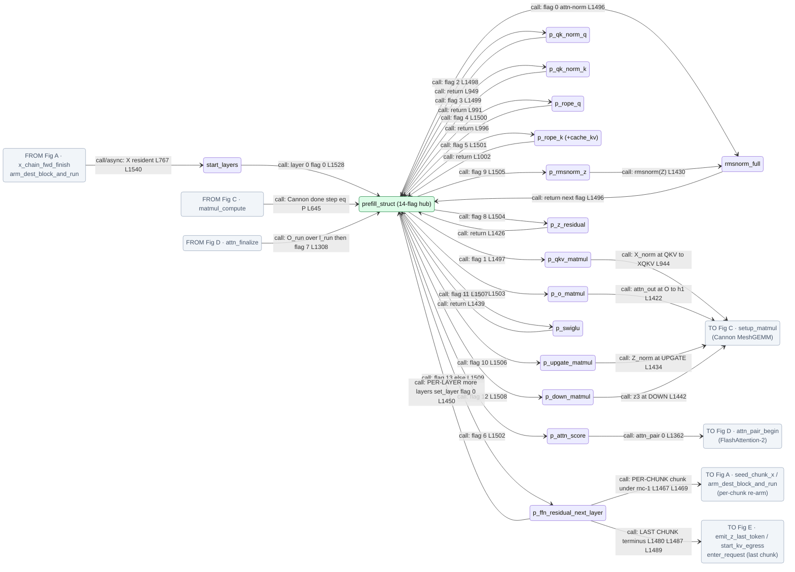
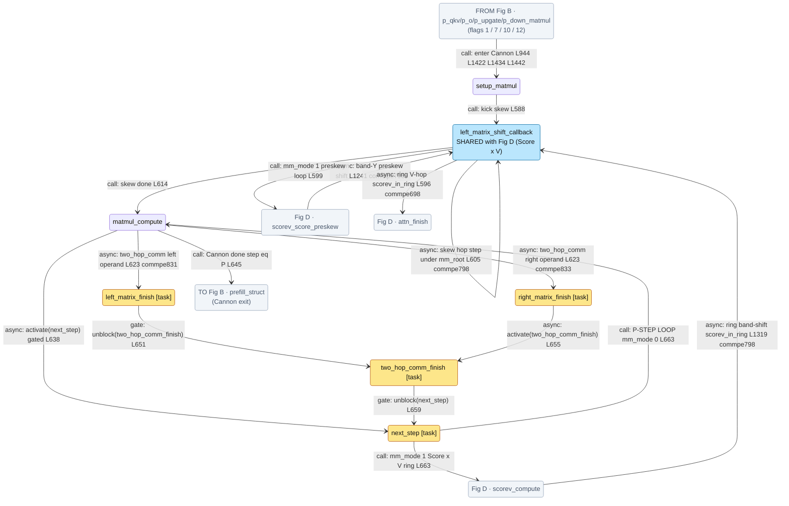
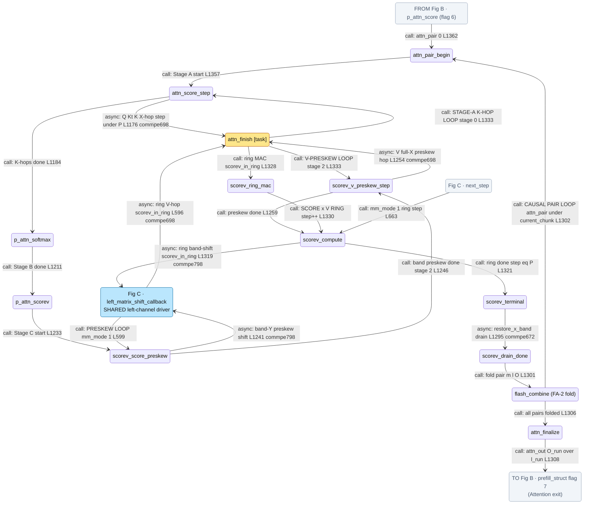
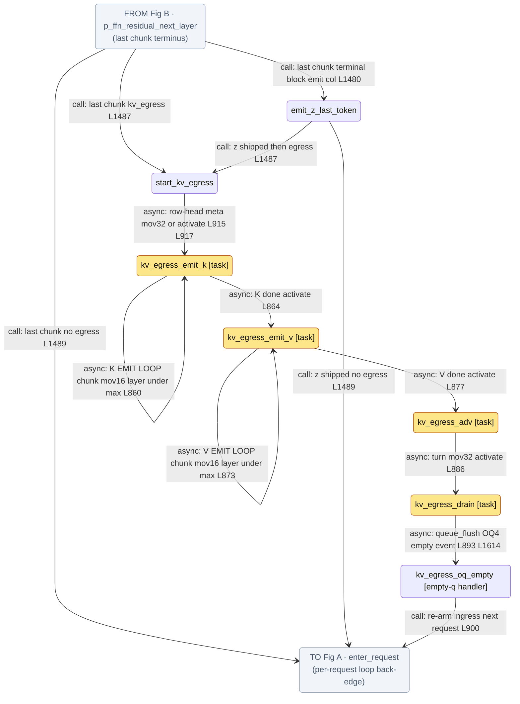

# prefill.csl — task/fn state machine

> Control-flow / state-machine companion to the algo walkthrough (`qwen3_1p7b-prefill.prefill.md`).
> Model `qwen3_1p7b-prefill`, ref config `test_sim_2x4_kv_varlen.json` (2×4 blocks, 8×8 PE/block,
> 8 layers → 1 layer/block). Nodes = every `task` + every `fn` that is `@activate`-d, task-bound, or
> the target of a comm_pe async callback. Edges = control transfers, labelled `call:` (synchronous
> same-stack call), `async:` (microthread `.activate`/`@activate` or a comm_pe callback), or `gate:`
> (`@unblock` of a `@block`-ed task). Line refs `L####` are `prefill.csl:####`; `commpe####` is
> `comm_lib/comm_pe.csl:####` (where a cross-module async edge is actually fired).

## Figure index

The machine is **50 nodes**, too large to read as one drawing. It is split into an **overview**
(Figure 1, components A–E) plus **five detail figures**, one per component. Every detail figure
carries grey **reference nodes** (`FROM Fig …` / `TO Fig …`) at its boundary, so each entry and exit
names the figure it continues into. Node counts: A 7 + B 16 + C 7 + D 13 + E 7 = 50.

| Figure | Component | Nodes | SVG |
|---|---|---|---|
| **1** | **Overview** — the five components and the control transfers between them | 5 boxes | [svg](qwen3_1p7b-prefill.prefill.statemachine.svg) |
| **A** | Boot & X ingress — `init_task`, `enter_request`, the HT_head x-chain, the dest-block shuttle | 7 | [svg](qwen3_1p7b-prefill.prefill.statemachine.A-boot-ingress.svg) |
| **B** | Layer machine — `start_layers` + the `prefill_struct` 14-flag hub and its operators | 16 | [svg](qwen3_1p7b-prefill.prefill.statemachine.B-layer-machine.svg) |
| **C** | Cannon — the projection MeshGEMM driver and its P-step operand rendezvous | 7 | [svg](qwen3_1p7b-prefill.prefill.statemachine.C-cannon.svg) |
| **D** | Attention — chunked FlashAttention-2 (Stage A/B/C, Score×V ring, causal-pair fold) | 13 | [svg](qwen3_1p7b-prefill.prefill.statemachine.D-attention.svg) |
| **E** | Per-request end / KV egress — last-token emit and the OQ4 egress chain | 7 | [svg](qwen3_1p7b-prefill.prefill.statemachine.E-request-end.svg) |

**One node is shared between two figures:** `left_matrix_shift_callback` (blue) is the left-channel
driver for both the Cannon skew loop (Fig C) and the Score×V band shift (Fig D). It is drawn solid in
both, because Score×V genuinely re-enters the Cannon driver via `mm_mode == 1` / `scorev_in_ring`.

## Figure 1 · Overview

## Figure A · Boot & X ingress

## Figure B · Layer machine (14-flag hub)

## Figure C · Cannon (projection MeshGEMM)

## Figure D · Attention (chunked FlashAttention-2)

## Figure E · Per-request end / KV egress

## Loop boundaries at a glance

- **Per-request loop** (Fig 1 `E → A`; detail Fig A/E) — `enter_request` (L1547) is re-entered after
  every request from either `kv_egress_oq_empty` (L900, egress build) or `p_ffn_residual_next_layer`
  (L1489, no-egress build). The serve loop never returns to `[*]`; `init_task` runs once.
- **Per-chunk loop** (Fig 1 `B → A`; detail Fig B/A) — `p_ffn_residual_next_layer` re-arms chunk `c+1`
  via `seed_chunk_x` (block 0, L1467) or `arm_dest_block_and_run` (dest blocks, L1469), both funnelling
  back through `start_layers`.
- **Per-layer loop** (internal to component B — drawn only in Fig B, not on the overview) —
  `p_ffn_residual_next_layer → prefill_struct`
  (L1450) with `flag = 0` and the next weight bank (`set_layer`), re-running the 14 flags for the next
  layer of this block.
- **14-flag layer machine** (Fig B) — `prefill_struct` (L1495) is the hub; each synchronous operator
  returns to it at the next `flag`. The three operators that go **asynchronous** (`p_*_matmul` →
  Cannon, `p_attn_score` → Attention) re-enter `prefill_struct` only when their async chain completes
  (`matmul_compute` L645, `attn_finalize` L1308).
- **Cannon P-step loop** (Fig C) — `matmul_compute ⇄ next_step` (L663/L638) runs `P` systolic steps;
  the skew pre-loop is the `left_matrix_shift_callback` self-edge (L605).
- **FA-2 attention loops** (Fig D) — outer **causal chunk-pair** loop `flash_combine → attn_pair_begin`
  (L1302); inner **Stage A K-hop** loop `attn_score_step ⇄ attn_finish` (L1176/L1333); **Score×V ring**
  loop `scorev_compute → left_matrix_shift_callback → attn_finish → scorev_ring_mac → scorev_compute`
  (L1319→L596→L1328→L1330); two **preskew** loops (`scorev_score_preskew` L1241,
  `scorev_v_preskew_step` L1254).
- **KV-egress emit loops** (Fig E) — `kv_egress_emit_k` and `kv_egress_emit_v` self-loop over
  (layer, chunk) (L860/L873).

## State-by-state walk

### Boot / per-request — Figure A

- **init_task** (task, L1578). In-edge: comptime `@activate(init_id)` from `[*]` (L1621, the single
  entry). Runs `comm.init()` (paints reduce/shuttle/MeshGEMM routes once) and sets the KV-egress switch
  `ring_mode + pop_on_advance` (L1585-1588), then **call**s `enter_request` (L1589). Runs exactly once.
- **enter_request** (fn, L1547). In-edges: `init_task` (L1589), `kv_egress_oq_empty` (L900),
  `p_ffn_residual_next_layer`/`emit_z_last_token` (L1489). Resets per-request state (`request_first_chunk`,
  `mm_mode`, `scorev_in_ring`, serve state, egress switch position, z-drain route). Branches on
  `is_x_receiver`: **call** `enter_x_chain` for block 0 (L1572) or `arm_dest_block_and_run` for dest
  blocks (L1575). This is the **per-request loop head**.

### X ingress — Figure A

- **enter_x_chain** (fn, L731). In-edges: `enter_request` (L1572), `seed_chunk_x` (L940). Rebinds IQ4 to
  the parity color, posts the async recv into `X_tile`, and forwards the rest east. Out-edge **async**
  `@mov16 .activate = x_chain_recv_finish_id` (L753).
- **x_chain_recv_finish** (task, L756). In-edge: L753. Either posts the async forward-mov
  (`.activate = x_chain_fwd_finish_id`, L758) or `@activate(x_chain_fwd_finish_id)` when nothing to
  forward (L760) — one merged out-edge **async** to `x_chain_fwd_finish`.
- **x_chain_fwd_finish** (task, L764). In-edge: L758/L760. **call**s `start_layers` (L767) — X is now
  resident.
- **seed_chunk_x** (fn, L939). In-edge: `p_ffn_residual_next_layer` (L1467). Thin wrapper that **call**s
  `enter_x_chain` (L940) to re-arm block 0's next-chunk recv.
- **arm_dest_block_and_run** (fn, L1535). In-edges: `enter_request` (L1575),
  `p_ffn_residual_next_layer` (L1469). Non-turn blocks do a **blocking** `enter_dest_shuttle` then **call**
  `start_layers` (L1540); turn blocks post an async drained recv whose completion fires
  `chunk_resume_callback = start_layers` (**async**, L1537 → commpe1025).

### Layer machine — Figure B

- **start_layers** (fn, L1512). In-edges: `x_chain_fwd_finish` (L767), `arm_dest_block_and_run`
  (L1540/async). Sets `current_layer = 0`, `set_layer(0)`, `flag = 0`, **call**s `prefill_struct`
  (L1528).
- **prefill_struct** (fn, L1495) — the **14-flag hub**. In-edges: `start_layers` and the return edge of
  every synchronous operator (L1496/949/991/996/1002/1426/1439), plus the async re-entries from Cannon
  (`matmul_compute` L645) and Attention (`attn_finalize` L1308), plus the per-layer back-edge
  (`p_ffn_residual_next_layer` L1450). **call**s the operator matching `flag`, incrementing `flag`
  (L1496-1509).
- **rmsnorm_full** (fn, L321). In-edges: `prefill_struct` flag 0 (L1496) and `p_rmsnorm_z` flag 9
  (L1430). Local sum-of-squares → `comm.all_reduce_full` (Y chain all-reduce) → rsqrt → scale; **call**
  returns to `prefill_struct` (the flag-0 site continues inline, L1496).
- **p_qkv_matmul / p_o_matmul / p_upgate_matmul / p_down_matmul** (fns L943/1421/1433/1441) — flags
  1/7/10/12. Each **call**s `setup_matmul` (L944/1422/1434/1442) entering **Cannon (Fig C)**; control
  returns to `prefill_struct` only from `matmul_compute` (L645).
- **p_qk_norm_q** (fn, L946) — flag 2. `comm.reconfig(2)` + `qk_norm_q_gqa` (band-scoped head_dim reduce);
  **call** return (L949).
- **p_qk_norm_k** (fn, L988) — flag 3. `qk_norm` over K head band; **call** return (L991).
- **p_rope_q** (fn, L993) — flag 4. Local RoPE on Q pairs; **call** return (L996).
- **p_rope_k** (fn, L998) — flag 5. RoPE on K + `cache_kv` (K final → bank K/V at `[layer][chunk]`,
  L1001); **call** return (L1002).
- **p_attn_score** (fn, L1360) — flag 6. Sets `attn_pair = 0`, **call**s `attn_pair_begin` (L1362)
  entering **Attention (Fig D)**; returns to `prefill_struct` only from `attn_finalize` (L1308).
- **p_z_residual** (fn, L1424) — flag 8. `Z = X + O`; **call** return (L1426).
- **p_rmsnorm_z** (fn, L1428) — flag 9. `comm.reconfig(0)` then **call**s `rmsnorm_full(&Z, …)` (L1430).
- **p_swiglu** (fn, L1436) — flag 11. `silu_gate` + `z3 = silu(gate)*up`; **call** return (L1439).
- **p_ffn_residual_next_layer** (fn, L1444) — flag 13 (`else`). `X = Z + down`, `current_layer++`. The
  **three-way loop junction**: more layers → `prefill_struct` (L1450, per-layer); else decode the
  metainfo tail, `comm.enter_source_shuttle` (blocking, ships X to the serpentine-next block), then
  either the per-chunk re-arm (`seed_chunk_x` L1467 / `arm_dest_block_and_run` L1469, **Fig A**) or the
  last-chunk terminus (`emit_z_last_token` L1480, `start_kv_egress` L1487, or `enter_request` L1489,
  **Fig E**).

### Cannon (projection MeshGEMM) — Figure C

- **setup_matmul** (fn, L561). In-edges: the four `p_*_matmul` operators. Sets `mm_mode = 0`, the skew
  counts, and **call**s `left_matrix_shift_callback` (L588).
- **left_matrix_shift_callback** (fn, L593) — the shared left-channel driver, **also used by Fig D**.
  In-edges: `setup_matmul` (L588), its own skew self-loop, and the two Score×V edges
  (`scorev_score_preskew` L1241, `scorev_compute` L1319). Branches: Score×V ring (`scorev_in_ring`)
  posts the V-hop → **async** `attn_finish` (L596); Score×V preskew (`mm_mode == 1`) **call**s
  `scorev_score_preskew` (L599); skew step `step under mm_root` posts `comm.left_matrix_shift` →
  **async** self (L605 → commpe798); skew done **call**s `matmul_compute` (L614).
- **matmul_compute** (fn, L618). In-edges: `left_matrix_shift_callback` (L614), `next_step` (L663).
  Per step posts `comm.two_hop_comm` (fires **async** `left_matrix_finish` L623→commpe831 and
  `right_matrix_finish` L623→commpe833) and `@activate(next_step)` (**async**, gated, L638); when
  `step == P` casts f32→bf16 and **call**s `prefill_struct` (L645) — **Cannon exit**.
- **left_matrix_finish** (task, L649). In-edge: L623/commpe831. `@block(self)` re-arm, then
  **gate** `@unblock(two_hop_comm_finish)` (L651).
- **right_matrix_finish** (task, L653). In-edge: L623/commpe833. `@block(self)`, then **async**
  `@activate(two_hop_comm_finish)` (L655). (left unblocks + right activates ⇒ the operand rendezvous.)
- **two_hop_comm_finish** (task, L657). In-edges: L651 + L655. `@block(self)`, then **gate**
  `@unblock(next_step)` (L659).
- **next_step** (task, L661). In-edges: L638 (armed) + L659 (unblocked). `@block(self)`, then **call**s
  `matmul_compute` for the next P-step (`mm_mode 0`) or `scorev_compute` for the Score×V ring
  (`mm_mode 1`, **Fig D**) (L663). The `matmul_compute ⇄ next_step` cycle is the **P-step loop**.

### Attention (chunked FlashAttention-2) — Figure D

- **attn_pair_begin** (fn, L1349). In-edges: `p_attn_score` (L1362) and the FA-2 pair back-edge from
  `flash_combine` (L1302). Stages this pair's K/V, `comm.enter_qkt_reduce`, **call**s `attn_score_step`
  (L1357).
- **attn_score_step** (fn, L1173) — Stage A `Q·Kᵀ`. Per K-block posts `comm.attn_right_hop` (**async**
  `attn_finish`, L1176→commpe698) + local `attn_partial`/`attn_score_reduce`; when hops done **call**s
  `p_attn_softmax` (L1184). The `attn_score_step ⇄ attn_finish` cycle is the **Stage A K-hop loop**.
- **attn_finish** (task, L1325). In-edges: the K-hop, V-preskew, and Score×V-ring V-hops (all
  commpe698). `@block(self)`; dispatches on state: `scorev_in_ring` → **call** `scorev_ring_mac` (L1328);
  `attn_stage == 0` → **call** `attn_score_step` (L1333); else (stage 2) → **call**
  `scorev_v_preskew_step` (L1333).
- **p_attn_softmax** (fn, L1191) — Stage B. α-scale, causal mask (diagonal pair), per-`(b,h,q)` max/sum
  via `comm.attn_vec_allreduce`; stops before normalize; **call**s `p_attn_scorev` (L1211).
- **p_attn_scorev** (fn, L1224) — Stage C entry. Clears the O accumulator, casts exp weights to fp16,
  `comm.rebind_x_to_band`, `mm_mode = 1`, **call**s `scorev_score_preskew` (L1233).
- **scorev_score_preskew** (fn, L1238). Score band-Y preskew: posts `comm.left_matrix_shift` →
  **async** `left_matrix_shift_callback` (**Fig C**, which loops back here via `mm_mode 1`, L599); when
  done `attn_stage = 2` and **call**s `scorev_v_preskew_step` (L1246).
- **scorev_v_preskew_step** (fn, L1251). V full-X preskew: posts `comm.attn_right_hop` → **async**
  `attn_finish` (stage-2 loop, L1254); when done **call**s `scorev_compute` (L1259).
- **scorev_compute** (fn, L1315) — the Score×V ring step. In-edges: `scorev_v_preskew_step` (L1259),
  `next_step` mm_mode 1 (L663, **Fig C**), `scorev_ring_mac` (L1330). `step under P` sets
  `scorev_in_ring` and posts the band-shift `comm.left_matrix_shift` → **async**
  `left_matrix_shift_callback` (L1319); `step == P` **call**s `scorev_terminal` (L1321).
- **scorev_ring_mac** (fn, L1265). In-edge: `attn_finish` ring branch (L1328). Slot-select MAC
  (`out += score_slot · V`); **call**s `scorev_compute` for the next ring step (L1329-1330) — closes the
  **Score×V ring**.
- **scorev_terminal** (fn, L1288). In-edge: `scorev_compute` (L1321). Clears ring state and posts
  `comm.restore_x_band` (async drain), whose `band_resume` fires `scorev_drain_done_callback`
  (**async**, L1295 → commpe672).
- **scorev_drain_done** (fn, L1300). In-edge: L1295/commpe672. **call**s `flash_combine` (L1301).
- **flash_combine** (fn, L1367) — the FA-2 `(m, l, O)` cross-pair rescale/fold. In-edge:
  `scorev_drain_done` (L1301). The branch predicate lives in `scorev_drain_done` (L1302): more causal
  pairs → **call** `attn_pair_begin` (L1302-1305, the **pair loop back-edge**); all folded → **call**
  `attn_finalize` (L1306).
- **attn_finalize** (fn, L1402). In-edge: `flash_combine` (L1306). `attn_out = O_run / l_run`; **call**s
  `prefill_struct` at flag 7 (L1308) — **Attention exit**.

### Per-request end / KV egress — Figure E

- **emit_z_last_token** (fn, L692). In-edge: `p_ffn_residual_next_layer` (L1480, last chunk, terminal
  block, this PE owns the last-token column). Gathers the last token's dim shard and ships it WEST to
  HT_tail; then the same terminus continues to `start_kv_egress` (L1487) or `enter_request` (L1489).
- **start_kv_egress** (fn, L903). In-edges: `p_ffn_residual_next_layer` (L1487), `emit_z_last_token`
  (L1487). Encodes OQ4 to the egress color; the row-head prepends `request_n_chunks` via an async
  `@mov32` (`.activate = kv_egress_emit_k_id`, L915), others `@activate(kv_egress_emit_k_id)` (L917) —
  one merged **async** out-edge.
- **kv_egress_emit_k** (task, L853). Self-loops over (layer, chunk) shipping one comptime `kv_tile_size`
  K chunk per `@mov16` (**async** self, L860); when all layers done **async** `@activate(emit_v)` (L864).
- **kv_egress_emit_v** (task, L867). Same for V banks (**async** self L873); when done **async**
  `@activate(adv)` (L877).
- **kv_egress_adv** (task, L880). Hands the PATTERN-B gather turn EAST (`@mov32` turn1/turn2), then
  **async** `@activate(drain)` (L886).
- **kv_egress_drain** (task, L893). `@queue_flush(OQ4)`; the flush-empty event fires the empty-queue
  handler (**async**, L893 + comptime `@set_empty_queue_handler` L1614).
- **kv_egress_oq_empty** (fn, L898, empty-queue handler). `queue_flush.exit` then **call**s
  `enter_request` (L900) — the **per-request loop back-edge** for the egress build.

## Legend

- **`call:`** — synchronous same-stack `fn`/`task` call (solid control transfer, no yield).
- **`async:`** — a microthread callback (`@mov*` / `@load_to_dsr` with `.activate`/`.unblock`),
  a bare `@activate(id)`, or a comm_pe module callback fired when a fabric transfer completes. Control
  yields; the target runs as a task/continuation. `commpe####` marks where in `comm_lib/comm_pe.csl`
  the edge is actually fired.
- **`gate:`** — an `@unblock(id)` releasing a `@block`-ed task (the Cannon operand rendezvous). Every
  Cannon/attention finish task also `@block`s itself on entry (L650/654/658/662/1326) to re-arm for the
  next step; those self-blocks are the re-arm mechanism behind the loops, not drawn as edges.
- **`[task]`** — a hardware task (id via `@get_local_task_id`, bound `@bind_local_task`). Unmarked nodes
  are plain `fn`s reached by synchronous call. Amber fill = task.
- **Grey `FROM Fig …` / `TO Fig …` nodes** — figure-boundary references, not real states. They name the
  figure that the control transfer continues into, so the five detail figures stitch back together.
- **Blue fill** — a node genuinely shared by two figures (`left_matrix_shift_callback`), or the
  cross-figure peers it talks to.

## Validation

- **50 nodes**, one entry (`init_task` from `[*]`); every other node has ≥1 in-edge; no orphans.
  Split across figures: A 7 + B 16 + C 7 + D 13 + E 7 = 50. Every real node appears **solid in exactly
  one** detail figure; cross-figure appearances are grey reference nodes (or the blue shared
  `left_matrix_shift_callback`).
- **`@activate` sites in prefill.csl: 8** (L638, 655, 760, 864, 877, 886, 917, 1621) — all drawn
  (L760 merged with the L758 `.activate=` into one `x_chain_recv_finish → x_chain_fwd_finish` edge;
  L917 merged with the L915 `.activate=` into one `start_kv_egress → kv_egress_emit_k` edge).
- **`.activate=` microthread callbacks: 5** (L753, 758, 860, 873, 915) — all drawn (L758/L760 and
  L915/L917 merged as above; L860, L873 are the emit self-loops; L753 the recv edge).
- **`.unblock=` callbacks in prefill.csl: 0** (the `.unblock` rendezvous of Cannon/attention live in
  `comm_pe.csl`, e.g. commpe832/834/699/707 — surfaced here as the `async:` comm edges into
  `left_matrix_finish`/`right_matrix_finish`/`attn_finish`).
- **`@unblock` sites: 2** (L651, L659) — both drawn as `gate:` edges.
- **`@block` sites: 10** (L650, 654, 658, 662, 1326 task-entry re-arm self-blocks; L1616-1620 comptime
  initial blocks) — these are self-gating/comptime, not inter-node edges; noted in the Legend.
- **Cross-module async edges** (comm_pe fires the callback/task; not in the prefill.csl grep but real
  control transfers): `left_matrix_shift → left_matrix_shift_callback` (commpe798, 3 call sites: skew
  L605, band preskew L1241, ring L1319), `two_hop_comm → left/right_matrix_finish` (commpe831/833),
  `attn_right_hop → attn_finish` (commpe698, 3 sites: K-hop L1176, V-preskew L1254, ring V-hop L596),
  dest shuttle → `start_layers` (commpe1025), `restore_x_band → scorev_drain_done` (commpe672).

## Ambiguities / modelling choices

- **flash_combine branch.** The next-pair-vs-finalize predicate is in `scorev_drain_done` (L1302), which
  calls `flash_combine` first (L1301). For readability the two branch edges are drawn out of
  `flash_combine`; semantically they are `scorev_drain_done`'s decision after `flash_combine` returns.
- **emit_z / egress convergence.** On the last chunk, the terminal block optionally runs
  `emit_z_last_token`, then **every** block reaches `start_kv_egress` (egress build) or `enter_request`
  (no-egress build). The `emit_z_last_token → start_kv_egress`/`→ enter_request` edges (L1487/L1489)
  represent the post-emit continuation; the direct `p_ffn_residual_next_layer` edges cover
  non-terminal blocks (and the no-z-column case).
- **next_step arming vs gating.** `matmul_compute` both `@activate`s `next_step` (L638) and triggers the
  `two_hop_comm` rendezvous that ultimately `@unblock`s it (L659). Both edges are drawn; `next_step`
  only fires once both the activation and the unblock have landed (the standard block/activate handshake).
- **rmsnorm_full reuse.** Reached from flag 0 (`prefill_struct`, L1496) and flag 9 (`p_rmsnorm_z`,
  L1430); one shared node with the single return edge to `prefill_struct`.
- **Figure split.** The five components are the composite `state` blocks of the original single-diagram
  version (`Boot` + `XIngress` merged into Fig A, since `enter_request` branches directly into both
  ingress paths). Splitting changed no node and no edge — only the drawing. The original 8301×3412
  single SVG is recoverable from git (`b8e5de8`).
