# KV-transfer full pipeline — step-by-step diagram (`qwen3_1p7b-e2e`)

Companion to topic [[prefill-decode-transfer-bandwidth]]. This is the profiled
prefill→decode KV-cache transfer, decomposed into numbered steps with the exact
operation, data movement, and code location at each step. **A = steps 1-4** (per-PE
"gather + transpose + relayout", intra-block, ~7% of A+B). **B = step 5** (north
shift, ~93%). Step 6 is the decode receiver. Source of truth = the git repo;
last synced 2026-07-17.

## Geometry (who is where)

```
        NORTH  ↑  (KV tiles travel north)
  ┌───────────────────────────────────────────────┐
  │  DECODE region        (P_BLOCK·P_Y_BLOCK rows)  │   ← Step 6: kv_ingress
  ├───────────────────────  RELAY SEAM  ────────────┤
  │  PREFILL region       (Ph = total_y_pes rows)   │   ← Steps 1-5
  │    each P_BLOCK×P_BLOCK block does A locally     │
  └───────────────────────────────────────────────┘
        SOUTH
```

Per-hop payload = `kv_tile = kv_dim_per_pe · reduce_len` fp16 wavelets
(`comm_pe.csl:866`). At full geometry that is only tens of bytes/PE.

## Pipeline flow (control + data)

```mermaid
flowchart TD
    S0["STEP 0 — entry · start_kv_transfer()  prefill.csl:762<br/>drain q7/0 (leftover shuttle tiles), then pin q7/0 → kv_xfer colors 17,21 ONCE<br/>control: 2×@queue_flush + 2×T29"]
    S1["STEP 1 — State 0 · West sweep · kv_sweep()  comm_pe.csl:888<br/>DATA: E/W funnel WEST along X → each row's diagonal PE<br/>P_BLOCK_SIZE blocking hops · colors 18,19 · queues 5,6 · @mov16<br/>COMPUTE: none | CONTROL: rebind 5,6 + 2 flush + 2 T29"]
    S2["STEP 2 — State 1 · East sweep · kv_sweep()  comm_pe.csl:888<br/>DATA: mirror EAST sweep → diagonal PE (lx==ly) now holds the WHOLE row<br/>P_BLOCK_SIZE hops · colors 20,22 | COMPUTE: none"]
    S3["STEP 3 — State 2 · North column emit · kv_col_emit()  comm_pe.csl:924<br/>DATA: diagonal emits UP the column; PE r keeps 1st arrival, forwards rest<br/>≤P_BLOCK_SIZE hops · colors 3,4 → realizes TRANSPOSE tile(lx,ly)→PE(ly,lx)<br/>COMPUTE: 1×@fmovh (diagonal self-keep) | CONTROL: rebind + repaint N-chain"]
    S4["STEP 4 — State 3 · South emit + TRANSFORM · kv_col_emit + kv_transform()  prefill.csl:730<br/>DATA: mirror DOWN-column emit<br/>COMPUTE: kv_transform relayout → decode slab order (K identity reshape / V in-tile transpose, @fmovh, NO arithmetic)<br/>banked into kv_xfer_bank[(layer·2+m)·kv_tile]"]
    LOOP{"more (layer, K|V) planes?<br/>loop 2·max_layers_per_block times<br/>prefill.csl:797"}
    S5["STEP 5 — State 4 · NORTH SHIFT · kv_north_shift()  comm_pe.csl:985  ← ~93%<br/>DATA: STORE-AND-FORWARD north across the ENTIRE prefill height + relay seam<br/>total_y_pes(=Ph) blocking hops · colors 17,21 · queues 7,0 (pinned since Step 0)<br/>× n_ph = 2·max_layers_per_block planes, back-to-back, SERIAL (no cross-plane pipeline)<br/>COMPUTE: none | CONTROL: none inside the plane loop"]
    S6["STEP 6 — Decode ingress · kv_ingress_phase()  decode.csl:1348<br/>DATA: recv-then-forward north; row r receives r+1, keeps its own (last), forwards r<br/>IQ7/OQ7 · kv_xfer colors<br/>then UNPACK @fmovh into XKCache_tile / XVCache_tile (no arithmetic)"]

    S0 --> S1 --> S2 --> S3 --> S4 --> LOOP
    LOOP -->|next plane| S1
    LOOP -->|all planes done| S5 --> S6

    classDef a fill:#e8f0fe,stroke:#4285f4;
    classDef b fill:#fce8e6,stroke:#ea4335;
    classDef d fill:#e6f4ea,stroke:#34a853;
    class S0,S1,S2,S3,S4 a;
    class S5 b;
    class S6 d;
```



Blue = **A (steps 0-4, intra-block gather+transpose, ~7%)** · Red = **B (step 5,
north shift, ~93%)** · Green = **decode receiver**.

## One KV tile's journey (spatial)

A tile owned by prefill PE at block-local `(lx, ly)` for `(layer L, plane K|V)`:

```
  block-local view (P_BLOCK × P_BLOCK)          then across regions
  ┌─────────────────────────┐
  │  (lx,ly) ──W/E sweep──▶  │   Steps 1-2: funnel along X to the
  │            diagonal PE   │   row's diagonal PE (lx==ly)
  │              │           │
  │       N/S column emit    │   Steps 3-4: emit along Y to dest
  │              ▼           │   PE (ly,lx)  = the TRANSPOSE
  │          (ly,lx) + xform │   Step 4: relayout → decode slab order
  └──────────────┬──────────┘
                 │  Step 5: NORTH SHIFT (store-and-forward)
                 ▼  up total_y_pes hops → across relay seam →
        ┌─────────────────────┐  into decode region
        │  decode mirror PE   │  Step 6: relay north + unpack into
        │  XKCache / XVCache  │  XKCache_tile / XVCache_tile
        └─────────────────────┘
```

Total hops ≈ `P_BLOCK` (funnel) + `P_BLOCK` (transpose) + `total_y_pes` (north) +
`decode_row`. The first two are **intra-block (≤ P_BLOCK)**; the third dominates.

## Step table

| # | State | fn @ line | data move (dir · color · queue) | compute | control | reps |
|---|---|---|---|---|---|---|
| 0 | entry | `start_kv_transfer` p:762 | pin q7,0→17,21 (once) | — | 2 flush + 2 T29 | 1 |
| 1 | 0 | `kv_sweep` c:888 | E/W→diag · 18,19 · q5,6 · P_BLOCK hops | none | rebind + 2f + 2T29 | 2·max_layers |
| 2 | 1 | `kv_sweep` c:888 | E/W→diag · 20,22 · q5,6 · P_BLOCK hops | none | rebind + 2f + 2T29 | 2·max_layers |
| 3 | 2 | `kv_col_emit` c:924 | N col · 3,4 · q5,6 (transpose) | 1 @fmovh | rebind + repaint | 2·max_layers |
| 4 | 3 | `kv_transform` p:730 | S col · 3,4 · q5,6 + relayout | @fmovh reshape (no arith) | repaint + 2f + 2T29 | 2·max_layers |
| 5 | 4 | `kv_north_shift` c:985 | **N · 17,21 · q7,0 · total_y_pes hops × n_ph planes serial** | none | none in loop | 1 (loops n_ph) |
| 6 | ingress | `kv_ingress_phase` d:1348 | N recv-fwd · kv_xfer · IQ7/OQ7 + unpack | @fmovh unpack | odd-row swap; final flush | 2·max_layers |

## Why B dominates & how to fix (from the bottleneck analysis)

- **A is bounded by `P_BLOCK`** (edge-terminated chains, no wavelet crosses a block
  boundary — `comm_pe.csl:922-923,940`) and is on-PE for the transform → cheap.
- **B (step 5) is the long pole**: `total_y_pes` (whole prefill height = 512 on the
  2×2 device layout) store-and-forward hops, × `n_ph = 2·max_layers` planes run
  **serially with no cross-plane pipelining** (`prefill.csl:802-806`). Tiny per-hop
  payload (tens of bytes) means each hop pays a full recv-tile + send-tile latency
  that dwarfs the byte-transfer → **~1% of A+B is genuine on-wire; ~0.1% of fabric
  per-link bandwidth used.** Latency/serialization-bound, NOT a fabric ceiling.
- **Fixes (priority):** (1) coalesce the `n_ph` planes into one shift (widen the
  `kv_north_shift` DSD to `n_ph·kv_tile`) → removes the ×n_ph serial multiplier;
  (2) bigger per-hop payload → bandwidth-bound instead of latency-bound; (3)
  cut-through instead of store-and-forward; (4) direct-route instead of per-PE relay
  to cut hop count.
