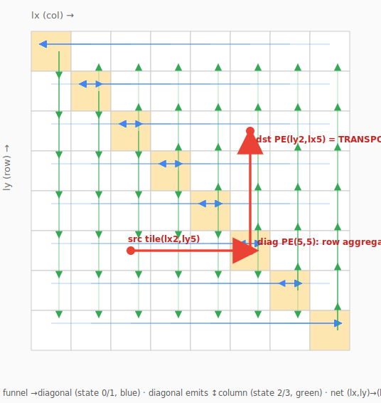
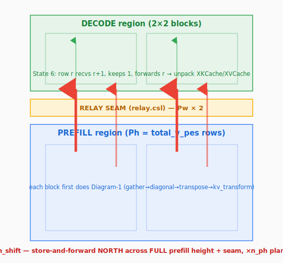

# KV-transfer pipeline — on-chip topology diagrams + transpose explainer

Companion to topic [[prefill-decode-transfer-bandwidth]]. Reference when analysing the
A/B/C performance numbers. Model: `qwen3_1p7b-e2e`. The profiled prefill→decode KV-cache
transfer, drawn on the PE grid with per-state data-flow directions.

## Diagram 1 — inside one prefill block: gather → diagonal → transpose (states 0-4)

Blue = **State 0/1** E/W funnel → each row's diagonal PE. Green = **State 2/3** N/S column
emit from the diagonal. Red = one example tile's path (the transpose). Gold = diagonal PE
(`lx==ly`). This is the **A** stage (~7% of A+B), strictly intra-block (≤ P_BLOCK hops).

## Diagram 2 — across regions: State 4 north shift → State 6 decode ingress

Red = **State 4/5** `kv_north_shift` — store-and-forward NORTH across the full prefill
height + relay seam, ×`n_ph` planes SERIAL (**~93%** of A+B). Green = **State 6** decode
ingress (recv → forward → unpack). This is the **B** stage.

---

## After aggregating to the diagonal, before transferring to decode (the transpose)

**Why a transpose at all.** Prefill and decode use a **transposed PE↔data mapping**: KV that
prefill holds on PE `(lx,ly)` is expected by decode on PE `(ly,lx)`. So before shipping north,
each tile must move `(lx,ly) → (ly,lx)`. **The diagonal PE is the pivot of that transpose.**

**Mechanism — funnel → diagonal → column-emit (borrow the diagonal):** a tile at
`(col=lx, row=ly)` reaching `(col=ly, row=lx)`:
1. **State 0/1 (E/W funnel, horizontal)** — along **row ly**, funnel the tile from col `lx`
   to that row's diagonal PE `(ly,ly)`; the diagonal ends holding the whole row.
   `kv_sweep`, `comm_pe.csl:888`. → tile now at `(ly,ly)`.
2. **State 2/3 (N/S column emit, vertical)** — the diagonal PE `(ly,ly)` emits the tile along
   **column ly** to row `lx`; intermediate PEs keep their first arrival, forward the rest.
   `kv_col_emit`, `comm_pe.csl:924`. → tile at `(ly,lx)` = destination PE. ✅
   Horizontal (col lx→ly) + vertical (row ly→lx) = net `(lx,ly)→(ly,lx)`, diagonal is the turn.
   (This is the red example path `(2,5)→(5,5)→(5,2)` in Diagram 1.)

**Then `kv_transform` — a SECOND transpose, inside the tile** (`prefill.csl:730`, State 3):
once the tile lands on PE `(ly,lx)`, its internal element order is relaid into **decode slab
order** and banked into `kv_xfer_bank[(layer·2+m)·kv_tile]`:
- **K**: `[f][b][s] → [b][f][s]` identity/reshape copy (K rows already in the right order from
  prefill's perm + interleaved-RoPE).
- **V**: `[f][b][s] → [b][s][f]` **in-tile transpose** via a strided DSD (stride `kv_dim_per_pe`,
  `prefill.csl:721`).

So there are **two transposes**, both on the prefill side, both before the north shift:

| level | what | how | arithmetic? |
|---|---|---|---|
| **PE-level** (states 0-3) | tile redistribution across PEs `(lx,ly)→(ly,lx)` | funnel→diagonal + column-emit | no — pure `@mov16` |
| **in-tile** (state 3 `kv_transform`) | element reorder → decode slab order | K reshape / V strided transpose (`@fmovh`) | **no — a DSD reshape, not arithmetic** |

**Consequences (matter for the numbers):**
- Because both transposes finish in prefill, decode receives KV **already in its layout** —
  **State 6 ingress does recv+forward+unpack only, no transpose/compute** (`decode.csl:1348`).
- The whole **A stage has zero arithmetic** (no RoPE/norm — those ran in the per-layer pipeline
  before the transfer). A = data movement + data reshape only.
- A is intra-block (≤ P_BLOCK hops) → ~7%. B (north shift) spans the full prefill height +
  seam + decode → hundreds of hops → ~93%.

## Step table

| # | State | fn @ line | data move (dir · color · queue) | compute | control | reps |
|---|---|---|---|---|---|---|
| 0 | entry | `start_kv_transfer` p:762 | pin q7,0→17,21 (once) | — | 2 flush + 2 T29 | 1 |
| 1 | 0 | `kv_sweep` c:888 | E/W→diag · 18,19 · q5,6 · P_BLOCK hops | none | rebind + 2f + 2T29 | 2·max_layers |
| 2 | 1 | `kv_sweep` c:888 | E/W→diag · 20,22 · q5,6 · P_BLOCK hops | none | rebind + 2f + 2T29 | 2·max_layers |
| 3 | 2 | `kv_col_emit` c:924 | N col · 3,4 · q5,6 (transpose) | 1 @fmovh | rebind + repaint | 2·max_layers |
| 4 | 3 | `kv_transform` p:730 | S col · 3,4 · q5,6 + relayout | @fmovh reshape (no arith) | repaint + 2f + 2T29 | 2·max_layers |
| 5 | 4 | `kv_north_shift` c:985 | **N · 17,21 · q7,0 · total_y_pes hops × n_ph SERIAL** | none | none in loop | 1 (loops n_ph) |
| 6 | ingress | `kv_ingress_phase` d:1348 | N recv-fwd · kv_xfer · IQ7/OQ7 + unpack | @fmovh unpack | odd-row swap; final flush | 2·max_layers |

## Why B dominates & how to fix

- **A bounded by P_BLOCK** (edge-terminated chains, no wavelet crosses a block boundary —
  `comm_pe.csl:922-923,940`); the transform is on-PE → cheap.
- **B (step 5) is the long pole**: `total_y_pes` (=512 on the 2×2 device) store-and-forward
  hops × `n_ph = 2·max_layers` planes run **serially, no cross-plane pipelining**
  (`prefill.csl:802-806`). Tiny per-hop payload (tens of bytes) → each hop pays full
  recv+send latency ≫ byte time → **~1% of A+B on-wire, ~0.1% of fabric per-link BW.**
  Latency/serialization-bound, NOT a fabric ceiling (the raw-fabric microbenchmark confirms
  a clean stream hits ~4.4 GB/s/link).
- **Fixes (priority):** (1) coalesce the `n_ph` planes into one shift (widen `kv_north_shift`
  DSD to `n_ph·kv_tile`) → removes the ×n_ph serial multiplier; (2) bigger per-hop payload →
  bandwidth-bound; (3) cut-through instead of store-and-forward; (4) direct-route instead of
  per-PE relay to cut hops.
