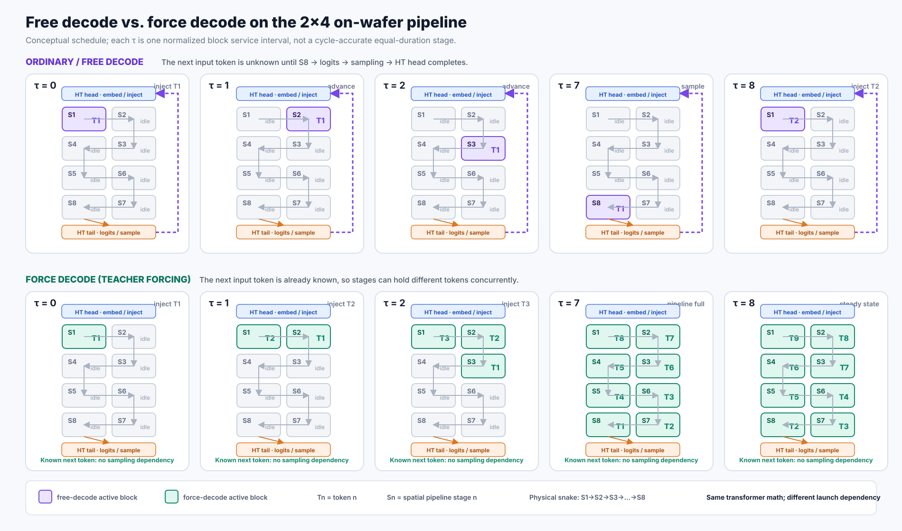

# Force decode 与普通 decode：片上 floor map、时间步与正确性

ContextBase: https://context.ed-aisys.com/doc/force-decode-vs-free-decode-on-wafer-floor-map-and-correctness-XnN0hseCzB

本文解释本次实验所用 Qwen3-1.7B `pdSeparate` decode kernel 中，普通（free）decode 与 force decode 的差异。核心结论是：

> force decode 没有省掉 Transformer 计算；它省掉的是“必须等上一个 token 被采样出来，才能启动下一个 token”的反馈依赖。因此，已知 token 可以作为 wavefront 同时占据不同的片上 pipeline block。

## 1. 先建立直觉：区别不是“算不算”，而是“下一件货到没到”

可以把八个片上 block 想成八个连续工位。一件货（一个 token）依次经过 S1 到 S8；每个工位都必须加工，不能跳过。

普通 decode 像是**下一件货的规格要等最后一个工位检查完当前货物后才决定**。即使 S1 已经空闲，也没有下一件确定的货可以加工，所以整条流水线对单个 request 经常只有一个 token 在前进。

force decode 像是手里已经有完整订单：`T1, T2, T3, ...` 的规格都已知。`T1` 离开 S1 去 S2 后，S1 可以立刻接 `T2`；再下一拍，S1 接 `T3`，S2 接 `T2`，S3 接 `T1`。每件货仍经过全部八个工位，但多个工位不再互相等同一件货。

所以更准确的对比是：

```text
普通 decode：先算出/采样出下一 token，才知道下一次要算什么
force decode：下一 token 已经在输入序列里，只需按顺序把它送进计算流水线
```

### 落到本次实现的片上 topology

实验配置把 28 个 Transformer layer 映射到 `2 × 4 = 8` 个空间 pipeline block。物理上采用蛇形连接：

```text
HT head / embedding
        ↓
     S1 → S2
           ↓
     S4 ← S3
     ↓
     S5 → S6
           ↓
     S8 ← S7
        ↓
HT tail / final norm / lm_head / sampling
```

28 层在八个 block 上的实际分配是：

```text
[2, 4, 4, 4, 4, 4, 4, 2] layers/block
```

因此中间 block 是 steady-state bottleneck。代码依据是：

- `launch.py:155-181`：layer distribution；
- `launch.py:300-318`：device 配置采用 2×4、每个 block 最多约 4 层；
- `launch.py:1008-1034` 与 `route_calc.csl`：row region 和蛇形路由；
- `decode.csl:1496-1533`：每步依次 receive X、block 内计算、send Z。

## 2. Timestep floor map



图中的 `τ` 是**归一化的 block service interval**，用于表达依赖和并发关系，不表示八个 block 的真实延迟完全相等。`Tn` 是第 n 个 token，`Sn` 是第 n 个空间 stage。

### 普通 decode

普通 decode 的下一个输入 token 尚未知。`T1` 必须走完：

```text
HT head → S1 → S2 → … → S8 → final norm → lm_head → sampling
                                                        ↓
HT head ← embedding ← sampled T2  ←────────────────────┘
```

直到 tail 采样出 `T2`，HT head 才能查 embedding 并把 `T2` 注入 S1。因此，对同一条 request，不能在 `T1@S2` 时就让 `T2@S1` 开始；这时 `T2` 还不存在。一个 token 的端到端反馈环是下一 token 的 launch gate。

实现上，tail 在 `ht_tail.csl:1148-1201` 做 final RMSNorm、lm_head、top-K、sampling，再把 sampled token 向北发给 head；head 在 `ht_head.csl:283-319` 收到 token id 后才做 embedding 并输出下一步 X。

### Force decode

force decode 用于重放一串**已经知道的 token**。例如要把 `[T1, T2, …, T9]` 重建进 KV cache，`T2` 不需要由 `T1` 的 logits 采样得到。于是：

- `τ=0`：`T1@S1`；
- `τ=1`：`T1@S2`，同时 `T2@S1`；
- `τ=2`：`T1@S3`、`T2@S2`、`T3@S1`；
- pipeline fill 后：八个 block 可以各自处理不同 token；
- steady state 中，一个 token 离开 S8 的同时，一个新 token 进入 S1。

这改变的是 token 的**启动依赖**，而不是单 token 的 Transformer 数据流。每个 forced token 仍然逐层执行 embedding、QKV、RoPE、causal attention、MLP，并把自己的 K/V 写入 cache。

## 3. 为什么 force decode 比“用普通 decode 重放 prefix”快

### 先看直觉

假设每个工位加工一件货需要约 1 个时间单位：

- 普通 decode 做 8 个 token，近似要让 8 个 token 各自走完一次“8 个工位 + 最后决定下一件货”的闭环；
- force decode 的第一个 token 仍需要约 8 个时间单位才能走到末端，但流水线装满后，理想情况下每隔约 1 个最慢工位的时间就能完成一个 token。

这就是 latency 与 throughput 的区别：force decode 没有显著缩短**第一个 token 穿过全片**的 latency，而是缩短了后续 token 的 initiation interval。prefix 越长，pipeline fill 的一次性成本越容易被摊薄。

### 性能模型

普通 decode 的 request-level initiation interval 近似包含完整反馈环：

\[
II_{free} \approx T_{S1}+T_{S2}+\cdots+T_{S8}+T_{tail}+T_{feedback}.
\]

force decode 在 pipeline fill 后，其 initiation interval 近似由最慢 block 决定：

\[
II_{forced} \approx \max_k T_{S_k},
\]

另加不能被重叠的注入/控制开销。因为中间 block 各持有 4/28 的 layer，理想的计算占比接近：

\[
\frac{II_{forced}}{T_{all\ layers}} \approx \frac{4}{28}=14.3\%.
\]

实测 forced/free 比值约为 11.7%–13.0%（随 position 缓慢变化），与这个空间 pipeline 模型一致。绝对 forced-token 时间仍会随 position 增长，因为 causal attention 要读取更长的 KV history；force decode 并没有消除这部分工作。

这里的比较对象是**用普通 autoregressive decode 重放已知 prefix**。它不意味着 force decode 一定比专门设计的 prefill kernel 更快：prefill 可以在 sequence 维做更大粒度的矩阵化，而 force decode 的价值是复用 decode 布局并以低转换成本重建 decode-native KV。

## 4. 为什么当前 stage / PE block 内不能再同时 pipeline 两个 token

这里需要区分“原则上绝不可能”和“当前实现不具备”。更准确的结论是：**当前 block 不是可重入的 token pipeline stage**。

### 先看直觉：一个 stage 不是四个独立小工位

图上把 S2 画成一个方块，里面可能放了 4 个 Transformer layer，但这不表示里面有 4 套独立机器。更像是一名工人依次换四套模具加工同一件货：layer 的权重分别存着，但计算台、临时工作区和传送带是共享的。

当 `T1` 正在用这张计算台跑本 block 的第二层时，让 `T2` 同时跑第一层需要第二张计算台、第二套临时 buffer 和另一套传送带。仅仅把执行顺序写成 `T1-layer2` 与 `T2-layer1` 交错，仍然是一张计算台上的 time-sharing，不是两件货同时加工，也不会增加瓶颈吞吐。

下面再对应到实现解释这些“共享的计算台和传送带”具体是什么。

### 4.1 一个 block 内的多层是在同一组 PE 上串行执行

`decode_struct()` 明确只处理一个 token，并在 `while (l < layers_in_this_block)` 中依次运行本 block 的 2–4 层（`decode.csl:1278-1295`）。本 block 并没有把 layer 10 和 layer 11 映射到两组独立 PE；它们共享同一块计算阵列。

假设 `T1` 正在这个 block 的 layer 11，而想让 `T2` 同时运行 layer 10：只有在 layer 10 和 layer 11 拥有独立的 compute、buffer 和 communication resources 时，才是真正的细粒度空间 pipeline。当前映射没有这些独立资源。

### 4.2 当前状态和 scratch buffer 只容纳一个 in-flight token

同一 block 共享：

- 一份 `X_tile` / `X_input_tile`（`decode.csl:338-348`）；
- 一份当前 RoPE position 状态（`decode.csl:396-427`）；
- 每层一份 `iter_num_bank` / `step_bank`（`decode.csl:452-456`）；
- QKV、attention、reduction 和 FFN scratch；
- 同一组 fabric colors、queues、matmul/reduction 路径。

如果两个 token 同时进入，后者会覆盖前者的 X、scratch 或 position state，并争用相同计算与通信资源。即使通过任务交错把两个 token 分时运行，也只是 time-slicing，不会让瓶颈资源在同一时刻完成两倍工作。

### 4.3 同一 layer 的 KV 还存在 causal 顺序

在 layer `l` 上，`T2` 的 attention 必须看到 `T1` 刚刚追加的 K/V。因此至少要保证：

\[
KV_l(T1)\ \text{committed before}\ attention_l(T2).
\]

若要做更细粒度 pipeline，必须同时完成：

1. 给不同 layer 或不同 token 分配独立 PE/计算资源；
2. 复制 token-local X、RoPE 和所有 scratch context；
3. 对 KV append 建立逐 layer 的 producer-consumer handshake；
4. 分离或调度 fabric colors、queues 和 collectives；
5. 接受 PE memory 增长，或牺牲单 layer 的并行宽度。

这是一种新的 kernel mapping，而不是在当前 loop 中简单多放一个 token。现有设计选择在 **block 之间**做空间 pipeline，因为那里已经有清晰的 buffer、路由和 ownership 边界。

## 5. 为什么 force decode 的结果是对的

### 先看直觉：跳过的是“猜答案”，不是“写入过程”

普通 decode 在每一步末尾做两件事：

1. 用当前 token 完成 Transformer 计算并写入该位置的 KV；
2. 从 logits 中选择下一 token。

force decode 只替换第 2 件事：既然下一 token 已经来自需要重放的已知文本，就不用再让模型猜一次。第 1 件事完全照常执行。因此，只要强制输入的 token 与参考路径实际选择的 token 相同，后续计算看到的 token、position 和历史 KV 就都相同。

一个类比是导航：普通 decode 每到一个路口都现场决定下一条路；force decode 手里已有同一条路线清单。只要每个路口选择相同，两种方式经过的位置和留下的轨迹就相同。提前知道下一步，并不会改变走过当前路段的过程。

### 形式证明

force decode 本质上是 teacher forcing。设已知 token 序列为 `x₁, x₂, …`，第 `p` 个位置、layer `l` 的状态为：

\[
(h_{l,p}, K_{l,\le p}, V_{l,\le p})
=
f_l(x_p, K_{l,<p}, V_{l,<p}; W_l).
\]

只要 force decode 输入的 `x_p` 与参考 free-decode trace 在该位置的 token 相同，就可以用归纳法证明 KV 相同：

1. **Base case**：两条路径从相同的已有 prefix KV 和相同 position 开始；
2. **Token induction**：假设位置 `<p` 的 KV 相同；
3. **Layer induction**：相同 token embedding、相同权重和相同 prior KV，使 layer 0 输出相同；逐层递推，所有 hidden state 与新 K/V 相同；
4. 因此位置 `p` 写入的 KV 相同，归纳推进到 `p+1`。

关键点是：某一步的 logits/sampling 只负责**选择下一 token id**；它不是当前 token K/V 计算的输入。force decode 只是直接提供已知的下一 token id，仍执行同一条 Transformer forward path。片上 wavefront 也保持了 causal 顺序：`T(p+1)` 到达任一 stage 时，`T(p)` 已经在该 stage 完成并提交 KV。

本次 pdSeparate 验证采用 self-teacher-forcing：先由 free decode 记录 token trace，再 force replay 同一 trace。`F=64`、8 个 request、共 10,067 个 token 全部一致，零 mismatch。这个结果证明的是：**给定同一 token 序列，force decode 重建了与 free decode 相同的状态轨迹**；它不声称被强制输入的任意外部序列一定是模型自己会采样出的序列。

## 6. 一句话总结

```text
free decode：下一个 token 未知 → 必须闭合整条采样反馈环 → request 内基本只有一个 token wavefront
force decode：下一个 token 已知 → 去掉 launch feedback dependency → 八个空间 block 可并行承载八个不同 token
```

force decode 的加速来自**跨 block 的 token pipeline**；正确性来自**同 token 序列下 causal Transformer 状态转移的确定性**；当前 block 内无法进一步并发，是因为多层共享同一组 PE、buffer、state 和 fabric resources，而不是 Transformer 数学上禁止任何更细的 pipeline 重构。
