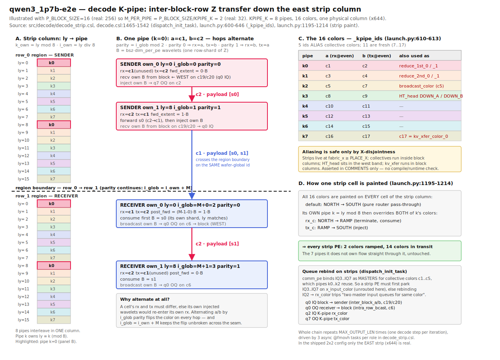

# qwen3_1p7b-e2e kernel Q&A log — 2026-07-09

**Project:** WaferEngine-staging
**Author:** claude
**Status:** captured

Running log of a code-reading session over `models/qwen3_1p7b-e2e` (session
`e2e-kernel-qa`). Decode CSL read directly; prefill + `launch.py` via subagents.
One `## Q<n>` section per question asked. Append, don't rewrite.

---

## Q1 — How is HT_head fed, and what colors carry prefill's first token + KV cache into decode?

### Finding

**Correction to a working assumption.** Only the **KV cache** crosses from
prefill to decode on-chip. The **first token does not.** There is no fabric path
of any color from `pf_ht_tail` to decode's HT_head.

- Prefill's sampled first token exits south: `pf_ht_tail` → `pf_mux` →
  `pf["logits_stream"]` → **host** (`launch.py` `runtime.receive(pf_blob)`).
  It is read, printed, and never sent back to the device.
- Decode's step-0 input X is **host-computed**, not prefill's token:
  `launch.py:~3006-3028` builds `host_x_f16 = W_E_full[cfg["token_ids"]]`
  (`token_ids` defaults to `[0]*bsz`, seed-2024 mock W_E) and sends it as
  `x_step_buf_u32` on `x_stream` into decode's demux.
- So the two halves are fused in **KV state only**. Decode begins generating
  from a config-chosen token, unrelated to the token prefill just sampled. A
  true fused e2e continuation would need either a host hop or a new on-chip
  token wire from `pf_ht_tail` north into decode's HT_head.

**Decode HT_head feed colors** (ids from `launch.py:535-585`):

| Wire | Color id | From → To | When |
|---|---|---|---|
| `pre_embed_x_color` (`c1_color`) | **18** | host → `x_demux` → HT_head west edge | step 0 only |
| `tok_bcast_color` | **7** | decode `ht_tail` root row → HT_head bottom edge | steps 1+ |
| `post_embed_x_color` (`c2_color`) | **23** | HT_head diag PE → decode row_0 west | every step |
| `ht_ready_color` | **0** | HT_head col=0 → demux (1-hop barrier) | init |
| `UP_A/UP_B`, `DOWN_A/DOWN_B` | 21, 22, 8, 9 | HT_head internal W_E gather chain | steps 1+ |

HT_head at step 0 does **no** embedding lookup — it just drains the host's
pre-embedded X on c1 into `embed_buf`. From step 1 it does the real 2-phase
`W_E` gather driven by token ids arriving on color 7 from decode's own HT_tail.
`DOWN_A/DOWN_B` (8, 9) are **aliases of `kpipe_a/b_colors[3]`**.

**KV cache path, prefill → decode (colors 17 / 21):**

| Segment | Region | Code | Colors |
|---|---|---|---|
| A. gather + transform | prefill block region | `prefill.csl` `start_kv_transfer` / `kv_step` states 0-3; `comm_pe.csl` `kv_sweep`, `kv_col_emit`, `kv_paint_col_chain` | sweep W **18/19**, sweep E **20/22** |
| B. north shift | prefill → relay seam → decode | `comm_pe.csl` `kv_north_shift`; `relay.csl` (no tasks, `build_relay` paints SOUTH→NORTH transit) | **17 / 21** |
| C. decode ingress | decode block region | `decode.csl` `kv_ingress` / `kv_ingress_phase`; `comm_pe.csl` `kv_flush_then_init`, `kv_oq7_empty` | **17 / 21** on IQ7/OQ7, then rebound to `broadcast_color` (5) |

Parity: even fabric rows send on 21 / recv on 17; odd rows swap at runtime
(`kv_ingress` reads `get_fabric_coord(Y)`). Relay also reserves color **22** at
RAMP/RAMP with no traffic. 17 aliases a K-pipe id and 21 aliases `UP_A_color`;
`launch.py:576` asserts these only ever coexist at X-disjoint coordinates
(strips / HT band vs block columns).

**Two side findings:**

1. `standalone-vs-integrated-kernel-parity` is **partly stale**. e2e `decode.csl`
   is md5 `05cc76d4` (note pins `71d80bba`) and now HAS Qwen3 QK-Norm +
   fp32-accumulate GEMV (`@fmachs`). Serving gaps (multi-round `round_reset`,
   EOS `STOP_THRESHOLD`, runtime-varlen prefill, chunked prefill) still hold.
   One numerics gap survives: e2e decode `softmax_score` exponentiates in
   **bf16** (`@map(fast_exp, score_dsd, score_dsd)`), keeping only the
   denominator f32; standalone runs exp/sum/normalize fully in f32. Prefill's
   softmax IS full-f32.
2. `tools/csl_color_audit` **cannot currently audit e2e**, in both directions:
   default `--ref origin/main` raises ProbeError (the `test_sim_2x2blk_kv_prof*`
   configs are untracked), and `--worktree` raises CoverageError at
   `src/decode/decode.csl:1414` — the raw `@set_config` on
   `PERF_COUNTER_CONTROL` in `kv_prof_enable()`. The standalone decode kernel
   audits fine. This is the tool refusing rather than under-reporting.

### Implications / next actions

- [ ] Decide whether fused e2e should carry prefill's first token to decode
      on-chip (new wire `pf_ht_tail` → decode HT_head), or whether the host hop
      is acceptable. Today decode's output is not a continuation of prefill's
      prompt — relevant to any end-to-end accuracy claim.
- [ ] Teach `tools/csl_color_audit/parse_csl.py` the raw `@set_config(addr/word_size, val)`
      form so the KV-profiler code is covered; do NOT widen `_TRIPWIRE_BENIGN`.
- [ ] Update `standalone-vs-integrated-kernel-parity` at the next maintain pass:
      the numerics half of the gap is mostly closed; record the bf16-exp residue.

### Pointers

- `models/qwen3_1p7b-e2e/launch.py:535-585` (decode color ids), `:921-953`
  (HT_head ports), `:2026-2036` (connects), `:2863-2878` (`build_relay`),
  `:3006-3028` (host X seed).
- `models/qwen3_1p7b-e2e/src/decode/ht_head.csl`, `decode.csl:1424-1463`
  (`kv_ingress`), `src/prefill/prefill.csl:805-845` (`kv_step`).
- Topology reference (other session, unverified but consistent with code):
  `assets/prefill-decode-transfer/e2e-topology-full.svg`.
- Relates to [[prefill-decode-transfer-bandwidth]] (A/B/C segments),
  [[standalone-vs-integrated-kernel-parity]].

---

## Q2 — Why are the demux and the inter-col strip missing from `e2e-topology-full.svg`, and how does the strip work?

### Why they're hard to find in the diagram

- **The demuxes ARE drawn**, dashed and 1 PE wide: `x_demux (x2 · y1–256)` and
  `pf_demux (x4–131, y514)`. At 645-column scale a 1-PE column is a hairline.
  Legend: "Dashed = mux/demux I/O plumbing."
- **The strips are NOT drawn, and the SVG's column labels hide them.** Each
  decode row region is `region_width = Pw + 2` placed at
  `region_place_x = PLACE_X - 1` (`launch.py:1018-1019, 1235`). For the real
  512 config `PLACE_X = HT_WIDTH_tail + 4 = 132`, so a row region spans
  **x131 … x644**: west strip at **x131**, block columns x132–643, east strip
  at **x644**.
  - The SVG labels x0–131 as "west band" — but **x131 is the decode west strip**,
    part of the row region, not the HT band.
  - **x644 is never drawn.** It is the `+1` in `total_w = PLACE_X + Pw + 1 = 645`.
- Worse for findability: in the shipped **2×2** config the *only real* strip is
  the **east** one (x644). Per `strip_realness()` (`launch.py:203-226`), with
  `P_Y_BLOCK_NUM=2`: row 0 (even, first) → `real_west=False, real_east=True`;
  row 1 (odd, last) → `real_east=True, real_west=False`. So all real inter-block
  strip traffic lives in a single undrawn column at the extreme east edge.
- The two **fake** west strips are not dead — they are compile-time wire:
  row 0's carries `post_embed_x_color` (23) into the block (`launch.py:1335`),
  row 1's carries `result_color` out to HT_tail (`launch.py:1256`).
  `dispatch_init_task` returns early on them (`decode.csl:1484-1487`).

### How the inter-col strip (K-pipe) works



*Diagram: `assets/decode-kpipe/kpipe-south.svg` (PNG alongside). Drawn from source
2026-07-09 — panel A ly→pipe interleave, panel B the k=0 chain and parity
alternation across the region seam, panel C the 16 colors and their aliases,
panel D the per-cell paint rule. Illustrated at P_BLOCK_SIZE=16 (real: 256).*

The strip is a **corner turn**, and it exists only for **inter-ROW** block hops.
Intra-row hops (block 0 → block 1 within a row) need no strip: they ride
`inter_block_a/b_color` (19/20) straight across adjacent block columns.

Snake order: even rows run east, odd rows run west. At a row's tail the pipeline
must jump to the next block row, which is a Y hop the horizontal snake can't do.

1. **Block → strip.** In the sender block, only `local_px == root_2nd_phase`
   (root col) drives `inter_block_send_z`; `INTER_A/B` routes forward
   `DIR_IN → DIR_OUT` along every row `ly`, so each of the `P_BLOCK_SIZE` rows
   delivers `B = bsz*dim_per_pe` wavelets into the strip PE at that `ly`
   (strip q0 IQ).
2. **K-pipe south.** `KPIPE_K = 8` interleaved pipes share the one strip column.
   PE at `ly` belongs to pipe `k_own = ly % 8`, own-cell index `i_own = ly / 8`,
   `M_PER_PIPE = P_BLOCK_SIZE / 8`. Each pipe has a color pair
   `(kpipe_a[k], kpipe_b[k])`; consecutive own-cells alternate rx/tx across the
   pair so neighbours never send on the same color. `i_glob = i_own` (sender) /
   `M + i_own` (receiver) makes the parity alternation continue **across the
   region boundary**. Non-own cells are pure router pass-through on that pipe's
   two colors.
3. **Store-and-forward chain** (`decode_strip.csl`, 3-task async chain per role,
   looped `MAX_OUTPUT_LEN` times):
   - sender own_i: `recv` own B from block → `fwd` `i*B` upstream wavelets
     (own_0..own_{i-1}) → `inject` own B onto tx.
   - receiver own_j: `consume` own B → `post_fwd` `(M-1-j)*B` downstream →
     `broadcast` own B into the block on `intra_row_bcast_color` (6), q0 OQ.
   Net effect: sender `ly` → receiver `ly`, shard-preserving.
4. **Strip → block.** `route_calc` paints `is_inter_row_recv_block` so every
   block PE receives `intra_row_bcast_color` from `DIR_IN` and forwards to
   `DIR_OUT`, except the far edge which only ramps in.

**Color budget:** 16 layout-global ids, `_kpipe_ids` (`launch.py:610-613`) =
`(1,2),(3,4),(5,7),(8,9),(10,11),(12,13),(14,15),(16,17)`. Pipes 0–2 **alias the
collective colors 1–5**; pipe 3's ids (8, 9) are also HT_head's `DOWN_A/DOWN_B`.
Safe only because strips (fabric_x ≥ PLACE_X) and the HT band are X-disjoint —
asserted in comments, not in code.

**Queue rebinding on strips** (`decode.csl` `dispatch_init_task:1516-1522`):
`comm_pe` binds IQ3..IQ7 as masters for collective colors 1–5, which the K-pipe
reuses. Strip PEs first **park IQ3..IQ7 on `x_input_color`** (unrouted there) so
that rebinding IQ2 → `rx_color` cannot trip "two master input queues for the same
color". Then IQ2 = rx, OQ7 = tx. Sender additionally swaps q0/q1 when
`sender_edge_parity` is odd so q0 always carries the active inter color.

### Implications / next actions

- [ ] `e2e-topology-full.svg` is misleading on two counts: x131 is the decode
      **west strip**, not part of the west HT band; and x644 (the **east strip**,
      the only real one in 2×2) is absent. Redraw or annotate before this diagram
      is used for floorplan reasoning.
- [ ] The "K-pipe colors alias collectives 1–5 and HT_head's DOWN_A/B, safe
      because X-disjoint" invariant is comment-only. This is exactly the class of
      claim `csl-color-audit` would classify `ASSERTED`. Candidate for a check.

### Pointers

- `launch.py:203-226` (`strip_realness`), `:600-646` (`_kpipe_ids`, DOWN_A/B
  aliasing), `:1018-1040` (region width/placement, strip roles), `:1256`, `:1335`
  (fake-strip transit paint), `:2930-2945` (geometry / `total_w`).
- `src/decode/decode_strip.csl` (whole file), `src/decode/decode.csl:1465-1542`
  (`dispatch_init_task`), `src/decode/route_calc.csl:129-195` (INTER_A/B,
  `has_inter_send/recv`), `:443-452` (`intra_row_bcast` far-edge).
- `assets/prefill-decode-transfer/e2e-topology-full.svg` (the diagram in question).
- **New:** `assets/decode-kpipe/kpipe-south.svg` + `.png` — K-pipe illustration
  produced in this session; hand to whoever re-works the topology plot.

---

## Q3 — Why is a K-pipe color double-booked as a reduce/broadcast color? East strip or west? Does the strip do other jobs?

### Which strip

K-pipe paint is applied **only where `real_* == True`** (`launch.py:1228-1230`).
In the shipped **2×2** config: row 0 → `(real_west=False, real_east=True)`,
row 1 → `(real_east=True, real_west=False)`. So **only the EAST strip column
(x644) carries a K-pipe**; the west strip (x131) has no K-pipe color painted at
all. Which side turns the corner is a function of snake parity, not of design:
at `P_Y_BLOCK_NUM=4` the middle rows have BOTH strips real and the corner
alternates east/west/east. e2e ships no ≥3-row config.

### Why the ids are shared — the whole color space is consumed

WSE-3 has **24 fabric colors (0..23)**. Cross-referencing `_kpipe_ids` against
every other layout-global Color in `launch.py` gives **24 distinct ids in use —
the entire space**. Only **c10 / c11 are K-pipe-exclusive**:

| pipe | a | b | also used as |
|---|---|---|---|
| k0 | c1 | c2 | `reduce_1st_0 / _1` |
| k1 | c3 | c4 | `reduce_2nd_0 / _1` |
| k2 | c5 | c7 | `broadcast_color` / `tok_bcast_color` |
| k3 | c8 | c9 | HT_head `DOWN_A/DOWN_B` (HT_head borrows *from* K-pipe: `DOWN_A_c = kpipe_a_colors[3]`) |
| k4 | c10 | c11 | — **K-pipe exclusive** |
| k5 | c12 | c13 | prefill `shuttle_ew_0/1` |
| k6 | c14 | c15 | prefill `x_chain_0/1` |
| k7 | c16 | c17 | prefill `z_drain` / `kv_xfer_color_0` |

K-pipe needs `2 × KPIPE_K = 16` ids on its own. 16 + 6 collectives + tok +
pre/post-embed + inter_block a/b + kv a/b + ht_ready already exceeds 24, so
aliasing is **forced**, not a stylistic choice.

### Why it is actually safe (stronger than the comment's claim)

The comment says "disjoint X coordinates". The real invariant is
**direction-disjointness — no wafer wire is ever driven by two users**:

1. **Strip cells never tx E/W on a K-pipe color.** Only `N→S` (pass-through),
   `N→RAMP` (rx), `RAMP→S` (tx). (`launch.py:1195-1198`)
2. **Block-edge PEs never tx toward a strip on c1..c5.** In `route_calc`, the
   1st/2nd-phase reduce chains always converge *inward* toward their root
   (`remainder_x=0 ⇒ tx EAST`, never WEST), and the X-broadcast **endpoints**
   at `local_px ∈ {0, P_BLOCK_SIZE-1}` are `rx=<neighbor>, tx=RAMP`. So the
   E/W wire between a block edge and its adjacent strip is **never driven** on
   the collective colors. Block PEs do carry *dangling rx* routes pointing at
   the strip; they simply receive nothing.
3. **c17's two jobs never share a column.** The decode `kv_xfer` paint is
   `row_rect = IntRectangle(IntVector(1, ly), IntVector(Pw+1, ly+1))` —
   **block columns only, strips excluded** (`launch.py:1133`). The relay region
   is `Pw` wide (x132–643), also excluding strips. So c17 = `kv_xfer_0` runs
   vertically in block columns while c17 = `kpipe_b_7` runs vertically in the
   strip column.
4. **Prefill's ids (c12–c16) are a different Y band** — reuse across regions is
   free; only ids that must cross a region seam (7, 17, 18, 19, 20, 21, 23) are
   truly layout-global.

None of this is checked at compile or run time.

### Yes — the strip columns are multi-purpose

Notably, the *fake* strips are not idle; they are compile-time wire:

| Column | Row | Role | Color |
|---|---|---|---|
| west (x131) | row 0 | **fake** — transits X into the chain-start block, `WEST→EAST` | `post_embed_x_color` (23), `launch.py:1341-1348` |
| west (x131) | row 1 (last) | **fake** — transits Z out to HT_tail, `EAST→WEST`; is the source of `decode_out_port` | `result_color` (region-local, `launch.py:1256-1265`) |
| east (x644) | row 0 | **real** sender — K-pipe + pulls Z from block | 16 K-pipe ids + `inter_block_a/b` (19/20) |
| east (x644) | row 1 | **real** receiver — K-pipe + broadcasts into block | 16 K-pipe ids + `intra_row_bcast` (6) |

So the east strip is simultaneously the K-pipe *and* the inter/intra-block Z
handoff endpoint; the west strip is simultaneously the X-ingress wire and the
Z-egress wire. `decode_out_port` reads from the fake west strip's `EAST→WEST`
transit, not from RAMP — a detail that would break if the west strip ever became
real (i.e. at `P_Y_BLOCK_NUM ≥ 4`).

### Clarification (Le pushed back — the phrase "double-booked" was misleading)

Sharing is at the level of the **wafer-global color id**, across *different PEs*.
**No PE uses c1 for two purposes.**

| PE | what c1 means there | who paints the route |
|---|---|---|
| block PE (lcl_x 1..Pw) | `reduce_1st_color_0` | `comm_pe.init()` at runtime (`@set_config`) |
| strip PE (lcl_x 0 or Pw+1) | pipe 0's `a` color | `_paint_real_strip_col` at compile time |

A strip PE never reduces anything. It paints c1 because **all 8 pipes share the
one column**, so *every* strip cell must transit *all 16* K-pipe colors (`N→S`),
overriding only its own pipe's two. Five of those 16 ids happen to be *named*
after collectives because block PEs use those ids for that.

**Structural proof the wire is never shared** — the colors painted across the
block↔strip boundary are exactly `{c6 intra_row_bcast, c19/c20 inter_block_a/b,
c23 post_embed_x}`, and `{6,19,20,23} ∩ kpipe_ids = ∅`. The Z hop
block → strip → south → strip → block is carried by **c19/c20 in, c6 out**; the
K-pipe colors carry only the vertical leg *inside* the strip column. Reduce
colors never carry Z and never leave the block columns (reduce chains converge
inward: `root_1st_phase = pe_num_per_group//2 > 0`, so `remainder_x=0 ⇒ tx EAST`;
bcast endpoints ramp).

**The one genuine per-PE overlap is at the QUEUE layer, not the route layer.**
Block and strip PEs are the *same code region* (`decode.csl`), so `comm_pe`'s
comptime block binds IQ3..IQ7 to c1..c5 as masters on strip PEs too. The K-pipe
then wants IQ2 bound to a color that may *be* c1..c5 → "two master input queues
for the same color". Hence the park-IQ3..IQ7-on-`x_input_color` step in
`dispatch_init_task`. That is the real, and only, cost of the aliasing.

### Implications / next actions

- [ ] **Latent hazard at `P_Y_BLOCK_NUM ≥ 4`:** the west strip becomes real and
      would need to carry the K-pipe *and* `result_color` / `post_embed_x`
      transit. `decode_out_port`'s `edge_dir_in` source paint assumes a fake
      west strip. Any taller-layout work must revisit this.
- [ ] At `P_Y_BLOCK_NUM ≥ 4` a real west strip paints c8/c9 (`N→S`) at x131,
      **immediately adjacent** to HT_head's c8/c9 (`DOWN_A/B`) at x≤130. Still
      direction-disjoint (both N/S only), but "wafer-physical disjoint" in the
      `launch.py:641-644` comment is loose — they are neighbouring columns.

### Pointers

- `launch.py:1128-1137` (kv paint excludes strips), `:1195-1214` (strip paint),
  `:1228-1230` (real-strip gating), `:1239-1272` (result_color + fake west
  strip + `decode_out_port`), `:1341-1355` (post_embed_x transit).
- `src/decode/route_calc.csl:197-298` (X reduce converges inward), `:401-441`
  (bcast endpoints ramp).
- Diagram: `assets/decode-kpipe/kpipe-south.svg` panel C (corrected 2026-07-09
  to show all aliases, not just c17).

---

## Q4 — HT_head's UP_A/UP_B (21,22) and DOWN_A/DOWN_B (8,9): what carries what, and why is DOWN tied to the K-pipe colors?

```
kpipe_a_colors = [1, 3, 5, 8, 10, 12, 14, 16]
kpipe_b_colors = [2, 4, 7, 9, 11, 13, 15, 17]
                            ^pipe 3
DOWN_A_c = kpipe_a_colors[3] = c8      DOWN_B_c = kpipe_b_colors[3] = c9
```

### What they carry (the W_E embedding gather, `ht_head.csl:126-226`)

Vocab is sharded along **Y** (row `py` owns `V_per_pe_y` vocab rows); hidden along
**X** (col owns `2*dim_per_pe`). Each column has a **diag pair**:
`upper = 2*eff_x`, `lower = 2*eff_x + 1`. For token `t`, the owning row is
`py_b = t / V_per_pe_y`; its `2*dim_per_pe` slice must reach that column's two
diag PEs (upper takes the first half, lower the second), which then emit east on
`post_embed_x` (c23) into decode row 0.

| source `py_b` vs diag pair | direction | colors |
|---|---|---|
| `> lower_diag` (south of pair) | northbound chain | **UP_A / UP_B** (21, 22) |
| `< upper_diag` (north of pair) | southbound chain | **DOWN_A / DOWN_B** (8, 9) |
| `== upper_diag` | consumes 1st half, 1-hop SOUTH | DOWN_B |
| `== lower_diag` | consumes 2nd half, 1-hop NORTH | UP_A |

**Both are one-way channels.** UP_* is painted only at/below `upper_diag`;
DOWN_* only at/above `lower_diag`. All routes are N/S only — never E/W.

**Why two colors per direction:** relay parity, identical trick to the K-pipe. A
relay's rx and tx must differ, so even `py` shuttles `UP_A→UP_B` and odd shuttles
`UP_B→UP_A` (`launch.py:876-903`, positions P1–P6). That alternation is the
*only* kinship with the K-pipe.

### Why DOWN reuses kpipe[3] — pure id scavenging, zero semantics

The 24-color space is exhausted. Ids **8, 9, 10, 11** were the only ones not
otherwise claimed, and the kpipe loop had *already constructed* `Color` objects
for 8/9 (pipe 3). So `DOWN_A_c = kpipe_a_colors[3]` reuses those objects rather
than minting duplicates; `set_param_all("DOWN_A_color", DOWN_A_c)` then binds the
id to ht_head's local param name (the object's own name stays `kpipe_color_a_3`).

Consequences:
- After HT_head takes 8/9, **only c10/c11 remain K-pipe-exclusive.**
- Safe because HT_head is its own region (x3–130) and both users paint **N/S
  only**, so even the adjacent x130 | x131 wire is never driven. In the shipped
  2×2 the west strip is fake, so 8/9 are not painted on a strip at all.
- `UP_A/UP_B` are aliased too, just with different partners: **c21 =
  `kv_xfer_color_1`**, **c22 = relay reserve / prefill `kv_sweep_e_color_1`**.

### Pointers

- `launch.py:604-646` (`_kpipe_ids`, `DOWN_A_c`/`DOWN_B_c`), `:826-833`
  (device-name binding), `:855-903` (P1–P6 static paint).
- `src/decode/ht_head.csl:126-226` (`embed_gather_dispatch`), `:32-40` (color params).

---

## Q5 — The decode `demux` region in `build_decode`, and how it talks to HT_head

**What:** `src/decode/demux.csl` on a `1 × P_BLOCK_SIZE` column at fabric
**x = 2** (`DEMUX_FAB_X`), immediately west of the HT band (`HT_HEAD_X = 3`).
`launch.py:680-776`. It is a **single-shot** store-and-forward scatter of the
host's step-0 X seed. It does nothing on any later step.

**Why it exists:** an SdkLayout host input stream attaches to exactly **one** PE.
The X seed is `P_BLOCK_SIZE` row-shards. The demux column turns that one serial
host stream into P parallel east-going shards.

### Chain mechanics

`B = batch_per_xpe_step = (bsz * dim_per_pe) // 2` u32 (bf16 packs 2/u32);
`per_step_x_wavelets = B * P_BLOCK_SIZE`.

- PE 0 receives `P*B` u32 from the host on `Edge.TOP` (`in_color`, region-local).
- PE k keeps the first `B` in `own_buf`, forwards the remaining `(P-k-1)*B` south.
- Every PE emits its own `B` **east** on `pre_embed_x_color` (c18).
- Two alternating chain colors (`chain_color_a` even hops, `chain_color_b` odd)
  — the same rx≠tx parity trick as the K-pipe and HT_head's UP/DOWN chains.
- Async join: `fwd_and_out` fires forward (`.unblock`) + out (`.activate`) at
  `next_cycle`, which is `@block`ed at comptime so it runs only after both.
  `next_cycle` re-arms nothing → single-shot.

### Two wires to HT_head, in opposite directions

| Wire | Color | Direction | Purpose |
|---|---|---|---|
| data | `pre_embed_x_color` **c18** | demux `Edge.RIGHT` → ht_head `Edge.LEFT` (multi-PE port) | the step-0 pre-embedded X |
| barrier | `ht_ready_color` **c0** | ht_head col=0 → demux `Edge.RIGHT`, 1 wavelet/row | "my routes are painted" |

**The barrier is a race fix, not a nicety.** HT_head's C1/C2 routes are painted at
**runtime** inside `ht_head.csl init()`. If demux emitted C1 wavelets first they
would hit unpainted routes. So demux's `init()` async-receives the sentinel and
only then `@activate(main_id)`. Color **0** is safe here only because demux (x2)
and HT_head (x3) are adjacent — the WSE-3 "avoid id 0 for long-distance routes"
caveat does not bite at 1 hop (`launch.py:579-585`).

### The shard alignment (why this works at all)

In HT_head, column `c` owns hidden `[c*2*dim_per_pe, (c+1)*2*dim_per_pe)` and its
**diag pair** is `upper = 2c` (takes the first half) / `lower = 2c+1` (second
half). So the diag PE of row `py` owns exactly hidden
`[py*dim_per_pe, (py+1)*dim_per_pe)` — precisely demux PE `ly = py`'s shard.

C1's runtime paint (`ht_head.csl:256-260`): cols `< diag_col` do `WEST→EAST`,
`col == diag_col` does `WEST→RAMP`. So demux PE `ly`'s shard walks east along row
`ly` and ramps into that row's diagonal PE, landing in `embed_buf` — **the same
buffer the W_E gather fills on steps ≥ 1**. Both paths then emit east on
`post_embed_x` (c23). Step 0 and step N are indistinguishable downstream.

### Notes

- After step 0 the loop closes on-chip: HT_tail → `tok_bcast` (c7) → HT_head does
  its own lookup. The demux idles for the rest of the run.
- Ports are declared for `x_total_wavelets = per_step * max_output_len`
  (capacity), though only one step's worth is ever sent.
- Current config has `HT_WIDTH_head = HT_WIDTH_tail = P/2` ⇒ `HT_X_OFFSET = 0`, so
  every HT_head column is embedding-active and the "west cols only relay C1"
  branch (`ht_head.csl:246`, `head_is_active == 0`) is **dead code today**.

### Pointers

- `launch.py:464-466` (sizing), `:680-776` (region, per-PE params, chain paint),
  `:921-953` (ht_head ports), `:2026-2034` (`connect` of both wires).
- `src/decode/demux.csl` (whole file), `src/decode/ht_head.csl:235-310`.
