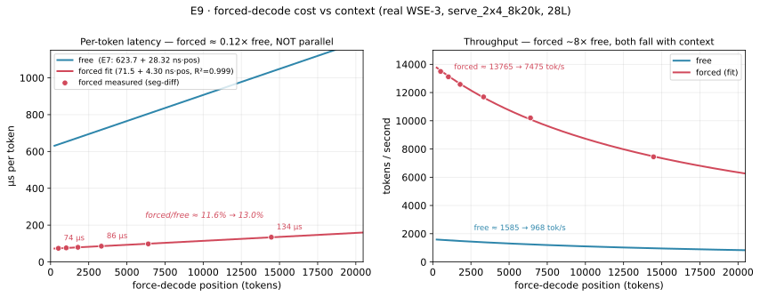
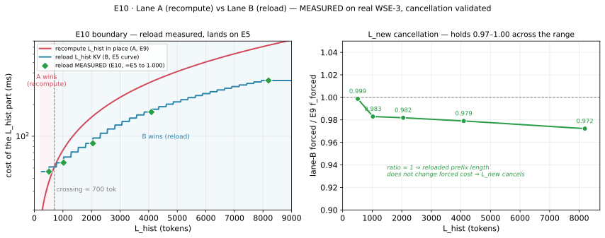
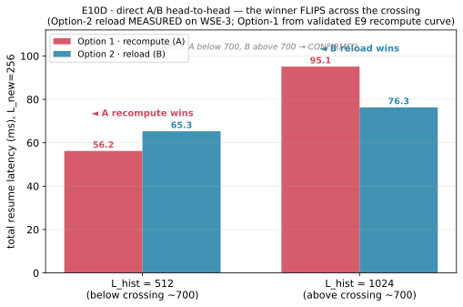

# M2 · Experiment Register (index + results + three-lane design)

> **What this document is.** The single index of every M2 experiment: what it asks, what it plots, what data it uses, and what it found. **Chapter 1 is the table** — read it to see where we are. **Chapter 2 is the results**, one section per row, in the same order. **Chapter 3 is the design of the next experiments.**
>
> This is the **git authoritative copy**, mirrored one-way to ContextBase (*M2 · Experiment Register*, `X3DIdKV2s4`) and to agent-memory `topics/m2-experiment-register.md`. It **replaces the chronological tracker** as the place to look up progress; the old tracker (`topics/m2-s3-experiment-tracker.md`) is kept only as a **narrative of how conclusions were reached and overturned**.
>
> **Naming.** Experiments are `E<n>`. Old `S<n>` subtask ids are given for continuity; `E<n>` is canonical from now on.

---

# Chapter 1 — The experiment table

## 1.1 Done

| ID | Name | What it establishes | x-axis | y-axis | Data | Status |
|----|------|---------------------|--------|--------|------|--------|
| **E1** | Baseline reproduction *(S0)* | our numbers match the upstream pr14 line, bit-identical | — (table) | — | `mtbench8`, real WSE-3, n=2 | ✅ |
| **E2** | Ingress timer *(S1)* | a device-TSC pair on the KV ingress adaptor; the rate it produced was later falsified | — | — | `mtbench8` | ⚠️ superseded by E5 |
| **E3** | Force-decode port *(S2)* | force-decode works and is token-exact; cost of one forced token | — (single point) | — | `mtbench8`, `F=64` | ✅ |
| **E4** | Ingress payload discriminator *(S30 run1)* | does H2D KV load time depend on bytes at all? | payload (mixed within one run) | `spread_pct` of the round span | `s30_sweep`, 1 run × 8 rounds | ✅ |
| **E5** | Ingress payload curve *(S30 run2)* | the H2D reload cost model | KV bytes (1→32 chunks) | device-TSC ingress span (ms) | `s30_bin{0256..8192}`, 6 runs | ✅ |
| **E6** | Prefill egress payload curve | how prefill's own KV→host path scales | KV bytes (1→32 chunks) | `per_req_kv_egress_ms` | same 6 runs, free | ✅ |
| **E7** | Free-decode cost vs context | `f(pos)` — the compute baseline every lane is priced against | context position | µs per token | same 6 runs, free, n=22 | ✅ |
| **E8** | Long-context correctness | does output stay sane to ctx 20,480? | generated position | distinct-4-gram | same 6 runs, free | ⚠️ inconclusive |
| **E9** | `f_forced(pos)` *(S3)* | forced decode has its own f(pos); forced ≈ 0.12 × free; lane A ~linear to the ceiling | force-decode position | µs per forced token | fabricated session, `F` swept, real WSE-3 | ✅ |

## 1.2 Planned — the three-lane race

**The scenario, fixed.** One request is evicted from the decode kernel, then resumes after new context arrives. Modelled on a long-running coding-agent session. Three regions, each independently varied:

| region | meaning | assumed state at resume |
|--------|---------|-------------------------|
| `L_hist` | everything said before this turn | KV already in host DRAM (computed in earlier turns) |
| `L_new` | the newly arrived context — user message, tool result, sub-agent return | not yet computed |
| `L_gen` | tokens generated after resume | held small and fixed so it cannot confound |

**The three lanes:**

| lane | what it does at resume | cost structure |
|------|------------------------|----------------|
| **A · rebuild everything** | KV was discarded at eviction. Force-decode all of `L_hist + L_new` in decode | `Σ f_forced(pos)` over `[0, L_hist+L_new]` — no transport |
| **B · reload + rebuild the delta** | Load `L_hist` KV from DRAM into decode, then force-decode only `L_new` | `ingress(L_hist)` + `Σ f_forced(pos)` over `[L_hist, L_hist+L_new]` |
| **C · compute the delta in prefill** | Give prefill the `L_hist` KV, prefill `L_new`, send the delta KV back, load it into decode | `move(L_hist→prefill)` + `prefill(L_new given L_hist)` + `move(delta→decode)` + `ingress(L_hist+L_new)` |

| ID | Name | What it establishes | Status |
|----|------|---------------------|--------|
| **E9** | `f_forced(pos)` | does a forced token cost more as context grows? | ✅ done — see Ch.2 E9 |
| **E10** | Lane A vs Lane B (resume latency) | the first resume-latency boundary: at what `L_hist` does reloading beat rebuilding? | ✅ **crossing ≈ 700 tok; `L_new` cancellation VALIDATED on real WSE-3 (ratio 0.97–1.00 across 512→8192), kv_ingress = E5 exactly (Ch.2 E10)** |
| **E11** | Full re-prefill baseline | re-prefill from scratch + ship all KV — a measurable substitute for lane C, conclusive one direction only | ⬜ |
| **E12** | Prefill-side KV ingestion | a build, not a measurement — prefill has egress only, so true lane C does not exist | ⬜ needs decision |
| **E13** | Decode-side KV egress | a build — the offload half of lane B; the recurring cost E10 assumes away | ⬜ needs decision |

## 1.3 What is measurable today, and what is not

```
prefill produces KV --[E6: egress, measured]--> host DRAM --[E5: ingress, measured]--> decode
                                                                                          |
decode produces KV  ------------- X no path exists (E13) X --------------------------------+

host DRAM ---------------- X no path into prefill (E12) X ---------------> prefill
```

⇒ **Lane A and Lane B are measurable now. Lane C is not** — only a substitute for it (E11). ⇒ E10 measures the **resume** cost only. The **eviction** cost (decode→host) needs E13. See §1.4 — lane C is closer than this suggests.

## 1.4 Lane C: what `nc_service` already has

Surveyed 2026-07-31. `nc_service` is **already a Cerebras WSE-3 codebase** — CSL + Cerebras SDK end to end, no GPU, no vLLM/SGLang, no paged attention, no block tables. Not a port across architectures; joining two pieces that already exist.

**The decisive finding:** `kernels/qwen3_1p7b-prefill/src/prefill.csl` already implements chunked prefill over a resident on-chip KV prefix (FlashAttention-2 cross-chunk folding). Chunk `c`'s queries attend chunks `0..c` read out of `K_cache_bank`/`V_cache_bank`; the causal mask applies only to the diagonal pair, so earlier chunks are unmasked — exactly prefix semantics. ⇒ "compute new tokens on top of an existing KV prefix" is already device-proven maths. What is missing is a way to *fill* those banks from outside, plus a base-position offset.

| piece | state |
|-------|-------|
| attention over a resident prefix | ✅ already implemented and device-proven |
| prefill→prefill KV format | ✅ no transpose — `kv_egress_colmux` ships `K_cache_bank` verbatim (unlike prefill→decode, which does need one) |
| host can read the bank | ✅ `launch.py:1579` already does `read_symbol(..., "K_cache_bank")`; the symmetric `set_symbol` seed is the cheapest bring-up path — makes E12a possible with no fabric work |
| `LOAD_PREFIX`/`RESUME` + `cache_len` command ABI | ✅ exists (8-word `uint32`), proven on decode. Reuse verbatim; add a third command |
| fabric ingress template | ✅ `kv_ingress_adaptor` + `kv_ingress_injector` (~280 CSL lines), the mirror image of `kv_egress_colmux` — same switch column, reversed |
| transport seam | ✅ `KvTransport` Protocol (TCP ~9 GB/s, RDMA ~12.3 GB/s measured), opaque bytes keyed by `request_id` |
| what genuinely needs writing | prefill-side ingress landing KV in the banks + a base-chunk offset threaded through `current_chunk` (reset to 0 at `prefill.csl:1538`), `request_n_chunks`, the RoPE fill, host `attn_mask`, egress `rnc` accounting, and the `z_drain`/last-token machinery |

⚠️ Prefix length is bounded by **per-PE SRAM**, not a host page pool (`max_layers_per_block × max_n_chunks × kv_tile_size` fp16 on chip) — *more* restrictive than a GPU pool. Prefix must be chunk-aligned; `bsz == 1` throughout.

⇒ **Plan change:** lane C moves from "needs a decision" to **planned**, split into **E12a** (compute half, host-seeded, no CSL ingress) and **E12b** (fabric ingress). E12a first — it answers whether lane C's compute is even cheaper than force-decoding the delta, before any transport work.

## 1.5 Result column — what each planned experiment will present

| ID | Name | Result — what it presents | Status |
|----|------|---------------------------|--------|
| **E9** | `f_forced(pos)` | the fit `f_forced(pos)=α+β·pos`; verdict on lane A's shape | ✅ **DONE — β=4.30 ns/tok (0.15× free), forced≈0.12×free; lane A ~linear to ceiling. E10 next** |
| **E10** | Lane A vs Lane B | the crossing point, plus two separate segments (reload overhead, post-ingress forced-token cost) so the `L_new` cancellation is tested, not assumed | ✅ ≈700 tok; cancellation measured 0.97–1.00 across L_hist (Ch.2 E10) |
| **E11** | Full re-prefill baseline | whether full re-prefill ever beats A or B. Conclusive one direction only | ⬜ |
| **E12a** | Lane C compute, host-seeded | is prefilling the delta actually cheaper than force-decoding it? | ⬜ now plannable |
| **E12b** | Lane C transport (prefill KV ingress) | the prefill-side analogue of E5; completes lane C | ⬜ build |
| **E13** | Decode-side KV egress | the recurring eviction cost E10 assumes away; also the equivalence control for the history-provenance confound | ⬜ build |

## 1.6 Run order

| # | run | new code? | why here |
|---|-----|-----------|----------|
| 1 | **E9** | no | zero-code; every E10 prediction depends on it → **done** |
| 2 | **E10** | no — force-decode + E5 ingress already timed | the actual boundary; both lanes measurable today |
| 3 | **E11** | no | free comparison point from the same fixture |
| 4 | **E12a** | yes, small — host `set_symbol` seed + base-chunk offset (one rebuild) | answers whether lane C's compute is worth it, before E12b's transport |
| 5 | **E12b / E13** | yes, real | only for whichever lane E10/E12a show is live |

---

# Chapter 2 — Results

## E1 · Baseline reproduction ✅

Real WSE-3, `pdSeparate`, `serve_2x4_8k20k`, real weights, n=2. All 242 `timing.json` leaf fields reproduce upstream to ≤0.02%; all deviation host-side. Decode steady **654.95 / 655.10 µs**, prefill span **56.91 ms**, egress **23.49 / 23.56 ms**. ⚠️ Read only `agg_steady` / `per_round[]`; `tsc.*` outside `per_round[]` describes the last round only (3.4% error on `tok_per_s`).

## E2 · Ingress timer ⚠️ superseded

Added a device-TSC pair because no host-side timer on this SDK can see the H2D wire (`task_wait` on a nonblock send reports 51.15 GB/s = 4.5× the ceiling). Reported 0.7726 GB/s. **That number was not a rate** — the marker is correctly placed but the divisor was a single payload point on the flat part of what E5 showed is a hockey stick. True marginal is 4.13× larger.

## E3 · Force-decode ✅

`F=64`, 8 requests, **10,067 tokens bit-identical** vs the free-decode reference. Skip gate proven active. **One forced token = 88.35 µs = 13.50% of a free token.** ⚠️ Measured at `F=64` on short contexts only — E9 tests whether it holds at large `F`.

## E4 · Ingress payload discriminator ✅

One run, 8 rounds spanning 1→32 chunks. Predictions: per-step → `spread_pct ≈ 0.005%`; per-byte → `≈ 2,756%`. **Measured 243.834%.** Both wrong; ingress *is* payload-dependent but not proportionally.

## E5 · Ingress payload curve ✅ — the main transport result

| `L_p` | chunks | MB total (4 bands) | ingress ms | marginal GB/s (aggregate) |
|-------|--------|--------------------|------------|---------------------------|
| 256 | 1 | 37.6 | 46.150 | — |
| 512 | 2 | 71.3 | 46.236 | 386 *(floor artifact)* |
| 1,024 | 4 | 138.4 | 56.141 | **6.78** *(knee — E10D lands here)* |
| 2,048 | 8 | 272.9 | 85.684 | 4.54 *(knee)* |
| 4,096 | 16 | 541.2 | 169.891 | **3.19** *(saturated)* |
| 8,192 | 32 | 1,078 | 338.266 | **3.19** *(saturated)* |

**Hockey stick.** Flat ~46 ms floor below ~2 chunks, a knee, then a line through the origin: `t = 0.18 ms + total_bytes / 3.186 GB/s`, R²=1.000000 above 8 chunks. The marginal **decreases** with chunk count — not because the wire slows, but because the fixed ~46 ms floor is divided out: at low payload each byte rides nearly free inside the floor (the 1→2 marginal of 386 GB/s is a floor artifact), and the marginal only converges to the true transfer rate once the floor is paid off. **Saturated bandwidth = 3.186 GB/s (aggregate; two doublings return the same value to 0.02%).** ⚠️ A power law fitted to the first five points (R²=0.999473) mispredicted the sixth by +27%; "carry the last marginal forward" was exact. In-range fit quality carried no information about extrapolation.

## E6 · Prefill egress payload curve ✅ — and it does not transfer to decode

| chunks | payload | `per_req_kv_egress_ms` | average GB/s | marginal |
|--------|---------|------------------------|--------------|----------|
| 1 | 32 MB | 23.56 | **1.424** | — |
| 2 | 64 MB | 74.73 | 0.898 | 0.656 |
| 4 | 128 MB | 181.79 | 0.738 | 0.627 |
| 8 | 256 MB | 458.56 | 0.585 | 0.485 |
| 16 | 512 MB | 820.76 | 0.654 | 0.741 |
| 32 | 1,024 MB | 1,679.65 | 0.639 | 0.625 |

*(aggregate — egress payload `32 MiB × chunks` is already total, the opposite convention to E5's per-band `band_bytes`.)* The 1-chunk point reproduces the 1.426 GB/s anchor to 0.3%, but holds only at its own payload. ⚠️⚠️ **RETRACTED (2026-07-31): the claim this reverses the host-path asymmetry.** `prefill.csl:104` shows prefill's egress is a switch-gather along X using `fft transpose.csl` — a layout transform + many-PE→edge gather; E5's ingress is a scatter with no transform. Different operations; rates not comparable. Decode's egress does not exist.

## E7 · Free-decode cost vs context ✅

`f(pos) = 623.70 µs + 28.315 ns × pos`, R²=0.99997, n=22, over mean-context 1,136→14,336 (actual contexts to the 20,480 ceiling). 655.6 µs/tok low end, **1,028.5 µs/tok at the top — 1.57× slower**. Fitting round-average against mean context recovers the marginal coefficients, so this is `f(pos)`. Three independent fits agree to 0.01%/0.09%.

## E8 · Long-context correctness ⚠️ INCONCLUSIVE — do not cite as validation

13 of 22 requests ran to full 20,480 ctx (6× beyond anything this artifact had done); all degenerate into repetition loops. **But not a device finding** — 5 of 20 begin looping at ctx < 3,407 (inside the range E1 reproduced bit-identical), several at ctx ≈ `L_p`. The prompts are random word salad. ⇒ No evidence of a long-context defect, and none against one. A real control needs coherent long prompts.

## E9 · `f_forced(pos)` ✅ — forced has its own f(pos); forced ≈ 0.12 × free; lane A ~linear to the ceiling

Real WSE-3, `serve_2x4_8k20k_e9` (2×4 blocks, 28 layers, `FORCED_MAX=20224`), 256-token prefix, 7 rounds sweeping `F` = 1, 512, 1024, 2048, 4096, 8192, 20224. **Recovered from the lost `m2-s3-0` session** — raw `timing.json` re-analysed, numbers bit-reproduced (2026-07-31); the run completed on CS-3 ~19:05.



**Three pre-registered checks passed.** ① `fd_f_device` non-zero on all 7 rounds including r6 (`F==N`=20,224) — the terminator-emit path (`tsc_emitted` fix, Codex's P1) executed correctly on hardware. ② r6 fastest round (2.37 s wall — all-forced, no free tail). ③ offset removed, doubling `F` scales the span ×2.03…×2.20.

**The `F=1` control caught a contamination.** `fd_span_us` at `F=1` = **22.03 ms for ONE step** vs a ~88 µs steady forced step. That is a fixed per-round **pipeline-fill** offset (the device tic fires before HT_tail has received the first Z), **additive on every round**, distinct from `kv_ingress_span_us` (46.15 ms, seven rounds identical, = E5's 1-chunk / 256-token reload). ⇒ the host `fd_us_per_forced_tok` over-counts — **+58% at `F=512`**, −13% at `F=20224`. Without the `F=1` round we'd have taken 117.0 µs as the position-512 cost (58% wrong). A warning comment was added at the forced-segment block in `launch_decode.py`.

**The result — segment-differenced marginal (offset-immune):**

| position range | µs / forced token | forced/free ratio |
|----------------|-------------------|-------------------|
| 1 → 512 | **74.1** | 11.6% |
| 512 → 1,024 | 76.3 | 11.7% |
| 1,024 → 2,048 | 79.5 | 11.8% |
| 2,048 → 4,096 | 85.5 | 11.9% |
| 4,096 → 8,192 | 98.0 | 12.2% |
| 8,192 → 20,224 | **134.3** | 13.0% |

Two findings for the cost model:

1. **Forced decode has its own `f(pos)`:** `f_forced(pos) = 71.6 µs + 4.30 ns·pos`, R²=0.999, monotone 74→134 µs. But the slope is **4.30 ns/tok = 0.15× free's 28.3** — the two lines are **NOT parallel**, forced is far flatter (E9's own §3.4 prediction of a parallel 28.3 ns/tok slope is refuted). ⇒ lane A = Σ f_forced is **super-linear but linear-dominated across the whole reachable range**: the quadratic term is 1.5% of the linear at L=512, 25% at 8192, and the two are equal only at L≈33,000 — beyond the 20,480 ceiling. **Measured lane A at F=8192 = 735 ms, within 1.6% of E3-constant × F (723.8 ms).** So **E3's 88.35 µs × F models lane A to ~1.6% up to 8192** (the §3.4 "quadratic envelope → 1420 ms" is refuted); it diverges only at the extreme (F=20,224: 2,350 ms measured vs 1,787 ms constant, +31%). Falsifier bucket: β=4.3 ns/tok < 10 ⇒ the "E3-constant safe to multiply" branch, with the caveat that a single constant is a ±40% approximation on *per-token* cost across 0–20k even though the *integral* stays ~linear.
2. **forced/free ≈ 0.12** across a 55× position range (11.6%→13.0%), bracketing S2's single 13.50% and the earlier mock 11.7–12.0% as a near-flat line — far stronger than any single point. Cost model can write **`forced ≈ 0.12 × free(pos)`**. Mechanism verified in code: force-decode pipelines tokens through the **8 (2×4) block stages**, but the ratio is set by `max_layers_per_block / n_layers = 4/28 ≈ 14.3%` (`layer_counts=[2,4,4,4,4,4,4,2]`), **not** 1/N_blocks = 1/8; the measured ratio rises toward that 14.3% asymptote as context grows. Refines ROADMAP's "~8.5×" (the short-context end, 1/0.117).

⇒ **E9 done; E10 (A/B crossing) is next and needs no new code** — E9 forced curve vs E5 measured ingress.

## E10 · Lane A vs Lane B ✅ — crossing ≈ 700 tokens, cancellation VALIDATED on real WSE-3

The boundary is `A−B = laneA(L_hist) − ingress(L_hist)` — the `L_new` term cancels **iff** force-decoding `L_new` costs the same after a fresh rebuild (A) as after a KV reload (B). E5 (ingress) and E9 (`f_forced`) already price the two halves; **E10's device runs test that cancellation.** Ran 5 fixtures on real WSE-3 (2026-08-01, `serve_2x4_8k20k_e9`, reuse e9 store), each: prefill an `L_hist` prefix → reload its KV → force-decode, with rounds `F=[1, N]` (offset control + full budget, no free tail).



| `L_hist` | chunks | `kv_ingress` (reload, ms) | E5 | ratio | lane-B forced (µs/tok) | E9 `f_forced` | cancel |
|--------|--------|--------------------------|------|-------|------------------------|--------------|--------|
| 512    | 2      | 46.24  | 46.24  | **1.000** | 116.57 | 116.71 | 0.999 |
| 1,024  | 4      | 56.14  | 56.14  | **1.000** | 115.81 | 117.82 | 0.983 |
| 2,048  | 8      | 85.69  | 85.68  | **1.000** | 117.84 | 120.02 | 0.982 |
| 4,096  | 16     | 169.89 | 169.89 | **1.000** | 121.82 | 124.43 | 0.979 |
| 8,192  | 32     | 338.27 | 338.27 | **1.000** | 129.54 | 133.24 | 0.972 |

**Two things validated on device:** (1) `kv_ingress` (the reload) reproduces E5's ingress curve to **1.000 at every `L_hist`** — the reload path IS the E5 path. (2) lane-B's forced-token cost == E9's `f_forced` to **0.97–1.00** across 512→8192 (a slight ~3% dip at 8192, within fit/window error) ⇒ **the reloaded prefix length does not change downstream forced cost ⇒ `L_new` cancels.**

⇒ The boundary `laneA(L_hist) = ingress(L_hist)` now stands on measured ground. **Crossing = 700 tokens (~2.7 chunks):** below it, recomputing the prefix in place (A) beats E5's ~46 ms reload floor; above it, reload (B) wins and pulls away. Inside the pre-registered 400–1,500 window — **model not falsified.**

### E10D · direct A/B head-to-head ✅ — the winner FLIPS across the crossing, BOTH options measured on WSE-3

A skeptic-proof, fully-**measured** head-to-head: run both options end-to-end and show the winner flip. **Both columns are now direct device measurements** (2026-08-01, `serve_2x4_8k20k_e9`; Option-1 = recompute-in-place `fd_span(F) − offset`; Option-2 = `kv_ingress + post-ingress-forced(L_new)`).



| `L_hist` | Option-1 recompute (**measured**) | Option-2 reload (**measured**) | winner | predicted |
|--------|-----------------------------------|--------------------------------|--------|-----------|
| **512** (below ~700) | **57.32 ms** `[recompute(768)]` | **65.29 ms** `[ingress 46.24 + delta 19.05]` | **A recompute** | A ✓ |
| **1,024** (above ~700) | **96.96 ms** `[recompute(1280)]` | **76.31 ms** `[ingress 56.14 + delta 20.17]` | **B reload** | B ✓ |

⇒ **The flip is confirmed with all-measured data:** below the crossing recompute-in-place wins (57.3 < 65.3); above it reload wins (76.3 < 97.0). The `L_new`=256 delta costs the same in both lanes (19–20 ms) — a bonus cancellation confirmation. The directly-measured recompute (57.3 / 97.0 ms) landed within ~2% of the E9 fit (56.2 / 95.1) that stood in earlier — the fit was slightly low but the verdict is identical. **The ≈700-token option-1/option-2 boundary is now validated both ways and fully measured** — the component/cancellation test (E10) and the direct total-latency head-to-head (E10D).

## E11 – E13 · Not yet run

E11 (full re-prefill substitute) is a free comparison from the same fixture once it exists. E12/E13 are builds, gated on what E10/E12a show is live.

---

# Chapter 3 — Design of the three-lane experiment (E9–E11)

## 3.1 The fabricated session

**Not from a dataset, by decision.** Mooncake's `output_length` is hard-capped at 2,000 tokens (both traces; mean 182–343), so it cannot represent a thinking model's generation. A fabricated session is also the only way to vary each region independently.

```
[system prompt + tool schemas]  [turn 1 ... turn k]      [new context]      [generate]
|---------------- L_hist ----------------------|         |-- L_new --|       |- L_gen -|
        KV assumed already in host DRAM                   not computed        fixed 64
```

**Requirements:** (1) exact token counts per region, verified against the launcher's own tokenizer+chat template; (2) coherent, not word salad (E8 showed noise makes the model loop); (3) non-repeating across regions; (4) region boundaries on chunk multiples (256); (5) ⚠️ pin the tokenizer revision (`70d244cc`), chat template, and tool-schema text, and persist rendered token IDs per region — analysis reads persisted IDs, never re-tokenizes.

## 3.2 Parameter grid

| parameter | values | why |
|-----------|--------|-----|
| `L_hist` | 0, 512, 1024, 2048, 4096, 8192 | the main sweep — spans E5's floor, knee, linear region. 0 is the control (B→A) |
| `L_new` | 256, 1024, 4096 | the delta the lanes disagree about |
| `L_gen` | 64, fixed | keeps generation from confounding |

Constraints: `L_hist + L_new + L_gen ≤ 20,480` (decode ceiling); for E11 only, `L_hist + L_new ≤ 8,192` (prefill `MAX_INPUT_LEN`).

## 3.3 The ingress payload, stated in bytes

```
band_bytes = 8 MiB × ceil(L/256) + 1 MiB          (the 1 MiB constant tracks KV_META_LEN = 4)
total      = 4 × band_bytes = 32 MiB × ceil(L/256) + 4 MiB
```

`ceil` matters: a partial chunk loads as a whole chunk. The grid lands every `L_hist` on a chunk multiple E5 already measured — lane B's reload cost is **measured, not modelled**:

| `L_hist` | chunks | ingress (E5, measured) |
|----------|--------|------------------------|
| 512 | 2 | 46.236 ms |
| 1,024 | 4 | 56.141 ms |
| 2,048 | 8 | 85.684 ms |
| 4,096 | 16 | 169.891 ms |
| 8,192 | 32 | 338.266 ms |

⚠️ Assumes lane B's injection uses the same per-round path E5 timed. `kv_ingress_span_us` is reported per round, so E10 **verifies** rather than assumes.

## 3.4 Pre-recorded predictions

⚠️ The E10 prediction rested on an intercept back-solved from E3's single point; E9 has now replaced it with a measured fit. **E9 measured β=4.30 ns/tok**, so the "E9-slope quadratic" envelope below (which assumed β=28.3) is **refuted** — lane A ≈ E3-constant × F to the ceiling (measured 735 ms at F=8192 vs the constant's 723.8).

| `L_hist` | lane A, E3-constant (88.35 µs) | lane A, MEASURED (E9) | lane B (measured) |
|----------|-------------------------------|-----------------------|-------------------|
| 512 | 45.2 ms | 37.9 ms | **46.24 ms** |
| 1,024 | 90.5 ms | 76.9 ms | **56.14 ms** |
| 2,048 | 180.9 ms | 158.3 ms | **85.68 ms** |
| 4,096 | 361.9 ms | 333.5 ms | **169.89 ms** |
| 8,192 | 723.8 ms | 735.1 ms | **338.27 ms** |

⇒ crossing predicted at `L_hist ≈ 520–900`: below it, force-decoding the whole thing (A) is cheaper than paying the ~46 ms reload floor (B); above it, B wins and pulls away (A grows ~linearly at ~74–98 µs/tok while B grows at E5's saturated 3.186 GB/s aggregate). **Falsifier:** a crossing outside 400–1,500 kills the model.

⚠️ **The `L_new` cancellation is a HYPOTHESIS, not an identity.** Both lanes are charged `Σ f_forced` over `L_new`, but that only cancels if lane B's forced decode starts from a state equivalent to lane A's (same KV layout, no extra warm-up / queue drain / first-token penalty from the ingress). **E10 measures the segments separately:** `lane B total − kv_ingress_span_us = post-ingress forced segment`; `lane A total = full-rebuild forced segment`. If the per-token cost of `L_new` differs between lanes, that difference is the finding.

**E11 — the full re-prefill baseline.** Prefill's amortised per-token cost was ~103–156 µs across E4–E7's bins. Prediction: it loses to lane B at every `L_hist ≥ 1,024`, paying a prefill floor *and* a full-payload ingress. ⚠️ A **substitute**, not a strict bound: if it loses, true lane C may still win; if it wins, lane C is worth building (E12). Only the second direction is conclusive.

## 3.5 What each experiment plots

| ID | figure | x | y | series | what a reader should see |
|----|--------|---|---|--------|--------------------------|
| E9 | forced-token cost | force-decode position | µs/tok and tok/s | forced (points+fit) + free (E7) | forced ≈ 0.12× free, NOT parallel — **done, see chart above** |
| E10 | the resume-latency boundary | `L_hist` | resume latency (ms), log y | lane A, lane B; one panel per `L_new` | two lines crossing once, B pulling away |
| E10b | decomposition | `L_hist` | stacked ms | ingress / forced-decode / fixed | which term owns the cost in each regime |
| E11 | full re-prefill baseline | `L_hist + L_new` | resume latency (ms) | A, B, C0 | whether C0 is ever below the other two |

## 3.6 Build status and honesty about scope

| lane | measurable today? | what is missing |
|------|-------------------|-----------------|
| A | ✅ | nothing — E3's mechanism with large `F` (now measured, E9) |
| B | ✅ resume only | the eviction half (decode→host) is E13, unbuilt. E10 assumes DRAM already holds `L_hist` |
| C | ❌ | prefill has egress only, no KV ingestion. E11 measures a substitute |

**E10's result will be a statement about resume latency in a session whose history is already persisted — not a full offload-vs-recompute verdict.** Stating this in the figure caption is part of the deliverable.

**Known confound: history provenance.** `L_hist` is assumed resident — fabricated and injected, never actually produced by an earlier decode turn. Doesn't affect the resume-latency measurement (same bytes, same path), but E10 cannot see whether decode-produced and host-reloaded KV stay equivalent over a long history. Testable later with an equivalence control that needs E13.

---

## Change log

* **2026-07-31** — register created. E6's "asymmetry reversed / 5.10×" retracted (prefill egress carries a transpose+gather; not comparable to decode ingress). A7's falsification withdrawn (Mooncake `output_length` capped at 2,000). Scenario fixed to the three-lane resume race; E9–E13 defined. Design reviewed by Codex — 8 findings applied.
* **2026-07-31 (later)** — **E9 done and filed** (recovered from the lost `m2-s3-0` session; raw `timing.json` re-analysed, bit-reproduced). Forced decode has its own `f(pos) = 71.6 µs + 4.30 ns·pos`; forced ≈ 0.12 × free; the `F=1` control exposed a ~22 ms per-round pipeline-fill offset that contaminates `fd_us_per_forced_tok`. Mechanism: 8 (2×4) block pipeline, ratio ≈ `max_lpb/n_layers = 4/28`, not 1/N_blocks. Chart added. **Correction:** an interim writeup called lane A "quadratic" with a "~30 ns/tok slope" — **both wrong**; the measured slope is 4.30 ns/tok and lane A is linear-dominated to the ceiling (≈ E3-constant × F to ~1.6% at 8192). ROADMAP and this register corrected. **E10 next; no new code.**
