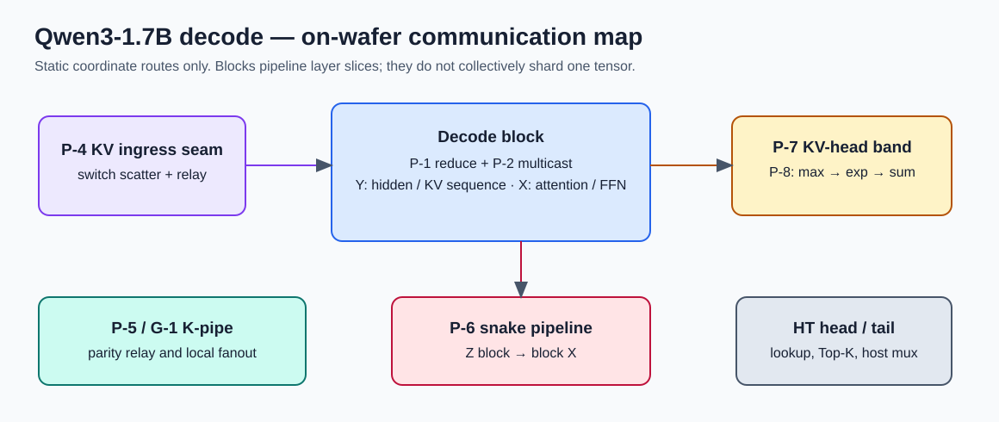
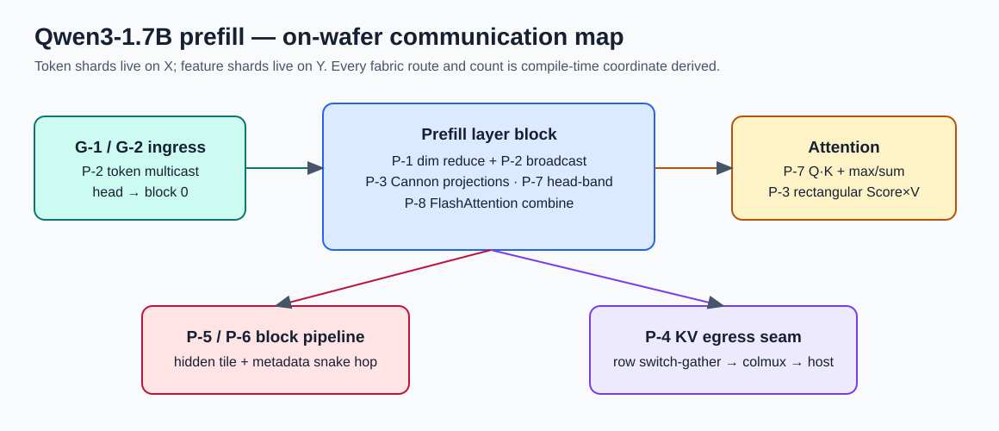

# Qwen3-1.7B decode and prefill — on-wafer communication map

> **Source snapshot:** the local `WaferEngine-staging` working tree inspected on 2026-08-20. The source links below are deliberately absolute local links, so they open the exact CSL implementation rather than a stale generated line citation. A block owns a contiguous slice of transformer layers; it is never a shard of the same tensor as another block.

## Visual index

| Artifact | Editable source | Rendered overview |
| --- | --- | --- |
| Decode | [Excalidraw](../../assets/kernel-algo/qwen3_1p7b-decode.communication-map.excalidraw) | [SVG](../../assets/kernel-algo/qwen3_1p7b-decode.communication-map.svg) |
| Prefill | [Excalidraw](../../assets/kernel-algo/qwen3_1p7b-prefill.communication-map.excalidraw) | [SVG](../../assets/kernel-algo/qwen3_1p7b-prefill.communication-map.svg) |

The diagrams are an orientation map, not a route-paint specification. For the task-level algorithm views, use the existing per-kernel walkthrough SVGs linked in the final column below. Those older walkthroughs remain helpful for structure, but their `file:line` text must not be treated as current source anchors.

## Decode

| Pattern | What moves / why | Current implementation anchors | Algorithm detail figure |
| --- | --- | --- | --- |
| **P-1 + P-2** — two-phase chain all-reduce + router multicast | GEMV partials and RMSNorm sums. The active axis is Y for hidden/KV sequence or X for attention/FFN width. The two reduce phases are on the *same* 1-D axis; P-2 broadcasts the replica. | [all_reduce_bsz_f32](</home/lexu/WaferEngine-staging/models/qwen3_1p7b-decode/src/comm_lib/comm_pe.csl:685>), [dim reduction](</home/lexu/WaferEngine-staging/models/qwen3_1p7b-decode/src/comm_lib/comm_pe.csl:1035>), [QKV fusion](</home/lexu/WaferEngine-staging/models/qwen3_1p7b-decode/src/comm_lib/comm_pe.csl:1115>), [axis repaint](</home/lexu/WaferEngine-staging/models/qwen3_1p7b-decode/src/comm_lib/comm_pe.csl:1335>), [chain routes](</home/lexu/WaferEngine-staging/models/qwen3_1p7b-decode/src/route_calc.csl:72>), [multicast routes](</home/lexu/WaferEngine-staging/models/qwen3_1p7b-decode/src/route_calc.csl:96>) | [comm library](../../assets/kernel-algo/qwen3_1p7b-decode.comm_pe.svg) · [main decode](../../assets/kernel-algo/qwen3_1p7b-decode.decode.svg) |
| **P-7 + P-2** — KV-head band reduction | Q/K RMSNorm and Q·K score partials reduce only within one fixed KV-head band on X, then broadcast within that band where needed. | [score band reduce](</home/lexu/WaferEngine-staging/models/qwen3_1p7b-decode/src/comm_lib/comm_pe.csl:931>), [Q/K norm reduce](</home/lexu/WaferEngine-staging/models/qwen3_1p7b-decode/src/comm_lib/comm_pe.csl:987>), [score caller](</home/lexu/WaferEngine-staging/models/qwen3_1p7b-decode/src/decode.csl:1257>) | [comm library](../../assets/kernel-algo/qwen3_1p7b-decode.comm_pe.svg) |
| **P-8** — safe decode softmax | KV sequence slots are sharded on Y. First all-reduce the maximum, then subtract the common maximum, exponentiate locally, and all-reduce the f32 sum. | [softmax driver](</home/lexu/WaferEngine-staging/models/qwen3_1p7b-decode/src/decode.csl:1271>), [max collective](</home/lexu/WaferEngine-staging/models/qwen3_1p7b-decode/src/comm_lib/comm_pe.csl:848>), [sum collective](</home/lexu/WaferEngine-staging/models/qwen3_1p7b-decode/src/comm_lib/comm_pe.csl:767>) | [main decode](../../assets/kernel-algo/qwen3_1p7b-decode.decode.svg) |
| **P-6 + P-2** — snake point-to-point pipeline | A hidden-state tile crosses from one layer-stage block to the serpentinely next block, then is fanned out inside the destination block. This is the only cross-block data movement; it is not a cross-block reduction. | [receive X](</home/lexu/WaferEngine-staging/models/qwen3_1p7b-decode/src/comm_lib/comm_pe.csl:1281>), [local fanout](</home/lexu/WaferEngine-staging/models/qwen3_1p7b-decode/src/comm_lib/comm_pe.csl:1295>), [send Z](</home/lexu/WaferEngine-staging/models/qwen3_1p7b-decode/src/comm_lib/comm_pe.csl:1308>) | [main decode](../../assets/kernel-algo/qwen3_1p7b-decode.decode.svg) |
| **P-5 / G-1** — K-pipe parity shuttle | The decode strip gathers, forwards, and injects the local hidden tile through a parity-alternating pipe; the peer strip consumes, forwards, then broadcasts. | [strip protocol](</home/lexu/WaferEngine-staging/models/qwen3_1p7b-decode/src/decode_strip.csl:1>), [sender chain](</home/lexu/WaferEngine-staging/models/qwen3_1p7b-decode/src/decode_strip.csl:68>), [receiver chain](</home/lexu/WaferEngine-staging/models/qwen3_1p7b-decode/src/decode_strip.csl:109>) | [decode strip](../../assets/kernel-algo/qwen3_1p7b-decode.decode_strip.svg) |
| **P-4** — KV ingress seam | The host-prepared KV layout is switch-scattered north-to-south, then shifted westward into decode blocks. The host performs the cross-artifact layout conversion; this is not the fused on-wafer diagonal transpose. | [injector scatter](</home/lexu/WaferEngine-staging/models/qwen3_1p7b-decode/src/kv_ingress_injector.csl:79>), [switch advance adaptor](</home/lexu/WaferEngine-staging/models/qwen3_1p7b-decode/src/kv_ingress_adaptor.csl:153>), [transparent relay](</home/lexu/WaferEngine-staging/models/qwen3_1p7b-decode/src/kv_fwd.csl:1>) | [KV injector](../../assets/kernel-algo/qwen3_1p7b-decode.kv_ingress_injector.svg) · [KV adaptor](../../assets/kernel-algo/qwen3_1p7b-decode.kv_ingress_adaptor.svg) |
| **G-1 / G-2 plumbing** — embedding and token ingress | `ht_head` relays the vocab-rotation lookup result to its target column. `demux` peels one token-ID batch from a FIFO and forwards the remainder. | [embedding dispatcher](</home/lexu/WaferEngine-staging/models/qwen3_1p7b-decode/src/ht_head.csl:136>), [demux split](</home/lexu/WaferEngine-staging/models/qwen3_1p7b-decode/src/demux.csl:61>) | [HT head](../../assets/kernel-algo/qwen3_1p7b-decode.ht_head.svg) · [demux](../../assets/kernel-algo/qwen3_1p7b-decode.demux.svg) |
| **P-1/P-2 variants** — output head | The lm-head contracts hidden Y and leaves logits at a root row (no broadcast); Top-K is an associative merge-reduce over X followed by a broadcast of the selected token. | [lm-head reduce](</home/lexu/WaferEngine-staging/models/qwen3_1p7b-decode/src/ht_tail.csl:727>), [Top-K merge-reduce](</home/lexu/WaferEngine-staging/models/qwen3_1p7b-decode/src/ht_tail.csl:956>), [token broadcast send](</home/lexu/WaferEngine-staging/models/qwen3_1p7b-decode/src/ht_tail.csl:1383>) | [HT tail](../../assets/kernel-algo/qwen3_1p7b-decode.ht_tail.svg) |
| **Serialization escape** — host egress | One mux PE relays the output to the host; it is intentionally a serialized point-to-point path, not a collective. | [mux main](</home/lexu/WaferEngine-staging/models/qwen3_1p7b-decode/src/mux.csl:66>) | [mux](../../assets/kernel-algo/qwen3_1p7b-decode.mux.svg) |

**Decode exclusions:** no Cannon (P-3), all-to-all, keyed routing, or cross-block collective exists. With one new token per step, GEMV partial all-reduce is the intended projection mechanism.

## Prefill

| Pattern | What moves / why | Current implementation anchors | Algorithm detail figure |
| --- | --- | --- | --- |
| **P-1 + P-2** — dim all-reduce | RMSNorm's f32 sum-of-squares reduces along Y, the hidden-feature axis, and is broadcast back. | [full reduce](</home/lexu/WaferEngine-staging/models/qwen3_1p7b-prefill/src/comm_lib/comm_pe.csl:323>), [RMSNorm caller](</home/lexu/WaferEngine-staging/models/qwen3_1p7b-prefill/src/prefill.csl:333>) | [comm library](../../assets/kernel-algo/qwen3_1p7b-prefill.comm_pe.svg) · [prefill](../../assets/kernel-algo/qwen3_1p7b-prefill.prefill.svg) |
| **P-7 + P-2** — KV-head-band reductions | Q/K RMSNorm, Q·K score partials, and the per-pair softmax reductions are confined to a KV-head band. Q·K uses a cycling root without repainting each step; max/sum variants broadcast within the band. | [Q/K norm](</home/lexu/WaferEngine-staging/models/qwen3_1p7b-prefill/src/comm_lib/comm_pe.csl:385>), [score reduce](</home/lexu/WaferEngine-staging/models/qwen3_1p7b-prefill/src/comm_lib/comm_pe.csl:457>), [softmax reduction](</home/lexu/WaferEngine-staging/models/qwen3_1p7b-prefill/src/comm_lib/comm_pe.csl:501>), [attention score step](</home/lexu/WaferEngine-staging/models/qwen3_1p7b-prefill/src/prefill.csl:1176>) | [comm library](../../assets/kernel-algo/qwen3_1p7b-prefill.comm_pe.svg) · [prefill attention](../../assets/kernel-algo/qwen3_1p7b-prefill.prefill.svg) |
| **P-3** — Cannon projections | QKV, O, up/gate, and down move the activation tile along Y and the weight tile along X. The local output partial remains stationary. | [skew](</home/lexu/WaferEngine-staging/models/qwen3_1p7b-prefill/src/comm_lib/comm_pe.csl:805>), [two-hop step](</home/lexu/WaferEngine-staging/models/qwen3_1p7b-prefill/src/comm_lib/comm_pe.csl:823>), [projection driver](</home/lexu/WaferEngine-staging/models/qwen3_1p7b-prefill/src/prefill.csl:561>) | [comm library](../../assets/kernel-algo/qwen3_1p7b-prefill.comm_pe.svg) · [prefill](../../assets/kernel-algo/qwen3_1p7b-prefill.prefill.svg) |
| **P-3 (rectangular)** — Score × V | Score shifts only inside its KV-head band; V circulates across X. The route machine temporarily lends queues 5/6/1 to the band shift, drains them, then restores the normal reduction binding. | [band-route/rebind](</home/lexu/WaferEngine-staging/models/qwen3_1p7b-prefill/src/comm_lib/comm_pe.csl:551>), [V hop](</home/lexu/WaferEngine-staging/models/qwen3_1p7b-prefill/src/comm_lib/comm_pe.csl:694>), [Score×V driver](</home/lexu/WaferEngine-staging/models/qwen3_1p7b-prefill/src/prefill.csl:1223>) | [prefill attention](../../assets/kernel-algo/qwen3_1p7b-prefill.prefill.svg) |
| **P-8** — FlashAttention-2 combine | Each PE locally combines chunk-pair `(max, sum, output)` states with the FlashAttention-2 rescale. It consumes the P-7 max/sum result but uses no new fabric transfer itself. | [pair start](</home/lexu/WaferEngine-staging/models/qwen3_1p7b-prefill/src/prefill.csl:1358>), [flash_combine](</home/lexu/WaferEngine-staging/models/qwen3_1p7b-prefill/src/prefill.csl:1376>) | [prefill](../../assets/kernel-algo/qwen3_1p7b-prefill.prefill.svg) |
| **P-5 / P-6** — serpentine block pipeline | A `[dim_per_pe, reduce_len]` hidden tile plus metadata travels to the next layer-stage block. N/S and E/W hops reuse queues only after a drain; parity order makes the shift register deadlock-free. | [shuttle core](</home/lexu/WaferEngine-staging/models/qwen3_1p7b-prefill/src/comm_lib/comm_pe.csl:886>), [source](</home/lexu/WaferEngine-staging/models/qwen3_1p7b-prefill/src/comm_lib/comm_pe.csl:950>), [drained destination](</home/lexu/WaferEngine-staging/models/qwen3_1p7b-prefill/src/comm_lib/comm_pe.csl:990>), [layer terminal caller](</home/lexu/WaferEngine-staging/models/qwen3_1p7b-prefill/src/prefill.csl:1470>) | [prefill](../../assets/kernel-algo/qwen3_1p7b-prefill.prefill.svg) |
| **P-4** — KV egress seam | Each row switch-gathers K then V eastward; `kv_egress_colmux` serializes each column northward to the host. This standalone artifact does not do the prefill-to-decode transpose on wafer. | [egress producer](</home/lexu/WaferEngine-staging/models/qwen3_1p7b-prefill/src/prefill.csl:805>), [start egress](</home/lexu/WaferEngine-staging/models/qwen3_1p7b-prefill/src/prefill.csl:912>), [column mux](</home/lexu/WaferEngine-staging/models/qwen3_1p7b-prefill/src/kv_egress_colmux.csl:1>) | [KV egress colmux](../../assets/kernel-algo/qwen3_1p7b-prefill.kv_egress_colmux.svg) |
| **G-1/G-2 + P-2** — token and embedding ingress | `demux` peels host token IDs. `ht_head` rotates a vocab tile and hands the ordered activation columns to block 0; router multicast distributes token IDs along the head column. | [demux](</home/lexu/WaferEngine-staging/models/qwen3_1p7b-prefill/src/demux.csl:1>), [vocab rotation](</home/lexu/WaferEngine-staging/models/qwen3_1p7b-prefill/src/ht_head.csl:230>), [ordered handoff](</home/lexu/WaferEngine-staging/models/qwen3_1p7b-prefill/src/ht_head.csl:260>), [block-0 receive](</home/lexu/WaferEngine-staging/models/qwen3_1p7b-prefill/src/prefill.csl:731>) | [demux](../../assets/kernel-algo/qwen3_1p7b-prefill.demux.svg) · [HT head](../../assets/kernel-algo/qwen3_1p7b-prefill.ht_head.svg) |
| **P-1/P-2 variants and serialization** — output head | HT-tail lm-head uses the two-phase Y reduction (logits stop at the root); Top-K is an X merge-reduce. The final Z tile is sent west into HT-tail, and mux serializes the host output. | [lm-head](</home/lexu/WaferEngine-staging/models/qwen3_1p7b-prefill/src/ht_tail.csl:652>), [Top-K](</home/lexu/WaferEngine-staging/models/qwen3_1p7b-prefill/src/ht_tail.csl:758>), [Z egress](</home/lexu/WaferEngine-staging/models/qwen3_1p7b-prefill/src/prefill.csl:692>), [mux](</home/lexu/WaferEngine-staging/models/qwen3_1p7b-prefill/src/mux.csl:1>) | [HT tail](../../assets/kernel-algo/qwen3_1p7b-prefill.ht_tail.svg) · [mux](../../assets/kernel-algo/qwen3_1p7b-prefill.mux.svg) |

**Prefill exclusions:** no keyed routing, all-to-all, or cross-block collective exists. All routes and wavelet counts are compile-time coordinate permutations; a mismatched count hangs rather than reporting an error.

## Tracking rules

- Treat `launch.py` color-allocation and placement comments as the source of truth for colors, queues, and PE rectangles. This index links the algorithm entry points; it does not replace a color/queue occupancy audit.
- Before changing a movement, first name the tensor and its sharded axis. A cursor-only KV edit may require no fabric movement at all.
- Any runtime branch that changes whether a PE emits a wavelet must be bit-identically replicated across all involved PEs. There is no dynamic destination field, acknowledgement, or credit protocol.
