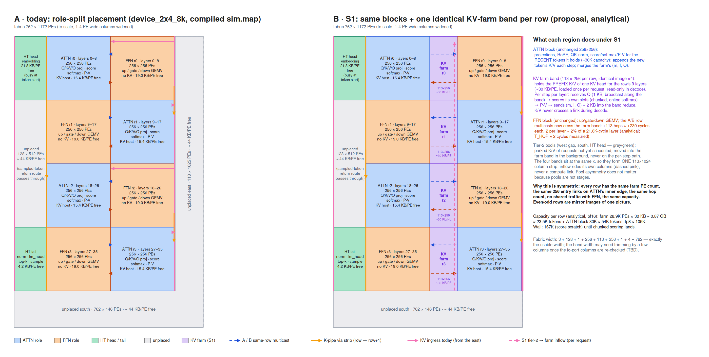
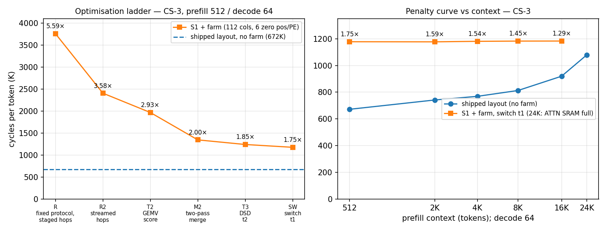

# 4b-weekly-summary-9-13 — Qwen3-4B on-chip KV offload (KV farm): progress to 2026-09-13

**Project:** wse3-performance-model · **Author:** claude (session 4b-layout-kv-stream) · **Owner:** Le Xu · **Status:** active
**Scope:** high-level progress only. Detailed records: `analyses/2026-09-13-kv-farm-v3-sim-integration/README.md` (results table, cost split, penalty curve), `analyses/2026-09-13-kv-farm-v2-single-pe/README.md`, design `docs/design/2026-09-02-kv-farm-s4-layout.md` (§5.4 protocol, §9.1 as-built, §11 TODO).

## 1. Goal and offload approach

Qwen3-4B decode on one WSE-3 keeps the whole KV cache inside the ATTN blocks' SRAM, which caps context at the block's own capacity. The offload approach is **compute-at-storage**: a **KV farm** band next to every ATTN block holds the older part of the cache and does the attention math for those positions locally, so K/V never cross a link during decode — only the query goes out and the partial result comes back.

- **Layout S1 (as built):** 4 block rows, each `[ATTN 256×256 | KV farm 112×256 | FFN 256×256]`, identical image on every row (even/odd rows mirrored). Farm PE `(col, row)` holds K/V of **one KV head** (`row mod 8`) for up to `n_pos` positions of every layer on its row (6 positions × 9 layers ≈ 28 KB per PE in the current build).
- **Per layer, per token (protocol t0–t8):** t1 the block band streams the head's query `Q_h` along the row (router-forwarded); t2 each farm PE scores its own positions, online-softmax, `P·V` → a local triple `(m, l, O)`; t3/t4/t5 the triples are merged along the row (groups of 16 → group roots) and up the head's class column to an entry root, in **two streaming passes** (max pass → router broadcast of `m_head` → local rescale → sum pass, so no hop waits on the previous hop's result); t6 the entry root hands `(m, l, O)` to the block; t7 the block's keeper floods the head's slice down its column; t8 every ATTN PE merges the farm triple with its own attention output before the O-projection. The block's own code path is otherwise unchanged.

## 2. Experimental setting

| item | value |
|---|---|
| machine | EPCC CS-3 (SDK 2.10 client / 1.13.2 cluster); simulator (simfab, SDK 2.10) for correctness only |
| model / launcher | Qwen3-4B decode launcher (`device_2x4_8k` = shipped no-farm layout; `device_2x4_8k_farm112_npos6` = S1 + farm), batch 1, bf16, 36 layers over 4 rows |
| request | prefill 512 / 2,048 / 4,096 / 7,936 tokens, then 64 decode steps; the per-token figure is the mean over the last 47 decode steps |
| metric | device cycles per token (one token passes all 36 layers serially); µs at 0.85 GHz; "per layer" = per-token delta ÷ 36 |
| farm contents | 6 **zero** positions per PE — device runs measure timing only; a device path to seed and read back the farm does not exist yet |
| correctness | simulator `sim_2x2` (P = 8) + 8-column farm: bit-exact KV-seed check and top-k check pass at every optimisation step |

## 3. Best results so far

**Ladder (prefill 512 / decode 64, cycles per token; shipped layout 672,193 = 790.8 µs):**

| step | what changed | cycles/token | × shipped |
|---|---|---|---|
| R | protocol as drawn, route bug fixed, merge hops staged through memory | 3,760,395 | 5.59× |
| R2 | merge hops streamed (`@fmacs(fabout, mem, fabin, a)`) | 2,407,451 | 3.58× |
| T2 | K stored dim-outer, score as the block's `@map`/`@fmachs` GEMV | 1,968,766 | 2.93× |
| M2 | two-pass merge: max stream → router broadcast → local rescale → `@fadds` streaming sum | 1,346,696 | 2.00× |
| T3 | rest of t2 on DSDs/DSRs (reductions, SIMD exp, `@increment_dsd_offset` P·V) | 1,241,770 | 1.85× |
| **SW** | **t1 switch-forwarded** (router pos0 pass-through / pos1 inject, `SWITCH_ADV`) | **1,177,712** | **1.75×** |

**Penalty curve (decode 64 after prefill N; 16K/24K with the block cache enlarged to 16,384 / 24,576 slots, added 2026-09-14; end-to-end at 7,936: shipped 1,046 tok/s device / ≈ 936 host-observed, farm 719 / ≈ 642):**

| prefill | shipped | S1 + farm | farm / shipped |
|---|---|---|---|
| 512 | 672,193 | 1,177,712 | 1.75× |
| 2,048 | 741,896 | 1,176,958 | 1.59× |
| 4,096 | 769,208 | 1,180,798 | 1.54× |
| 7,936 | 812,929 | 1,182,501 | 1.45× |
| 16,128 | 919,798 | 1,182,869 | 1.29× |
| 24,320 | 1,079,711 | — (farm image: ATTN PE out of SRAM) | — |

The 24K row enlarges the ATTN block's own cache in both images (the farm band still holds 6 zero positions); the farm image fails only because its block-side buffers (2 KB keeper tap, 1 KB Q forward buffer, the `farm_*` code) no longer fit beside a 96-slot cache — it is not a statement about the farm's capacity, which lives in the farm PEs (≈ 21.5K positions per head per row on top of the block's 8K).

**What the numbers say.** The farm image's cost is **context-flat** (1.177–1.183 M from 512 to 16K) while the shipped layout grows ≈ 248K from 512 to 16K and ≈ 20K per further 1K tokens: the block's context-dependent attention work falls inside the window in which it waits for the farm, so it is absorbed. The farm's remaining excess (≈ 14K cycles per layer at 512, ≈ 10K at 8K, against ≈ 18.7K per layer for the shipped block) is therefore **farm-path latency**, not extra block work. Measured components: ≈ 650 cycles per farm position per layer (one PE, 6-long vectors), ≈ 62 cycles per merge hop per layer (36 hops ≈ 2.2K), ≈ 8K per layer position-independent (t2's short-vector issue overhead, `m_head` broadcast and queue rebinds, the 520-wavelet hand-off and keeper tap, flood, t8). At equal context the shipped layout stays ahead while the context fits its cache; the farm's case is capacity beyond the block's SRAM at a shrinking latency penalty.

**Which point matters (Le, 2026-09-14).** The block's cache holds 8,192 positions, so prefill 7,936 + decode 64 is the largest request the shipped layout can run and the only row where the comparison is meaningful; the 512–4K rows exist to show that the farm's cost is context-independent. For the real regime, **> 8K context**, the shipped layout cannot run at all and the per-token cost is the 7,936 figure itself (≈ 1.18 M cycles ≈ 1.39 ms at 0.85 GHz): the block side is already full and the farm side does not move with context as long as the farm keeps 6 positions per PE, which covers ≈ 21.5K farm positions per head per row (112 × 32 × 6), i.e. total context up to ≈ 29K. Beyond that, one more position per PE (`n_pos = 7`, the compiled maximum: 40,640 B used at 6, 4,608 B per position, 48 KB SRAM) costs ≈ 23K cycles per token (650/position/layer × 36) and raises the farm to ≈ 25K tokens. Compiled capacities (msize): shipped block alone tops out at ≈ 29K context (45,392 B per ATTN PE at 24K, 176.5 B per slot); with the farm image the block can hold ≈ 23K (the farm adds 4,032 B to every ATTN PE), so block + farm reaches ≈ 33K with the block at 8K and ≈ 48K with the block at 23K. Read 1.45× as conservative: its denominator is a layout that does not exist at that context.

## 4. Things learned this week (durable)

- **Route programming must cover every colour that transits a PE**, not only the ones it sends/receives; an early `return` in per-role route code skipped level-3 pass-through routes and hung every run (sim and device) until found via a simulator core dump + per-PE phase words.
- **Simulator "Stopping due to fatal error" + SIGSEGV is the idle stop**, i.e. a plain hang; the CTF trace loses its tail on that abort, the readable state is a core dump taken before it.
- **IQ0 on the ATTN block is not borrowable** (the next step's x lands asynchronously; remapping a non-empty queue faults); IQ2/OQ0 are.
- **Switch-advanced inject chains ending at a data receiver:** the originator's popped 1-command `SWITCH_ADV` wavelet is enqueued downstream as one 32-bit data wavelet; the members' 2-command wavelets are not — identical on simulator and silicon (confirmed by hang/no-hang of the receive extent).
- Per-hop cost of a streamed chain merge is ≈ 62 cycles/hop when sender and receiver overlap; a store-and-forward hop was ≈ 537.
- No fabric adder is reachable from CSL 2.10 (present in the simulator model, no API), so reductions stay on CE streaming adds.

## 5. Next (TODO, in Le's order)

1. **Remote fetching / farm–block load balance** (added 2026-09-13): the block idles ≈ 10K cycles/layer at 8K while the farm path runs. Keep storage on the farm but stream K/V of `n_fetch` positions per layer along the row to the block band (router-level taps into per-layer fetch cache slots) and let the block's ordinary attention loop compute them (≈ 135 cycles/position/layer per PE with 32 PEs in parallel, vs 650 on one farm PE); pick `n_fetch` so both sides finish together.
2. **Device correctness harness** for the farm (seeded non-zero K/V, host reference) — prerequisite for any capacity claim and for (1).
3. Shorten the farm path further (t2 fixed overhead, hand-off + tap, chain passes), then S4 (head fold, rotated tail, 240-column band).

## Pointers

- Kernel snapshot for review (V5): https://context.ed-aisys.com/doc/kv_farmcsl-kv-farm-pe-kernel-v5-snapshot-two-pass-merge-dsd-t2-2026-09-13-Y6r8DCcNTR
- Working tree `/home/lexu/build/4b-farm/s1/qwen3_4b-decode/` (`src/kv_farm.csl`, `src/decode.csl` `farm_*`, `run_farm_cs3.sh`); CS-3 logs `~/rsync/4b-farm-s1-logs/`
- Figures: `../artifacts/2026-09-13-kv-farm-s1-floorplan.png` (from `docs/diagrams/gen_2026-09-02-kv-farm-figures.py`), `../artifacts/2026-09-13-kv-farm-ladder-and-curve.png` (`../artifacts/2026-09-13-gen_kv_farm_ladder_and_curve.py`)
