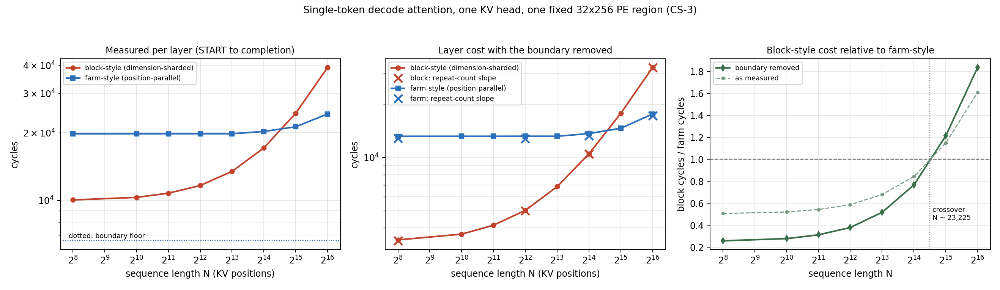

# Attention compute: dimension-sharded (block) vs position-parallel (farm), scaling with sequence length — 2026-09-16

**Project:** wse3-performance-model · **Author:** claude (session 4b-layout-kv-stream) · **Owner:** Le Xu · **Status:** measured, CS-3
**Full record:** repo `analyses/2026-09-15-attention-scaling-sidebyside/README.md` (+ `scaling.png`, `results.csv`, `raw_results.json`, `slopes.json`, `marginal.json`); code `/home/lexu/build/attn-sidebyside/`.

## Why this experiment

The KV farm (compute-at-storage) computes decode attention **position-parallel**: each PE holds the full 128-dim K/V of its own positions and does a whole-vector dot product, then one online-softmax merge across the region. The shipped block computes it **dimension-sharded**: each PE holds 4 dims of many positions, and a score needs an all-reduce across the 32 columns of a head band. The open question was whether "farm-style is cheaper per position" is a real, measurable property or an artifact, and how each scales with sequence length N. We needed measured numbers before extrapolating: **isolate the attention compute** (Q/K/V pre-seeded on the PEs, nothing enters or leaves the timed window), fix one PE region, hold the K/V bytes equal, and sweep N.

## Setting

One KV head, one decode token, `O[4 query heads][128 dims]`, softmax over N stored positions, bf16 K/V/Q with f32 accumulation. Same **32-column × 256-row region = 8,192 PEs** for both algorithms, same total K/V bytes per PE (`N/32`). Timed on CS-3 with the Layout C collector-column harness (one PE reads its own TSC before START and after a completion chain accounts for every row — no cross-PE TSC arithmetic; cycle counts leave via an output stream after timing, `memcpy_required=False`). Boundary removed two ways that agree to 0.01–3%: a directly measured floor (layer body removed) and a repeat-count slope (body run k=1,3,5×). Every reported config passes a numpy reference (max |dO|/max|O| 7e-8…5e-7); nothing is extrapolated.

## Results (cycles per attention layer, boundary removed)

| N | block-style | farm-style | block/farm |
|---|---|---|---|
| 256 | 3,411 | 13,206 | 0.26× |
| 4,096 | 5,012 | 13,214 | 0.38× |
| 8,192 | 6,839 | 13,212 | 0.52× |
| 16,384 | 10,498 | 13,681 | 0.77× |
| 32,768 | 17,812 | 14,671 | 1.21× |
| 65,536 | 32,438 | 17,662 | 1.84× |

- **Crossover N ≈ 23,000 positions** (23,225 by log-interpolation, boundary removed; as-measured 23,170). Below it the dimension-sharded block layout is faster; above it the position-parallel farm layout is, and the gap widens.
- **Marginal cost per stored position** (fit over N = 16,384…65,536): block **0.446** cyc, farm **0.081** cyc — **5.5×**. Farm-style is nearly flat (1.34× over a 256× range in N); block-style grows 9.5×.
- **Fixed cost**: farm's floor is ≈ 13.2K cycles (the merge — chain-latency-bound; a shorter column chain lowers it: the 64×128 shape drops it to ≈ 11.4K); block's floor is small (~3.4K at N=256).

## Why these are the numbers

- **The block moves an O(N) quantity every layer; the farm never does.** A block score needs `4 × N/256` f32 all-reduced across the 32-column band, twice (in and out) — that payload grows linearly with N. The farm's only N-dependent term is the local `N/8192`-position GEMV; its merge payload (4 + 516 f32 up the chains) is constant in N. That is the whole shape of the two curves.
- **Per PE-cycle the farm's dot product is far denser.** Farm: one PE does the full 128-dim dot for its positions → 650 PE-cycles/position, 1.6 MAC/cycle. Block: 32 PEs each do 4 dims + an X-reduce → ~4,300 PE-cycles/position, 0.24 MAC/cycle. The block's short 4-dim vectors and the reduce eat the efficiency; that is the 5.5× per-position gap, not any difference in stored bytes (identical).
- **SRAM: the farm holds 4× more context on the same PEs** (compile limits, not arithmetic: block max N = 131,072 / fails 196,608; farm max = 524,288 / fails 786,432). Same K/V bytes, but the block's score+exp scratch scales with N/256 positions per PE (~4× its K/V bytes of working set) while the farm's scales with N/8192 (working set ≈ K/V bytes + a fixed O accumulator).

## What the farm pays instead (the tradeoff, quantified)

Farm-style is not free below crossover: (1) a high fixed floor (~13K merge) that does not shrink when few positions are used — a 9K-context request still pays it; (2) a fixed per-PE SRAM overhead for holding all 128 dims + the Q_h copy + the O accumulator (the "replicate the dimensions" cost, ≈ 3.7 KB/PE of Q/O/scratch beyond the shared code); (3) short-vector instruction overhead at small n_pos. The block layout wins whenever positions-per-PE is small and most of the time is spent in the weighted GEMVs — i.e. context that fits the block's own cache (≤ ~8K on the shipped image, up to ~29K if the cache is enlarged). This is the same crossover seen at the whole-token level in the penalty curve: the farm's value is capacity beyond the block's SRAM.

## Two defects this experiment surfaced in `kv_farm.csl` (masked by the all-zero device fill)

Both are real in the shipped kernel and will corrupt the farm's numerical output the moment real K/V are seeded; timing is unaffected, so every timing conclusion (1.69× ladder, penalty curve, this scaling) still stands.

1. **`scale_to_head` rescale is wrong.** It uses `exp_neg_f32(m_pe − m_head)`, but `m_pe` was overwritten by the max pass with a running partial maximum (should keep this PE's own local max separately), and it omits the alpha scale (should be `e^(alpha·(m_local − m_head))`, alpha ≈ 0.088). Cosine similarity 0.41 vs reference until fixed → 1e-7.
2. **DSR max reduction behind the `@map` GEMV returns the last element on device** (not in simfab). The score GEMV and the max share one `local_triple` loop body; on CS-3 the reduction returns the slice's last element, inflating the denominator (1.19× at N=16,384). Fix: split the reduction into its own loop, as `decode.csl` already has it. Recorded as personal memory `wse3-dsr-reduce-after-map-returns-last-element`.

Both were masked because every device run so far used all-zero farm K/V (all scores 0 → max = last = 0, and scale_to_head is a no-op). Finding them is exactly what the pending "device correctness harness (seeded K/V)" TODO is for.

## Caveats

One KV head, one layer, batch 1, isolated region — no fabric contention, Q ingress, RoPE, QK-norm, O-proj or residual (identical in both, outside the comparison). The collectives are structure-and-payload-faithful re-implementations, not `comm_lib`/`kv_farm` themselves. The block layout needs the region width to divide head_dim (128), so the 112-wide farm shape cannot be run block-style. One optional-shape config (block 64×128, N=1,024) deadlocks on device, undiagnosed; the primary 32×256 sweep is unaffected.
