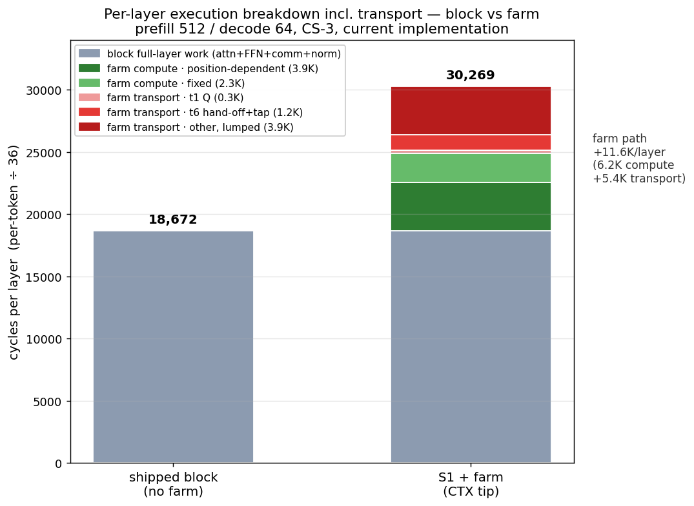
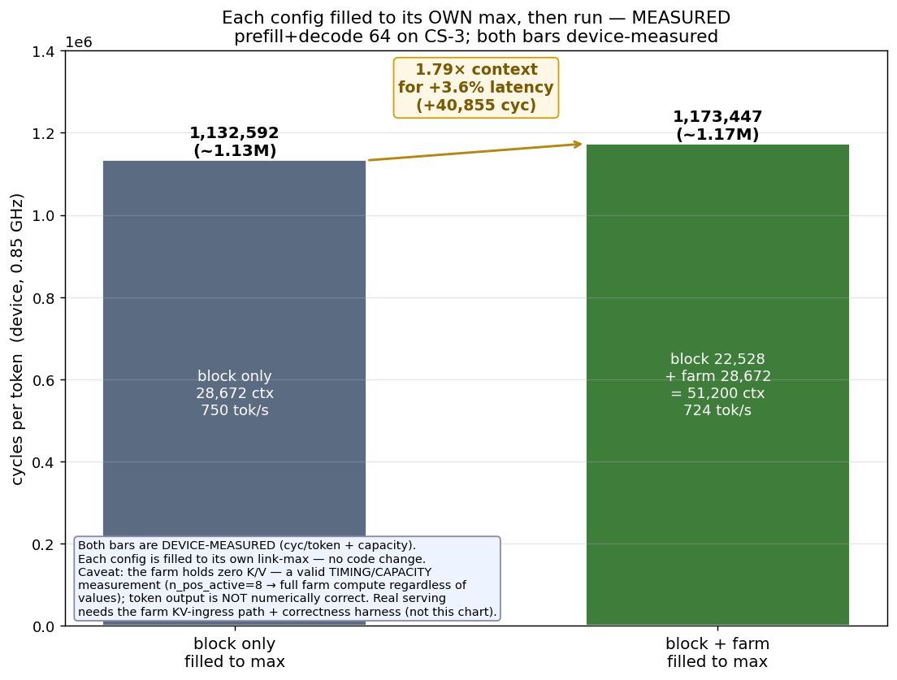

# KV farm S1 — session update 2026-09-17: streamed-max landed, bf16 hand-off trial, reduction correctness resolved, capacity

**Project:** wse3-performance-model · **Author:** claude (session 4b-layout-kv-stream) · **Owner:** Le Xu · **Status:** active
**Scope:** what this session changed on top of the 2026-09-13 weekly summary — one landed optimisation, one measured-then-reverted trial, one correctness question closed, plus the current results ladder and capacity. Detailed records: `analyses/2026-09-13-kv-farm-v3-sim-integration/README.md` (ladder, cost split, penalty/capacity), architecture in the as-built doc "KV farm as built (S1) — one decode layer in eleven timesteps" and step sheet `docs/diagrams/2026-09-14-kv-farm-s1-steps-sheet.png`.

## 1. What changed this session

- **Streamed-max landed (FARM_CTX), device-verified 1.62×.** The merge's max pass was staged through SRAM (`@fmovs` recv → scalar compare → `@fmovs` send, ~62 cyc/hop); it is now one streamed `@fmaxs(msend, mrecv, m_pe_dsd)` that forwards `max(incoming, running)` without clobbering the PE's own local max. Device: **1,089,683 cyc/token** (from FARM_CT 1,138,588; −48,905/token ≈ −1.36K/layer, matching the twofabin microbench prediction). The separate preserved local max also **fixed defect #1** (the rescale in `scale_to_head` had been using a clobbered max and dropping the α scale, cos-sim 0.41 → correct).
- **bf16 t6 hand-off — TRIAL, measured then reverted (not landed).** Sending the 512-f32 O partial of the entry→block hand-off as bf16 (512 f32 → 512 bf16 @ 2/wavelet = 256 wavelets; header m/l kept 8 f32) measured **1,067,988 cyc/token = −21,695/token = −1.99% = −603 cyc/layer** on device. Compiled and ran clean (no queue-remap/width fault on colour 9 or the farm IQ). Pure timing (device K/V are zeros → bf16(0)==f32(0), output bit-identical). Reverted after; tree restored to the f32 tip. **Landing is gated on precision** — with real K/V, bf16 on O rounds the farm's dominant t8 term at large context; must measure `max|dO|/max|O|` on the real-kernel seed harness first.
- **DSR reduction correctness — contradiction resolved, NOT a bug.** A single-call pointer-dest reduction (`@fmaxs(&acc, acc, dsr)` / `@fadds`) is codegen-sensitive: it reduces correctly only in the module-var + dedicated-DSR + `save_address=false` form, and degrades to last-element with a local accumulator or an inline DSD. This is documented internally (the block's own `decode.csl` cites `common_errors.md E-36`). kv_farm uses the safe form on a **dedicated DSR (id 3, not shared with the gemv's id 2)**, device-verified to reduce correctly, and the shipped block uses the byte-identical form. An isolated-test verdict that flagged it as broken had tested the local-var / inline-DSD variants, not kv_farm's form.
- **Tree divergence noted.** The local working tree's `src/kv_farm.csl` (42.7 KB, imports a `gen.csl` seed harness) is NOT the source that produced FARM_CTX (38.9 KB, no `gen.csl`, preserved on CS-3); `gen.csl` is unstaged so the local tree does not compile on CS-3. Farm perf work must build against the verified baseline until the seed harness is properly integrated.

## 2. Architecture (recap)

**Offload approach — compute-at-storage.** A **KV farm** band sits beside every ATTN block and holds the older part of the KV cache, doing the attention math for those positions locally. During decode K/V never cross a link — only the query goes out and a partial result comes back. **Layout S1 (as built):** 4 block rows, each `[ATTN 256×256 | KV farm 112×256 | FFN 256×256]`, identical image per row. A farm PE holds the full 128-dim K/V of **one KV head** for up to `n_pos` positions of every layer (position-parallel, dims-in-PE) — the opposite sharding to the block, which splits dims across many PEs.

**Per layer, per token (t0–t8):** t1 the block streams the head's query along the row (switch-forwarded); t2 each farm PE scores its own positions, online-softmax, P·V → a local triple `(m, l, O)`; t3–t5 the triples merge along the row and up the head's class column to an entry root in **two streaming passes** (max pass → router broadcast of the head max → local rescale → sum pass, so no hop waits on the previous hop); t6 the entry root hands `(m, l, O)` to the block; t7 the block keeper floods the head slice down its column; t8 every ATTN PE merges the farm triple with its own attention output before the O-projection. Full walk-through in the as-built doc.

## 3. Results — optimisation ladder (prefill 512 / decode 64, cycles per token)

Shipped block (no farm) = 672,193 cyc/token = parity target. The "×" is the farm's penalty over that at 512 context; it shrinks with context (1.29× at 16K — the block grows, the farm image is context-flat). The cyc/token deltas are what is fixed.

| step | change | cyc/token | × shipped | Δ/layer |
|---|---|---|---|---|
| R | protocol as drawn, merge hops staged through SRAM | 3,760,395 | 5.59× | — |
| R2 | merge hops streamed (`@fmacs`) | 2,407,451 | 3.58× | −37.6K |
| T2 | K dim-outer, score as the block's `@map`/`@fmachs` GEMV | 1,968,766 | 2.93× | −12.2K |
| M2 | two-pass merge (max stream → broadcast → rescale → `@fadds` sum) | 1,346,696 | 2.00× | −17.3K |
| T3 | rest of t2 on DSDs/DSRs | 1,241,770 | 1.85× | −2.9K |
| SW | t1 switch-forwarded | 1,177,712 | 1.75× | −1.8K |
| CT | contiguous head-to-row layout | 1,138,588 | 1.69× | −1.1K |
| **CTX** | **max pass streamed (current landed tip)** | **1,089,683** | **1.62×** | **−1.36K** |
| bf16 t6 *(trial, reverted)* | O partial on the hand-off as bf16 | 1,067,988 | 1.59× | −0.60K |

**Reading — diminishing returns.** The first three steps (streaming, GEMV, two-pass merge) banked ~2.4M cyc/token (5.59× → 2.0×); every step since is 20–65K/token (0.6–2.9K/layer) and halving. bf16's 2% is the smallest rung — a normal long-tail bite. Against the right denominator it is larger: the remaining farm-vs-block gap is 417K/token, so bf16 is 5.2% of the gap and ~13% of its wire sub-bucket.

### 3.1 Per-layer breakdown: block vs farm, including transport (512 ctx, CTX tip)

Per-layer = per-token ÷ 36, device-measured totals; the farm path is split by repeat-slope / subtraction (compute, t1, hand-off isolated; the rest of transport is lumped — subtraction cannot split it further). The block's own layer work is unchanged under the farm; the block's internal attention stages were not separately instrumented, so it is shown as one bar.

| component | shipped block | S1 + farm |
|---|---|---|
| block full-layer work (QKV / attn / O-proj / FFN / comm / norm) | 18,672 | 18,672 (unchanged) |
| farm compute · position-dependent | — | 3,900 |
| farm compute · fixed | — | 2,300 |
| farm transport · t1 Q | — | 300 |
| farm transport · t6 hand-off + keeper tap | — | 1,200 |
| farm transport · other (merge / m_head broadcast / IQ rebinds / flood / t8, lumped) | — | 3,897 |
| **total** | **18,672** | **30,269** |

Farm path = **+11.6K/layer = 6.2K compute + 5.4K transport**.

**Read this carefully — it is not the "farm wins" regime.** At 512 ctx the farm holds **zero** positions (device runs are timing-only), so it offloads nothing; the +11.6K is pure added path cost on top of the unchanged block work. The farm path is ~flat with context while the block's own attention grows (+6.9K/layer over 512→16K), so the *exposed* excess shrinks from 11.6K/layer at 512 to **7.3K/layer at 16K** — the growing block attention overlaps the farm's wait window. The design crossover (same positions, farm cheaper than block) is compute-only ~23K / end-to-end ~29K (§8).

### 3.2 The comparison that matters: each config filled to its OWN max, then run (MEASURED)

The fair value comparison is not both at 512 (§3.1, where the farm holds zeros and is dead weight) but each system filled to the largest context it can hold, then run:

| config | max context | cyc/token |
|---|---|---|
| block only, filled | 28,672 | **1,132,592** (measured; 750 tok/s dev, ~670 host) |
| block + farm, filled | 51,200 (1.79×) | **1,173,447** (measured; 724 tok/s dev, ~646 host) |

**MEASURED, both bars on device:** the farm serves **1.79× the context (51,200 vs 28,672) for +3.6% per-token latency** (+40,855 cyc, 1,173,447 vs 1,132,592). The farm's extra 28,672 positions of attention run in parallel on otherwise-idle farm PEs and hide behind the block's own (now-large) attention, so the added context is nearly **free in latency**. Caveats: free only above the crossover (below it the farm is pure overhead, §3.1); NOT free in SRAM (+4 KB per ATTN PE); and the RIGHT bar's farm holds **zero K/V** — a valid timing/capacity measurement (n_pos_active = 8 drives full farm compute regardless of values), but token output is not numerically correct. Real serving needs the farm KV-ingress path + correctness harness (option 1), not this chart.

**How this became measured — no code change.** Each config runs at its OWN link-max: block-only at a 28,672 cache (28K links, 30K fails) and block+farm at a 22,528 block cache + farm n_pos 8 = 51,200 (both link; a 24K block cache in the farm image fails). No kernel change was needed — matching the farm to the block's cache was never required. (A discarded idea, the "272 B fit-fix" — drop the dead `farm_q_fwd_buf` to force a 24K farm image — was refuted as a build-time no-op: the buffer is already dead-stripped under switch t1, and the 24K wall is a `.data.hi` data-pool overflow, not a buffer a gate can free.) Real serving at 51.2K with correct output still needs the farm KV-ingress path + correctness harness (option 1).

## 4. Where the remaining ~11.6K/layer excess sits (after CTX)

Excess over shipped = 1,089,683 − 672,193 = 417,490/token = 11.6K/layer:

- **~6K/layer t2 attention compute** — 3.9K position-dependent (real attention work, ~6.6× cheaper per PE-cycle than the block; irreducible) + 2.3K fixed (`@map` dispatch, SIMD exp, the DSR reductions).
- **~4.6K/layer transport (wire-bound)** — t1 Q, the head-max broadcast + IQ rebinds, the 520-wavelet hand-off + keeper tap (~1.2K), the column flood, t8. Only fewer bytes (bf16) attack this; bf16 t6 took 0.6K of it. No single dominant item remains (each ≤ ~3K/layer by subtraction).

Consequence: further tok/s is diminishing returns (stack more bf16 on Q / flood for maybe another 1–2%, plus micro dispatch opts). The big remaining levers are not tok/s.

## 5. Capacity — max context per request (compile-time, from the msize reports)

| config | max context / request | limited by |
|---|---|---|
| **no farm (shipped)** | **≈ 29K tokens** | ATTN PE SRAM (45,392 B at a 24K cache, ~3.8 KB left) |
| **with farm** | **≈ 51.2K tokens (measured)** | block 22,528 (max cache the farm image links) + farm 28,672 (n_pos 8) |

Farm 28,672 = farm PE full at n_pos 8 (measured: farm PE 48,864 B, 288 B under the 49,152 budget; n_pos 9 overflows). The farm image links up to a **22,528 block cache** (sweep: 18K/20K/22K link, 24K fails on the `.data.hi` ~44 KB data pool; the task-table error is a linker cascade of that overflow, not an independent wall — proven because block-only 30K fails the same way with no farm tasks). So with-farm max = 22,528 + 28,672 = **51,200, device-measured at 1,173,447 cyc/token**. **These are real timing/capacity measurements, but the farm holds zeros** — the KV-ingress fill path and a device correctness harness do not exist yet. Why with-farm is ~1.79× over shipped's 28.7K: the S1 band has 0.44× the block's PEs per row and a farm PE is only ~2× denser in K/V. Levers to widen it: **S4 240-column band (~2.14× → ~54K)**, fp8 K/V (2× on the K/V data — the actual limiter), or shrinking the farm PE's non-K/V footprint.

## 6. Correctness status

- **Defect #1 (rescale) — FIXED** by the CTX rewrite (preserved local max + α).
- **DSR reduction — resolved, not a bug** (§1); kv_farm uses the documented-safe form, corroborated by the shipped block.
- **Still zero-K/V on device.** The landed CTX timing and the bf16 trial are value-independent, but the real-value correctness of the farm (and bf16's precision) is gated on porting the nonzero-KV seed harness (exact per-head max/sum + `max|dO|/max|O|`) onto the real kernel — which needs `gen.csl` staged and a farm device→host egress.

## 7. Open decisions / next

1. **Seed harness: integrate (1) or park.** Promoting the seed-harness tree to canonical (stage `gen.csl`, add a farm output port, re-measure a fresh f32 baseline) unblocks the bf16 landing, the real-value correctness check, and any future bf16 (Q, flood). If tok/s is not the priority, park it and keep building on the verified baseline.
2. **S4 capacity** — the 240-column band is the real value lever (~54K context).
3. **Remote-fetch load balance** — the block idles ~10K/layer waiting for the farm; streaming a chosen number of positions back to the block to compute could cut the farm's exposed latency more than any single wire opt. Needs the correctness harness and a block-window measurement first.

## 8. Layout crossover: partitioned-dim vs position-parallel, and the farm-size threshold

From the isolated attention-scaling side-by-side (`analyses/2026-09-15-attention-scaling-sidebyside/`, one 32×256 = 8,192-PE region, same K/V bytes, compute-only, numpy-verified):

| layout | marginal cyc/position | fixed floor |
|---|---|---|
| partitioned-dim XQ (block-style, dims sharded across PEs) | 0.446 | ~0 |
| position-parallel (farm-style, full dims per PE) | 0.081 (5.5× cheaper) | ~13.2K |

**Crossover N ≈ 23K positions**: below it the partitioned-dim block is cheaper; above it the farm is. The farm's whole advantage is amortising its ~13.2K fixed merge floor over positions, so the farm only makes sense when it serves more positions than the crossover.

**Farm-size threshold (answers "how small before partitioned-dim wins"):** if the farm serves fewer than ~23K positions, the partitioned-dim layout is the better choice. The measured farm capacity is ~28.7K (n_pos 8) — a ~23K–28.7K latency-win window (below 23K the block computes the same context faster; above 28.7K the farm cannot hold it). Widening the band (S4) both raises capacity (~54K) and lowers the crossover via more parallelism — the 64×128 region already pushes the farm advantage to 3.15× at N=65,536.

Caveats: this is a **compute-only, per-region** crossover; end-to-end (with the ~4.6K/layer transport) parity vs the shipped block extrapolates to ~29K context. A plotted crossover-vs-geometry curve would need a farm-PE-count sweep — only two geometry points (32×256, 64×128) exist so far.

**On a dedicated partitioned baseline:** the shipped block already IS a partitioned-dim baseline, and the penalty curve is farm-vs-it end-to-end up to 16K. The head-to-head IS now measured at each config's own max (block-only 28.7K vs block+farm 51.2K, §3.2). Pushing the farm image's block cache past ~22.5K (to match a 24K+ block cache) is blocked by the `.data.hi` data-pool overflow (the task-table error is a cascade of it, not an independent wall) — needs real block-KV-data reduction (e.g. fp8), not a buffer fix. A dim-partitioned kernel built INTO the farm band (true same-silicon apples-to-apples, end-to-end incl. transport) is the most rigorous test but a substantial build that mostly re-confirms the side-by-side + penalty curve; defer unless the sharding choice needs a formal defense.
