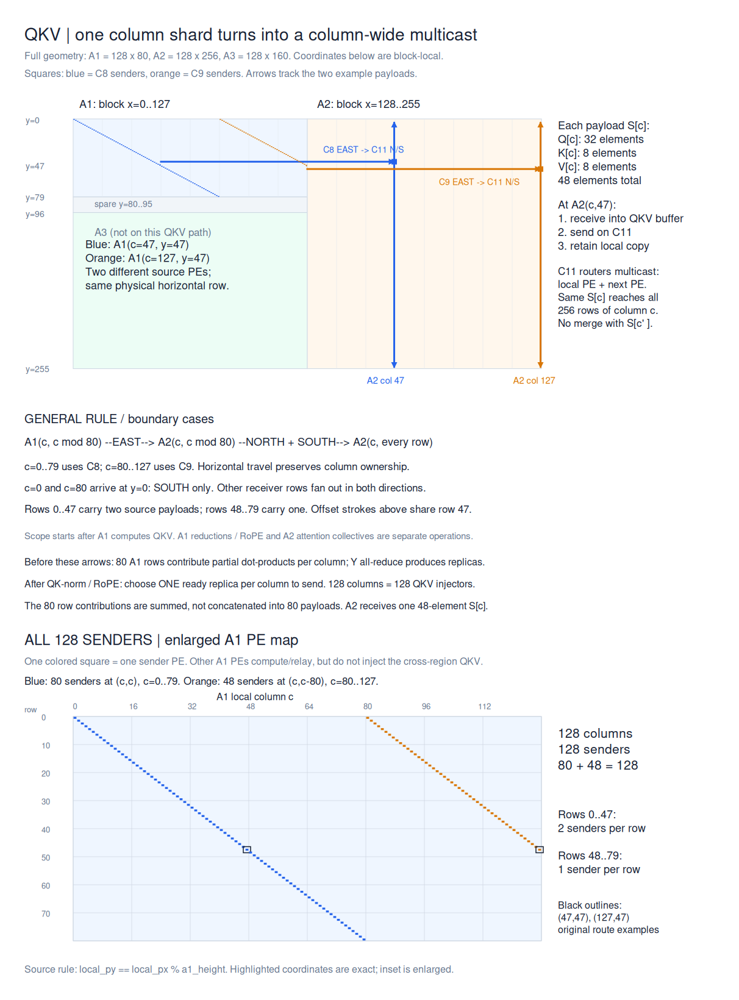
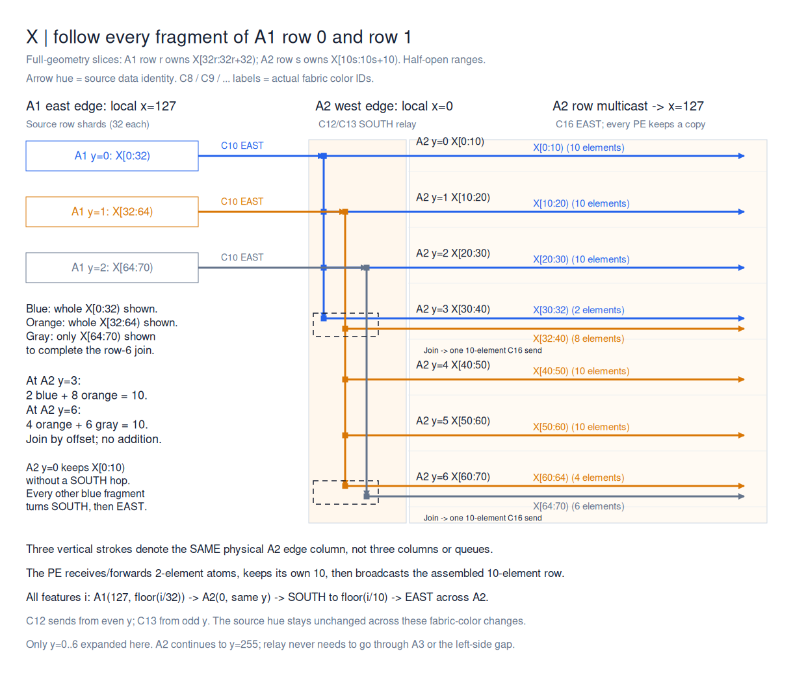
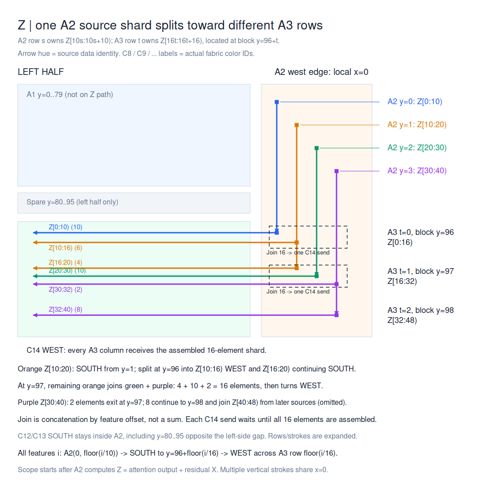

# Distinguish QKV column replicas from hidden-row resharding — 2026-09-10

**Project:** wse3-performance-model
**Author:** codex
**Status:** captured

## Finding

When reading unequal-height A1/A2/A3 transport diagrams, do not interpret all
A1 row buffers as distinct QKV payloads to concatenate. In the full geometry,
A1 has 128 QKV handoff injectors, one per column at row c mod 80. Before
handoff, the Y all-reduce sums the 80 hidden-row partial contributions and
broadcasts the result; QK-norm/RoPE prepare the final per-column replica.
A2 then replicates that column's QKV across its 256 rows. X and Z instead
require hidden-feature resharding (32->10 and 10->16), followed by row multicast;
those joins concatenate slices and do not perform arithmetic addition.

Source observations, not new hardware measurements. See
[reduction](/home/lexu/wse3-performance-model/demo/qwen3-4b-thinner-stage/layoutC/code/src/decode.csl:1849),
[sender selection](/home/lexu/wse3-performance-model/demo/qwen3-4b-thinner-stage/layoutC/code/src/tall_stage.csl:179),
and [X/Z redistribution](/home/lexu/wse3-performance-model/demo/qwen3-4b-thinner-stage/layoutC/code/src/tall_stage.csl:118).

## Pending generalization

Le requested retaining these three application cases for later generalization.
The value contracts, current protocol candidates, and unchecked tasks live in
[communication TODO](/home/lexu/wse3-performance-model/demo/communication-algorithm/TODO.md).
They are composed cases, not a claim of three new semantic primitives or a
validated generic compiler. No skill promotion is proposed yet.

## Diagram snapshots

Copied byte-for-byte from the source workspace on 2026-09-10. The workspace
`docs/diagrams/2026-09-10-layoutC-travel-*` remains the editable source of truth;
these memory copies are dated reference snapshots, not a second editing branch.
Each Excalidraw stores its implementation-source SHA-256 provenance.

| Case | Editable snapshot | Vector export |
| --- | --- | --- |
| QKV | [Excalidraw](../../artifacts/2026-09-10-layoutC-travel-qkv.excalidraw) | [SVG](../../artifacts/2026-09-10-layoutC-travel-qkv.svg) |
| X | [Excalidraw](../../artifacts/2026-09-10-layoutC-travel-x.excalidraw) | [SVG](../../artifacts/2026-09-10-layoutC-travel-x.svg) |
| Z | [Excalidraw](../../artifacts/2026-09-10-layoutC-travel-z.excalidraw) | [SVG](../../artifacts/2026-09-10-layoutC-travel-z.svg) |

